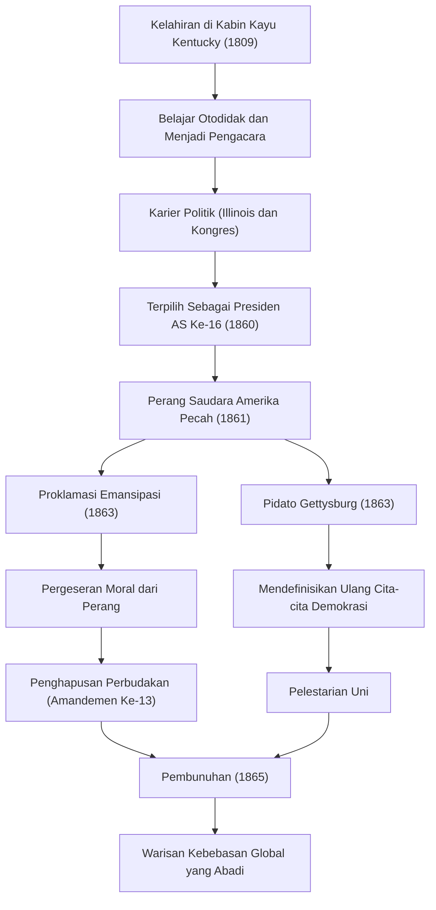

Presiden ke-16 Amerika Serikat, Abraham Lincoln. Dikenal luas sebagai "Bapak Emansipasi", ia adalah tokoh yang mencegah perpecahan negara dengan melewati Perang Saudara Amerika, krisis terbesar sejak berdirinya negara tersebut. Kata-katanya "Pemerintahan dari rakyat, oleh rakyat, untuk rakyat" telah diwariskan hingga hari ini sebagai filosofi yang membentuk fondasi demokrasi.

Dalam artikel ini, kita akan menggali lebih dalam tentang kehidupannya yang luar biasa, dari kabin kayu hingga menjadi presiden, cinta kemanusiaannya yang mendalam, filosofi uniknya, dan pengaruh tak terhingga yang ia tinggalkan bagi generasi mendatang, dilengkapi dengan diagram.

## Berangkat dari Kesulitan: Dari Kabin Kayu Menjadi Pengacara Otodidak

Pada 12 Februari 1809, Lincoln lahir di sebuah kabin kayu sederhana di Kentucky. Di masa kecilnya, ia terpaksa menjalani kehidupan sebagai perintis yang sangat miskin, dan dikatakan bahwa ia menerima pendidikan sekolah formal kurang dari setahun dalam hidupnya. Namun, rasa ingin tahunya secara intelektual tidak pernah pudar. Ia banyak membaca buku apa pun yang bisa ia dapatkan, mulai dari Alkitab, karya Shakespeare, hingga buku-buku hukum, serta menyerap pengetahuan secara otodidak.

Di masa mudanya, ia terus belajar hukum sambil menjalani berbagai profesi seperti pelaut perahu datar, juru ukur, dan penjaga toko. Setelah mendapatkan lisensi pengacaranya pada tahun 1836, ia meraih kepercayaan besar di Illinois karena kepribadiannya yang jujur dan kemampuan orasinya yang luar biasa. Julukan "Honest Abe" (Abe yang Jujur) menjadi identik dengannya sejak saat itu.

## Memasuki Panggung Politik: Menentang Perluasan Perbudakan

Karier Lincoln sebagai politisi dimulai sebagai anggota Dewan Perwakilan Rakyat Illinois. Setelah itu, ia menjabat sebagai anggota Dewan Perwakilan Rakyat Amerika Serikat selama satu periode, tetapi ia mulai benar-benar menarik perhatian nasional pada akhir tahun 1850-an selama perdebatan mengenai perluasan perbudakan.

Pada saat itu, Amerika berada dalam konflik serius yang membagi negara menjadi dua, antara Selatan yang mengadvokasi keberlangsungan perbudakan, dan Utara yang mengadvokasi penghapusan atau pencegahan perluasannya. Meskipun Lincoln tidak mengadvokasi penghapusan perbudakan dengan segera, ia dengan tegas menentang "perluasannya". Dalam debat terbuka untuk pemilihan senat tahun 1858 dengan Stephen Douglas (Debat Lincoln-Douglas), ia menyampaikan pidato terkenal "Sebuah rumah yang terbelah tidak dapat bertahan", menyerukan perlunya resolusi mendasar untuk masalah perbudakan ke seluruh penjuru negeri.

## Pelantikan sebagai Presiden ke-16 dan Pecahnya Perang Saudara

Dalam pemilihan presiden tahun 1860, Lincoln, mencalonkan diri sebagai kandidat dari Partai Republik, memenangkan dukungan luar biasa dari negara-negara bagian Utara dan terpilih sebagai Presiden Amerika Serikat ke-16. Namun, pemilihannya memicu penentangan yang menentukan dari negara-negara bagian Selatan, yang kemudian memisahkan diri dari Uni satu demi satu dan mendirikan "Negara Konfederasi Amerika".

Pada bulan April 1861, hanya satu bulan setelah pelantikan Lincoln, Perang Saudara Amerika pecah. Ini menjadi perang saudara paling berdarah dan tragis dalam sejarah Amerika. Tujuan utama Lincoln adalah "melestarikan Uni" dan menyatukan kembali bangsa yang terpecah. Pada awalnya, situasi perang tidak menguntungkan bagi Utara, tetapi ia memimpin pasukan dengan semangat yang gigih dan tidak pernah menyerah bahkan dalam situasi yang paling putus asa sekalipun.

## Titik Balik Bersejarah: Proklamasi Emansipasi dan Pidato Gettysburg

Seiring berlarutnya perang, Lincoln membuat satu keputusan penting. Pada 1 Januari 1863, ia mengeluarkan "Proklamasi Emansipasi". Ini secara hukum mendeklarasikan pembebasan para budak di negara-negara bagian Selatan yang sedang memberontak. Meskipun proklamasi ini tidak serta merta membebaskan semua budak, hal itu memiliki signifikansi historis dengan mengubah tujuan perang dari sekadar "melestarikan Uni" menjadi "perjuangan untuk kebebasan dan martabat manusia".

Pada bulan November di tahun yang sama, ia menyampaikan pidato singkat bersejarah pada upacara dedikasi Pemakaman Nasional Prajurit di Gettysburg, Pennsylvania, yang telah menjadi lokasi pertempuran sengit. Inilah yang disebut "Pidato Gettysburg". Di sana ia menegaskan kembali kelahiran bangsa dan cita-cita kebebasan, memohon agar "pemerintahan dari rakyat, oleh rakyat, untuk rakyat" tidak musnah dari muka bumi, yang merupakan misi dari mereka yang ditinggalkan. Pidato sekitar dua menit ini dengan indah menangkap esensi demokrasi Amerika dan akan selalu dikenang oleh generasi mendatang.

### Alur Jejak dan Prestasi Lincoln

Diagram berikut menunjukkan tonggak-tonggak penting dalam kehidupan Lincoln dan alur pengaruh yang dibawa oleh kebijakannya.

## Pembunuhan dan Pengaruh pada Generasi Mendatang: Cita-cita yang Abadi

Pada 9 April 1865, Jenderal Lee dari pasukan Selatan menyerah, dan perang saudara tragis yang berlangsung selama empat tahun akhirnya berakhir. Lincoln telah mencapai dua tujuan besar, yaitu pelestarian Uni dan penghapusan perbudakan. Ia bertekad untuk menghadapi masa rekonstruksi pascaperang dengan sikap yang toleran, "tanpa kedengkian terhadap siapa pun, dengan amal untuk semua".

Namun, kegembiraan atas perdamaian itu hanya berlangsung sebentar. Hanya lima hari setelah penyerahan diri, pada 14 April 1865, saat sedang menonton pertunjukan di Teater Ford di Washington D.C., Lincoln ditembak oleh John Wilkes Booth, seorang aktor yang bersimpati pada Selatan, dan menghembuskan napas terakhirnya keesokan paginya. Ia meninggal pada usia 56 tahun. Ia meninggalkan dunia ini tanpa sempat melihat bangsanya yang bersatu kembali.

Kematian Abraham Lincoln membawa kesedihan mendalam bagi seluruh rakyat Amerika, tetapi warisan yang ia tinggalkan tidak pernah memudar. Penghapusan resmi perbudakan melalui Amandemen Ke-13 terwujud setelah kematiannya, dan cita-citanya tentang kebebasan dan kesetaraan terus memberikan pengaruh yang tak terhingga pada perjuangan hak asasi manusia di seluruh dunia, termasuk gerakan hak-hak sipil di kemudian hari.

Kehidupan Lincoln juga merupakan perwujudan dari Impian Amerika, bahwa tidak peduli betapa miskinnya latar belakang seseorang, pencapaian luar biasa mungkin diraih melalui kemauan dan usaha keras sendiri. Kepemimpinannya yang membimbing negara melewati krisis perpecahan nasional yang belum pernah terjadi sebelumnya dengan pemahaman kemanusiaan yang mendalam dan keyakinan yang tak tergoyahkan, terus memberikan kita wawasan penting bahkan di masyarakat modern ini.
