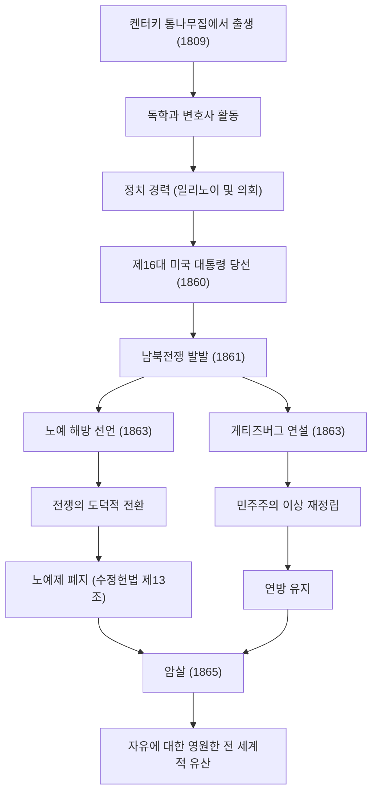

미국 제16대 대통령, 에이브러햄 링컨(Abraham Lincoln). '노예 해방의 아버지'로 널리 알려져 있으며, 건국 이래 최대의 위기였던 남북전쟁을 극복하고 국가의 분열을 막아낸 인물입니다. "국민의, 국민에 의한, 국민을 위한 정치"라는 말은 민주주의의 근간을 이루는 이념으로서 오늘날까지 전해 내려오고 있습니다.

본 기사에서는 통나무집에서 대통령에까지 오른 그의 기구한 생애, 깊은 인간애와 독자적인 철학, 그리고 후세에 남긴 헤아릴 수 없는 영향에 대해 도해를 곁들여 깊이 파헤쳐 봅니다.

## 역경에서의 출발: 통나무집에서 독학으로 변호사가 되기까지

1809년 2월 12일, 링컨은 켄터키주의 소박한 통나무집에서 태어났습니다. 유년기에는 극빈한 개척민으로서의 생활을 강요받았으며, 정규 학교 교육을 받은 것은 평생을 통틀어 불과 1년 남짓이었다고 합니다. 그러나 그의 지적 호기심은 결코 시들지 않았습니다. 성경이나 셰익스피어, 나아가 법률 서적에 이르기까지 손에 닿는 한 많은 책을 탐독하며 독학으로 지식을 흡수해 나갔습니다.

청년기에는 평저선 선원, 측량사, 상점 점원 등 다양한 직업을 경험하면서 법률 공부를 계속했습니다. 1836년에 변호사 자격을 취득하자, 그의 성실한 인품과 탁월한 웅변력으로 인해 일리노이주에서 두터운 신망을 얻게 됩니다. "정직한 에이브(Honest Abe)"라는 애칭은 이때부터 그의 대명사가 되었습니다.

## 정치의 표무대로: 노예제 확대 반대

링컨의 정치인으로서의 커리어는 일리노이주 의회 의원으로부터 시작되었습니다. 이후 연방 하원의원을 1선임하지만, 그가 진정으로 전국적인 주목을 받게 된 것은 1850년대 후반 노예제도 확대를 둘러싼 논쟁에서입니다.

당시 미국은 노예제 존속을 주장하는 남부와 폐지 혹은 확대 저지를 주장하는 북부 간에 국가를 양분하는 심각한 대립 상태에 있었습니다. 링컨은 노예제의 즉각적인 폐지를 주장하지는 않았으나, 그 '확대'에는 단호히 반대했습니다. 1858년 스티븐 더글러스와의 상원의원 선거 공개 토론회(링컨-더글러스 논쟁)에서는 "갈라진 집은 바로 설 수 없다"라는 유명한 연설을 통해 노예제 문제의 근본적 해결의 필요성을 미국 전역에 호소했습니다.

## 제16대 대통령 취임과 남북전쟁의 발발

1860년 대통령 선거에서 공화당 후보로 출마한 링컨은 북부 여러 주의 압도적인 지지를 얻어 승리하며 제16대 미국 연방 대통령에 선출되었습니다. 그러나 그의 당선은 남부 여러 주의 반발을 결정적인 것으로 만들었고, 잇달아 연방을 탈퇴한 남부 여러 주는 '미국 연합국'을 수립했습니다.

1861년 4월, 링컨이 취임한 지 불과 1개월 후 남북전쟁(American Civil War)이 발발합니다. 이는 미국 역사상 가장 많은 피가 흐른 비참한 내전이 되었습니다. 링컨의 최대 목표는 '연방의 유지'였으며, 분열된 국가를 하나로 뭉치게 하는 것이었습니다. 초기의 전황은 북부에게 불리한 것이었지만, 그는 불굴의 정신으로 군을 지휘했고 절망적인 상황 속에서도 결코 포기하지 않았습니다.

## 역사적 전환점: 노예 해방 선언과 게티즈버그 연설

전쟁이 장기화되는 가운데, 링컨은 하나의 중대한 결단을 내립니다. 1863년 1월 1일, '노예 해방 선언(Emancipation Proclamation)'을 공포한 것입니다. 이로써 반란 상태에 있는 남부 여러 주의 노예를 해방하는 것이 법적으로 선언되었습니다. 이 선언이 즉시 모든 노예를 자유롭게 한 것은 아니었으나, 전쟁의 목적을 단순한 '연방 유지'에서 '인간의 자유와 존엄을 향한 투쟁'으로 승화시키는 역사적 의의를 지니고 있었습니다.

같은 해 11월에는 격전지였던 펜실베이니아주 게티즈버그의 국립 전몰자 묘지 헌납식에서 역사에 남을 짧은 연설을 했습니다. 이른바 '게티즈버그 연설'입니다. 여기서 그는 국가의 탄생과 자유의 이념을 재확인하고, "국민의, 국민에 의한, 국민을 위한 정치(Government of the people, by the people, for the people)"가 지상에서 소멸하지 않도록 하는 것이야말로 남겨진 자들의 사명이라고 호소했습니다. 이 약 2분간의 연설은 미국 민주주의의 진수를 훌륭하게 표현하고 있으며, 후세에 영원히 전해지게 됩니다.

### 링컨의 궤적과 업적의 흐름

아래 표는 링컨 생애의 중요한 이정표와 그의 정책이 가져온 영향의 흐름을 보여줍니다.

## 암살과 후세에 미친 영향: 불멸의 이념

1865년 4월 9일, 남군의 리 장군이 항복하며 4년에 걸친 비참한 남북전쟁은 마침내 종결되었습니다. 링컨은 연방의 유지와 노예제 폐지라는 두 가지 거대한 목적을 달성한 것입니다. 그는 전후의 부흥(재건)을 향해 "누구에게도 악의를 품지 않고, 모든 사람에게 자애로움으로"라는 관대한 태도로 임할 결의를 다지고 있었습니다.

그러나 그 평화의 기쁨도 잠시뿐이었습니다. 항복으로부터 불과 5일 후인 1865년 4월 14일, 워싱턴 D.C.의 포드 극장에서 연극을 관람 중이던 링컨은 남부 동조자인 배우 존 윌크스 부스의 흉탄에 쓰러져 다음 날 아침 숨을 거두었습니다. 향년 56세. 통일된 국가를 지켜보지 못한 채, 그는 세상을 떠났습니다.

에이브러햄 링컨의 죽음은 미국 전역에 깊은 슬픔을 가져왔으나, 그가 남긴 유산은 퇴색하지 않았습니다. 수정헌법 제13조에 의한 노예제의 공식적인 폐지는 그의 사후에 실현되었고, 그가 내세운 자유와 평등의 이념은 이후의 공민권 운동을 비롯한 전 세계 인권 획득의 발걸음에 헤아릴 수 없는 영향을 계속해서 주고 있습니다.

링컨의 생애는 아무리 빈곤한 처지에서라도 스스로의 의지와 노력에 의해 위대한 성취가 가능하다는 아메리칸 드림의 체현이기도 합니다. 국가의 분단이라는 전대미문의 위기 속에서, 깊은 인간 이해와 흔들림 없는 신념으로 국가를 이끈 그의 리더십은 현대 사회에서도 여전히 우리에게 중요한 시사점을 던져주고 있습니다.
