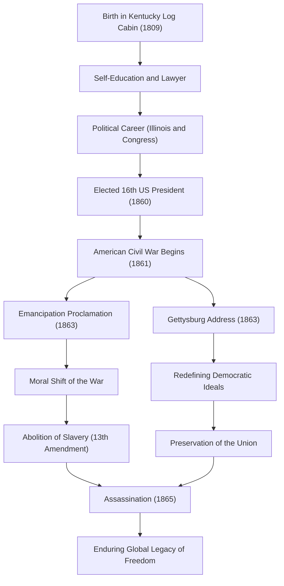

アメリカ合衆国第16代大統領、エイブラハム・リンカーン（Abraham Lincoln）。「奴隷解放の父」として広く知られ、建国以来最大の危機であった南北戦争を乗り越え、国家の分裂を防いだ人物です。「人民の、人民による、人民のための政治」という言葉は、民主主義の根幹をなす理念として、今日まで語り継がれています。

本記事では、丸太小屋から大統領にまで上り詰めた彼の数奇な生涯、深い人間愛と独自の哲学、そして後世に遺した計り知れない影響について、図解を交えながら深く掘り下げていきます。

## 逆境からの出発：丸太小屋から独学の弁護士へ

1809年2月12日、リンカーンはケンタッキー州の質素な丸太小屋で誕生しました。幼少期は極貧の開拓民としての生活を余儀なくされ、正式な学校教育を受けたのは生涯でわずか1年足らずだったと言われています。しかし、彼の知的好奇心は決して衰えることはありませんでした。聖書やシェイクスピア、さらには法律書に至るまで、手に入る限りの書物を読み漁り、独学で知識を吸収していきました。

青年期には平底船の船乗り、測量士、商店の店員など様々な職業を経験しながら、法律の勉強を続けました。1836年に弁護士資格を取得すると、その誠実な人柄と卓越した雄弁さにより、イリノイ州において厚い信頼を集めるようになります。「正直者エイブ（Honest Abe）」という愛称は、この頃から彼の代名詞となりました。

## 政治の表舞台へ：奴隷制拡大への反対

リンカーンの政治家としてのキャリアは、イリノイ州議会議員からスタートしました。その後、連邦下院議員を1期務めますが、彼が真に全国的な注目を集めるようになったのは、1850年代後半、奴隷制度の拡大をめぐる論争においてです。

当時のアメリカは、奴隷制の存続を主張する南部と、廃止あるいは拡大阻止を主張する北部との間で、国を二分する深刻な対立状態にありました。リンカーンは奴隷制の即時廃止こそ主張しなかったものの、その「拡大」には断固として反対しました。1858年のスティーブン・ダグラスとの上院議員選挙における公開討論会（リンカーン・ダグラス論争）では、「分かれたる家は立つこと能わず」という有名な演説を行い、奴隷制問題の根本的解決の必要性を全米に訴えかけました。

## 第16代大統領就任と南北戦争の勃発

1860年の大統領選挙において、共和党の候補として出馬したリンカーンは、北部諸州の圧倒的な支持を得て勝利し、第16代アメリカ合衆国大統領に選出されました。しかし、彼の当選は南部諸州の反発を決定的なものとし、次々と連邦を離脱した南部諸州は「アメリカ連合国」を樹立しました。

1861年4月、リンカーンの就任からわずか1ヶ月後、南北戦争（American Civil War）が勃発します。これはアメリカ史上最も多くの血が流れた悲惨な内戦となりました。リンカーンの最大の目標は「連邦の維持」であり、分裂した国家を一つにまとめることでした。初期の戦況は北部にとって不利なものでしたが、彼は不屈の精神で軍を指揮し、絶望的な状況下でも決して諦めませんでした。

## 歴史的転換点：奴隷解放宣言とゲティスバーグ演説

戦争が長期化する中、リンカーンは一つの重大な決断を下します。1863年1月1日、「奴隷解放宣言（Emancipation Proclamation）」を発布したのです。これにより、反乱状態にある南部諸州の奴隷を解放することが法的に宣言されました。この宣言は直ちにすべての奴隷を自由にしたわけではありませんでしたが、戦争の目的を単なる「連邦維持」から「人間の自由と尊厳を求める戦い」へと昇華させる歴史的意義を持っていました。

同年11月には、激戦地となったペンシルベニア州ゲティスバーグの国立戦没者墓地奉献式において、歴史に残る短い演説を行いました。いわゆる「ゲティスバーグ演説」です。ここで彼は、国家の誕生と自由の理念を再確認し、「人民の、人民による、人民のための政治（Government of the people, by the people, for the people）」が地上から消滅しないようにすることこそが、残された者の使命であると訴えかけました。この約2分間の演説は、アメリカの民主主義の真髄を見事に表現しており、後世に永遠に語り継がれることとなります。

### リンカーンの軌跡と功績のフロー

以下の図は、リンカーンの生涯の重要なマイルストーンと、彼の政策がもたらした影響の流れを示しています。

## 暗殺と後世への影響：不滅の理念

1865年4月9日、南軍のリー将軍が降伏し、4年に及んだ悲惨な南北戦争はついに終結しました。リンカーンは連邦の維持と奴隷制の廃止という二つの巨大な目的を達成したのです。彼は戦後の復興（リコンストラクション）に向けて、「誰に対しても悪意を抱かず、すべての人に慈愛をもって」という寛容な態度で臨む決意を固めていました。

しかし、その平和の喜びも束の間でした。降伏からわずか5日後の1865年4月14日、ワシントンD.C.のフォード劇場で観劇中であったリンカーンは、南部同調者の俳優ジョン・ウィルクス・ブースによって凶弾に倒れ、翌朝息を引き取りました。享年56歳。統一された国家を見届けることなく、彼はこの世を去りました。

エイブラハム・リンカーンの死は全米に深い悲しみをもたらしましたが、彼の残した遺産は色褪せることはありませんでした。憲法修正第13条による奴隷制の正式な廃止は彼の死後に実現し、彼の掲げた自由と平等の理念は、その後の公民権運動をはじめとする世界中の人権獲得の歩みに計り知れない影響を与え続けています。

リンカーンの生涯は、いかに貧しい境遇からであっても、自らの意思と努力によって偉大な成就が可能であるというアメリカン・ドリームの体現でもあります。国家の分断という未曾有の危機において、深い人間理解と揺るぎない信念をもって国を導いた彼のリーダーシップは、現代社会においてもなお、私たちに重要な示唆を与えてくれるのです。
