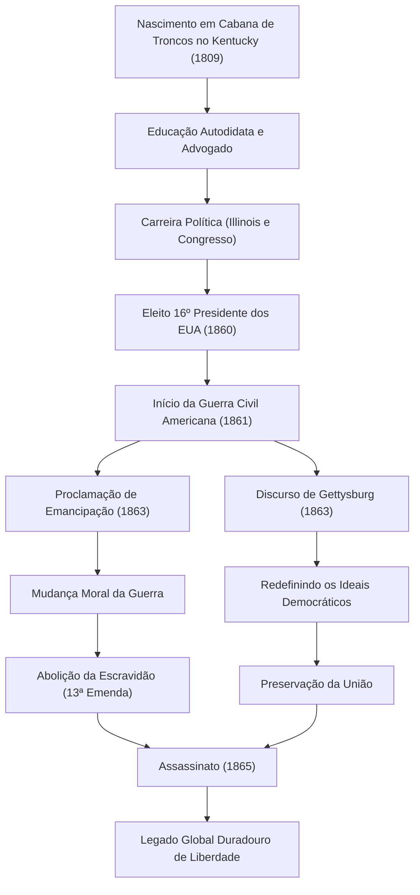

O 16º presidente dos Estados Unidos, Abraham Lincoln. Amplamente conhecido como o "Pai da Emancipação", ele foi o homem que superou a maior crise desde a fundação do país, a Guerra Civil Americana (Guerra de Secessão), e evitou a divisão da nação. Suas palavras, "governo do povo, pelo povo, para o povo", foram transmitidas até os dias de hoje como um princípio que forma a base da democracia.

Neste artigo, vamos explorar profundamente, com o auxílio de diagramas, a sua extraordinária vida, que o levou de uma cabana de troncos até a presidência, seu profundo amor pela humanidade e sua filosofia única, além do impacto imensurável que deixou para a posteridade.

## Partida da Adversidade: De uma Cabana de Troncos a um Advogado Autodidata

Em 12 de fevereiro de 1809, Lincoln nasceu em uma humilde cabana de troncos no estado de Kentucky. Durante sua infância, ele foi forçado a viver como um pioneiro extremamente pobre e diz-se que recebeu menos de um ano de educação escolar formal em toda a sua vida. No entanto, sua curiosidade intelectual nunca diminuiu. Ele leu devoradoramente todos os livros em que pôde colocar as mãos, desde a Bíblia e Shakespeare até livros de direito, e absorveu conhecimento de forma autodidata.

Na sua juventude, ele continuou a estudar direito enquanto trabalhava em várias profissões, como barqueiro de fundo chato, agrimensor e balconista de loja. Quando obteve sua licença de advogado em 1836, ele ganhou profunda confiança no estado de Illinois devido ao seu caráter sincero e excelente eloquência. O apelido "Honest Abe" (Abe Honesto) tornou-se sinônimo de seu nome a partir dessa época.

## Entrada no Cenário Político: Oposição à Expansão da Escravidão

A carreira de Lincoln como político começou como membro da legislatura estadual de Illinois. Ele serviu então um mandato na Câmara dos Representantes federal, mas só começou a atrair verdadeiramente a atenção nacional no final da década de 1850, no debate sobre a expansão da escravidão.

Naquela época, a América estava num estado de conflito profundo que dividiu o país em dois, entre o Sul, que defendia a continuação da escravidão, e o Norte, que defendia a sua abolição ou a prevenção da sua expansão. Embora Lincoln não defendesse a abolição imediata da escravidão, ele opôs-se veementemente à sua "expansão". Durante uma série de debates públicos nas eleições para o Senado de 1858 contra Stephen Douglas (os debates Lincoln-Douglas), ele fez seu famoso discurso de "uma casa dividida contra si mesma não pode subsistir", apelando a toda a nação sobre a necessidade de uma resolução fundamental da questão da escravidão.

## Posse como o 16º Presidente e a Eclosão da Guerra Civil

Na eleição presidencial de 1860, Lincoln concorreu como candidato do Partido Republicano, obteve o apoio esmagador dos estados do Norte e foi eleito o 16º Presidente dos Estados Unidos da América. No entanto, sua eleição tornou decisiva a oposição dos estados do Sul, e os estados do Sul que se separaram sucessivamente da União estabeleceram os "Estados Confederados da América".

Em abril de 1861, apenas um mês após a posse de Lincoln, eclodiu a Guerra Civil Americana. Esta tornou-se a guerra civil mais sangrenta e trágica da história americana. O maior objetivo de Lincoln era a "manutenção da União", para reunir a nação dividida. A situação inicial da guerra foi desfavorável ao Norte, mas ele comandou o exército com um espírito indomável e nunca desistiu, mesmo em circunstâncias desesperadoras.

## Ponto de Virada Histórico: A Proclamação de Emancipação e o Discurso de Gettysburg

À medida que a guerra se prolongava, Lincoln tomou uma decisão importante. Em 1 de janeiro de 1863, ele emitiu a "Proclamação de Emancipação". Isso declarou legalmente que os escravos nos estados do Sul que estavam em estado de rebelião seriam libertados. Embora esta declaração não tenha libertado imediatamente todos os escravos, teve o significado histórico de elevar o propósito da guerra da simples "manutenção da União" para uma "luta pela liberdade humana e dignidade".

Em novembro do mesmo ano, ele fez um breve discurso que ficaria para a história na cerimônia de dedicação do Cemitério Nacional dos Soldados em Gettysburg, Pensilvânia, o local de uma batalha feroz. Este é o chamado "Discurso de Gettysburg". Lá ele reafirmou os ideais do nascimento e da liberdade da nação e apelou que a missão dos que ficaram era garantir que "o governo do povo, pelo povo, para o povo" não desaparecesse da face da terra. Este discurso de cerca de dois minutos expressa lindamente a essência da democracia americana e será transmitido para sempre à posteridade.

### O Fluxo da Trajetória e Conquistas de Lincoln

O diagrama a seguir mostra o fluxo dos marcos importantes na vida de Lincoln e o impacto de suas políticas.

## Assassinato e Impacto nas Gerações Futuras: Um Ideal Imortal

Em 9 de abril de 1865, o General Lee do Exército Confederado se rendeu, e a trágica Guerra Civil, que durou quatro anos, finalmente chegou ao fim. Lincoln alcançou os dois enormes propósitos de preservar a União e abolir a escravidão. Ele estava determinado a abordar a reconstrução pós-guerra (Reconstrução) com uma atitude de tolerância: "com malícia para com ninguém, com caridade para com todos".

No entanto, essa alegria pela paz durou pouco. Apenas cinco dias após a rendição, em 14 de abril de 1865, enquanto assistia a uma peça no Teatro Ford em Washington, D.C., Lincoln foi morto a tiros pelo ator John Wilkes Booth, um simpatizante do Sul, e morreu na manhã seguinte. Ele tinha 56 anos de idade. Ele deixou este mundo sem ver uma nação unificada.

A morte de Abraham Lincoln trouxe profunda tristeza a todos os Estados Unidos, mas o legado que ele deixou nunca desapareceu. A abolição formal da escravidão pela 13ª Emenda à Constituição foi realizada após a sua morte, e os ideais de liberdade e igualdade que ele defendeu continuam a ter um impacto incomensurável nos movimentos subsequentes para ganhar os direitos humanos em todo o mundo, incluindo o movimento dos direitos civis.

A vida de Lincoln é também uma personificação do Sonho Americano, de que grandes realizações são possíveis através da própria vontade e esforço, não importa quão pobre seja a origem da pessoa. Durante a crise sem precedentes da divisão nacional, sua liderança na condução do país com um profundo entendimento da humanidade e crenças inabaláveis ainda nos oferece sugestões importantes na sociedade moderna.
