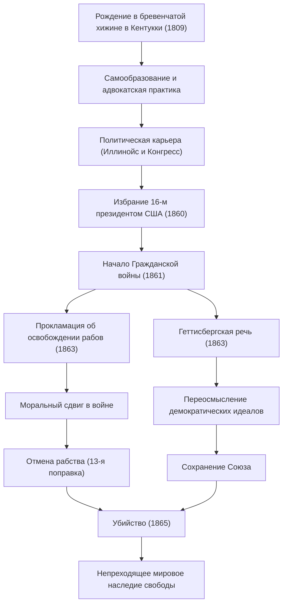

Авраам Линкольн (Abraham Lincoln) — 16-й президент Соединенных Штатов Америки. Широко известный как «Отец освобождения рабов», он является человеком, который преодолел Гражданскую войну, ставшую величайшим кризисом с момента основания страны, и предотвратил раскол нации. Его слова о «правительстве из народа, созданного народом и для народа» до сих пор передаются из поколения в поколение как основополагающий идеал демократии.

В этой статье мы подробно, с использованием иллюстраций, рассмотрим его необыкновенную жизнь, прошедшую путь от бревенчатой хижины до поста президента, его глубокую человечность и уникальную философию, а также то неизмеримое влияние, которое он оказал на последующие поколения.

## Начало пути из трудностей: от бревенчатой хижины до юриста-самоучки

12 февраля 1809 года Линкольн родился в скромной бревенчатой хижине в штате Кентукки. В детстве он был вынужден вести жизнь крайне бедного первопоселенца, и говорят, что формальное школьное образование он получал менее одного года за всю свою жизнь. Однако его интеллектуальное любопытство никогда не угасало. Он запоем читал все доступные книги, от Библии и Шекспира до юридических трактатов, самостоятельно впитывая знания.

В юности он продолжал изучать право, сменив множество профессий: был моряком на плоскодонке, землемером, продавцом в магазине. Получив лицензию адвоката в 1836 году, благодаря своему честному характеру и выдающемуся красноречию, он завоевал глубокое доверие в Иллинойсе. Именно с этого времени прозвище «Честный Эйб» (Honest Abe) стало его визитной карточкой.

## Выход на политическую арену: противодействие распространению рабства

Политическая карьера Линкольна началась с поста члена законодательного собрания штата Иллинойс. Затем он отслужил один срок в Палате представителей Конгресса США, но поистине национальное внимание он привлек к себе в конце 1850-х годов во время дебатов о расширении рабства.

Америка того времени находилась в состоянии глубокого конфликта, разделившего страну надвое, между Югом, выступавшим за сохранение рабства, и Севером, выступавшим за его отмену или предотвращение расширения. Хотя Линкольн и не призывал к немедленной отмене рабства, он решительно выступал против его «расширения». Во время публичных дебатов на выборах в Сенат против Стивена Дугласа в 1858 году (Дебаты Линкольна — Дугласа) он произнес свою знаменитую речь «Дом разделенный выстоять не может», обратившись ко всей нации с призывом к необходимости фундаментального решения проблемы рабства.

## Избрание 16-м президентом и начало Гражданской войны

На президентских выборах 1860 года Линкольн, баллотировавшийся как кандидат от Республиканской партии, одержал победу благодаря подавляющей поддержке северных штатов и был избран 16-м президентом США. Однако его избрание вызвало решительный протест южных штатов, которые один за другим вышли из состава Союза и образовали «Конфедеративные Штаты Америки».

В апреле 1861 года, всего через месяц после инаугурации Линкольна, разразилась Гражданская война (American Civil War). Она стала самой кровопролитной и трагической гражданской войной в истории Америки. Главной целью Линкольна было «сохранение Союза» и объединение расколотой нации. Хотя на начальном этапе военная ситуация складывалась не в пользу Севера, он с непоколебимым духом руководил армией и никогда не сдавался, даже в самых безвыходных ситуациях.

## Исторический поворотный момент: Прокламация об освобождении рабов и Геттисбергская речь

В условиях затяжной войны Линкольн принимает одно важное решение. 1 января 1863 года он издал «Прокламацию об освобождении рабов» (Emancipation Proclamation). Тем самым было юридически провозглашено освобождение рабов в мятежных южных штатах. Хотя эта прокламация не привела к немедленному освобождению всех рабов, она имела историческое значение, возвысив цель войны от простого «сохранения Союза» до «борьбы за человеческую свободу и достоинство».

В ноябре того же года на церемонии освящения Национального солдатского кладбища в Геттисберге, штат Пенсильвания, где произошла ожесточенная битва, он произнес короткую речь, вошедшую в историю. Это так называемая «Геттисбергская речь». В ней он вновь подтвердил идеалы свободы и рождения нации, призвав к тому, что миссия оставшихся в живых — сделать так, чтобы «правительство из народа, созданного народом и для народа (Government of the people, by the people, for the people)» не исчезло с лица земли. Эта речь, длившаяся около двух минут, блестяще выразила суть американской демократии и будет вечно передаваться из поколения в поколение.

### Схема жизненного пути и достижений Линкольна

На приведенной ниже диаграмме показаны важные вехи в жизни Линкольна и влияние его политики.

## Убийство и влияние на последующие поколения: Бессмертные идеалы

9 апреля 1865 года генерал южан Ли капитулировал, и четырехлетняя трагическая Гражданская война наконец завершилась. Линкольн достиг двух грандиозных целей: сохранения Союза и отмены рабства. Он был полон решимости подойти к послевоенному восстановлению (Реконструкции) с терпимостью, «не питая ни к кому злобы, но с милосердием ко всем».

Однако радость мира была недолгой. 14 апреля 1865 года, всего через пять дней после капитуляции, во время просмотра спектакля в театре Форда в Вашингтоне, округ Колумбия, Линкольн был смертельно ранен актером Джоном Уилксом Бутом, сочувствовавшим Югу, и на следующее утро скончался. Ему было 56 лет. Он ушел из жизни, так и не увидев объединенную нацию.

Смерть Авраама Линкольна принесла глубокую скорбь всей Америке, но оставленное им наследие не померкло. Официальная отмена рабства 13-й поправкой к Конституции была реализована уже после его смерти, а провозглашенные им идеалы свободы и равенства продолжают оказывать неизмеримое влияние на борьбу за права человека во всем мире, начиная с движения за гражданские права.

Жизнь Линкольна — это также воплощение американской мечты о том, что даже из самых бедных слоев общества можно достичь великих свершений благодаря собственной воле и усилиям. Во время беспрецедентного кризиса раскола нации его лидерство, которое вело страну с глубоким пониманием человеческой природы и непоколебимой убежденностью, продолжает давать нам важные уроки и в современном обществе.
