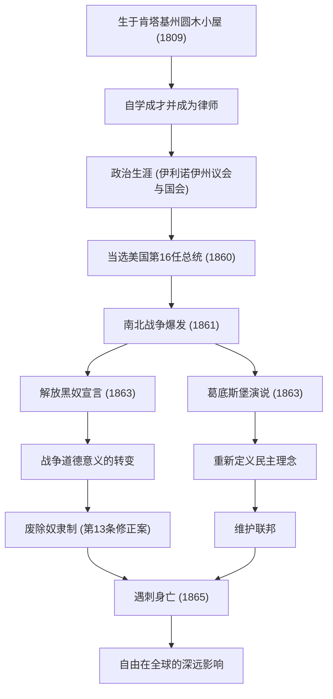

美国第16任总统亚伯拉罕·林肯（Abraham Lincoln）。他被广泛誉为“解放黑奴之父”，是度过了建国以来最大危机——南北战争，并阻止了国家分裂的人物。他所说的“民有、民治、民享”的政府，作为民主主义的根本理念，至今仍被人们传颂。

本文将深入探讨他从圆木小屋一路攀升至总统的传奇一生、深沉的人类之爱与独特的哲学，以及对后世留下的不可估量的影响，并辅以图解说明。

## 逆境中的起点：从圆木小屋到自学成才的律师

1809年2月12日，林肯出生在肯塔基州一间简陋的圆木小屋里。他的童年被迫过着极度贫困的开拓者生活，据说他一生中接受正规学校教育的时间不到一年。然而，他的求知欲却从未衰退。从《圣经》、莎士比亚的著作，到法律书籍，他尽可能地阅读能弄到手的每一本书，通过自学吸收知识。

青年时期，他一边从事平底船水手、测量员、商店店员等各种职业，一边继续学习法律。1836年取得律师资格后，凭借其诚实的人品和卓越的口才，他在伊利诺伊州赢得了深厚的信任。“诚实的亚伯（Honest Abe）”这个绰号就是从这个时候开始成为他的代名词的。

## 登上政治舞台：反对奴隶制扩张

林肯的政治家生涯始于伊利诺伊州议员。之后，他担任了一届联邦众议员，但他真正引起全国关注，是在19世纪50年代后期围绕奴隶制扩张的争论中。

当时的美国，在主张保留奴隶制的南方和主张废除或阻止其扩张的北方之间，处于将国家一分为二的严重对立状态。虽然林肯没有主张立即废除奴隶制，但他坚决反对其“扩张”。在1858年与斯蒂芬·道格拉斯的参议员竞选公开辩论（林肯-道格拉斯辩论）中，他发表了著名的“分裂之家不能持久”的演说，向全美呼吁从根本上解决奴隶制问题的必要性。

## 就任第16任总统与南北战争爆发

在1860年的总统选举中，作为共和党候选人参选的林肯获得了北方各州的压倒性支持而获胜，当选为美国第16任总统。然而，他的当选使南方各州的反抗成为定局，接连脱离联邦的南方各州建立起了“美利坚联盟国”。

1861年4月，在林肯就任仅仅一个月后，南北战争（American Civil War）爆发了。这是美国历史上流血最多、最惨烈的内战。林肯最大的目标是“维护联邦”，将分裂的国家团结在一起。虽然初期的战况对北方不利，但他以不屈的精神指挥军队，即使在绝望的境地也决不放弃。

## 历史转折点：解放黑奴宣言与葛底斯堡演说

在战争长期化之际，林肯做出了一个重大决定。1863年1月1日，他发表了《解放黑奴宣言（Emancipation Proclamation）》。由此，在法律上宣布解放处于叛乱状态的南方各州的奴隶。这项宣言并没有立即让所有奴隶获得自由，但它具有将战争的目的从单纯的“维护联邦”升华为“寻求人类自由与尊严之战”的历史意义。

同年11月，在曾是激战之地的宾夕法尼亚州葛底斯堡国家公墓的落成典礼上，他发表了名垂青史的简短演说。这就是所谓的“葛底斯堡演说”。在这里，他重申了国家诞生和自由的理念，并呼吁道，确保“民有、民治、民享的政府（Government of the people, by the people, for the people）”不从地球上消失，正是生者的使命。这段大约2分钟的演说出色地表达了美国民主主义的精髓，并将永远被后世传颂。

### 林肯的轨迹与功绩流程图

下图展示了林肯一生的重要里程碑，以及他的政策所带来的影响之发展过程。

## 遇刺与对后世的影响：不朽的理念

1865年4月9日，南军的李将军投降，长达4年的惨烈南北战争终于结束了。林肯实现了维护联邦和废除奴隶制这两个巨大的目标。为了战后的重建（Reconstruction），他下定决心以“对任何人都不抱恶意，对所有人都怀有慈爱”的宽容态度来面对。

然而，和平的喜悦是短暂的。在投降仅仅5天后的1865年4月14日，正在华盛顿特区福特剧院看戏的林肯，倒在了同情南方的演员约翰·威尔克斯·布斯的枪口下，并于次日清晨离世。享年56岁。他没能亲眼看到一个统一的国家，便离开了人世。

亚伯拉罕·林肯的死给全美带来了深深的悲痛，但他留下的遗产却从未褪色。通过宪法第13条修正案正式废除奴隶制在他死后得以实现，他所倡导的自由和平等的理念，对包括后来的民权运动在内的全世界争取人权的进程继续产生着不可估量的影响。

林肯的一生也是美国梦的体现：无论出身多么贫寒，凭借自己的意愿和努力，都能取得伟大的成就。在国家分裂这一前所未有的危机中，他以深刻的人性理解和坚定不移的信念领导国家的领导力，在现代社会依然为我们提供了重要的启示。
