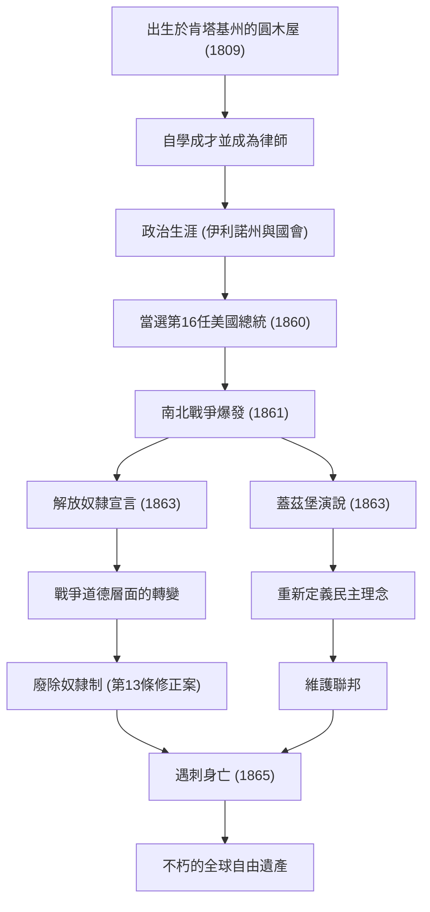

美國第16任總統，亞伯拉罕·林肯（Abraham Lincoln）。身為廣為人知的「解放黑奴之父」，他帶領國家度過了建國以來最大的危機——南北戰爭，並防止了國家的分裂。「民有、民治、民享的政府」這句話，作為構成民主主義根基的理念，至今仍被傳頌。

本篇文章將深入探討他從圓木屋一路攀升至總統的傳奇一生、深厚的人類之愛與獨特的哲學，以及他為後世留下的不可估量的影響，並搭配圖解進行詳細解說。

## 從逆境出發：從圓木屋到自學成才的律師

1809年2月12日，林肯出生於肯塔基州一間簡陋的圓木屋。他的童年被迫過著極度貧困的拓荒者生活，據說他一生中接受正式學校教育的時間加起來不到一年。然而，他的求知慾從未衰退。從聖經、莎士比亞到法律書籍，他廣泛閱讀所有能取得的書本，透過自學吸收知識。

在青年時期，他曾從事平底船水手、測量員、商店店員等各種職業，同時繼續研讀法律。1836年取得律師資格後，憑藉著誠實的人品和卓越的口才，他在伊利諾州贏得了深厚的信任。「誠實的艾伯（Honest Abe）」這個暱稱，便是在這個時期成為他的代名詞。

## 步入政治舞台：反對奴隸制擴張

林肯的政治生涯始於伊利諾州眾議員。之後，他擔任了一屆聯邦眾議員，但他真正獲得全國關注，是在1850年代後半期圍繞奴隸制擴張的爭論中。

當時的美國，在主張維持奴隸制的南方與主張廢除或阻止其擴張的北方之間，處於將國家一分為二的嚴重對立狀態。雖然林肯沒有主張立即廢除奴隸制，但他堅決反對其「擴張」。在1858年與史蒂芬·道格拉斯爭奪參議員的公開辯論會（林肯-道格拉斯辯論）上，他發表了著名的「分裂之家無法長久」演說，向全美呼籲徹底解決奴隸制問題的必要性。

## 就任第16任總統與南北戰爭爆發

在1860年的總統大選中，作為共和黨候選人參選的林肯，在北方各州的壓倒性支持下獲得勝利，當選為美國第16任總統。然而，他的當選卻成為南方各州反彈的導火線，接連脫離聯邦的南方各州成立了「美利堅邦聯」。

1861年4月，在林肯就任僅一個月後，南北戰爭（American Civil War）爆發。這場戰爭成為美國史上流血最多的悲慘內戰。林肯的最大目標是「維護聯邦」，將分裂的國家重新團結在一起。雖然戰爭初期的戰況對北方不利，但他以不屈的精神指揮軍隊，即使在絕望的情況下也從未放棄。

## 歷史的轉捩點：解放奴隸宣言與蓋茲堡演說

隨著戰爭的長期化，林肯做出了一項重大決定。1863年1月1日，他發布了「解放奴隸宣言（Emancipation Proclamation）」。此宣言在法律上宣布解放處於叛亂狀態的南方各州的奴隸。這項宣言雖然沒有立即讓所有奴隸獲得自由，但卻具有將戰爭目的從單純的「維護聯邦」昇華為「追求人類自由與尊嚴之戰」的歷史意義。

同年11月，在曾是激戰地的賓夕法尼亞州蓋茲堡國家公墓的奉獻儀式上，他發表了名留青史的簡短演說。這就是著名的「蓋茲堡演說」。在這裡，他重新確認了國家的誕生與自由的理念，並呼籲生者的使命，就是要確保「民有、民治、民享的政府（Government of the people, by the people, for the people）」不會從地球上消失。這段大約兩分鐘的演說，完美地表達了美國民主主義的精髓，並將永遠流傳後世。

### 林肯的軌跡與功績流程圖

下圖展示了林肯生平的重要里程碑，以及其政策所帶來影響的流程。

## 暗殺與對後世的影響：不朽的理念

1865年4月9日，南軍的李將軍投降，長達四年的悲慘南北戰爭終於結束。林肯達成了維護聯邦和廢除奴隸制這兩個巨大的目標。為了戰後的重建（Reconstruction），他下定決心以「對任何人不懷惡意，對所有人抱持慈愛」的寬容態度來面對。

然而，這份和平的喜悅轉瞬即逝。在投降僅五天後的1865年4月14日，正在華盛頓特區福特劇院觀賞戲劇的林肯，遭到同情南方的演員約翰·威爾克斯·布思開槍暗殺，並於隔天清晨離世，享年56歲。他沒能親眼看到一個統一的國家，便離開了人世。

亞伯拉罕·林肯的死給全美帶來了深切的悲痛，但他留下的遺產並未褪色。透過憲法第13條修正案正式廢除奴隸制在他死後得以實現，他所倡導的自由與平等理念，對之後的民權運動等全世界爭取人權的歷程，持續產生著不可估量的影響。

林肯的一生，體現了美國夢：無論出身多麼貧寒，只要憑藉自身的意志和努力，就能取得偉大的成就。在國家面臨分裂這場史無前例的危機時，他以對人類的深刻理解和堅定不移的信念帶領國家，他的領導力在現代社會中，依然帶給我們重要的啟示。
