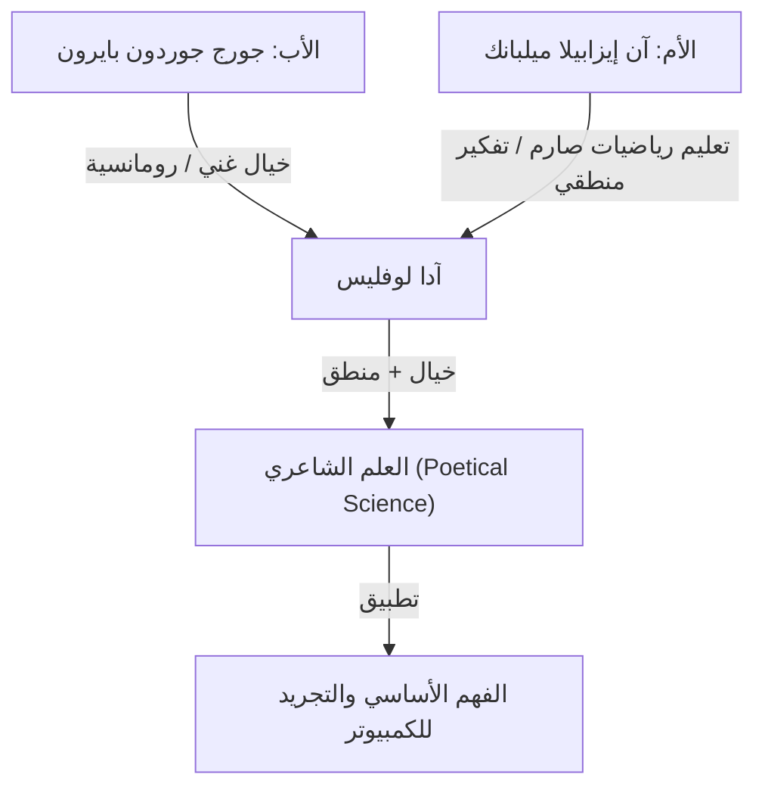
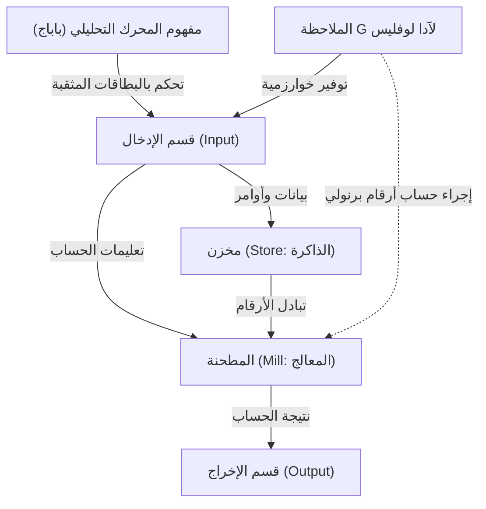

# مقدمة: عبقرية العصر الفيكتوري، آدا لوفليس

عندما نعود في تاريخ علوم الكمبيوتر، نصل دائمًا إلى اسم امرأة واحدة. اسمها أوغستا آدا كينج، كونتيسة لوفليس (Augusta Ada King, Countess of Lovelace). تُعرف عمومًا باسم "آدا لوفليس"، وقد حفرت اسمها في التاريخ كـ "أول مبرمجة في العالم".

ومع ذلك، فإن إنجازاتها لا تقتصر على مجرد "كتابة أول كود". تكمن العظمة الحقيقية لآدا لوفليس في حقيقة أنها أدركت في القرن التاسع عشر جوهر الكمبيوتر الحديث، حيث يمكن أن تتجاوز آلة الحساب كونها مجرد "آلة تحسب الأرقام" لتصبح "آلة عامة الغرض تعالج جميع أنواع المعلومات بل وتنتج الموسيقى والفن".

في هذه المقالة، سنشرح بالتفصيل ونتعمق قدر الإمكان في الحياة الغريبة لآدا لوفليس، والبيئة التي نشأت فيها، ولقائها المصيري مع تشارلز باباج، ومحتويات الوثيقة التاريخية التي تركتها، "الملاحظة جي (Note G)".

## الفصل الأول: دماء شاعر وتعليم رياضيات —— اندماج مواهب متناقضة

ولدت آدا لوفليس في 10 ديسمبر 1815 في لندن، إنجلترا. والدها هو الشاعر العظيم جورج جوردون بايرون (البارون بايرون السادس)، الذي مثل الحركة الرومانسية البريطانية. والدتها كانت آن إيزابيلا ميلبانك (أنابيلا)، التي أحبت الرياضيات والمنطق وأطلق عليها بايرون "أميرة متوازي الأضلاع".

بعد شهر واحد فقط من ولادة آدا، انفصل والداها بشكل دراماتيكي. غادر اللورد بايرون إنجلترا، ولم ترَ آدا والدها مرة أخرى أبدًا.

كانت والدتها أنابيلا تخشى بشدة أن ترث آدا مزاج والدها كـ "شاعر خطير وغير أخلاقي" (جنون عائلة بايرون). نتيجة لذلك، أعطت أنابيلا آدا تعليمًا علميًا ورياضيًا صارمًا، وهو أمر كان استثنائيًا للغاية بالنسبة للنساء في ذلك الوقت.

### تعليم صارم و "علم شاعري"

منذ طفولتها، تعلمت آدا الرياضيات والمنطق والعلوم وعلم الفلك بدقة على يد معلمين خاصين من الدرجة الأولى. ولكن، على عكس نوايا والدتها، كان خيال والدها الغني وشغفه ينبضان بوضوح داخل آدا.

كانت آدا تطلق على نفسها اسم "عالمة شاعرية (Poetical Scientist)". بالنسبة لها، لم تكن الرياضيات سلسلة جافة من الأرقام، بل كانت مثل "الشعر" لكشف الجمال المخفي والحقيقة في الكون. هذا "الاندماج بين الخيال والتفكير المنطقي" هو بالضبط القوة الدافعة التي جعلتها تحقق إنجازات تاريخية لاحقًا.

## الفصل الثاني: لقاء مصيري —— تشارلز باباج و "المحرك التفاضلي"

في يونيو 1833، وصلت آدا البالغة من العمر 17 عامًا إلى أكبر نقطة تحول في حياتها. من خلال إحدى معلماتها، ماري سومرفيل (عالمة رائدة في ذلك الوقت)، التقت بعالم الرياضيات المخترع العبقري تشارلز باباج (Charles Babbage)، الذي كان يشغل منصب أستاذ لوكاسي في جامعة كامبريدج.

### مواجهة مع آلة الحساب

في ذلك الوقت، كان باباج يعرض نموذجًا أوليًا لـ "المحرك التفاضلي (Difference Engine)"، وهي آلة حاسبة ميكانيكية ضخمة لحساب قيم كثيرات الحدود وإنشاء جداول رياضية. شاهدت آدا عرضًا لهذه الآلة في صالون منزل باباج وتأثرت بشدة.

بينما كان الكثير من الناس ينظرون إلى المحرك التفاضلي على أنه مجرد "أداة غريبة"، فهمت آدا على الفور الجمال الرياضي الحقيقي والإمكانات الكامنة في تلك الآلة. كما أذهل باباج بالذكاء الرياضي الاستثنائي والبصيرة التي تتمتع بها هذه الفتاة الشابة، وأصبحا صديقين ومتعاونين مدى الحياة متجاوزين فارق السن (كان باباج يبلغ من العمر 41 عامًا في ذلك الوقت).

أطلق باباج على آدا اسم "ساحرة الأرقام (Enchantress of Number)" وكان يقدر موهبتها أكثر من أي شخص آخر.

## الفصل الثالث: تحدي الحلم النهائي "المحرك التحليلي"

بينما كان باباج يكافح من أجل تطوير المحرك التفاضلي، بدأ يحمل رؤية أكثر فخامة. كان هذا هو "المحرك التحليلي (Analytical Engine)"، وهو كمبيوتر للأغراض العامة يمكنه إجراء أي عملية حسابية رياضية عن طريق قراءة البرامج باستخدام البطاقات المثقبة.

كانت هذه آلة مفاهيمية مذهلة تمتلك جميع الهياكل الأساسية لأجهزة الكمبيوتر الحديثة (الإدخال، الذاكرة، المعالجة، الإخراج). تمامًا كما استخدم نول جاكار البطاقات المثقبة لنسج أنماط معقدة، كان المحرك التحليلي آلة "تنسج أنماطًا جبرية".

### ورقة مينينابريا وترجمة آدا

في عام 1842، ألقى باباج محاضرة حول المحرك التحليلي في تورينو، إيطاليا. استمع عالم الرياضيات الإيطالي (ورئيس الوزراء الإيطالي لاحقًا) لويجي فيديريكو مينينابريا إلى هذه المحاضرة ونشر ورقة بحثية حول المحرك التحليلي باللغة الفرنسية.

طلب أصدقاء باباج من آدا ترجمة هذه الورقة إلى اللغة الإنجليزية. انغمست آدا في هذا العمل ولم تتوقف عند مجرد الترجمة، بل أضافت وجهات نظرها الخاصة وشروحات مفصلة للورقة كـ "ملاحظات (Notes)".

نتيجة لذلك، امتدت الملاحظات التي أضافتها إلى 7 عناصر من A إلى G، وتضخم عدد الكلمات إلى حوالي 3 أضعاف الورقة الأصلية (حوالي 20,000 كلمة). تعتبر هذه "الملاحظات" من أهم الوثائق في تاريخ الكمبيوتر.

## الفصل الرابع: "أول برنامج في العالم" —— معجزة الملاحظة جي (Note G)

أشهر الملاحظات التي كتبتها آدا هي "الملاحظة جي (Note G)" الموضوعة في النهاية.

هنا، تم وصف خوارزمية مفصلة لحساب أرقام برنولي باستخدام المحرك التحليلي خطوة بخطوة في شكل جدول. في هذا الجدول، يتم تنظيم حالة المتغيرات والعمليات المراد تنفيذها ومكان تخزين نتائج العمليات بشكل منطقي للغاية، وهذا هو السبب في أنها تسمى اليوم "أول برنامج كمبيوتر في العالم".

استخدمت آدا ببراعة مفاهيم ضرورية حتى في البرمجة الحديثة، مثل تهيئة المتغيرات والحلقات (التكرار) والتفرع الشرطي، في هذه الملاحظة G. على الرغم من أن الآلة لم تكتمل ماديًا، إلا أنها قامت بمحاكاة عمل الآلة بشكل مثالي في رأسها فقط وكتبت برنامجًا خاليًا من الأخطاء.

## الفصل الخامس: "بصيرة" سبقت عصرها بـ 100 عام

الدليل على أن آدا لوفليس كانت عبقرية حقًا لا يكمن فقط في كتابة برنامج، ولكن في إدراكها لـ "جوهر" المحرك التحليلي.

حتى باباج نفسه كان ينظر إلى المحرك التحليلي بشكل أساسي على أنه "آلة حاسبة ضخمة لإنشاء جداول رياضية متقدمة". لكن آدا أدركت أن الموضوع الذي يتعامل معه المحرك التحليلي لا يقتصر على "الأرقام".

كتبت في ملاحظتها:

> "قد يعمل المحرك التحليلي على أشياء أخرى غير الأرقام. ... على سبيل المثال، إذا كانت القوانين الأساسية للانسجام والتأليف الموسيقي متوافقة مع مثل هذه المعالجة، فقد تقوم هذه الآلة بتأليف موسيقى علمية ومثالية، مهما كانت معقدة."

بمعنى آخر، توقعت في عام 1843 المفهوم الأساسي للحوسبة الرقمية الحديثة، وهو أن الأرقام يمكن استبدالها بـ "الصوت" أو "الصور" أو "الرموز" وغيرها من المعلومات ومعالجتها. كان هذا قبل حوالي 100 عام من اقتراح آلان تورينج لمفهوم "آلة تورينج الشاملة".

في الوقت نفسه، أشارت إلى أن "المحرك التحليلي لا يمكنه فعل أي شيء سوى ما نأمره به (لا يمكنه ابتكار أي شيء بنفسه)"، وهي بصيرة مهمة غالبًا ما يتم الاستشهاد بها في النقاشات حول الذكاء الاصطناعي (AI) الحديث (ما يسمى بـ "اعتراض لوفليس").

## الفصل السادس: السنوات الأخيرة والإرث للأجيال القادمة

لم يجعل ذكاء آدا المتميز حياتها سعيدة بالضرورة. عانت من مشاكل صحية خطيرة طوال حياتها، وعاشت سنوات أخيرة مضطربة مع انغماس مفرط في الرياضيات والمقامرة ومشاكل الديون.

في 27 نوفمبر 1852، توفيت آدا لوفليس بسبب سرطان الرحم عن عمر يناهز 36 عامًا فقط. ومن المفارقات أن هذا هو نفس العمر الذي توفي فيه والدها اللورد بايرون. بناءً على رغبتها الأخيرة، دُفنت بجوار والدها الذي لم تقابله قط.

### إعادة التقييم في عصر الكمبيوتر

لم يكتمل المحرك التحليلي لباباج خلال حياتها، وظلت إنجازاتها مدفونة في التاريخ لفترة طويلة. ومع ذلك، عندما بدأ عصر الكمبيوتر في منتصف القرن العشرين، أُعيد اكتشاف "ملاحظاتها"، وأشاد العالم بأسره ببصيرتها المذهلة.

في عام 1979، أطلقت وزارة الدفاع الأمريكية على لغة برمجة جديدة طورتها اسم "Ada" تكريمًا لها. حتى اليوم، يُحتفل يوم الثلاثاء الثاني من شهر أكتوبر باعتباره "يوم آدا لوفليس"، وهو يوم عالمي للاحتفاء بإنجازات المرأة في مجالات العلوم والتكنولوجيا والهندسة والرياضيات (STEM).

## الخاتمة

كانت آدا لوفليس "زائرة من المستقبل" حلمت بالعالم الرقمي بعد 100 عام في عصر التروس والمحركات البخارية. "العلم الشاعري" الذي نتج عن اندماج خيالها الغني وتفكيرها المنطقي الصارم هو حجر الزاوية لمجتمع تكنولوجيا المعلومات الذي نتمتع به اليوم.

أكثر من مجرد لقب أول مبرمجة في العالم، فإن حقيقة أنها فهمت جوهر الكمبيوتر بشكل أسرع وأعمق من أي شخص آخر ستستمر في الانتقال عبر الأجيال كواحدة من ألمع الحلقات في التاريخ الفكري للبشرية.
