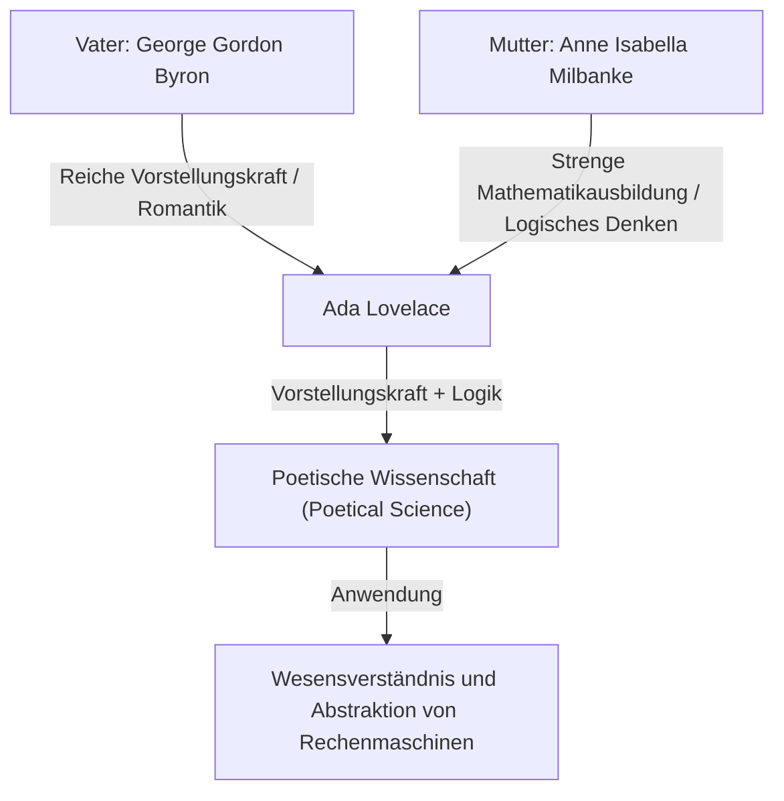
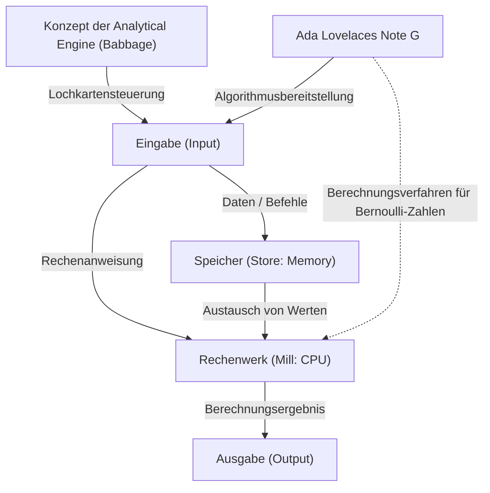

# Einleitung: Das Genie des viktorianischen Zeitalters, Ada Lovelace

Wenn wir in der Geschichte der Informatik zurückblicken, stoßen wir unweigerlich auf den Namen einer Frau. Ihr Name ist Augusta Ada King, Countess of Lovelace. Allgemein als "Ada Lovelace" bekannt, hat sie sich als "die erste Programmiererin der Welt" in die Geschichte eingetragen.

Ihre Leistungen beschränken sich jedoch nicht nur darauf, "den ersten Code geschrieben zu haben". Die wahre Größe von Ada Lovelace liegt darin, dass sie bereits im 19. Jahrhundert das Wesen moderner Computer erkannte: dass eine Rechenmaschine weit mehr als nur eine "Zahlen berechnende Maschine" sein könnte, nämlich eine "universelle Maschine, die alle Arten von Informationen verarbeiten und sogar Musik und Kunst erschaffen kann".

In diesem Artikel werden wir das ereignisreiche Leben von Ada Lovelace, die Umgebung, in der sie aufwuchs, ihre schicksalhafte Begegnung mit Charles Babbage und den Inhalt ihres historischen Dokuments "Note G" so detailliert und tiefgehend wie möglich beleuchten.

## Kapitel 1: Das Blut eines Dichters und mathematische Bildung - Die Verschmelzung gegensätzlicher Talente

Ada Lovelace wurde am 10. Dezember 1815 in London, England, geboren. Ihr Vater war George Gordon Byron (der 6. Baron Byron), ein großer Dichter, der die britische Romantik repräsentierte. Ihre Mutter war Anne Isabella Milbanke (Annabella), die Mathematik und Logik liebte und von Byron "die Prinzessin der Parallelogramme" genannt wurde.

Nur einen Monat nach Adas Geburt ließen sich ihre Eltern in einer dramatischen Scheidung. Lord Byron verließ England und Ada sah ihren Vater nie wieder.

Ihre Mutter Annabella fürchtete extrem, dass Ada das Temperament eines "gefährlichen und unmoralischen Dichters" (den Wahnsinn der Familie Byron) wie ihr Vater erben könnte. Als Folge davon ließ Annabella Ada eine strenge mathematisch-naturwissenschaftliche Ausbildung zukommen, was für eine Frau in der damaligen Zeit absolut außergewöhnlich war.

### Strenge Bildung und "Poetische Wissenschaft"

Von Kindheit an wurde Ada von erstklassigen Tutoren in Mathematik, Logik, Naturwissenschaften und Astronomie unterrichtet. Doch entgegen den Absichten ihrer Mutter lebten die reiche Vorstellungskraft und Leidenschaft, die sie von ihrem Vater geerbt hatte, in Ada weiter.

Ada bezeichnete sich selbst als "Poetical Scientist" (poetische Wissenschaftlerin). Für sie war Mathematik keine trockene Ansammlung von Zahlen, sondern so etwas wie "Poesie", um die verborgene Schönheit und die Wahrheiten des Universums zu entschlüsseln. Diese "Verschmelzung von Vorstellungskraft und logischem Denken" war genau die treibende Kraft, die sie später dazu brachte, historische Großtaten zu vollbringen.

## Kapitel 2: Eine schicksalhafte Begegnung - Charles Babbage und die "Difference Engine"

Im Juni 1833 erlebte die 17-jährige Ada den größten Wendepunkt ihres Lebens. Durch eine ihrer Tutorinnen, Mary Somerville (eine führende Wissenschaftlerin der damaligen Zeit), lernte sie den brillanten Mathematiker und Erfinder Charles Babbage kennen, der damals den Lucasischen Lehrstuhl für Mathematik an der Universität Cambridge innehatte.

### Die Begegnung mit der Rechenmaschine

Damals stellte Babbage den Prototyp einer gigantischen mechanischen Rechenmaschine namens "Difference Engine" (Differenzmaschine) vor, die dazu diente, Werte von Polynomen zu berechnen und mathematische Tabellen zu erstellen. Ada sah eine Demonstration dieser Maschine in Babbages Salon und war tief beeindruckt.

Während viele Menschen die Difference Engine nur als "seltsamen Apparat" betrachteten, verstand Ada sofort die wahre mathematische Schönheit und das Potenzial, das in dieser Maschine verborgen lag. Auch Babbage war erstaunt über die außergewöhnliche mathematische Intelligenz und Einsicht dieses jungen Mädchens, und die beiden wurden über den Altersunterschied hinweg (Babbage war damals 41 Jahre alt) lebenslange Freunde und Forschungspartner.

Babbage nannte Ada die "Enchantress of Number" (Zauberin der Zahlen) und schätzte ihr Talent höher als jeder andere.

## Kapitel 3: Die Herausforderung des ultimativen Traums, die "Analytical Engine"

Während Babbage bei der Entwicklung der Difference Engine auf Schwierigkeiten stieß, begann er, eine noch grandiosere Vision zu hegen. Dies war die "Analytical Engine" (Analytische Maschine), ein universeller Computer, der jede mathematische Berechnung ausführen konnte, indem er Programme über Lochkarten einlas.

Dies war eine erstaunliche konzeptionelle Maschine, die alle grundlegenden Strukturen moderner Computer (Eingabe, Speicherung, Verarbeitung, Ausgabe) besaß. So wie der Jacquard-Webstuhl Lochkarten verwendete, um komplexe Muster zu weben, war die Analytical Engine eine Maschine, die "algebraische Muster webte".

### Menabreas Arbeit und Adas Übersetzung

1842 hielt Babbage in Turin, Italien, einen Vortrag über die Analytical Engine. Der italienische Mathematiker (und spätere italienische Premierminister) Luigi Federico Menabrea, der diesen Vortrag hörte, veröffentlichte eine Arbeit über die Analytical Engine auf Französisch.

Babbages Freunde baten Ada, diese Arbeit ins Englische zu übersetzen. Ada vertiefte sich in diese Aufgabe und beschränkte sich nicht auf eine bloße Übersetzung, sondern fügte der Arbeit ihre eigenen Ansichten und detaillierte Erklärungen als "Notes" (Anmerkungen) hinzu.

Als Ergebnis beliefen sich die von ihr hinzugefügten Anmerkungen auf sieben Abschnitte von A bis G, und die Wortzahl stieg auf etwa das Dreifache des ursprünglichen Papiers (etwa 20.000 Wörter). Diese "Notes" gelten als eines der wichtigsten Dokumente in der Geschichte der Informatik.

## Kapitel 4: "Das erste Programm der Welt" - Das Wunder von Note G

Die berühmteste der von Ada geschriebenen Anmerkungen ist die am Ende platzierte "Note G".

Hier wird ein detaillierter Algorithmus zur Berechnung von Bernoulli-Zahlen mit der Analytical Engine Schritt für Schritt in Tabellenform beschrieben. In dieser Tabelle sind der Zustand der Variablen, die auszuführenden Operationen und der Speicherort der Operationsergebnisse äußerst logisch angeordnet, weshalb dies heute als "das erste Computerprogramm der Welt" bezeichnet wird.

Ada nutzt in dieser Note G meisterhaft Konzepte wie Variableninitialisierung, Schleifen (wiederholte Verarbeitung) und bedingte Verzweigungen, die auch in der modernen Programmierung unverzichtbar sind. Obwohl die Maschine physisch nicht fertiggestellt war, simulierte sie den Betrieb der Maschine perfekt nur in ihrem Kopf und schrieb ein fehlerfreies Programm.

## Kapitel 5: Die "Weitsicht", die der Zeit 100 Jahre voraus war

Der Beweis dafür, dass Ada Lovelace ein wahres Genie war, liegt nicht nur darin, dass sie ein Programm geschrieben hat, sondern dass sie das "Wesen" der Analytical Engine durchschaute.

Sogar Babbage betrachtete die Analytical Engine hauptsächlich als "einen riesigen Computer zur Erstellung fortgeschrittener mathematischer Tabellen". Ada erkannte jedoch, dass die von der Analytical Engine behandelten Objekte nicht nur auf "Zahlen" beschränkt waren.

Sie schrieb in ihren Anmerkungen Folgendes:

> "Die Analytical Engine könnte möglicherweise auf andere Dinge als Zahlen wirken. ... Wenn beispielsweise die grundlegenden Gesetze der Harmonielehre und der musikalischen Komposition für eine solche Verarbeitung geeignet wären, könnte diese Maschine wissenschaftlich perfekte Musik von beliebiger Komplexität komponieren."

Das heißt, sie sah bereits 1843 das grundlegende Konzept des modernen Digital Computings voraus, dass Zahlen durch jede Art von Information wie "Töne", "Bilder" und "Symbole" ersetzt und verarbeitet werden können. Dies war etwa 100 Jahre bevor Alan Turing das Konzept der "universellen Turingmaschine" vorschlug.

Gleichzeitig wies sie auch darauf hin, dass "die Analytical Engine nur ausführen kann, was der Mensch ihr befiehlt (sie erschafft von sich aus nichts)", eine wichtige Erkenntnis, die oft in Diskussionen über moderne KI (Künstliche Intelligenz) zitiert wird (der sogenannte "Lady Lovelace's Objection").

## Kapitel 6: Spätere Jahre und Vermächtnis an die Nachwelt

Adas herausragende Intelligenz machte ihr Leben nicht unbedingt glücklich. Sie litt ihr ganzes Leben lang unter ernsthaften Gesundheitsproblemen und verbrachte ihre späteren Jahre voller Turbulenzen, einschließlich übermäßiger Hingabe an die Mathematik, Spielsucht und Schuldenproblemen.

Am 27. November 1852 starb Ada Lovelace im Alter von nur 36 Jahren an Gebärmutterkrebs. Seltsamerweise war dies dasselbe Alter, in dem ihr Vater Lord Byron starb. Auf ihren letzten Wunsch hin wurde sie neben dem Vater begraben, den sie nie kennengelernt hatte.

### Neubewertung im Computerzeitalter

Babbages Analytical Engine wurde zu ihren Lebzeiten nie fertiggestellt, und ihre Leistungen blieben lange in der Geschichte verborgen. Als jedoch Mitte des 20. Jahrhunderts das Computerzeitalter anbrach, wurden ihre hinterlassenen "Notes" wiederentdeckt, und ihre erstaunliche Weitsicht wurde weltweit gefeiert.

1979 benannte das US-Verteidigungsministerium zu ihren Ehren eine neu entwickelte Programmiersprache "Ada". Noch heute ist der zweite Dienstag im Oktober der "Ada Lovelace Day", ein internationaler Gedenktag, um die Leistungen von Frauen im MINT-Bereich (Mathematik, Informatik, Naturwissenschaften, Technik) zu feiern.

## Schlusswort

Ada Lovelace war eine "Besucherin aus der Zukunft", die im Zeitalter der Zahnräder und Dampfmaschinen von der digitalen Welt hundert Jahre später träumte. Die "poetische Wissenschaft", die aus der Verschmelzung ihrer reichen Vorstellungskraft und ihres strengen logischen Denkens entstand, ist der Grundstein der IT-Gesellschaft, die wir heute genießen.

Mehr noch als der Titel der ersten Programmiererin der Welt wird die Tatsache, dass sie das Wesen des Computers früher und tiefer als jeder andere verstanden hat, als eine der brillantesten Episoden in der intellektuellen Geschichte der Menschheit weitergegeben werden.
