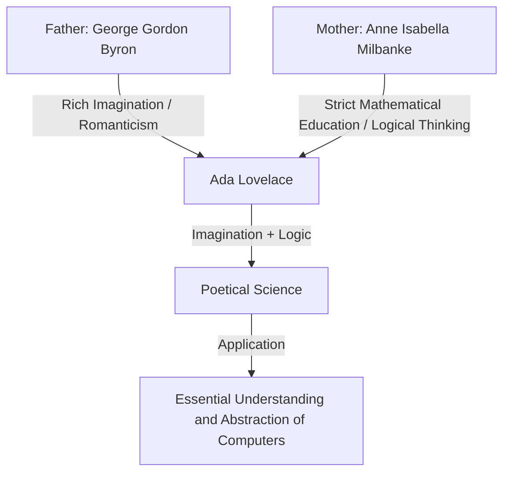
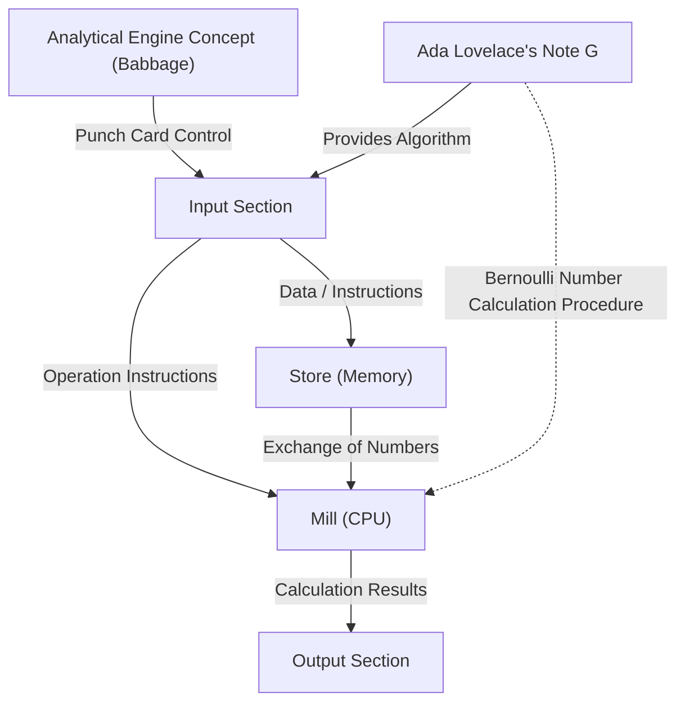

# Introduction: The Victorian Genius, Ada Lovelace

When tracing the history of computer science, we inevitably arrive at the name of one woman. Her name is Augusta Ada King, Countess of Lovelace. Commonly known as "Ada Lovelace", she has carved her name into history as the "world's first programmer".

However, her achievements go far beyond simply "writing the first code". The true greatness of Ada Lovelace lies in the fact that, even in the 19th century, she saw the essence of modern computers: that computing machines could go beyond being mere "number-calculating machines" and become "general-purpose machines capable of processing any information and even creating music and art".

In this article, we will explain in as much detail and depth as possible the extraordinary life of Ada Lovelace, the environment that raised her, her fateful encounter with Charles Babbage, and the contents of her historical document "Note G".

## Chapter 1: The Blood of a Poet and Mathematical Education — The Fusion of Conflicting Talents

Ada Lovelace was born in London, England, on December 10, 1815. Her father was the great poet representing English Romanticism, George Gordon Byron (6th Baron Byron). Her mother was Anne Isabella Milbanke (Annabella), whom Byron called the "Princess of Parallelograms" because of her love for mathematics and logic.

Just one month after Ada was born, her parents went through a dramatic divorce. Lord Byron left England, and Ada never saw her father again.

Her mother, Annabella, was extremely afraid that Ada would inherit her father's "dangerous and immoral poet" temperament (the madness of the Byron family). As a result, Annabella subjected Ada to a strict education in mathematics and science, which was highly unusual for a woman at the time.

### Strict Education and "Poetical Science"

From a young age, Ada was thoroughly taught mathematics, logic, science, and astronomy by top-class tutors. However, contrary to her mother's intentions, the rich imagination and passion she inherited from her father were certainly alive within Ada.

Ada referred to herself as a "Poetical Scientist". For her, mathematics was not a dry enumeration of numbers, but something like "poetry" for unraveling the hidden beauty and truths of the universe. This "fusion of imagination and logical thinking" was the very driving force that would later lead her to achieve her historical feats.

## Chapter 2: A Fateful Encounter — Charles Babbage and the "Difference Engine"

In June 1833, the greatest turning point in the life of 17-year-old Ada arrived. Through Mary Somerville (a leading female scientist of the time) who was one of her tutors, she met Charles Babbage, a genius mathematician and inventor who held the Lucasian Professorship of Mathematics at the University of Cambridge.

### Encounter with the Calculating Machine

At the time, Babbage was demonstrating a prototype of his "Difference Engine", a massive mechanical calculator for computing the values of polynomials to create mathematical tables. Ada witnessed the demonstration of this machine at Babbage's home salon and was deeply impressed.

While many people saw the Difference Engine simply as a "curious contraption", Ada immediately understood the true mathematical beauty and potential hidden within the machine. Babbage was also amazed by the extraordinary mathematical intelligence and insight of this young girl, and the two became lifelong friends and collaborators, transcending their age difference (Babbage was 41 at the time).

Babbage called Ada the "Enchantress of Number" and valued her talents more highly than anyone else.

## Chapter 3: The Challenge of the Ultimate Dream, the "Analytical Engine"

Even while struggling with the development of the Difference Engine, Babbage began to conceive an even grander vision. This was the "Analytical Engine", a general-purpose computer capable of performing any mathematical calculation by reading programs using punch cards.

This was an astonishing conceptual machine equipped with all the basic structures of a modern computer (input, memory, processing, and output). Just as the Jacquard loom wove complex patterns using punch cards, the Analytical Engine was a machine that "wove algebraic patterns".

### Menabrea's Paper and Ada's Translation

In 1842, Babbage gave a lecture on the Analytical Engine in Turin, Italy. Luigi Federico Menabrea, an Italian mathematician (and later Prime Minister of Italy) who attended the lecture, published a paper on the Analytical Engine in French.

Babbage's friends asked Ada to translate this paper into English. Ada immersed herself in this work, and rather than just translating it, she added her own views and detailed explanations to the paper as "Notes".

As a result, the notes she added spanned seven sections from A to G, and the word count swelled to about three times that of the original paper (about 20,000 words). These "Notes" are considered one of the most important documents in the history of computers.

## Chapter 4: The "World's First Program" — The Miracle of Note G

The most famous of the notes written by Ada is "Note G", which is placed at the very end.

Here, a detailed algorithm for calculating Bernoulli numbers using the Analytical Engine is described in a step-by-step tabular format. This table very logically organizes the states of variables, the operations to be executed, and where to store the results of operations, which is why it is called the "world's first computer program" today.

In Note G, Ada brilliantly utilizes concepts that are essential even in modern programming, such as variable initialization, loops (repetitive processing), and conditional branching. Even though the machine was not physically completed, she perfectly simulated its operation in her head and wrote a bug-free program.

## Chapter 5: "Foresight" 100 Years Ahead of Its Time

The proof that Ada Lovelace was truly a genius lies not simply in the fact that she wrote a program, but that she saw through to the "essence" of the Analytical Engine.

Even Babbage primarily viewed the Analytical Engine as a "massive calculator for creating advanced mathematical tables". However, Ada realized that the subjects the Analytical Engine could handle were not limited to "numbers".

She wrote the following in her notes:

> "The Analytical Engine might act upon other things besides number... Supposing, for instance, that the fundamental relations of pitched sounds in the science of harmony and of musical composition were susceptible of such expression and adaptations, the engine might compose elaborate and scientific pieces of music of any degree of complexity or extent."

In other words, she foresaw the concept that forms the foundation of modern digital computing—that numbers could be replaced with any information, such as "audio", "images", and "symbols"—as early as 1843. This was about 100 years before Alan Turing proposed the concept of the "Universal Turing Machine".

At the same time, she also pointed out that "The Analytical Engine has no pretensions whatever to originate anything. It can do whatever we know how to order it to perform", which is an important insight frequently cited even in modern debates about AI (Artificial Intelligence) (the so-called "Lovelace Objection").

## Chapter 6: Later Years and Legacy for Posterity

Ada's outstanding intellect did not necessarily make her life a happy one. She suffered from severe health problems throughout her life and lived a turbulent later life marked by excessive immersion in mathematics, a penchant for gambling, and debt problems.

On November 27, 1852, Ada Lovelace passed away from uterine cancer at the young age of 36. Curiously, this was the exact same age at which her father, Lord Byron, had died. Following her last wishes, she was buried next to the father she had never met.

### Re-evaluation in the Computer Age

Babbage's Analytical Engine was never completed during her lifetime, and her achievements were buried in history for a long time. However, when the dawn of the computer age arrived in the mid-20th century, her surviving "Notes" were rediscovered, and her astonishing foresight came to be praised around the world.

In 1979, the United States Department of Defense named a newly developed programming language "Ada" in her honor. Even today, the second Tuesday of October is celebrated internationally as "Ada Lovelace Day" to honor the achievements of women in STEM (Science, Technology, Engineering, and Mathematics) fields.

## Conclusion

In the age of gears and steam engines, Ada Lovelace was a "visitor from the future" who dreamed of a digital world 100 years later. The "Poetical Science" born from the fusion of her rich imagination and strict logical thinking is the cornerstone of the IT society we enjoy today.

Beyond the title of the world's first programmer, the fact that she understood the essence of computers earlier and more deeply than anyone else will continue to be passed down as one of the most brilliant episodes in the intellectual history of humanity.
