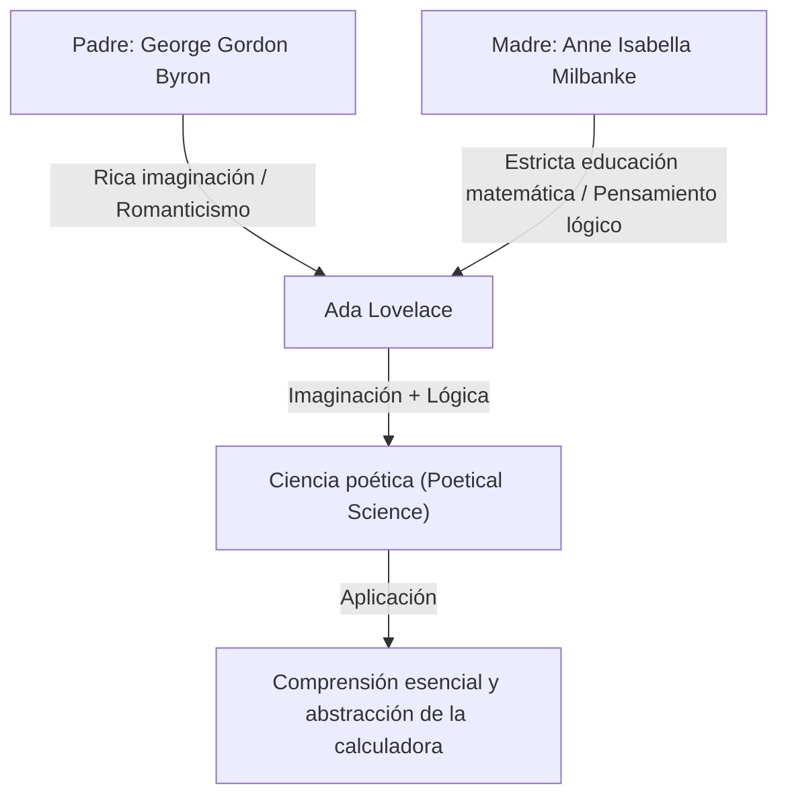
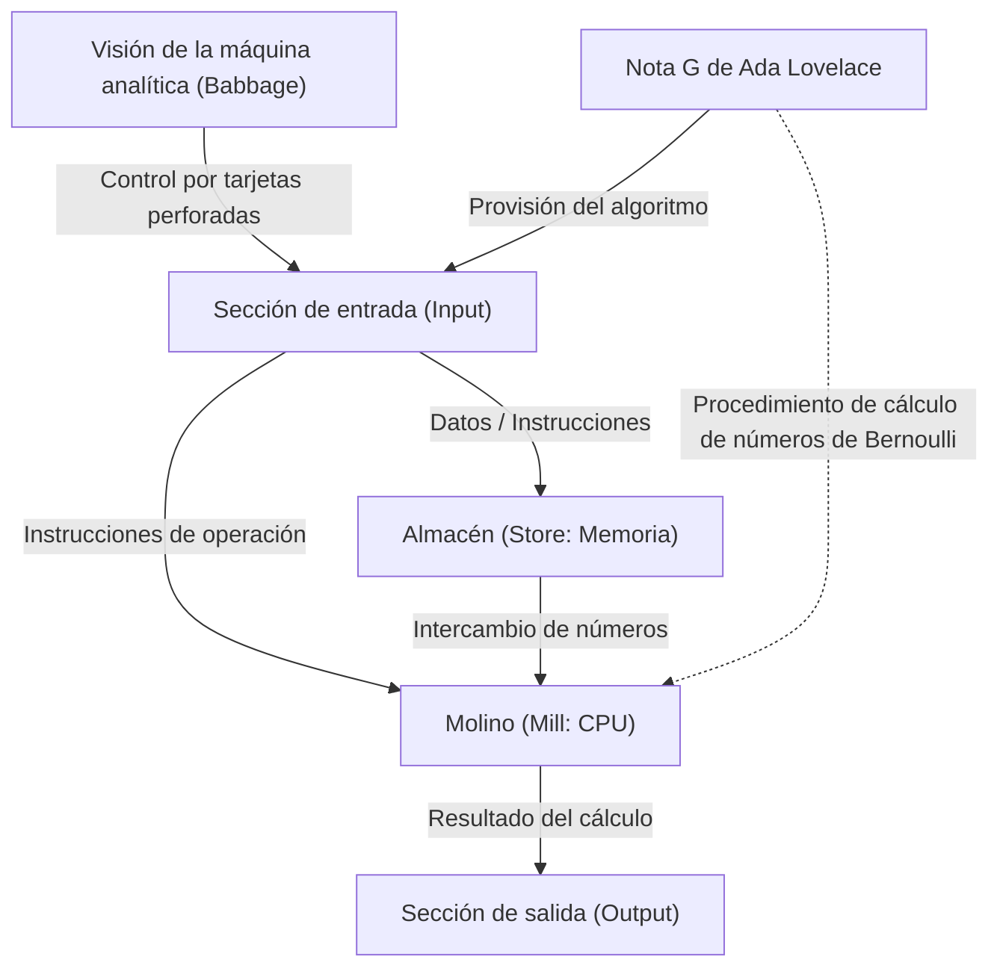

# Introducción: Ada Lovelace, el genio de la época victoriana

Al repasar la historia de la informática, invariablemente nos encontramos con el nombre de una mujer. Su nombre es Augusta Ada King, condesa de Lovelace (Augusta Ada King, Countess of Lovelace). Conocida popularmente como "Ada Lovelace", ha grabado su nombre en la historia como la "primera programadora del mundo".

Sin embargo, sus logros van mucho más allá de simplemente "escribir el primer código". La verdadera grandeza de Ada Lovelace radica en que, ya en el siglo XIX, vislumbró la esencia de los ordenadores modernos: entendió que una máquina calculadora podía superar la mera "máquina para calcular números" y convertirse en una "máquina de propósito general capaz de procesar cualquier información e incluso generar música o arte".

En este artículo, explicaremos con el mayor detalle posible la singular vida de Ada Lovelace, el entorno que la formó, su encuentro predestinado con Charles Babbage y el contenido de su histórico documento "Nota G (Note G)".

## Capítulo 1: Sangre de poeta y educación matemática: la fusión de talentos opuestos

Ada Lovelace nació el 10 de diciembre de 1815 en Londres, Inglaterra. Su padre fue George Gordon Byron (sexto barón Byron), un gran poeta representativo del romanticismo británico. Su madre fue Anne Isabella Milbanke (Annabella), a quien Byron llamaba "la princesa de los paralelogramos" por su amor a las matemáticas y la lógica.

Apenas un mes después del nacimiento de Ada, sus padres se divorciaron dramáticamente. Lord Byron abandonó Inglaterra y Ada nunca volvió a ver a su padre.

Annabella, su madre, temía profundamente que Ada heredara el temperamento de un "poeta peligroso e inmoral" como su padre (la locura de los Byron). Como resultado, Annabella impuso a Ada una rigurosa educación en ciencias y matemáticas, algo excepcionalmente inusual para una mujer de esa época.

### Educación estricta y "ciencia poética"

Desde su infancia, tutores de primer nivel inculcaron a Ada una exhaustiva formación en matemáticas, lógica, ciencias y astronomía. Sin embargo, en contra de las intenciones de su madre, en Ada ciertamente vivía la rica imaginación y la pasión que había heredado de su padre.

Ada se llamaba a sí misma una "científica poética (Poetical Scientist)". Para ella, las matemáticas no eran una árida sucesión de números, sino una especie de "poesía" para desentrañar la belleza oculta y las verdades del universo. Fue precisamente esta "fusión de imaginación y pensamiento lógico" la fuerza motriz que la llevaría a lograr hazañas históricas más adelante.

## Capítulo 2: Un encuentro predestinado: Charles Babbage y la "máquina diferencial"

En junio de 1833, a los 17 años, Ada experimentó el mayor punto de inflexión de su vida. A través de Mary Somerville, una de sus tutoras (y una destacada científica de la época), conoció a Charles Babbage, un genio matemático e inventor que ocupaba la Cátedra Lucasiana de Matemáticas en la Universidad de Cambridge.

### Encuentro con la máquina de calcular

En aquel momento, Babbage exhibía un prototipo de su "máquina diferencial (Difference Engine)", una enorme calculadora mecánica diseñada para calcular valores polinómicos y crear tablas matemáticas. Ada presenció una demostración de esta máquina en el salón de la casa de Babbage y quedó profundamente impresionada.

Mientras que muchas personas veían la máquina diferencial simplemente como un "artilugio curioso", Ada comprendió instantáneamente la verdadera belleza matemática y el potencial que escondía. Babbage, a su vez, quedó maravillado por la extraordinaria inteligencia matemática y perspicacia de esta joven, y ambos forjaron una amistad y una colaboración que duraría toda la vida, superando la diferencia de edad (Babbage tenía 41 años en ese momento).

Babbage llamaba a Ada "la maga de los números (Enchantress of Number)" y valoraba su talento por encima del de cualquier otra persona.

## Capítulo 3: El desafío hacia el sueño definitivo: la "máquina analítica"

A pesar de sus dificultades con el desarrollo de la máquina diferencial, Babbage concibió una visión aún más grandiosa: la "máquina analítica (Analytical Engine)", una calculadora de propósito general capaz de ejecutar cualquier cálculo matemático leyendo programas mediante tarjetas perforadas.

Era una asombrosa máquina conceptual que poseía todas las estructuras básicas de los ordenadores modernos (entrada, memoria, procesamiento y salida). Así como el telar de Jacquard usaba tarjetas perforadas para tejer patrones complejos, la máquina analítica era una máquina que "tejía patrones algebraicos".

### El artículo de Menabrea y la traducción de Ada

En 1842, Babbage dio una conferencia sobre la máquina analítica en Turín, Italia. Luigi Federico Menabrea, un matemático italiano (y futuro Primer Ministro de Italia) que asistió a la conferencia, publicó un artículo en francés sobre la máquina analítica.

Los amigos de Babbage le pidieron a Ada que tradujera este artículo al inglés. Ada se sumergió en la tarea y, yendo más allá de una simple traducción, añadió sus propias perspectivas y explicaciones detalladas al artículo en forma de "Notas (Notes)".

Como resultado, las notas que añadió se extendieron a lo largo de siete secciones (de la A a la G), y el texto alcanzó casi el triple de la longitud del artículo original (unas 20.000 palabras). Estas "Notas" son consideradas uno de los documentos más importantes en la historia de la informática.

## Capítulo 4: El "primer programa del mundo": el milagro de la Nota G (Note G)

De todas las notas que escribió Ada, la más famosa es la última, la "Nota G (Note G)".

En ella, se describe en un formato de tabla paso a paso un algoritmo detallado para calcular los números de Bernoulli utilizando la máquina analítica. Esta tabla organiza de manera extremadamente lógica el estado de las variables, las operaciones a ejecutar y el destino de almacenamiento de los resultados de las operaciones, razón por la cual hoy en día se la denomina el "primer programa informático del mundo".

En esta Nota G, Ada utilizó magistralmente conceptos que son indispensables en la programación moderna, como la inicialización de variables, los bucles (repetición de procesos) y las ramificaciones condicionales. Aunque la máquina aún no se había construido físicamente, ella simuló su funcionamiento a la perfección solo en su mente y escribió un programa libre de errores.

## Capítulo 5: "Visión de futuro": cien años adelantada a su tiempo

La verdadera prueba del genio de Ada Lovelace no radica simplemente en haber escrito un programa, sino en haber vislumbrado la "esencia" de la máquina analítica.

Incluso el propio Babbage concebía la máquina analítica principalmente como una "enorme calculadora para crear tablas matemáticas complejas". Sin embargo, Ada se dio cuenta de que el alcance de la máquina analítica no se limitaba a los "números".

En sus notas, escribió lo siguiente:

> "La máquina analítica podría actuar sobre otras cosas además del número... Suponiendo, por ejemplo, que las relaciones fundamentales de los sonidos afinados en la ciencia de la armonía y de la composición musical fueran susceptibles de tal expresión y adaptaciones, la máquina podría componer piezas musicales elaboradas y científicas de cualquier grado de complejidad o extensión."

Es decir, ya en 1843 previó el concepto fundamental de la informática digital moderna: que los números podían ser sustituidos por cualquier tipo de información, como "sonidos", "imágenes" o "símbolos", para ser procesados. Esto ocurrió casi 100 años antes de que Alan Turing propusiera el concepto de la "máquina de Turing universal".

Al mismo tiempo, también señaló que "la máquina analítica solo puede hacer aquello que le ordenemos que haga (no puede crear nada por sí misma)", una profunda observación que se cita frecuentemente en las discusiones modernas sobre la inteligencia artificial (IA), conocida como la "objeción de Lovelace".

## Capítulo 6: Últimos años y su legado para la posteridad

La brillante inteligencia de Ada no necesariamente le trajo felicidad en su vida. Sufrió graves problemas de salud a lo largo de toda su vida, y pasó sus últimos años sumida en la agitación debido a su obsesión por las matemáticas, su inclinación por el juego y sus problemas de deudas.

El 27 de noviembre de 1852, Ada Lovelace falleció de cáncer de útero a la temprana edad de 36 años. Curiosamente, fue la misma edad a la que murió su padre, Lord Byron. Por deseo propio, fue enterrada junto a su padre, a quien nunca conoció en vida.

### Reevaluación en la era de la informática

La máquina analítica de Babbage nunca se completó durante su vida, y los logros de Ada quedaron enterrados en la historia durante mucho tiempo. Sin embargo, con los albores de la era de la informática a mediados del siglo XX, sus "Notas" fueron redescubiertas y su asombrosa visión de futuro comenzó a ser elogiada en todo el mundo.

En 1979, el Departamento de Defensa de los Estados Unidos bautizó a un nuevo lenguaje de programación como "Ada" en su honor. Hoy en día, el segundo martes de octubre se celebra el "Día de Ada Lovelace", un día internacional dedicado a conmemorar los logros de las mujeres en los campos STEM (Ciencia, Tecnología, Ingeniería y Matemáticas).

## Conclusión

Ada Lovelace fue una "visitante del futuro" que, en la era de los engranajes y las máquinas de vapor, soñó con el mundo digital 100 años antes. La "ciencia poética" nacida de la fusión de su rica imaginación y su estricto pensamiento lógico sentó las bases de la sociedad de la información que disfrutamos hoy.

Más allá del título de primera programadora del mundo, el hecho de que comprendiera la esencia de los ordenadores de manera más temprana y profunda que nadie, seguirá siendo relatado como uno de los episodios más brillantes de la historia intelectual de la humanidad.
