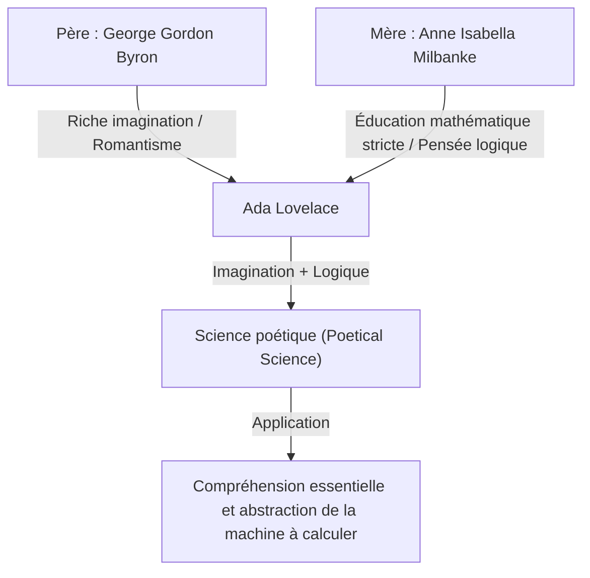
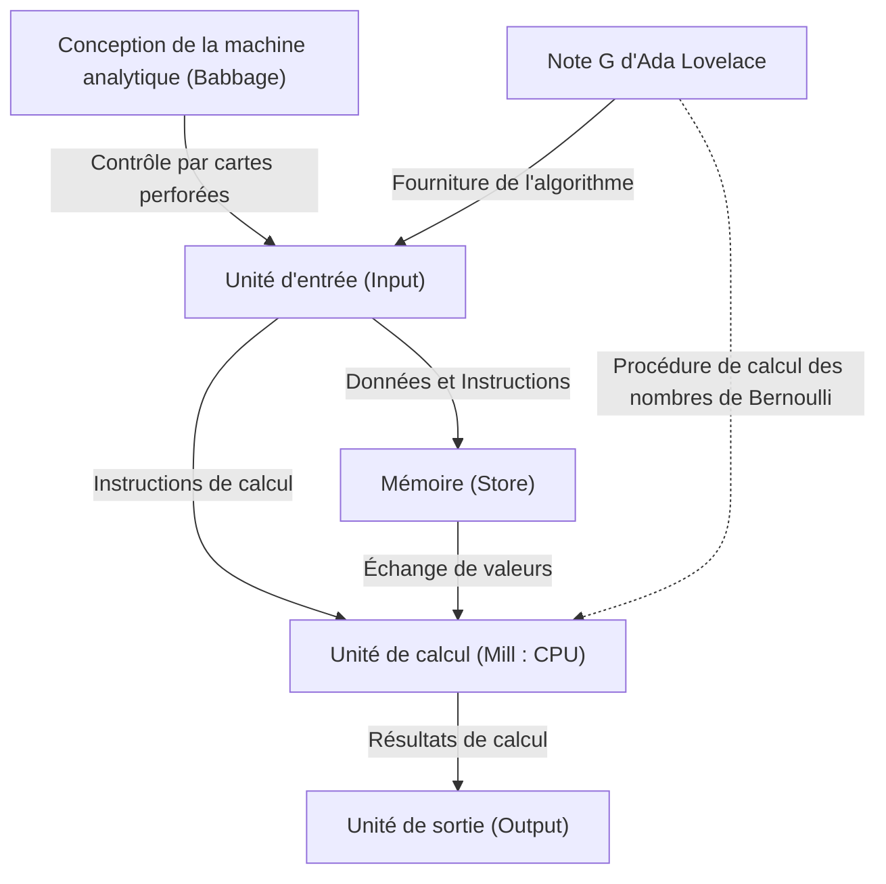

# Introduction : Le génie victorien, Ada Lovelace

Lorsque l'on remonte l'histoire de l'informatique, on tombe immanquablement sur le nom d'une femme. Son nom est Augusta Ada King, comtesse de Lovelace. Généralement connue sous le nom d'« Ada Lovelace », elle a gravé son nom dans l'histoire en tant que « première programmeuse au monde ».

Cependant, ses réalisations ne se limitent pas au simple fait d'« avoir écrit le premier code ». La véritable grandeur d'Ada Lovelace réside dans le fait qu'elle avait perçu dès le 19ème siècle l'essence de l'ordinateur moderne : qu'une machine à calculer pouvait aller au-delà d'une simple « machine à calculer des nombres » pour devenir une « machine universelle capable de traiter tout type d'informations, voire de créer de la musique et de l'art ».

Dans cet article, nous allons explorer en détail la vie mouvementée d'Ada Lovelace, l'environnement dans lequel elle a grandi, sa rencontre fatidique avec Charles Babbage, et le contenu de son document historique, la « Note G », en approfondissant autant que possible.

## Chapitre 1 : Le sang d'un poète et l'éducation mathématique —— La fusion de talents opposés

Ada Lovelace est née le 10 décembre 1815 à Londres, en Angleterre. Son père était le grand poète représentatif du romantisme britannique, George Gordon Byron (6e baron Byron). Sa mère était Anne Isabella Milbanke (Annabella), qui aimait les mathématiques et la logique, et que Byron surnommait la « Princesse des Parallélogrammes ».

À peine un mois après la naissance d'Ada, ses parents ont connu un divorce dramatique. Lord Byron a quitté l'Angleterre et Ada n'a plus jamais revu son père.

Sa mère, Annabella, craignait par-dessus tout qu'Ada n'hérite du tempérament de « poète dangereux et immoral » de son père (la folie des Byron). En conséquence, Annabella a imposé à Ada une éducation scientifique et mathématique stricte, ce qui était tout à fait exceptionnel pour une femme de l'époque.

### Une éducation stricte et la « science poétique »

Dès son plus jeune âge, Ada a reçu une éducation poussée en mathématiques, logique, sciences et astronomie par des tuteurs de premier ordre. Cependant, contrairement aux intentions de sa mère, la riche imagination et la passion héritées de son père vivaient bel et bien en Ada.

Ada se considérait elle-même comme une « scientifique poétique » (Poetical Scientist). Pour elle, les mathématiques n'étaient pas une série aride de chiffres, mais plutôt une sorte de « poésie » permettant de dévoiler la beauté cachée et les vérités de l'univers. C'est cette « fusion de l'imagination et de la pensée logique » qui deviendra la force motrice lui permettant d'accomplir ses exploits historiques plus tard.

## Chapitre 2 : Une rencontre fatidique —— Charles Babbage et la « machine à différences »

En juin 1833, à l'âge de 17 ans, Ada a connu le plus grand tournant de sa vie. Par l'intermédiaire de l'une de ses tutrices, Mary Somerville (une femme scientifique éminente de l'époque), elle a rencontré le mathématicien et inventeur de génie, Charles Babbage, qui occupait la chaire lucasienne de mathématiques à l'Université de Cambridge.

### La rencontre avec la machine à calculer

À l'époque, Babbage présentait au public le prototype de sa « machine à différences » (Difference Engine), une immense calculatrice mécanique destinée à calculer les valeurs de polynômes pour créer des tables mathématiques. Ada a assisté à une démonstration de cette machine dans le salon de la maison de Babbage et en a été profondément impressionnée.

Alors que beaucoup ne voyaient dans la machine à différences qu'un « gadget curieux », Ada a immédiatement compris la véritable beauté et les possibilités mathématiques qui se cachaient dans cette machine. Babbage, de son côté, fut émerveillé par l'intelligence mathématique exceptionnelle et la perspicacité de cette jeune fille. Les deux, malgré leur différence d'âge (Babbage avait alors 41 ans), sont devenus des amis pour la vie et des collaborateurs de recherche.

Babbage appelait Ada l'« Enchanteresse des Nombres » (Enchantress of Number) et appréciait son talent plus que quiconque.

## Chapitre 3 : Le défi du rêve ultime, la « machine analytique »

Bien que luttant pour développer la machine à différences, Babbage a commencé à concevoir un projet encore plus grandiose. Il s'agissait de la « machine analytique » (Analytical Engine), un calculateur universel capable d'exécuter n'importe quel calcul mathématique en lisant des programmes à l'aide de cartes perforées.

C'était une machine conceptuelle étonnante, dotée de toute la structure de base des ordinateurs modernes (entrée, mémoire, traitement, sortie). Tout comme le métier à tisser Jacquard utilisait des cartes perforées pour tisser des motifs complexes, la machine analytique était une machine capable de « tisser des motifs algébriques ».

### L'article de Menabrea et la traduction d'Ada

En 1842, Babbage a donné une conférence sur la machine analytique à Turin, en Italie. Le mathématicien italien (et futur Premier ministre de l'Italie) Luigi Federico Menabrea, qui a assisté à cette conférence, a publié un article en français sur la machine analytique.

Les amis de Babbage ont demandé à Ada de traduire cet article en anglais. Ada s'est plongée dans ce travail, ne se contentant pas d'une simple traduction, mais y ajoutant ses propres opinions et des explications détaillées sous forme de « notes » (Notes) annexées à l'article.

En fin de compte, les notes qu'elle a ajoutées, de A à G, ont représenté environ trois fois le volume de l'article original (environ 20 000 mots). Ces « notes » sont considérées comme l'un des documents les plus importants de l'histoire de l'informatique.

## Chapitre 4 : Le « premier programme au monde » —— Le miracle de la Note G

La plus célèbre des notes rédigées par Ada est la dernière, la « Note G » (Note G).

On y trouve un algorithme détaillé, décrit étape par étape sous forme de tableau, pour calculer les nombres de Bernoulli à l'aide de la machine analytique. Ce tableau organise de manière extrêmement logique l'état des variables, les opérations à exécuter et les emplacements de stockage des résultats des opérations, ce qui lui vaut aujourd'hui le titre de « premier programme informatique au monde ».

Ada a brillamment utilisé dans cette Note G des concepts indispensables à la programmation moderne, tels que l'initialisation des variables, les boucles (traitements répétitifs) et les branchements conditionnels (instructions if). Bien que la machine n'ait pas été physiquement achevée, elle a parfaitement simulé son fonctionnement dans sa tête et a écrit un programme sans bogue.

## Chapitre 5 : Une « prescience » avec un siècle d'avance

La preuve qu'Ada Lovelace était un véritable génie ne réside pas simplement dans le fait d'avoir écrit un programme, mais d'avoir perçu l'« essence » de la machine analytique.

Même Babbage considérait principalement la machine analytique comme une « immense calculatrice destinée à créer des tables mathématiques avancées ». Cependant, Ada avait réalisé que les objets traités par la machine analytique ne se limitaient pas aux seuls « nombres ».

Dans ses notes, elle a écrit :

> « La machine analytique pourrait agir sur d'autres choses que des nombres. ... En supposant, par exemple, que les relations fondamentales des sons dans la science de l'harmonie et de la composition musicale soient susceptibles d'une telle expression et de telles adaptations, la machine pourrait composer des morceaux de musique scientifique de n'importe quel degré de complexité ou de longueur. »

En d'autres termes, elle avait prévu dès 1843 le concept fondamental de l'informatique numérique moderne, à savoir que les nombres pouvaient être remplacés par n'importe quelle information, comme du « son », des « images » ou des « symboles », pour être traités. C'était près d'un siècle avant qu'Alan Turing ne propose le concept de la « machine de Turing universelle ».

En même temps, elle a également souligné que « la machine analytique n'a pas la prétention de créer quoi que ce soit par elle-même. Elle peut faire tout ce que nous savons lui ordonner de faire », ce qui est une observation importante souvent citée dans les débats contemporains sur l'IA (Intelligence Artificielle) (connue sous le nom d'« objection de Lovelace »).

## Chapitre 6 : Dernières années et héritage pour la postérité

L'intelligence exceptionnelle d'Ada n'a pas nécessairement rendu sa vie heureuse. Tout au long de sa vie, elle a souffert de graves problèmes de santé, et ses dernières années ont été tumultueuses, marquées par une obsession excessive pour les mathématiques, une inclination pour les jeux d'argent et des problèmes de dettes.

Le 27 novembre 1852, Ada Lovelace est décédée d'un cancer de l'utérus à l'âge de seulement 36 ans. Curieusement, c'était le même âge auquel son père, Lord Byron, était décédé. Selon sa dernière volonté, elle a été enterrée à côté de son père qu'elle n'avait jamais rencontré.

### Réévaluation à l'ère de l'informatique

La machine analytique de Babbage n'a jamais été achevée de son vivant, et les réalisations d'Ada sont longtemps restées enfouies dans l'histoire. Cependant, lorsque l'ère de l'informatique s'est ouverte au milieu du 20ème siècle, ses « Notes » ont été redécouvertes, et sa prescience étonnante a été saluée par le monde entier.

En 1979, le Département de la Défense des États-Unis a nommé un nouveau langage de programmation qu'il avait développé « Ada », en son honneur. Aujourd'hui encore, le deuxième mardi d'octobre est célébré comme le « Ada Lovelace Day », une journée internationale visant à célébrer les réalisations des femmes dans les domaines des STEM (sciences, technologies, ingénierie et mathématiques).

## Conclusion

Ada Lovelace, à l'ère des engrenages et des machines à vapeur, était une « visiteuse du futur » qui rêvait du monde numérique d'un siècle plus tard. La « science poétique » née de la fusion de sa riche imagination et de sa stricte pensée logique est devenue la pierre angulaire de la société informatique dont nous bénéficions aujourd'hui.

Plus que le titre de première programmeuse au monde, le fait qu'elle ait compris l'essence de l'ordinateur plus tôt et plus profondément que quiconque continuera d'être raconté comme l'un des épisodes les plus brillants de l'histoire intellectuelle de l'humanité.
