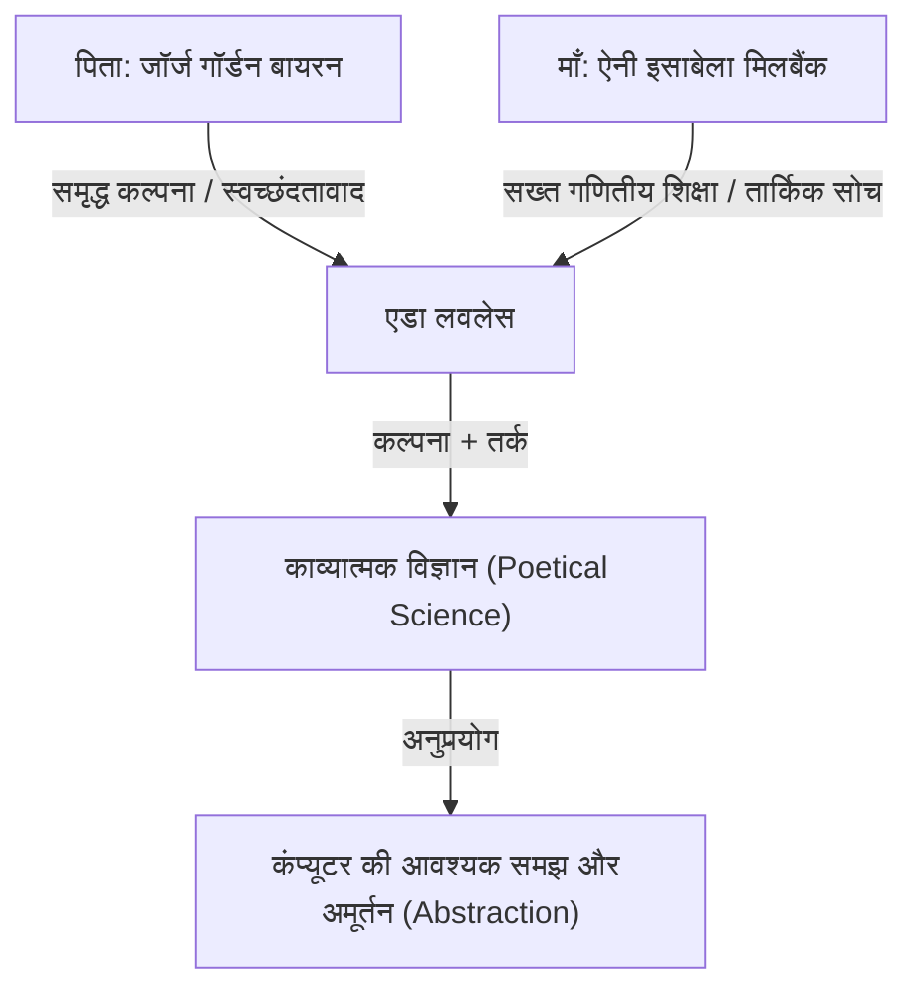
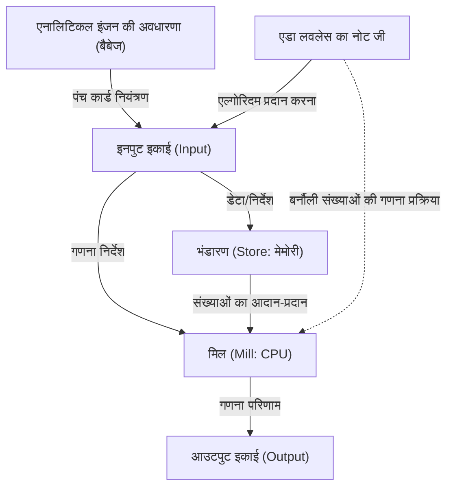

# प्रस्तावना: विक्टोरियन युग की प्रतिभा, एडा लवलेस

कंप्यूटर विज्ञान के इतिहास में पीछे मुड़कर देखते समय, हम हमेशा एक महिला के नाम पर आते हैं। उनका नाम ऑगस्टा एडा किंग, काउंटेस ऑफ लवलेस (Augusta Ada King, Countess of Lovelace) है। आमतौर पर "एडा लवलेस" के रूप में जानी जाने वाली, उन्होंने "दुनिया की पहली प्रोग्रामर" के रूप में इतिहास में अपनी पहचान बनाई है।

हालाँकि, उनकी उपलब्धियाँ केवल "पहला कोड लिखने" तक ही सीमित नहीं थीं। एडा लवलेस की सच्ची महानता इस तथ्य में निहित है कि उन्होंने 19वीं शताब्दी में ही आधुनिक कंप्यूटरों के सार को देख लिया था कि कंप्यूटर केवल "संख्याओं की गणना करने वाली मशीनें" होने से परे जाकर "किसी भी जानकारी को संसाधित करने वाली और संगीत और कला को भी उत्पन्न करने वाली सामान्य-उद्देश्य वाली मशीनें" बन सकते हैं।

इस लेख में, हम एडा लवलेस के असाधारण जीवन, उन्हें पोषित करने वाले परिवेश, चार्ल्स बैबेज के साथ उनके भाग्यशाली मिलन, और उनके द्वारा छोड़े गए ऐतिहासिक दस्तावेज़ "नोट जी (Note G)" की सामग्री के बारे में यथासंभव विस्तार से और गहराई से बताएंगे।

## अध्याय 1: कवि का खून और गणित की शिक्षा - विपरीत प्रतिभाओं का संगम

एडा लवलेस का जन्म 10 दिसंबर 1815 को लंदन, इंग्लैंड में हुआ था। उनके पिता एक महान कवि, जॉर्ज गॉर्डन बायरन (6वें बैरन बायरन) थे, जो ब्रिटिश स्वच्छंदतावाद (Romanticism) का प्रतिनिधित्व करते थे। उनकी माँ ऐनी इसाबेला मिलबैंक (एनाबेला) थीं, जिन्हें गणित और तर्कशास्त्र से प्यार था और बायरन ने उन्हें "समानांतर चतुर्भुज की राजकुमारी (Princess of Parallelograms)" कहा था।

एडा के जन्म के ठीक एक महीने बाद, उनके माता-पिता का नाटकीय रूप से तलाक हो गया। लॉर्ड बायरन ने इंग्लैंड छोड़ दिया, और एडा अपने पिता से फिर कभी नहीं मिलीं।

माँ एनाबेला को इस बात का बहुत डर था कि एडा को अपने पिता का "खतरनाक और अनैतिक कवि" वाला स्वभाव (बायरन परिवार का पागलपन) विरासत में मिलेगा। परिणामस्वरूप, एनाबेला ने एडा को विज्ञान और गणित में एक बहुत ही सख्त शिक्षा दी, जो उस समय की महिलाओं के लिए एक बहुत ही असाधारण बात थी।

### सख्त शिक्षा और "काव्यात्मक विज्ञान"

बचपन से ही, एडा को शीर्ष स्तर के ट्यूटर्स द्वारा गणित, तर्कशास्त्र, विज्ञान और खगोल विज्ञान में पूरी तरह से प्रशिक्षित किया गया था। हालाँकि, अपनी माँ के इरादों के विपरीत, एडा के अंदर अपने पिता से विरासत में मिली समृद्ध कल्पना और जुनून स्पष्ट रूप से जीवित था।

एडा खुद को "काव्यात्मक वैज्ञानिक (Poetical Scientist)" कहती थीं। उनके लिए, गणित केवल संख्याओं का एक नीरस संग्रह नहीं था, बल्कि ब्रह्मांड की छिपी हुई सुंदरता और सच्चाई को उजागर करने वाली "कविता" जैसा कुछ था। यह "कल्पना और तार्किक सोच का संगम" ही था जो बाद में उन्हें ऐतिहासिक महानता प्राप्त करने के लिए प्रेरित करेगा।

## अध्याय 2: भाग्यशाली मुलाकात - चार्ल्स बैबेज और "डिफरेंस इंजन"

जून 1833 में, 17 वर्षीय एडा के जीवन का सबसे बड़ा मोड़ आया। अपनी एक ट्यूटर, मैरी सोमरविले (उस समय की एक प्रमुख महिला वैज्ञानिक) के माध्यम से, वह कैम्ब्रिज विश्वविद्यालय में लुकासियन प्रोफेसर, एक प्रतिभाशाली गणितज्ञ और आविष्कारक चार्ल्स बैबेज (Charles Babbage) से मिलीं।

### गणना मशीन के साथ मुठभेड़

उस समय, बैबेज ने "डिफरेंस इंजन (Difference Engine)" का एक प्रोटोटाइप प्रदर्शित किया था, जो बहुपदों के मानों की गणना करने और गणितीय सारणी बनाने के लिए एक विशाल यांत्रिक कैलकुलेटर था। बैबेज के घर के सैलून में एडा ने इस मशीन का प्रदर्शन देखा और बहुत प्रभावित हुईं।

जबकि बहुत से लोग डिफरेंस इंजन को केवल एक "दुर्लभ नवीनता" के रूप में देखते थे, एडा ने तुरंत मशीन के भीतर छिपी सच्ची गणितीय सुंदरता और संभावनाओं को समझ लिया। बैबेज भी इस युवा लड़की की असाधारण गणितीय बुद्धि और अंतर्दृष्टि से चकित थे, और वे दोनों अपनी उम्र के अंतर (उस समय बैबेज 41 वर्ष के थे) को पार करते हुए आजीवन दोस्त और सहयोगी बन गए।

बैबेज ने एडा को "संख्याओं की जादूगरनी (Enchantress of Number)" कहा और उनकी प्रतिभा को किसी और से अधिक महत्व दिया।

## अध्याय 3: अंतिम स्वप्न - "एनालिटिकल इंजन" की चुनौती

डिफरेंस इंजन के विकास के साथ संघर्ष करते हुए भी, बैबेज ने और भी अधिक भव्य दृष्टिकोण की कल्पना करना शुरू कर दिया। वह "एनालिटिकल इंजन (Analytical Engine)" था, एक सामान्य-उद्देश्य वाला कंप्यूटर जो प्रोग्राम को पढ़ने के लिए पंच कार्ड (Punched cards) का उपयोग करके किसी भी गणितीय गणना को निष्पादित कर सकता था।

यह एक अद्भुत वैचारिक मशीन थी जिसमें एक आधुनिक कंप्यूटर की सभी बुनियादी संरचनाएँ (इनपुट, मेमोरी, प्रोसेसिंग, आउटपुट) थीं। जिस तरह जैक्वार्ड लूम (Jacquard loom) जटिल पैटर्न बुनने के लिए पंच कार्ड का उपयोग करता था, उसी तरह एनालिटिकल इंजन "बीजगणितीय पैटर्न (Algebraic patterns)" बुनने वाली मशीन थी।

### मेनाब्रिया का पेपर और एडा का अनुवाद

1842 में, बैबेज ने ट्यूरिन, इटली में एनालिटिकल इंजन पर跨 एक व्याख्यान दिया। इस व्याख्यान को सुनने वाले इतालवी गणितज्ञ (और बाद में इतालवी प्रधान मंत्री) लुइगी फेडेरिको मेनाब्रिया (Luigi Federico Menabrea) ने एनालिटिकल इंजन के बारे में फ्रेंच में एक पेपर प्रकाशित किया।

बैबेज के दोस्तों ने एडा से इस पेपर का अंग्रेजी में अनुवाद करने को कहा। एडा ने खुद को इस काम में डुबो दिया, और केवल अनुवाद करने तक ही सीमित नहीं रहीं, बल्कि पेपर पर अपने स्वयं के विचार और विस्तृत स्पष्टीकरण "नोट्स (Notes)" के रूप में जोड़े।

परिणामस्वरूप, उनके द्वारा जोड़े गए नोट्स A से G तक 7 आइटम में थे, और शब्दों की संख्या मूल पेपर (लगभग 20,000 शब्द) से लगभग तीन गुना हो गई। इन "नोट्स" को कंप्यूटर इतिहास के सबसे महत्वपूर्ण दस्तावेजों में से एक माना जाता है।

## अध्याय 4: "दुनिया का पहला प्रोग्राम" - नोट जी (Note G) का चमत्कार

एडा द्वारा लिखे गए नोट्स में सबसे प्रसिद्ध "नोट जी (Note G)" है, जिसे अंत में रखा गया था।

यहां, एनालिटिकल इंजन का उपयोग करके बर्नौली संख्याओं (Bernoulli numbers) की गणना करने के लिए एक विस्तृत एल्गोरिदम चरण-दर-चरण सारणीबद्ध प्रारूप में वर्णित है। इस तालिका में, चर (Variables) की स्थिति, किए जाने वाले संचालन (Operations), और गणना परिणामों के गंतव्य को अत्यंत तार्किक तरीके से व्यवस्थित किया गया है, यही कारण है कि इसे आज "दुनिया का पहला कंप्यूटर प्रोग्राम" कहा जाता है।

एडा ने नोट G में चर के आरंभीकरण (Initialization), लूप (पुनरावृत्ति), और सशर्त शाखा (Conditional branching) जैसी अवधारणाओं का शानदार ढंग से उपयोग किया है, जो आधुनिक प्रोग्रामिंग में भी आवश्यक हैं। भले ही मशीन भौतिक रूप से पूरी नहीं हुई थी, उन्होंने अपने दिमाग में इसके संचालन का पूरी तरह से अनुकरण (Simulate) किया और एक बग-मुक्त प्रोग्राम लिखा।

## अध्याय 5: "दूरदर्शिता" जो अपने समय से 100 साल आगे थी

एडा लवलेस की सच्ची प्रतिभा का प्रमाण केवल यह नहीं है कि उन्होंने एक प्रोग्राम लिखा, बल्कि यह है कि उन्होंने एनालिटिकल इंजन का "सार" देखा था।

यहाँ तक कि बैबेज ने भी एनालिटिकल इंजन को मुख्य रूप से "उन्नत गणितीय सारणी बनाने के लिए एक विशाल कैलकुलेटर" के रूप में देखा। हालाँकि, एडा ने महसूस किया कि एनालिटिकल इंजन जिन चीजों को संभाल सकता है वे केवल "संख्याओं" तक ही सीमित नहीं थीं।

उन्होंने अपने नोट्स में लिखा:

> "एनालिटिकल इंजन उन चीजों पर कार्य कर सकता है जो संख्याओं के अलावा कुछ और भी हैं।... उदाहरण के लिए, मान लें कि सामंजस्य (Harmony) और संगीत रचना के मौलिक नियम इस तरह के संचालन के अनुकूल हैं, तो यह मशीन वैज्ञानिक और उत्तम संगीत की रचना कर सकती है, चाहे वह कितनी भी जटिल क्यों न हो।"

दूसरे शब्दों में, उन्होंने 1843 में ही इस अवधारणा की भविष्यवाणी की थी, जो आधुनिक डिजिटल कंप्यूटिंग का मूल है, कि संख्याओं को "ऑडियो," "छवियों," और "प्रतीकों" जैसी किसी भी जानकारी से बदला और संसाधित किया जा सकता है। यह एलन ट्यूरिंग (Alan Turing) द्वारा "यूनिवर्सल ट्यूरिंग मशीन" की अवधारणा का प्रस्ताव देने से लगभग 100 साल पहले की बात है।

साथ ही, उन्होंने यह भी बताया कि "एनालिटिकल इंजन केवल वही कर सकता है जो हम उसे करने का आदेश देना जानते हैं (यह अपने आप कुछ भी नहीं बना सकता है)," जो एक महत्वपूर्ण अंतर्दृष्टि है जिसे अक्सर आधुनिक AI (कृत्रिम बुद्धिमत्ता) के बारे में चर्चाओं में उद्धृत किया जाता है (तथाकथित "लवलेस की आपत्ति (Lovelace's objection)")।

## अध्याय 6: बाद के वर्ष और भविष्य की पीढ़ियों के लिए विरासत

एडा की उत्कृष्ट बुद्धि ने उनके जीवन को हमेशा खुशहाल नहीं बनाया। उन्हें जीवन भर गंभीर स्वास्थ्य समस्याओं का सामना करना पड़ा, और उनके बाद के वर्ष उथल-पुथल भरे थे, जिसमें गणित में अत्यधिक तल्लीनता, जुए की लत और कर्ज की समस्याएं शामिल थीं।

27 नवंबर 1852 को, गर्भाशय के कैंसर के कारण एडा लवलेस का केवल 36 वर्ष की आयु में निधन हो गया। संयोग से, यह वही उम्र थी जब उनके पिता, लॉर्ड बायरन की मृत्यु हुई थी। उनकी अंतिम इच्छा के अनुसार, उन्हें उनके पिता के बगल में दफनाया गया, जिनसे वे कभी नहीं मिली थीं।

### कंप्यूटर युग में पुनर्मूल्यांकन

बैबेज का एनालिटिकल इंजन उनके जीवनकाल के दौरान कभी पूरा नहीं हुआ, और उनकी उपलब्धियाँ लंबे समय तक इतिहास में दबी रहीं। हालाँकि, 20वीं सदी के मध्य में जब कंप्यूटर युग शुरू हुआ, तो उनके पीछे छोड़े गए "नोट्स" को फिर से खोजा गया, और उनकी आश्चर्यजनक दूरदर्शिता की दुनिया भर में प्रशंसा होने लगी।

1979 में, अमेरिकी रक्षा विभाग ने उनके सम्मान में एक नई विकसित प्रोग्रामिंग भाषा का नाम "एडा (Ada)" रखा। आज भी, अक्टूबर के दूसरे मंगलवार को "एडा लवलेस दिवस (Ada Lovelace Day)" के रूप में मनाया जाता है, जो STEM (विज्ञान, प्रौद्योगिकी, इंजीनियरिंग और गणित) क्षेत्रों में महिलाओं के योगदान का जश्न मनाने के लिए एक अंतर्राष्ट्रीय स्मृति दिवस है।

## निष्कर्ष

एडा लवलेस गियर और भाप इंजन के युग में "भविष्य से एक आगंतुक" थीं, जिन्होंने 100 साल बाद की डिजिटल दुनिया का सपना देखा था। उनकी समृद्ध कल्पना और सख्त तार्किक सोच के विलय द्वारा निर्मित "काव्यात्मक विज्ञान" उस IT समाज की आधारशिला है जिसका आज हम आनंद ले रहे हैं।

दुनिया की पहली प्रोग्रामर की उपाधि से अधिक, यह तथ्य कि वह किसी और से पहले और अधिक गहराई से कंप्यूटर के सार को समझती थीं, हमेशा मानव बौद्धिक इतिहास में सबसे शानदार एपिसोड में से एक के रूप में बताया जाएगा।
