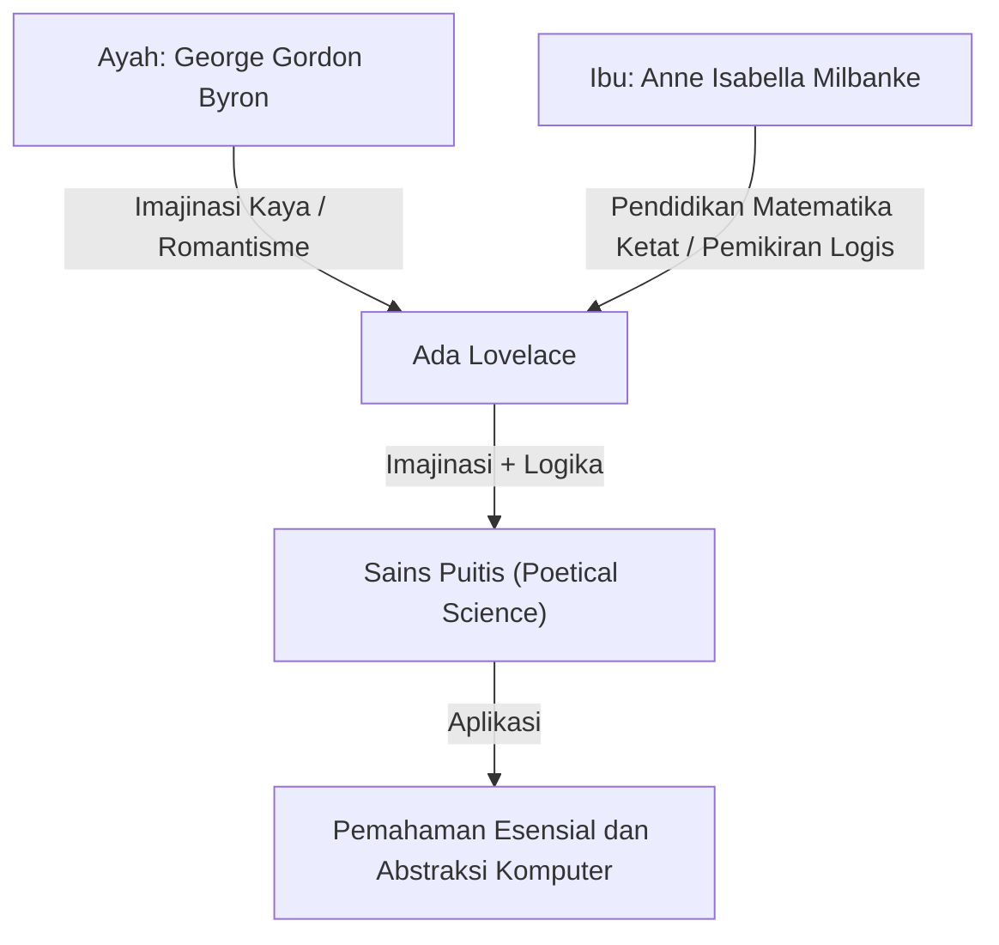
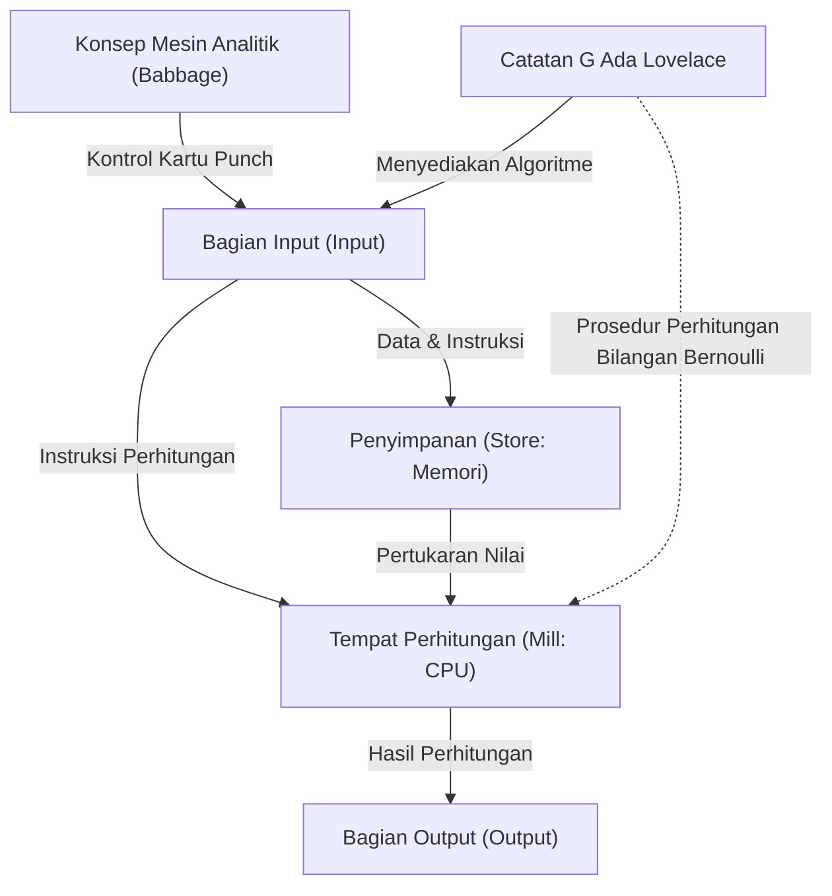

# Pendahuluan: Jenius Era Victoria, Ada Lovelace

Ketika menelusuri sejarah ilmu komputer, kita pasti akan sampai pada satu nama perempuan. Namanya adalah Augusta Ada King, Countess of Lovelace. Umumnya dikenal sebagai "Ada Lovelace", ia telah mengukir namanya dalam sejarah sebagai "programmer pertama di dunia".

Namun, prestasinya tidak hanya sebatas "menulis kode pertama". Kebesaran sejati Ada Lovelace terletak pada kenyataan bahwa ia mampu melihat esensi komputer modern pada tahap abad ke-19: bahwa mesin hitung bisa melampaui sekadar "mesin penghitung angka" dan menjadi "mesin serbaguna yang dapat memproses segala jenis informasi, bahkan menciptakan musik dan seni".

Dalam artikel ini, kami akan menjelaskan secara rinci dan mendalam tentang kehidupan Ada Lovelace yang luar biasa, lingkungan yang membesarkannya, pertemuan takdirnya dengan Charles Babbage, hingga isi dokumen sejarah yang ia tinggalkan, "Note G" (Catatan G).

## Bab 1: Darah Penyair dan Pendidikan Matematika —— Perpaduan Bakat yang Bertolak Belakang

Ada Lovelace lahir pada 10 Desember 1815, di London, Inggris. Ayahnya adalah penyair besar yang mewakili romantisme Inggris, George Gordon Byron (Baron Byron ke-6). Ibunya adalah Anne Isabella Milbanke (Annabella), yang mencintai matematika dan logika, yang dijuluki "Putri Jajaran Genjang" oleh Byron.

Hanya satu bulan setelah Ada lahir, orang tuanya mengalami perceraian yang dramatis. Lord Byron meninggalkan Inggris, dan Ada tidak pernah melihat ayahnya lagi.

Ibunya, Annabella, sangat takut jika Ada akan mewarisi temperamen "penyair yang berbahaya dan tidak bermoral" seperti ayahnya (kegilaan keluarga Byron). Akibatnya, Annabella memberikan Ada pendidikan sains dan matematika yang ketat, sesuatu yang sangat tidak biasa bagi wanita pada masa itu.

### Pendidikan Ketat dan "Sains Puitis"

Sejak kecil, Ada diajarkan secara intensif matematika, logika, sains, dan astronomi oleh guru-guru privat kelas satu. Namun, bertentangan dengan niat ibunya, imajinasi dan gairah kaya yang diwarisi dari ayahnya benar-benar hidup dalam diri Ada.

Ada menyebut dirinya sebagai "Ilmuwan Puitis" (Poetical Scientist). Baginya, matematika bukanlah deretan angka yang kering, melainkan sesuatu seperti "puisi" untuk mengungkap keindahan dan kebenaran tersembunyi dari alam semesta. "Perpaduan antara imajinasi dan pemikiran logis" inilah yang kelak menjadi kekuatan pendorong yang memungkinkannya mencapai prestasi bersejarah.

## Bab 2: Pertemuan Takdir —— Charles Babbage dan "Mesin Selisih"

Pada bulan Juni 1833, titik balik terbesar dalam hidup Ada yang berusia 17 tahun tiba. Melalui salah satu tutornya, Mary Somerville (ilmuwan wanita terkemuka saat itu), ia bertemu dengan matematikawan jenius dan penemu, Charles Babbage, yang memegang posisi Profesor Lucasian di Universitas Cambridge.

### Pertemuan dengan Mesin Hitung

Babbage saat itu sedang memamerkan prototipe "Mesin Selisih" (Difference Engine), mesin hitung mekanis raksasa untuk menghitung nilai polinomial dan membuat tabel matematika. Ada menyaksikan demonstrasi mesin ini di salon rumah Babbage dan sangat terkesan.

Sementara banyak orang hanya melihat Mesin Selisih sebagai "mainan aneh", Ada segera memahami keindahan matematis sejati dan potensi yang tersembunyi di dalam mesin tersebut. Babbage juga kagum dengan kecerdasan matematika yang luar biasa dan wawasan gadis muda ini, dan keduanya menjadi teman seumur hidup serta kolaborator, meskipun terpaut perbedaan usia (Babbage saat itu berusia 41 tahun).

Babbage menyebut Ada sebagai "Penyihir Angka" (Enchantress of Number) dan sangat menghargai bakatnya melebihi siapa pun.

## Bab 3: Tantangan Menuju Impian Puncak "Mesin Analitik"

Meskipun kesulitan mengembangkan Mesin Selisih, Babbage menyusun visi yang lebih besar lagi. Itu adalah "Mesin Analitik" (Analytical Engine), komputer serbaguna yang dapat mengeksekusi perhitungan matematis apa pun dengan memasukkan program menggunakan kartu punch (kartu berlubang).

Ini adalah mesin konseptual yang luar biasa yang dilengkapi dengan semua struktur dasar komputer modern (input, memori, pemrosesan, output). Sama seperti alat tenun Jacquard yang menggunakan kartu punch untuk menenun pola rumit, Mesin Analitik adalah mesin untuk "menenun pola aljabar".

### Makalah Menabrea dan Terjemahan Ada

Pada tahun 1842, Babbage memberikan kuliah tentang Mesin Analitik di Turin, Italia. Matematikawan Italia (yang kemudian menjadi Perdana Menteri Italia) Luigi Federico Menabrea, yang mendengarkan kuliah ini, menerbitkan sebuah makalah tentang Mesin Analitik dalam bahasa Prancis.

Teman-teman Babbage meminta Ada untuk menerjemahkan makalah ini ke bahasa Inggris. Ada membenamkan dirinya dalam pekerjaan ini dan tidak hanya sekadar menerjemahkan, tetapi juga menambahkan pandangannya sendiri dan penjelasan rinci sebagai "Catatan" (Notes) pada makalah tersebut.

Akibatnya, catatan yang ditambahkannya berjumlah 7 item dari A hingga G, dan jumlah kata membengkak menjadi sekitar tiga kali lipat dari makalah aslinya (sekitar 20.000 kata). "Catatan" inilah yang dianggap sebagai salah satu literatur terpenting dalam sejarah komputer.

## Bab 4: "Program Pertama di Dunia" —— Keajaiban Catatan G (Note G)

Yang paling terkenal dari catatan yang ditulis Ada adalah bagian terakhir, "Catatan G" (Note G).

Di sini, algoritme rinci untuk menghitung bilangan Bernoulli menggunakan Mesin Analitik dideskripsikan dalam format tabel langkah demi langkah. Tabel ini mengorganisasikan secara logis status variabel, operasi yang akan dijalankan, lokasi penyimpanan hasil perhitungan, dll., dan inilah mengapa tabel ini disebut "program komputer pertama di dunia" saat ini.

Ada dengan brilian menggunakan konsep-konsep yang juga sangat diperlukan dalam pemrograman modern, seperti inisialisasi variabel, loop (proses pengulangan), dan percabangan kondisional, dalam Catatan G ini. Meskipun mesin tersebut belum selesai secara fisik, ia mampu mensimulasikan operasinya dengan sempurna hanya di dalam kepalanya dan menulis program yang bebas dari bug.

## Bab 5: "Visi" yang Mendahului Zaman 100 Tahun

Bukti bahwa Ada Lovelace benar-benar jenius bukanlah sekadar karena ia menulis program, tetapi karena ia melihat "esensi" dari Mesin Analitik.

Bahkan Babbage sendiri menganggap Mesin Analitik utamanya sebagai "kalkulator raksasa untuk membuat tabel matematika tingkat lanjut". Namun, Ada menyadari bahwa objek yang ditangani oleh Mesin Analitik tidak terbatas pada "angka" saja.

Ia menulis dalam catatannya:

> "Mesin Analitik mungkin bertindak pada hal-hal selain angka... Sebagai contoh, jika hukum dasar harmoni dan komposisi musik dapat disesuaikan dengan operasi semacam itu, mesin ini dapat menggubah musik yang ilmiah dan sempurna, serumit apa pun."

Dengan kata lain, ia meramalkan pada tahun 1843 konsep yang membentuk dasar komputasi digital modern: bahwa angka dapat diganti dengan segala jenis informasi, seperti "suara", "gambar", dan "simbol" untuk diproses. Ini terjadi sekitar 100 tahun sebelum Alan Turing mengusulkan konsep "Mesin Turing Universal".

Pada saat yang sama, ia juga menunjukkan bahwa "Mesin Analitik tidak memiliki kemampuan untuk memunculkan apa pun yang tidak kita ketahui cara memerintahkannya", yang merupakan wawasan penting yang sering dikutip dalam diskusi tentang AI (Kecerdasan Buatan) modern (yang dikenal sebagai "Bantahan Lovelace").

## Bab 6: Tahun-tahun Terakhir dan Warisan bagi Generasi Mendatang

Kecerdasan luar biasa Ada tidak selalu membuat hidupnya bahagia. Sepanjang hidupnya, ia menderita masalah kesehatan yang serius, dan ia menghabiskan tahun-tahun terakhirnya yang penuh gejolak dengan pengabdian yang berlebihan pada matematika, kecenderungan berjudi, dan masalah utang.

Pada 27 November 1852, Ada Lovelace meninggal karena kanker rahim pada usia 36 tahun. Secara kebetulan, ia meninggal pada usia yang sama dengan ayahnya, Lord Byron. Atas permintaannya, ia dimakamkan di sebelah ayahnya, yang belum pernah ia temui.

### Evaluasi Ulang di Era Komputer

Mesin Analitik Babbage tidak pernah selesai selama masa hidupnya, dan pencapaiannya telah lama terkubur dalam sejarah. Namun, ketika era komputer dimulai pada pertengahan abad ke-20, "Catatan" yang ditinggalkannya ditemukan kembali, dan visi luar biasanya mulai dipuji oleh seluruh dunia.

Pada tahun 1979, Departemen Pertahanan AS menamai bahasa pemrograman baru yang dikembangkannya "Ada" sebagai penghormatan kepadanya. Bahkan saat ini, Selasa kedua di bulan Oktober dirayakan secara internasional sebagai "Hari Ada Lovelace" untuk merayakan pencapaian wanita di bidang STEM (Sains, Teknologi, Teknik, dan Matematika).

## Penutup

Ada Lovelace adalah "pengunjung dari masa depan" yang memimpikan dunia digital 100 tahun ke depan di era roda gigi dan mesin uap. "Sains puitis" yang lahir dari perpaduan imajinasi yang kaya dan pemikiran logis yang ketat telah menjadi batu penjuru masyarakat IT yang kita nikmati hari ini.

Lebih dari sekadar gelar programmer pertama di dunia, fakta bahwa ia memahami esensi komputer lebih awal dan lebih dalam daripada siapa pun akan terus diceritakan sebagai salah satu episode paling cemerlang dalam sejarah intelektual umat manusia.
