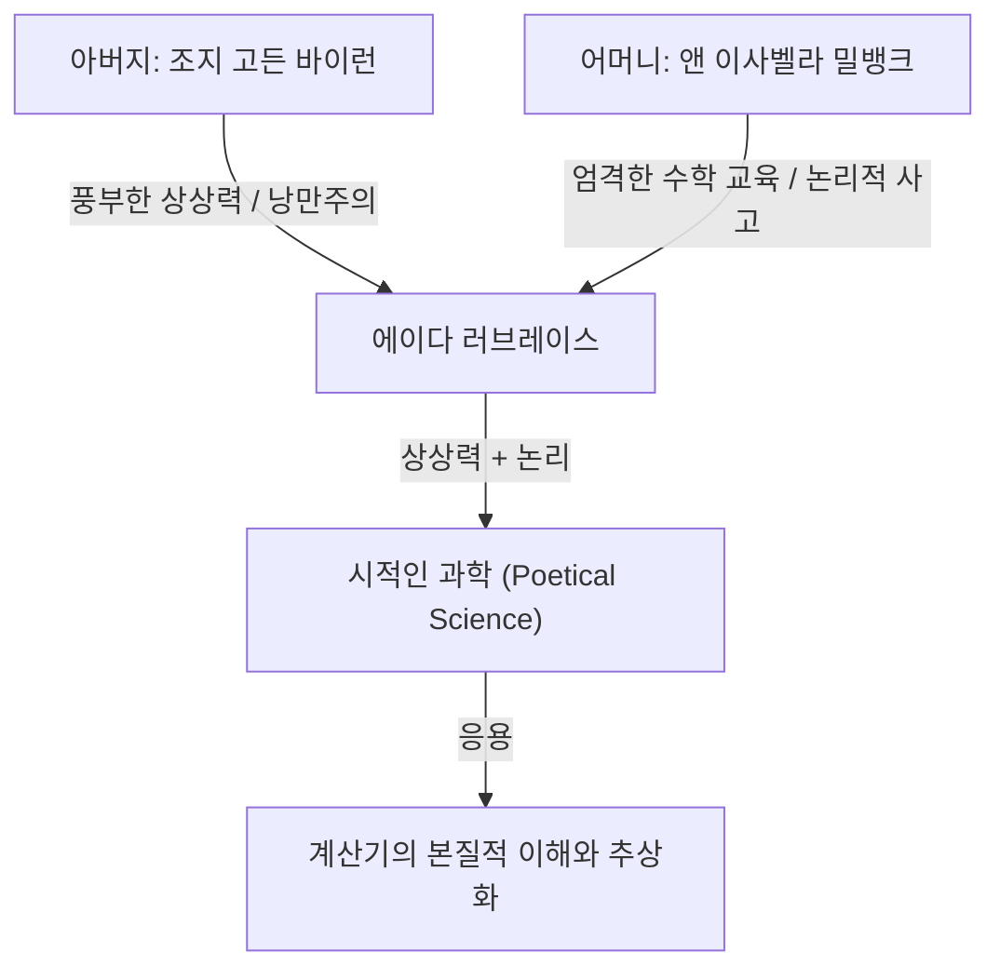
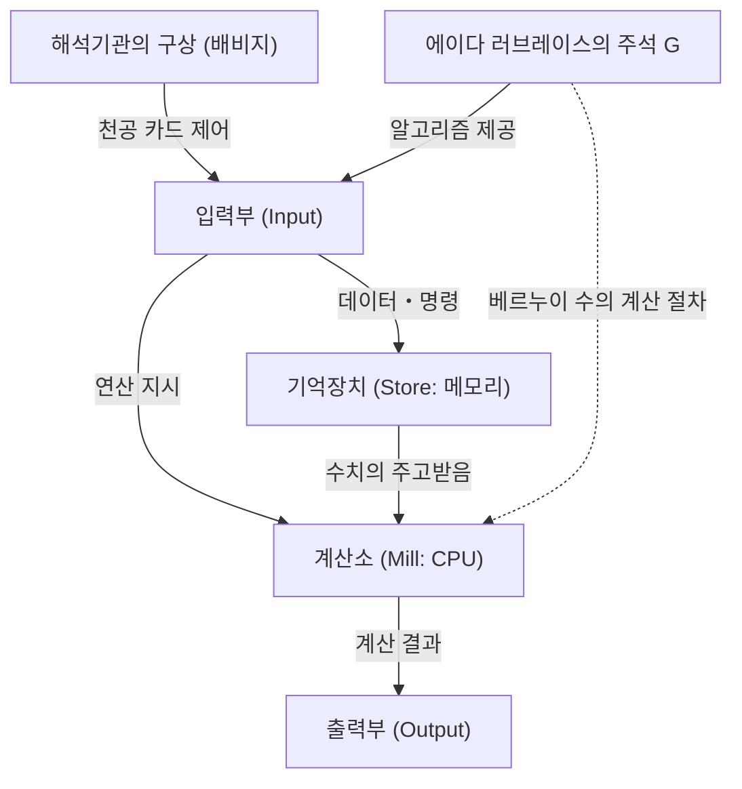

# 머리말: 빅토리아 시대의 천재, 에이다 러브레이스

컴퓨터 과학의 역사를 거슬러 올라갈 때, 우리는 반드시 한 여성의 이름에 다다르게 됩니다. 그녀의 이름은 어거스타 에이다 킹, 러브레이스 백작 부인(Augusta Ada King, Countess of Lovelace). 일반적으로 '에이다 러브레이스'로 알려진 그녀는 '세계 최초의 프로그래머'로서 역사에 그 이름을 새기고 있습니다.

그러나 그녀의 업적은 단순히 '최초의 코드를 작성했다'는 것에 머물지 않습니다. 에이다 러브레이스의 진정한 위대함은 계산기가 단순한 '수치를 계산하는 기계'를 넘어 '모든 정보를 처리하고 음악이나 예술조차도 만들어내는 범용적인 기계'가 될 수 있다는, 현대 컴퓨터의 본질을 19세기 단계에서 꿰뚫어 보았다는 점에 있습니다.

본 기사에서는 에이다 러브레이스의 기구한 생애, 그녀를 키워낸 환경, 찰스 배비지와의 운명적인 만남, 그리고 그녀가 남긴 역사적 문헌 'Note G(주석 G)'의 내용에 이르기까지 가능한 한 상세하고 깊이 있게 해설해 나갈 것입니다.

## 제1장: 시인의 피와 수학 교육——상반된 재능의 융합

에이다 러브레이스는 1815년 12월 10일 영국 런던에서 태어났습니다. 그녀의 아버지는 영국 낭만주의를 대표하는 대시인 조지 고든 바이런(제6대 바이런 남작). 어머니는 수학과 논리학을 사랑하여 바이런으로부터 '평행사변형의 공주'라고 불렸던 앤 이사벨라 밀뱅크(애너벨라)였습니다.

에이다가 태어난 지 불과 1개월 후, 부모는 극적인 이혼을 하게 됩니다. 바이런 경은 영국을 떠났고, 에이다는 다시는 아버지를 만나지 못했습니다.

어머니 애너벨라는 에이다가 아버지와 같은 '위험하고 부도덕한 시인'의 기질(바이런 가문의 광기)을 물려받는 것을 극도로 두려워했습니다. 그 결과 애너벨라는 에이다에게 당시 여성으로서는 극히 이례적인 엄격한 이과계 교육을 실시합니다.

### 엄격한 교육과 '시적인 과학'

에이다는 유년기부터 수학, 논리학, 과학, 천문학 등을 일류 가정교사들로부터 철저하게 주입받았습니다. 그러나 어머니의 의도와는 반대로, 에이다 안에는 아버지로부터 물려받은 풍부한 상상력과 열정이 확실히 숨쉬고 있었습니다.

에이다는 자신을 '시적인 과학자(Poetical Scientist)'라고 불렀습니다. 그녀에게 수학은 건조한 숫자의 나열이 아니라, 우주의 숨겨진 아름다움이나 진리를 해명하기 위한 '시'와 같은 것이었습니다. 이 '상상력과 논리적 사고의 융합'이야말로 훗날 그녀에게 역사적인 위업을 달성하게 하는 원동력이 됩니다.

## 제2장: 운명의 만남——찰스 배비지와 '차분기관'

1833년 6월, 17세의 에이다에게 인생 최대의 전환기가 찾아옵니다. 그녀는 가정교사 중 한 명이었던 메리 서머빌(당대를 대표하는 여성 과학자)을 통해 케임브리지 대학의 루커스 교수직에 있던 천재 수학자이자 발명가, 찰스 배비지(Charles Babbage)와 만납니다.

### 계산 기계와의 조우

당시 배비지는 다항식의 값을 계산하여 수표를 작성하기 위한 거대한 기계식 계산기 '차분기관(Difference Engine)'의 프로토타입을 공개하고 있었습니다. 에이다는 배비지 자택의 살롱에서 이 기계의 데몬스트레이션을 직접 보고 깊은 감명을 받습니다.

많은 사람들이 차분기관을 단순한 '진기한 장치'로만 보고 있었던 반면, 에이다는 그 기계에 숨겨진 진정한 수학적 아름다움과 가능성을 즉시 이해했습니다. 배비지 또한 이 어린 소녀의 비범한 수학적 지성과 통찰력에 경탄했으며, 두 사람은 나이 차이(배비지는 당시 41세)를 뛰어넘은 평생의 친구이자 공동 연구자가 되었습니다.

배비지는 에이다를 '숫자의 마술사(Enchantress of Number)'라고 부르며 그녀의 재능을 누구보다 높이 평가했습니다.

## 제3장: 궁극의 꿈 '해석기관'에 대한 도전

배비지는 차분기관의 개발에 고전하면서도 더욱 장대한 구상을 품게 됩니다. 그것이 천공 카드(구멍 뚫린 카드)를 사용하여 프로그램을 읽어들이게 함으로써 모든 수학적 계산을 실행할 수 있는 범용 계산기 '해석기관(Analytical Engine)'입니다.

이것은 현대 컴퓨터의 기본 구조(입력, 기억, 연산, 출력)를 모두 갖춘 놀라운 개념적 기계였습니다. 자카드 직기가 천공 카드를 사용하여 복잡한 무늬를 짜내듯, 해석기관은 '대수학적인 패턴을 짜내는' 기계였던 것입니다.

### 메나브레아의 논문과 에이다의 번역

1842년, 배비지가 이탈리아 토리노에서 해석기관에 대해 강연을 했습니다. 이 강연을 들은 이탈리아의 수학자(훗날 이탈리아 총리) 루이지 페데리코 메나브레아가 프랑스어로 해석기관에 대한 논문을 발표했습니다.

배비지의 친구들은 에이다에게 이 논문을 영어로 번역해 달라고 의뢰합니다. 에이다는 이 작업에 몰두하여 단순한 번역에 그치지 않고, 논문에 대한 자신의 견해나 상세한 해설을 '주석(Notes)'으로 덧붙였습니다.

결과적으로 그녀가 덧붙인 주석은 A부터 G까지 7개 항목에 달했으며, 글자 수는 원본 논문의 약 3배(약 2만 단어)로 불어났습니다. 이 '주석'이야말로 컴퓨터 역사상 가장 중요한 문헌 중 하나로 여겨지는 것입니다.

## 제4장: '세계 최초의 프로그램'——주석 G(Note G)의 기적

에이다가 작성한 주석 중 가장 유명한 것이 마지막에 놓인 '주석 G(Note G)'입니다.

여기에서는 해석기관을 사용하여 베르누이 수를 계산하기 위한 상세한 알고리즘이 단계별 표 형식으로 기술되어 있습니다. 이 표에는 변수의 상태, 실행할 연산, 연산 결과의 저장 위치 등이 지극히 논리적으로 정리되어 있으며, 이것이 오늘날 '세계 최초의 컴퓨터 프로그램'이라고 불리는 이유입니다.

에이다는 변수의 초기화, 루프(반복 처리), 조건 분기 등 현대 프로그래밍에서도 필수 불가결한 개념들을 이 주석 G 안에서 훌륭하게 구사하고 있습니다. 기계가 물리적으로 완성되지 않았음에도 불구하고, 그녀는 머릿속에서만 그 기계의 동작을 완벽하게 시뮬레이션하여 버그가 없는 프로그램을 작성해 낸 것입니다.

## 제5장: 시대를 100년 앞서간 '선견지명'

에이다 러브레이스가 진정한 천재였다는 증명은 단순히 프로그램을 작성했다는 것이 아니라, 해석기관의 '본질'을 꿰뚫어 보고 있었다는 데 있습니다.

배비지조차도 해석기관을 주로 '고도의 수표를 작성하기 위한 거대한 계산기'로 파악하고 있었습니다. 그러나 에이다는 해석기관이 다루는 대상이 '숫자'에만 한정되지 않는다는 것을 깨달았습니다.

그녀는 주석에서 다음과 같이 적고 있습니다.

> "해석기관은 수 이외의 것에도 작용할지 모릅니다. ... 예를 들어, 화성학이나 악곡 구성의 기본 법칙이 그러한 처리에 적합한 것이라면, 이 기계는 아무리 복잡하더라도 과학적이고 완벽한 음악을 작곡할 수 있을 것입니다."

즉 그녀는 숫자를 '음성'이나 '이미지', '기호' 등 모든 정보로 치환하여 처리할 수 있다는, 현대 디지털 컴퓨팅의 근간을 이루는 개념을 1843년 시점에서 예견했던 것입니다. 이는 앨런 튜링이 '만능 튜링 기계'의 개념을 제창하기 약 100년 전의 일이었습니다.

동시에 그녀는 '해석기관은 인간이 명령한 것만 실행할 수 있다(스스로 무언가를 창조해 내지는 않는다)'고도 지적했으며, 이는 현대의 AI(인공지능)에 관한 논의(이른바 '러브레이스의 반론')에서도 자주 인용되는 중요한 통찰입니다.

## 제6장: 말년과 후세에 남긴 유산

에이다의 탁월한 지성은 그녀의 삶을 반드시 행복하게 만들지는 않았습니다. 그녀는 평생에 걸쳐 심각한 건강 문제에 시달렸으며, 또한 수학에 대한 지나친 몰두나 도박에의 경도, 빚 문제 등 파란만장한 말년을 보냈습니다.

1852년 11월 27일, 에이다 러브레이스는 자궁암으로 인해 불과 36세의 나이로 세상을 떠났습니다. 기이하게도 그것은 아버지 바이런 경이 사망한 것과 같은 나이였습니다. 그녀의 유언에 따라, 그녀는 한 번도 만나본 적 없는 아버지의 곁에 안장되었습니다.

### 컴퓨터 시대의 재평가

배비지의 해석기관이 그녀가 살아있는 동안 완성되는 일은 없었고, 그녀의 업적도 오랫동안 역사 속에 묻혀 있었습니다. 그러나 20세기 중반에 컴퓨터의 시대가 막을 열자, 그녀가 남긴 '주석'이 재발견되었고 그 경이로운 선견지명이 전 세계로부터 찬사를 받게 됩니다.

1979년, 미국 국방부는 개발한 새로운 프로그래밍 언어를 그녀에게 경의를 표하여 'Ada(에이다)'라고 명명했습니다. 현재도 10월 둘째 주 화요일은 '에이다 러브레이스의 날'로서, STEM(과학·기술·공학·수학) 분야에서의 여성의 활약을 축하하는 국제적인 기념일이 되었습니다.

## 맺음말

에이다 러브레이스는 톱니바퀴와 증기기관의 시대에 100년 후의 디지털 세계를 꿈꾼 '미래에서 온 방문자'였습니다. 그녀의 풍부한 상상력과 엄격한 논리적 사고의 융합이 만들어낸 '시적인 과학'은 오늘날 우리가 누리고 있는 IT 사회의 주춧돌이 되었습니다.

세계 최초의 프로그래머라는 칭호 이상으로, 그녀가 컴퓨터의 본질을 누구보다 빠르고 깊게 이해하고 있었다는 사실은 인류의 지적 역사에서 가장 빛나는 에피소드 중 하나로 앞으로도 계속 이야기될 것입니다.
