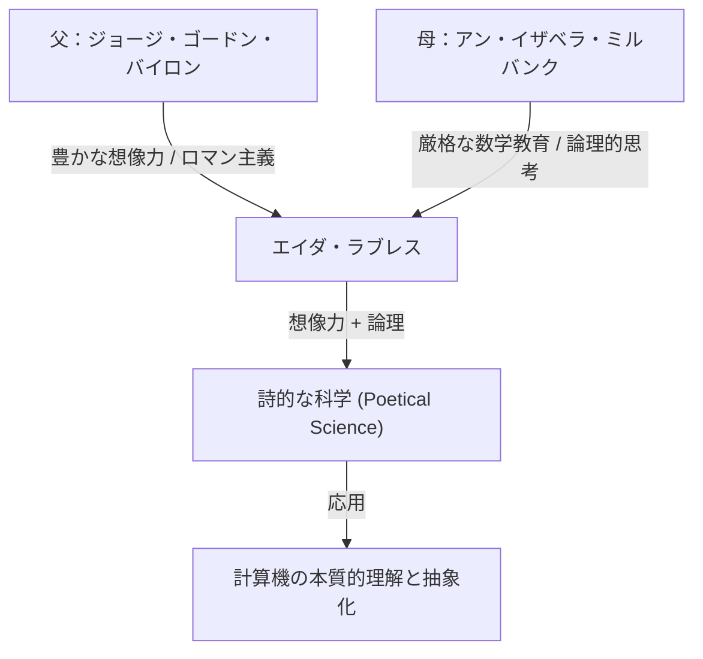
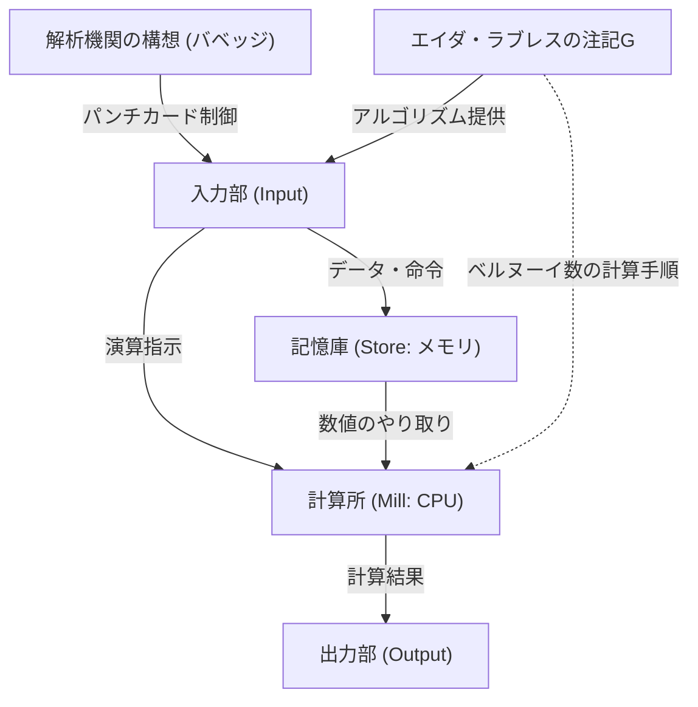

# はじめに：ヴィクトリア朝の天才、エイダ・ラブレス

コンピュータ・サイエンスの歴史を遡る時、私たちは必ず一人の女性の名前に行き着きます。彼女の名前はオーガスタ・エイダ・キング、ラブレス伯爵夫人（Augusta Ada King, Countess of Lovelace）。一般には「エイダ・ラブレス」として知られる彼女は、「世界初のプログラマー」として歴史にその名を刻んでいます。

しかし、彼女の業績は単に「最初のコードを書いた」ということだけに留まりません。エイダ・ラブレスの真の偉大さは、計算機が単なる「数値を計算する機械」を超えて、「あらゆる情報を処理し、音楽や芸術すらも生み出す汎用的な機械」になり得るという、現代のコンピュータの本質を19世紀の段階で見抜いていた点にあります。

本記事では、エイダ・ラブレスの数奇な生涯、彼女を育んだ環境、チャールズ・バベッジとの運命的な出会い、そして彼女が残した歴史的文献「Note G（注記G）」の内容に至るまで、可能な限り詳細かつ深掘りして解説していきます。

## 第1章：詩人の血と数学の教育——相反する才能の融合

エイダ・ラブレスは1815年12月10日、イギリス・ロンドンで生まれました。彼女の父親は、イギリス・ロマン派を代表する大詩人、ジョージ・ゴードン・バイロン（第6代バイロン男爵）。母親は、数学と論理学を愛し「平行四辺形のプリンセス」とバイロンから呼ばれたアン・イザベラ・ミルバンク（アナベラ）でした。

エイダが生まれてわずか1ヶ月後、両親は劇的な離婚を遂げます。バイロン卿はイギリスを去り、エイダは二度と父親に会うことはありませんでした。

母親のアナベラは、エイダが父親のような「危険で不道徳な詩人」の気質（バイロン家の狂気）を受け継ぐことを極端に恐れました。その結果、アナベラはエイダに対し、当時の女性としては異例中の異例である、厳格な理数系教育を施します。

### 厳しい教育と「詩的な科学」

エイダは幼少期から、数学、論理学、科学、天文学などを一流の家庭教師から徹底的に叩き込まれました。しかし、母親の意図とは裏腹に、エイダの中には父親から受け継いだ豊かな想像力と情熱が確かに息づいていました。

エイダは自身のことを「詩的な科学者（Poetical Scientist）」と呼んでいました。彼女にとって数学は、無味乾燥な数字の羅列ではなく、宇宙の隠された美しさや真理を解き明かすための「詩」のようなものだったのです。この「想像力と論理的思考の融合」こそが、後に彼女に歴史的な偉業を成し遂げさせる原動力となります。

## 第2章：運命の出会い——チャールズ・バベッジと「階差機関」

1833年6月、17歳のエイダにとって人生最大の転機が訪れます。彼女は家庭教師の一人であったメアリー・サマヴィル（当時を代表する女性科学者）を通じて、ケンブリッジ大学のルーカス教授職にあった天才数学者であり発明家、チャールズ・バベッジ（Charles Babbage）と出会います。

### 計算機械との遭遇

当時のバベッジは、多項式の値を計算して数表を作成するための巨大な機械式計算機「階差機関（Difference Engine）」のプロトタイプを公開していました。エイダはバベッジの自宅のサロンでこの機械のデモンストレーションを目の当たりにし、深い感銘を受けます。

多くの人々が階差機関を単なる「珍しいからくり」としてしか見ていなかったのに対し、エイダはその機械に潜む真の数学的な美しさと可能性を即座に理解しました。バベッジもまた、この若き少女の並外れた数学的知性と洞察力に驚嘆し、二人は年齢差（バベッジは当時41歳）を超えた生涯にわたる友人であり、共同研究者となりました。

バベッジはエイダを「数の魔女（Enchantress of Number）」と呼び、彼女の才能を誰よりも高く評価していました。

## 第3章：究極の夢「解析機関」への挑戦

バベッジは階差機関の開発に苦戦しながらも、さらに壮大な構想を抱くようになります。それが、パンチカード（穴あきカード）を用いてプログラムを読み込ませることで、あらゆる数学的計算を実行できる汎用計算機「解析機関（Analytical Engine）」です。

これは現代のコンピュータの基本構造（入力、記憶、演算、出力）をすべて備えた、驚くべき概念的機械でした。ジャカード織機がパンチカードを使って複雑な模様を織り上げるように、解析機関は「代数的なパターンを織り上げる」機械だったのです。

### メニナブレアの論文とエイダの翻訳

1842年、バベッジがイタリアのトリノで解析機関について講演を行いました。この講演を聴いたイタリアの数学者（後のイタリア首相）ルイジ・フェデリコ・メニナブレアが、フランス語で解析機関についての論文を発表しました。

バベッジの友人たちは、エイダにこの論文を英語に翻訳するよう依頼します。エイダはこの作業に没頭し、単なる翻訳にとどまらず、論文に対して自身の見解や詳細な解説を「注記（Notes）」として書き加えました。

結果として、彼女が付け加えた注記はAからGまでの7項目に及び、文字数は元の論文の約3倍（約2万語）にも膨れ上がりました。この「注記」こそが、コンピュータ史において最も重要な文献の一つとされるものです。

## 第4章：「世界初のプログラム」——注記G（Note G）の奇跡

エイダが記述した注記の中で最も有名なのが、最後に置かれた「注記G（Note G）」です。

ここでは、解析機関を用いてベルヌーイ数を計算するための詳細なアルゴリズムが、ステップ・バイ・ステップの表形式で記述されています。この表には、変数の状態、実行する演算、演算結果の格納先などが極めて論理的に整理されており、これが今日「世界初のコンピュータ・プログラム」と呼ばれているゆえんです。

エイダは、変数の初期化、ループ（繰り返し処理）、条件分岐といった、現代のプログラミングにおいても不可欠な概念を、この注記Gの中で見事に駆使しています。機械が物理的に完成していなかったにもかかわらず、彼女は頭の中だけでその機械の動作を完璧にシミュレートし、バグのないプログラムを書き上げたのです。

## 第5章：時代を100年先取った「先見性」

エイダ・ラブレスが真に天才であった証明は、単にプログラムを書いたことではなく、解析機関の「本質」を見抜いていたことにあります。

バベッジでさえ、解析機関を主に「高度な数表を作成するための巨大な計算機」として捉えていました。しかしエイダは、解析機関が扱う対象は「数字」だけに限定されないことに気づいていました。

彼女は注記の中で次のように記しています。

> 「解析機関は、数以外のものにも作用するかもしれません。... 例えば、和声学や楽曲構成の基本法則がそのような処理に適合するものであれば、この機械は、どんなに複雑であっても、科学的で完璧な音楽を作曲することができるでしょう。」

つまり彼女は、数字を「音声」や「画像」「記号」など、あらゆる情報に置き換えて処理できるという、現代のデジタル・コンピューティングの根幹をなす概念を1843年の時点で予見していたのです。これは、アラン・チューリングが「万能チューリングマシン」の概念を提唱する約100年も前のことでした。

同時に彼女は、「解析機関は人間が命じたことしか実行できない（自ら何かを創り出すことはない）」とも指摘しており、これは現代のAI（人工知能）に関する議論（いわゆる「ラブレスの反論」）においても度々引用される重要な洞察です。

## 第6章：晩年と後世への遺産

エイダの卓越した知性は、彼女の人生を必ずしも幸福にはしませんでした。彼女は生涯を通じて深刻な健康問題に悩まされ、また数学への過度な没頭やギャンブルへの傾倒、借金問題など、波乱に満ちた晩年を送りました。

1852年11月27日、エイダ・ラブレスは子宮がんのため、わずか36歳でこの世を去りました。奇しくも、それは父親バイロン卿が亡くなったのと同じ年齢でした。彼女の遺っての希望により、彼女は一度も会うことのなかった父親の隣に埋葬されました。

### コンピュータ時代における再評価

バベッジの解析機関が彼女の生きている間に完成することはなく、彼女の業績も長らく歴史の中に埋もれていました。しかし、20世紀半ばにコンピュータの時代が幕を開けると、彼女の残した「注記」が再発見され、その驚異的な先見性が世界中から称賛されるようになります。

1979年、アメリカ国防総省は開発した新しいプログラミング言語を、彼女に敬意を表して「Ada（エイダ）」と命名しました。現在でも、10月の第2火曜日は「エイダ・ラブレスの日」として、STEM（科学・技術・工学・数学）分野における女性の活躍を祝う国際的な記念日となっています。

## おわりに

エイダ・ラブレスは、歯車と蒸気機関の時代にあって、100年後のデジタルの世界を夢見た「未来からの訪問者」でした。彼女の豊かな想像力と厳格な論理的思考の融合が生み出した「詩的な科学」は、今日の私たちが享受しているIT社会の礎石となっています。

世界初のプログラマーという称号以上に、彼女がコンピュータの本質を誰よりも早く、深く理解していたという事実は、人類の知的歴史における最も輝かしいエピソードの一つとして、これからも語り継がれていくことでしょう。
