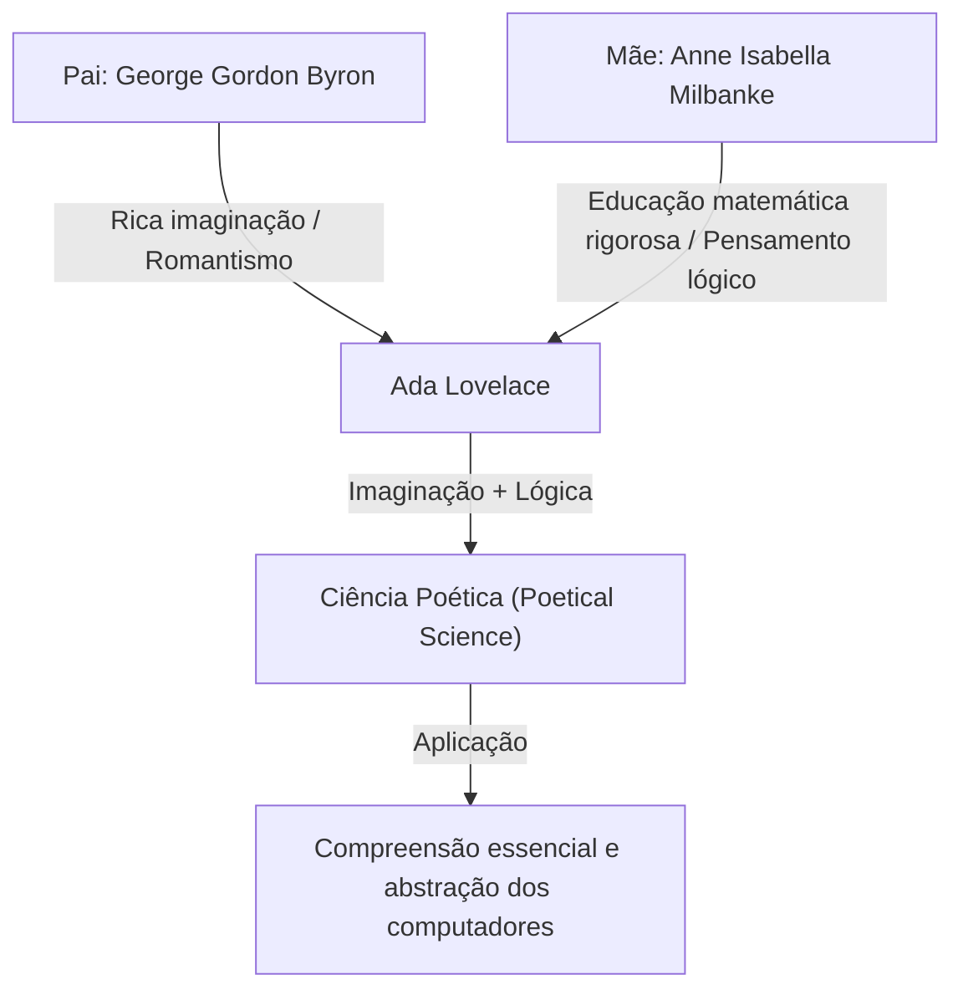
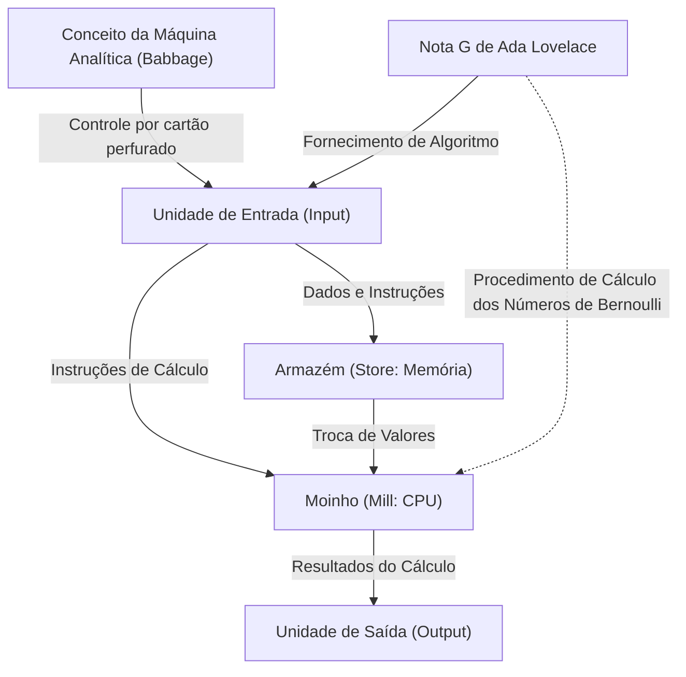

# Introdução: O Gênio da Era Vitoriana, Ada Lovelace

Ao traçar a história da ciência da computação, sempre chegamos ao nome de uma mulher. Seu nome é Augusta Ada King, Condessa de Lovelace. Geralmente conhecida como "Ada Lovelace", ela gravou seu nome na história como a "primeira programadora do mundo".

No entanto, suas conquistas vão além de simplesmente "escrever o primeiro código". A verdadeira grandeza de Ada Lovelace reside no fato de que, já no século XIX, ela previu a essência dos computadores modernos: que uma máquina de calcular poderia transcender ser apenas uma "máquina de calcular números" e se tornar uma "máquina de uso geral capaz de processar qualquer informação e até mesmo criar música e arte".

Neste artigo, exploraremos com o máximo de detalhes possível a vida extraordinária de Ada Lovelace, o ambiente em que cresceu, seu encontro fatídico com Charles Babbage e o conteúdo de seu documento histórico "Nota G (Note G)".

## Capítulo 1: O Sangue de um Poeta e a Educação Matemática —— A Fusão de Talentos Contrastantes

Ada Lovelace nasceu em Londres, Inglaterra, em 10 de dezembro de 1815. Seu pai era o grande poeta representante do Romantismo inglês, George Gordon Byron (o 6º Barão Byron). Sua mãe era Anne Isabella Milbanke (Annabella), a quem Byron chamava de "Princesa dos Paralelogramos" por seu amor à matemática e à lógica.

Apenas um mês após o nascimento de Ada, seus pais passaram por um divórcio dramático. Lord Byron deixou a Inglaterra e Ada nunca mais viu seu pai.

Sua mãe, Annabella, tinha um medo extremo de que Ada herdasse o temperamento de "poeta perigoso e imoral" de seu pai (a loucura da família Byron). Como resultado, Annabella deu a Ada uma educação rigorosa em matemática e ciências, o que era uma exceção extrema para as mulheres daquela época.

### Uma Educação Rigorosa e a "Ciência Poética"

Desde cedo, Ada recebeu educação intensiva em matemática, lógica, ciências e astronomia por tutores de primeira linha. No entanto, contrariando as intenções de sua mãe, a rica imaginação e paixão que ela herdou de seu pai certamente viviam dentro dela.

Ada chamava a si mesma de "Cientista Poética (Poetical Scientist)". Para ela, a matemática não era uma série seca de números, mas sim uma "poesia" para desvendar as belezas e verdades ocultas do universo. Essa "fusão de imaginação e pensamento lógico" foi exatamente o que a impulsionou a alcançar suas realizações históricas posteriores.

## Capítulo 2: Um Encontro Fatídico —— Charles Babbage e a "Máquina Diferencial"

Em junho de 1833, o maior ponto de virada na vida de Ada, de 17 anos, ocorreu. Através de uma de suas tutoras, Mary Somerville (uma das principais cientistas femininas da época), ela conheceu Charles Babbage, um matemático genial e inventor que ocupou a Cátedra Lucasiana de Matemática na Universidade de Cambridge.

### O Encontro com a Máquina de Calcular

Na época, Babbage estava apresentando um protótipo de sua gigantesca calculadora mecânica, a "Máquina Diferencial (Difference Engine)", projetada para calcular valores polinomiais e criar tabelas matemáticas. Ada testemunhou uma demonstração desta máquina no salão da casa de Babbage e ficou profundamente impressionada.

Enquanto muitas pessoas viam a Máquina Diferencial como um mero "brinquedo curioso", Ada compreendeu instantaneamente a verdadeira beleza e o potencial matemático ocultos naquela máquina. Babbage também ficou maravilhado com a extraordinária inteligência matemática e visão da jovem, e os dois se tornaram amigos por toda a vida e colaboradores em pesquisa, transcendendo sua diferença de idade (Babbage tinha 41 anos na época).

Babbage chamava Ada de "A Feiticeira dos Números (Enchantress of Number)" e avaliava seu talento mais alto do que qualquer outra pessoa.

## Capítulo 3: O Desafio do Sonho Supremo, a "Máquina Analítica"

Embora Babbage lutasse com o desenvolvimento da Máquina Diferencial, ele começou a conceber uma ideia ainda mais grandiosa. Tratava-se da "Máquina Analítica (Analytical Engine)", uma calculadora de uso geral que poderia executar qualquer cálculo matemático lendo programas através de cartões perfurados.

Era uma máquina conceitual notável, equipada com todas as estruturas básicas de um computador moderno (entrada, memória, processamento e saída). Assim como o tear de Jacquard usava cartões perfurados para tecer padrões complexos, a Máquina Analítica era uma máquina que "tecia padrões algébricos".

### O Artigo de Menabrea e a Tradução de Ada

Em 1842, Babbage deu uma palestra sobre a Máquina Analítica em Turim, Itália. O matemático italiano Luigi Federico Menabrea (posteriormente Primeiro-Ministro da Itália), que assistiu à palestra, publicou um artigo sobre a Máquina Analítica em francês.

Os amigos de Babbage pediram a Ada que traduzisse esse artigo para o inglês. Ada mergulhou nessa tarefa e, indo além da mera tradução, acrescentou suas próprias opiniões e explicações detalhadas ao artigo como "Notas (Notes)".

Como resultado, as notas que ela acrescentou abrangeram 7 itens, de A a G, e a contagem de palavras aumentou para cerca de três vezes a do artigo original (aproximadamente 20.000 palavras). Essas "Notas" são consideradas um dos documentos mais importantes da história da computação.

## Capítulo 4: O "Primeiro Programa do Mundo" —— O Milagre da Nota G (Note G)

A mais famosa das notas escritas por Ada é a última, a "Nota G (Note G)".

Aqui, ela descreveu um algoritmo detalhado para calcular os números de Bernoulli usando a Máquina Analítica, apresentado passo a passo em formato de tabela. Esta tabela organiza logicamente o estado das variáveis, as operações a serem executadas e os destinos para armazenar os resultados das operações, e é por isso que hoje é chamado de "o primeiro programa de computador do mundo".

Ada utilizou com maestria conceitos que são indispensáveis na programação moderna, como a inicialização de variáveis, loops (processamento repetitivo) e ramificações condicionais (condicionais), dentro desta Nota G. Embora a máquina não estivesse fisicamente concluída, ela simulou perfeitamente sua operação apenas em sua cabeça e escreveu um programa sem bugs.

## Capítulo 5: "Presciência" Que Antecipou Sua Era em 100 Anos

A prova de que Ada Lovelace era um verdadeiro gênio não reside simplesmente no fato de ela ter escrito um programa, mas em sua percepção da "essência" da Máquina Analítica.

Até mesmo Babbage via a Máquina Analítica principalmente como uma "calculadora gigante para criar tabelas matemáticas avançadas". No entanto, Ada percebeu que os objetos manipulados pela Máquina Analítica não se limitavam apenas a "números".

Ela escreveu em suas notas:

> "A Máquina Analítica pode atuar sobre outras coisas além dos números... Supondo, por exemplo, que as relações fundamentais de sons e a ciência da harmonia musical fossem suscetíveis a tais expressões e adaptações, a máquina poderia compor peças de música de qualquer grau de complexidade ou extensão científica."

Em outras palavras, em 1843, ela previu o conceito que forma a base da computação digital moderna: que os números poderiam ser substituídos e processados como qualquer forma de informação, como "som", "imagem" ou "símbolo". Isso foi cerca de 100 anos antes de Alan Turing propor o conceito da "Máquina de Turing Universal".

Ao mesmo tempo, ela também apontou que "A Máquina Analítica não tem pretensão alguma de originar algo (não pode criar nada por si mesma, apenas executa o que ordenamos)", o que é um insight importante frequentemente citado em debates modernos sobre IA (Inteligência Artificial) (a chamada "Objeção de Lovelace").

## Capítulo 6: Últimos Anos e Legado para as Gerações Futuras

A inteligência notável de Ada não a fez necessariamente feliz em sua vida. Ela sofreu com graves problemas de saúde ao longo de sua vida, e também viveu seus últimos anos de forma turbulenta, lutando com excesso de dedicação à matemática, inclinação ao jogo e problemas com dívidas.

Em 27 de novembro de 1852, Ada Lovelace faleceu de câncer uterino com apenas 36 anos de idade. Coincidentemente, era a mesma idade em que seu pai, Lord Byron, morreu. A seu pedido, ela foi enterrada ao lado de seu pai, a quem ela nunca tinha conhecido.

### Reavaliação na Era da Computação

A Máquina Analítica de Babbage nunca foi concluída durante a vida dela, e suas conquistas permaneceram enterradas na história por um longo tempo. No entanto, quando a era da computação amanheceu em meados do século 20, suas "Notas" foram redescobertas e sua incrível presciência passou a ser aclamada em todo o mundo.

Em 1979, o Departamento de Defesa dos EUA nomeou uma nova linguagem de programação que desenvolveu como "Ada" em sua homenagem. Mesmo hoje, a segunda terça-feira de outubro é celebrada internacionalmente como o "Dia de Ada Lovelace" para celebrar as conquistas das mulheres nos campos STEM (Ciência, Tecnologia, Engenharia e Matemática).

## Conclusão

Ada Lovelace foi uma "visitante do futuro" que sonhou com um mundo digital 100 anos à frente, em uma era de engrenagens e máquinas a vapor. A "Ciência Poética" nascida da fusão de sua rica imaginação e pensamento lógico rigoroso serve como pedra angular da sociedade de TI que desfrutamos hoje.

Além do título de primeira programadora do mundo, o fato de que ela compreendeu a essência dos computadores mais cedo e mais profundamente do que qualquer outra pessoa continuará a ser transmitido como um dos episódios mais brilhantes da história intelectual da humanidade.
