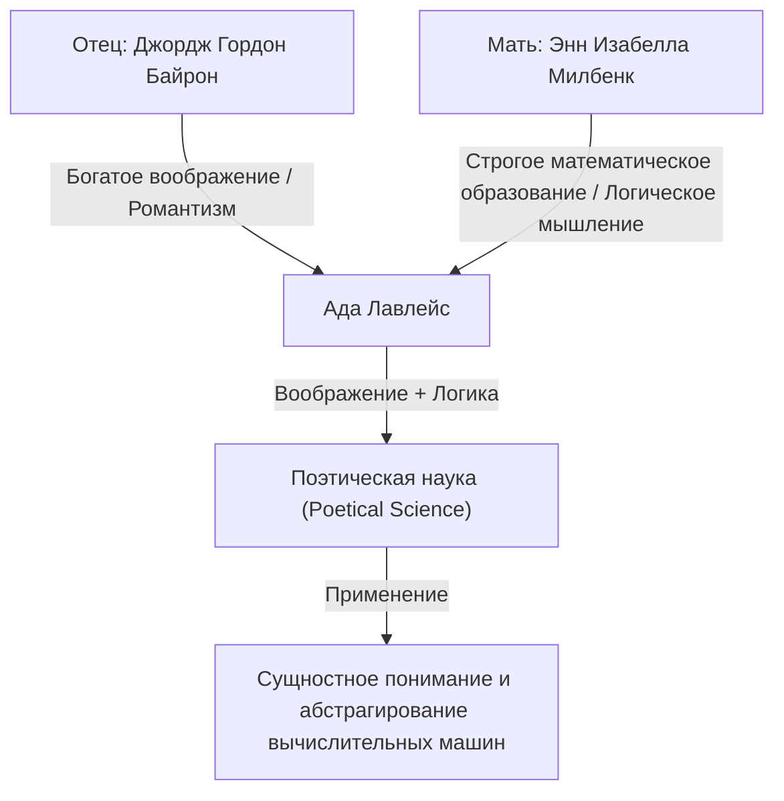
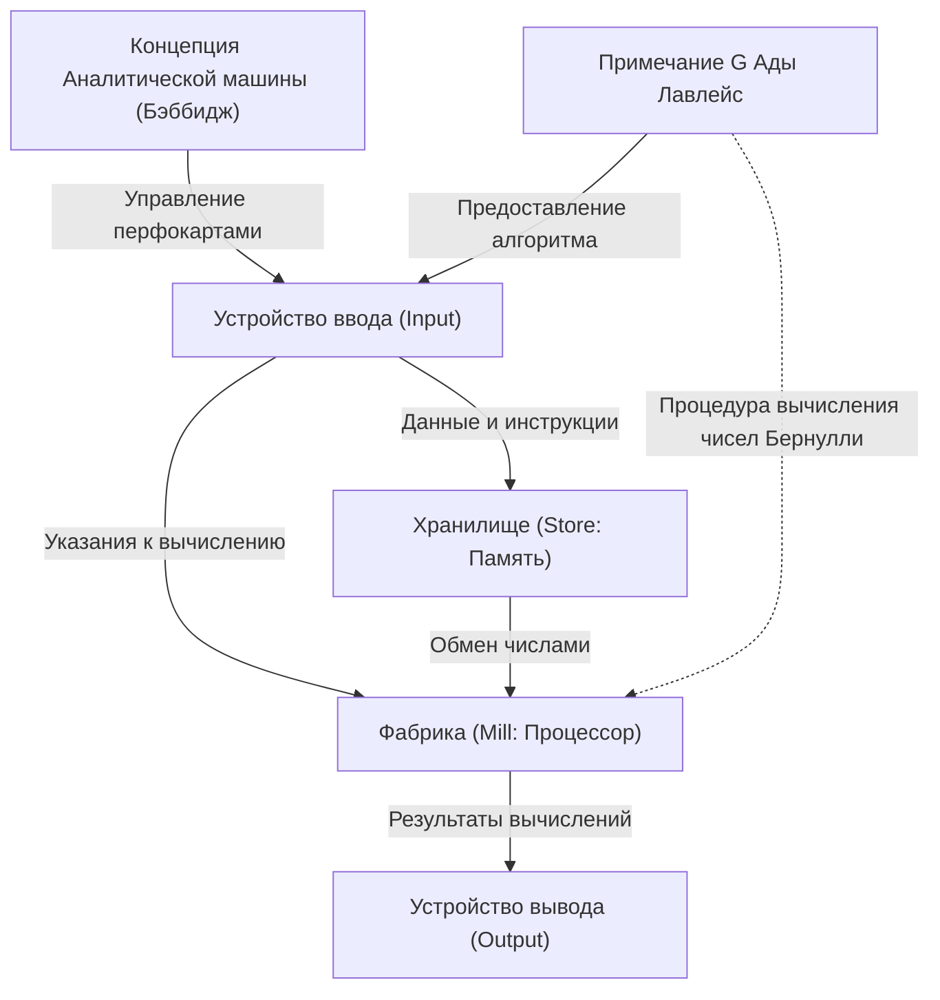

# Введение: Гений Викторианской эпохи, Ада Лавлейс

Оглядываясь на историю информатики, мы неизбежно сталкиваемся с именем одной женщины. Её имя — Августа Ада Кинг, графиня Лавлейс (Augusta Ada King, Countess of Lovelace). Известная широкой публике как «Ада Лавлейс», она вошла в историю как «первый в мире программист».

Однако её достижения не ограничиваются простым «написанием первого кода». Истинное величие Ады Лавлейс заключается в том, что она разглядела суть современных компьютеров ещё в 19 веке: она поняла, что вычислительная машина может выйти за рамки простого «устройства для вычисления чисел» и стать «универсальной машиной, способной обрабатывать любую информацию и даже создавать музыку и искусство».

В этой статье мы максимально подробно и глубоко рассмотрим необычную жизнь Ады Лавлейс, среду, в которой она выросла, её судьбоносную встречу с Чарльзом Бэббиджем и содержание оставленного ею исторического документа — «Примечание G (Note G)».

## Глава 1: Кровь поэта и математическое образование — слияние противоположных талантов

Ада Лавлейс родилась 10 декабря 1815 года в Лондоне, Англия. Её отцом был великий поэт, представитель английского романтизма Джордж Гордон Байрон (6-й барон Байрон). Её матерью была Энн Изабелла Милбенк (Анабелла), увлекавшаяся математикой и логикой, которую Байрон называл «Королевой параллелограммов».

Всего через месяц после рождения Ады её родители со скандалом развелись. Лорд Байрон покинул Англию, и Ада больше никогда не видела своего отца.

Мать Анабелла панически боялась, что Ада унаследует темперамент (безумие рода Байронов) своего отца, «опасного и аморального поэта». В результате Анабелла дала Аде строгое математическое и естественнонаучное образование, что было крайне необычно для женщин того времени.

### Строгое образование и «поэтическая наука»

С раннего детства первоклассные домашние учителя тщательно обучали Аду математике, логике, науке и астрономии. Однако, вопреки намерениям матери, в Аде действительно жило богатое воображение и страсть, унаследованные от отца.

Ада называла себя «поэтическим ученым (Poetical Scientist)». Для неё математика была не сухим набором цифр, а чем-то вроде «поэзии», служащей для раскрытия скрытой красоты и истины Вселенной. Именно это «слияние воображения и логического мышления» стало движущей силой, позволившей ей в будущем совершить исторический подвиг.

## Глава 2: Судьбоносная встреча — Чарльз Бэббидж и «Разностная машина»

В июне 1833 года в жизни 17-летней Ады произошел величайший поворотный момент. Через одну из своих домашних наставниц, Мэри Сомервилль (выдающуюся женщину-ученого того времени), она познакомилась с гениальным математиком и изобретателем Чарльзом Бэббиджем, занимавшим должность лукасовского профессора в Кембриджском университете.

### Знакомство с вычислительной машиной

В то время Бэббидж демонстрировал прототип гигантского механического калькулятора — «Разностной машины (Difference Engine)», предназначенной для вычисления значений многочленов и создания математических таблиц. Ада своими глазами увидела демонстрацию этой машины в салоне дома Бэббиджа и была глубоко впечатлена.

В то время как многие люди видели в Разностной машине лишь «забавную диковину», Ада мгновенно поняла её истинную математическую красоту и скрытый потенциал. Бэббидж, в свою очередь, был поражен выдающимся математическим интеллектом и проницательностью этой юной девушки. Несмотря на разницу в возрасте (Бэббиджу тогда был 41 год), они стали друзьями и соавторами на всю жизнь.

Бэббидж называл Аду «Волшебницей чисел (Enchantress of Number)» и ценил её талант выше всех остальных.

## Глава 3: Вызов абсолютной мечте — «Аналитическая машина»

Продолжая бороться с трудностями при разработке Разностной машины, Бэббидж задумал ещё более грандиозный проект. Это была «Аналитическая машина (Analytical Engine)» — универсальный компьютер, способный выполнять любые математические вычисления путем чтения программ с помощью перфокарт.

Это была удивительная концептуальная машина, оснащенная всеми базовыми структурами современного компьютера (ввод, память, обработка, вывод). Подобно тому, как жаккардовый ткацкий станок использовал перфокарты для создания сложных узоров, Аналитическая машина была устройством для «ткачества алгебраических узоров».

### Статья Менабреа и перевод Ады

В 1842 году Бэббидж прочитал лекцию об Аналитической машине в Турине, Италия. Итальянский математик (и будущий премьер-министр Италии) Луиджи Федерико Менабреа, присутствовавший на лекции, опубликовал статью об Аналитической машине на французском языке.

Друзья Бэббиджа попросили Аду перевести эту статью на английский язык. Ада погрузилась в эту работу и не ограничилась простым переводом: она добавила к статье собственные взгляды и подробные пояснения в виде «Примечаний (Notes)».

В результате её примечания, обозначенные буквами от A до G, увеличили объем оригинальной статьи примерно в три раза (около 20 000 слов). Именно эти «Примечания» считаются одним из важнейших документов в истории компьютеров.

## Глава 4: «Первая в мире программа» — Чудо Примечания G (Note G)

Самым известным из примечаний, написанных Адой, является последнее — «Примечание G (Note G)».

Здесь в виде пошаговой таблицы описан подробный алгоритм вычисления чисел Бернулли с помощью Аналитической машины. В этой таблице предельно логично структурированы состояния переменных, выполняемые операции и места хранения результатов. Именно поэтому сегодня её называют «первой в мире компьютерной программой».

В Примечании G Ада блестяще использовала такие концепции, как инициализация переменных, циклы (повторяющиеся процессы) и условные переходы, которые являются неотъемлемой частью современного программирования. Несмотря на то, что машина физически не была завершена, она смогла идеально смоделировать её работу в уме и написать безошибочную программу.

## Глава 5: «Дальновидность», опередившая время на 100 лет

Доказательством того, что Ада Лавлейс была истинным гением, является не просто написание программы, а то, что она разглядела «суть» Аналитической машины.

Даже сам Бэббидж воспринимал Аналитическую машину в первую очередь как «гигантский калькулятор для создания сложных математических таблиц». Однако Ада поняла, что машина может работать не только с «числами».

В своих примечаниях она писала:

> «Аналитическая машина могла бы воздействовать на другие вещи, помимо чисел... Предположим, например, что фундаментальные законы гармонии и музыкальной композиции поддаются такой обработке и адаптации; тогда машина могла бы сочинять сложные и научные музыкальные произведения любой степени сложности или длины».

То есть уже в 1843 году она предвидела концепцию, лежащую в основе современных цифровых вычислений: возможность заменить числа на любую информацию, будь то «звук», «изображение» или «символ». Это произошло примерно за 100 лет до того, как Алан Тьюринг предложил концепцию «универсальной машины Тьюринга».

В то же время она отметила, что «Аналитическая машина не претендует на создание чего-либо оригинального; она может выполнять только то, что мы умеем ей приказать». Это важное наблюдение часто цитируется в современных дискуссиях об искусственном интеллекте (так называемое «Возражение леди Лавлейс»).

## Глава 6: Последние годы и наследие для потомков

Выдающийся интеллект Ады не принес ей безоблачного счастья. На протяжении всей жизни она страдала от серьезных проблем со здоровьем. Её последние годы были полны потрясений: чрезмерное увлечение математикой, склонность к азартным играм и проблемы с долгами.

27 ноября 1852 года Ада Лавлейс скончалась от рака матки в возрасте всего 36 лет. По иронии судьбы, именно в этом возрасте умер её отец, лорд Байрон. Согласно её последнему желанию, она была похоронена рядом с отцом, с которым никогда не встречалась.

### Переоценка в компьютерную эру

Аналитическая машина Бэббиджа так и не была завершена при её жизни, и её достижения на долгое время были забыты. Однако с наступлением компьютерной эры в середине 20-го века её «Примечания» были вновь открыты, и её поразительная дальновидность получила мировое признание.

В 1979 году Министерство обороны США назвало разработанный ими новый язык программирования «Ada» в её честь. По сей день второй вторник октября отмечается как «День Ады Лавлейс» — международный праздник, посвященный достижениям женщин в областях STEM (наука, технологии, инженерия и математика).

## Заключение

Ада Лавлейс была «гостьей из будущего», которая в эпоху шестеренок и паровых машин мечтала о цифровом мире сто лет спустя. «Поэтическая наука», рожденная слиянием её богатого воображения и строгого логического мышления, стала краеугольным камнем современного IT-общества, благами которого мы пользуемся сегодня.

Больше, чем титул первого в мире программиста, тот факт, что она поняла суть компьютеров раньше и глубже всех остальных, навсегда останется одним из самых ярких эпизодов в интеллектуальной истории человечества.
