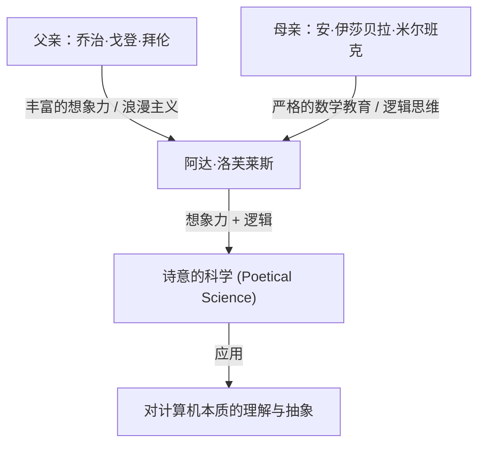
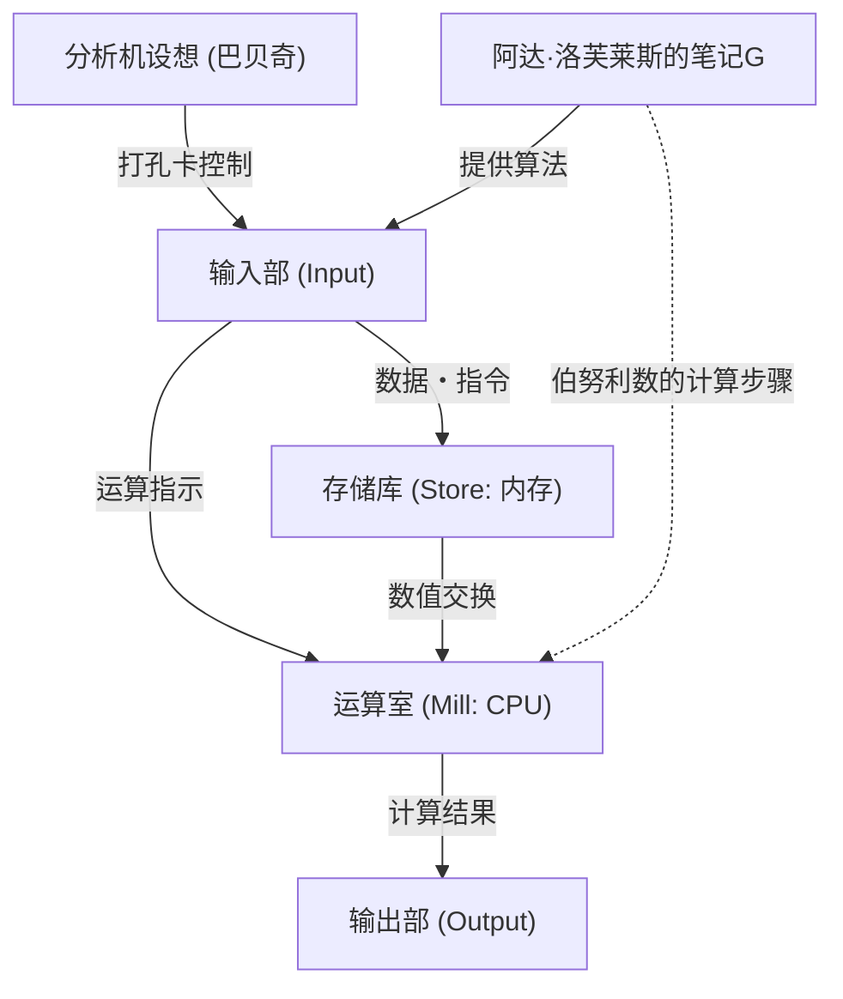

# 引言：维多利亚时代的天才，阿达·洛芙莱斯

回顾计算机科学的历史时，我们必然会提到一位女性的名字。她名叫奥古斯塔·阿达·金，洛芙莱斯伯爵夫人（Augusta Ada King, Countess of Lovelace）。她通常被称为“阿达·洛芙莱斯”，作为“世界首位程序员”在历史上留下了自己的名字。

然而，她的成就并不仅仅停留在“编写了第一段代码”上。阿达·洛芙莱斯真正的伟大之处在于，她在19世纪就看透了现代计算机的本质，即计算器不再仅仅是“计算数值的机器”，而是可以成为“处理各种信息，甚至创作音乐和艺术的通用机器”。

本文将尽可能详细和深入地解说阿达·洛芙莱斯波折的一生、培养她的环境、与查尔斯·巴贝奇命中注定的相遇，以及她留下的历史文献《笔记G（Note G）》的内容。

## 第1章：诗人的血统与数学教育——矛盾才能的融合

阿达·洛芙莱斯于1815年12月10日出生在英国伦敦。她的父亲是英国浪漫主义代表性的大诗人乔治·戈登·拜伦（第六代拜伦男爵）。她的母亲是热爱数学和逻辑学、被拜伦称为“平行四边形公主”的安·伊莎贝拉·米尔班克（安娜贝拉）。

在阿达出生仅一个月后，她的父母就戏剧性地离婚了。拜伦勋爵离开了英国，阿达也再也没有见过她的父亲。

母亲安娜贝拉极度害怕阿达继承父亲那种“危险且不道德的诗人”气质（拜伦家族的疯狂）。因此，安娜贝拉对阿达进行了在当时女性中极其罕见的严格理科教育。

### 严格的教育与“诗意的科学”

阿达从小就接受一流家庭教师的彻底辅导，学习数学、逻辑学、科学、天文学等。然而，与母亲的意图相反，阿达的内心确实跳动着从父亲那里继承的丰富想象力和热情。

阿达称自己为“诗意的科学家（Poetical Scientist）”。对她来说，数学不是枯燥无味的数字排列，而是像解开宇宙隐藏之美和真理的“诗”一样的东西。这种“想象力与逻辑思维的融合”，正是后来驱使她完成历史性伟业的动力。

## 第2章：命运的相遇——查尔斯·巴贝奇与“差分机”

1833年6月，17岁的阿达迎来了人生最大的转折点。通过她的家庭教师之一玛丽·萨默维尔（当时代表性的女性科学家），她结识了当时在剑桥大学担任卢卡斯数学教授的天才数学家兼发明家查尔斯·巴贝奇（Charles Babbage）。

### 与计算机械的邂逅

当时的巴贝奇公开了一台用于计算多项式值并制作数学表的巨大机械式计算机“差分机（Difference Engine）”的原型。阿达在巴贝奇家中的沙龙里亲眼目睹了这台机器的演示，深受感动。

当许多人只把差分机看作是一个“罕见的机关”时，阿达却立刻理解了隐藏在这台机器中的真正数学之美和潜力。巴贝奇也对这位年轻少女非凡的数学智慧和洞察力感到惊叹，两人跨越了年龄的差距（巴贝奇当时41岁），成为了终生的朋友和共同研究者。

巴贝奇称阿达为“数字的女巫（Enchantress of Number）”，对她的才华评价极高。

## 第3章：挑战终极梦想“分析机”

尽管巴贝奇在差分机的开发上陷入了苦战，但他心中萌生了更宏大的构想。那就是使用打孔卡（Punch card）输入程序，从而能够执行任何数学计算的通用计算机“分析机（Analytical Engine）”。

这是一个令人惊叹的概念性机器，具备了现代计算机的所有基本结构（输入、存储、运算、输出）。就像雅卡尔织布机使用打孔卡织出复杂的图案一样，分析机是一台“编织代数模式”的机器。

### 门纳布雷亚的论文与阿达的翻译

1842年，巴贝奇在意大利都灵就分析机发表演讲。听了这场演讲的意大利数学家（后来的意大利首相）路易吉·费德里科·门纳布雷亚用法语发表了一篇关于分析机的论文。

巴贝奇的朋友们委托阿达将这篇论文翻译成英文。阿达全身心地投入到这项工作中，她不仅进行了翻译，还对论文添加了自己的见解和详细解说，作为“笔记（Notes）”附在后面。

结果，她添加的笔记从A到G共达7项，字数膨胀到了原论文的约3倍（约2万字）。这些“笔记”被认为是计算机史上最重要的文献之一。

## 第4章：“世界首段程序”——笔记G（Note G）的奇迹

在阿达编写的笔记中，最著名的就是放在最后的“笔记G（Note G）”。

在这里，她用按步骤（step-by-step）的表格形式详细描述了使用分析机计算伯努利数的算法。这个表格极其有逻辑地整理了变量的状态、要执行的运算、运算结果的存储位置等，这就是它在今天被称为“世界首段计算机程序”的原因。

阿达在这个笔记G中完美地运用了变量初始化、循环（重复处理）和条件分支等现代编程中不可或缺的概念。尽管机器在物理上还没有完成，她却仅凭大脑完美模拟了那台机器的运行，并写出了没有漏洞的程序。

## 第5章：领先时代100年的“远见”

证明阿达·洛芙莱斯是真正天才的，不仅仅是她编写了程序，更在于她看透了分析机的“本质”。

连巴贝奇本人也主要将分析机看作“用于制作高级数学表的巨大计算器”。但阿达意识到，分析机处理的对象并不局限于“数字”。

她在笔记中写下了这样的话：

> “分析机或许不仅能对数字起作用。……例如，如果和声学和乐曲构成的基本法则能够适应这种处理，那么这台机器就可以创作出任何复杂程度的、科学且完美的音乐。”

也就是说，她在1843年就已经预见到了现代数字计算的核心概念，即将数字替换为“声音”、“图像”、“符号”等任何信息进行处理。这比艾伦·图灵提出“通用图灵机”概念早了大约100年。

同时，她也指出“分析机只能执行人类命令它做的事情（它无法自己创造任何东西）”，这是在讨论现代AI（人工智能）时经常被引用的重要见解（即所谓的“洛芙莱斯的异议”）。

## 第6章：晚年与留给后世的遗产

阿达卓越的智慧并没有让她的生活完全幸福。她一生都饱受严重的健康问题困扰，加上过度沉迷于数学、热衷赌博以及债务问题等，度过了充满波折的晚年。

1852年11月27日，阿达·洛芙莱斯因患子宫癌去世，年仅36岁。巧合的是，这与她父亲拜伦勋爵去世时的年龄完全相同。遵照她的遗愿，她被安葬在从未谋面的父亲身旁。

### 在计算机时代的重新评价

巴贝奇的分析机在阿达有生之年并没有完成，她的成就也在很长一段时间里被埋没在历史中。然而，到了20世纪中叶，当计算机时代拉开帷幕时，她留下的“笔记”被重新发现，她那惊人的远见受到了全世界的赞誉。

1979年，美国国防部为了向她致敬，将开发的新编程语言命名为“Ada”。直到今天，10月的第二个星期二依然被定为“阿达·洛芙莱斯日”，是一个庆祝女性在STEM（科学、技术、工程、数学）领域取得成就的国际纪念日。

## 结语

阿达·洛芙莱斯在齿轮和蒸汽机的时代里，梦想着100年后的数字世界，是一位“来自未来的访客”。她丰富的想象力和严谨的逻辑思维相融合所产生的“诗意的科学”，成为了我们今天所享受的IT社会的基石。

比世界首位程序员这个称号更重要的是，她比任何人都要早、且更深刻地理解了计算机的本质，这个事实作为人类知识史上最辉煌的篇章之一，将被永远传颂下去。
