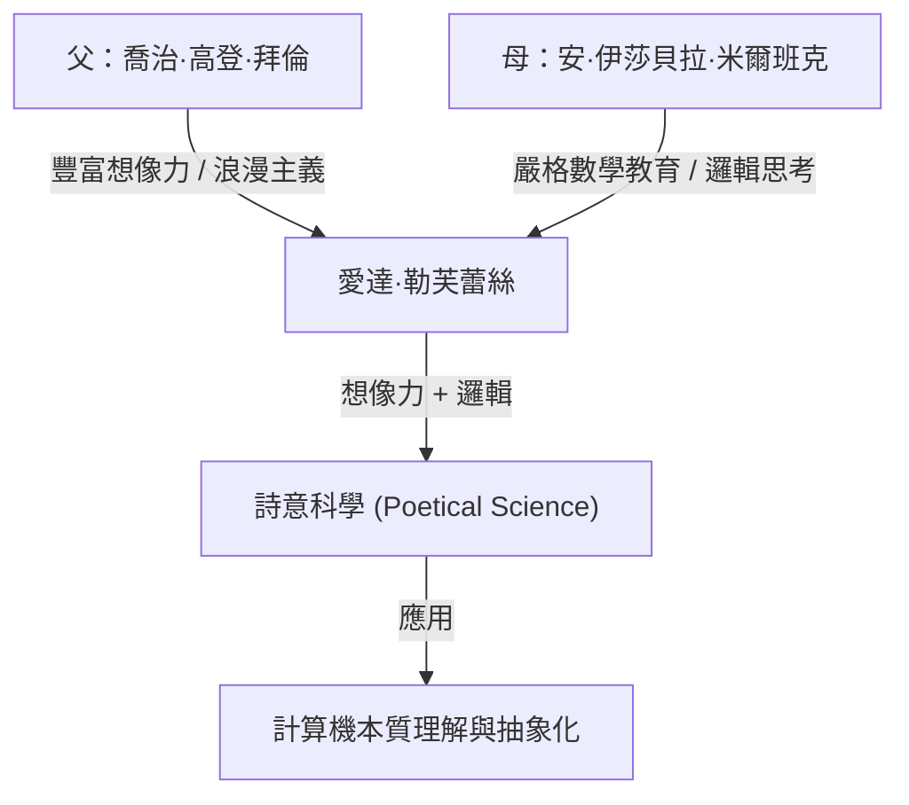
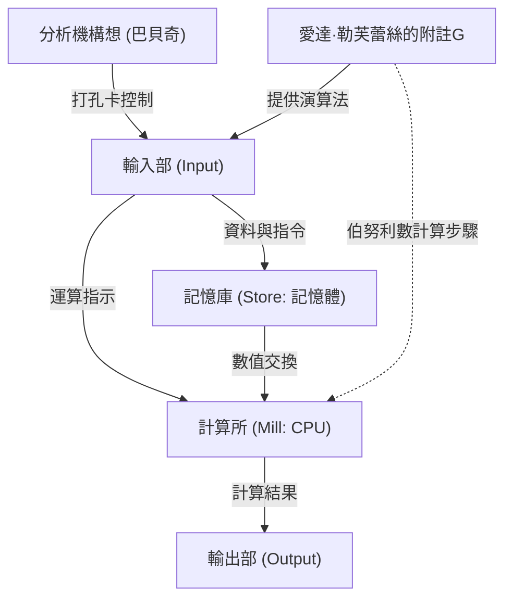

# 前言：維多利亞時代的天才，愛達·勒芙蕾絲

回溯電腦科學的歷史時，我們必定會遇到一位女性的名字。她的名字是奧古斯塔·愛達·金，勒芙蕾絲伯爵夫人（Augusta Ada King, Countess of Lovelace）。一般以「愛達·勒芙蕾絲」為人所知的她，以「世界首位程式設計師」之名銘刻於歷史中。

然而，她的成就並不僅僅停留在「寫出第一個程式碼」而已。愛達·勒芙蕾絲真正的偉大之處在於，她在19世紀的階段就看穿了現代電腦的本質：計算機可以超越單純的「計算數值的機器」，成為「能夠處理各種資訊，甚至創造音樂和藝術的通用機器」。

本文將盡可能詳細且深入地解說愛達·勒芙蕾絲充滿波折的一生、孕育她的環境、與查爾斯·巴貝奇命運般的相遇，以及她留下的歷史文獻「附註G（Note G）」的內容。

## 第1章：詩人的血統與數學教育——相互矛盾的才能融合

愛達·勒芙蕾絲於1815年12月10日出生在英國倫敦。她的父親是代表英國浪漫主義的偉大詩人喬治·高登·拜倫（第6代拜倫男爵）。母親則是熱愛數學與邏輯學，被拜倫稱為「平行四邊形公主」的安·伊莎貝拉·米爾班克（安娜貝拉）。

在愛達出生僅一個月後，父母便戲劇性地離婚。拜倫勳爵離開了英國，愛達從此再也沒有見過父親。

母親安娜貝拉極度害怕愛達會繼承父親那種「危險且不道德的詩人」氣質（拜倫家族的瘋狂）。因此，安娜貝拉對愛達實施了嚴格的理科教育，這在當時的女性中是極為罕見的例外。

### 嚴格的教育與「詩意科學」

愛達從幼年時期開始，就由一流的家庭教師徹底灌輸數學、邏輯學、科學、天文學等知識。然而，與母親的意圖相反，愛達的內心確實繼承了來自父親的豐富想像力與熱情。

愛達稱自己為「詩意科學家（Poetical Scientist）」。對她來說，數學不是枯燥乏味的數字羅列，而是用來解開宇宙隱藏之美與真理的「詩」。這種「想像力與邏輯思考的融合」，正是後來推動她完成歷史性偉業的原動力。

## 第2章：命運的相遇——查爾斯·巴貝奇與「差分機」

1833年6月，對17歲的愛達來說，迎來了人生的最大轉機。透過她的家庭教師之一瑪麗·薩默維爾（當時具代表性的女性科學家），她結識了擔任劍橋大學盧卡斯教授職位的天才數學家兼發明家查爾斯·巴貝奇（Charles Babbage）。

### 與計算機械的邂逅

當時的巴貝奇正在公開展示一種為了計算多項式的值以製作數表的大型機械式計算機「差分機（Difference Engine）」的原型。愛達在巴貝奇家中的沙龍親眼目睹了這台機器的展示，並深受感動。

當許多人只把差分機看作「罕見的機關」時，愛達卻立刻理解了隱藏在那台機器中的真正數學之美與可能性。巴貝奇也對這位年輕少女非凡的數學智慧與洞察力感到驚嘆，兩人超越了年齡差距（巴貝奇當時41歲），成為了一生的朋友與共同研究者。

巴貝奇稱愛達為「數字的魔女（Enchantress of Number）」，並比任何人都要高度評價她的才能。

## 第3章：挑戰終極夢想「分析機」

巴貝奇雖然在開發差分機上陷入苦戰，但他開始抱持著更加宏大的構想。那就是透過使用打孔卡來讀取程式，從而能夠執行任何數學計算的通用計算機「分析機（Analytical Engine）」。

這是一台具備現代電腦所有基本結構（輸入、記憶、運算、輸出）的驚人概念性機器。就像雅卡爾織布機使用打孔卡織出複雜圖案一樣，分析機是一台「編織代數圖案」的機器。

### 梅納布雷亞的論文與愛達的翻譯

1842年，巴貝奇在義大利都靈發表了關於分析機的演講。聽了這場演講的義大利數學家（後來的義大利總理）路易吉·費德里科·梅納布雷亞，用法語發表了一篇關於分析機的論文。

巴貝奇的朋友們委託愛達將這篇論文翻譯成英文。愛達全心投入這項工作，她不僅僅是翻譯，還將自己的見解和詳細的解說作為「附註（Notes）」加入論文中。

結果，她添加的附註從A到G共有7項，字數膨脹到原論文的大約3倍（約2萬字）。這份「附註」正是電腦史上最重要的文獻之一。

## 第4章：「世界首個程式」——附註G（Note G）的奇蹟

在愛達所寫的附註中，最著名的就是放在最後的「附註G（Note G）」。

在這裡，她以步驟式的表格形式，詳細描述了使用分析機計算伯努利數的演算法。這個表格極具邏輯性地整理了變數的狀態、要執行的運算、運算結果的儲存位置等，這就是今天被稱為「世界首個電腦程式」的原因。

愛達在這個附註G中，出色地運用了變數初始化、迴圈（重複處理）、條件分支等在現代程式設計中也不可外缺的概念。儘管當時機器在物理上並未完成，她卻僅憑腦海中的構思就完美模擬了機器的運作，並寫出了沒有錯誤的程式。

## 第5章：領先時代100年的「先見之明」

愛達·勒芙蕾絲真正是天才的證明，並不在於她寫了程式，而在於她看穿了分析機的「本質」。

就連巴貝奇自己，主要也是將分析機看作是「為了製作高階數表的大型計算機」。但愛達卻意識到，分析機處理的對象不僅限於「數字」。

她在附註中這樣寫道：

> 「分析機或許也能作用於數字以外的事物。... 例如，如果和聲學或樂曲構成的基本法則適合這樣的處理，這台機器就能夠創作出任何複雜、科學且完美的音樂。」

也就是說，她在1843年就預見了現代數位運算的根本概念：數字可以被替換為「聲音」、「圖像」、「符號」等任何資訊進行處理。這比阿蘭·圖靈提出「通用圖靈機」概念早了將近100年。

同時，她也指出「分析機只能執行人類命令的事情（不會自己創造出任何東西）」，這是現代在討論AI（人工智慧）時（所謂的「勒芙蕾絲的反對意見」）也經常被引用的重要洞察。

## 第6章：晚年與留給後世的遺產

愛達卓越的智慧，並沒有讓她的人生一定幸福。她一生都深受嚴重的健康問題困擾，並且過度沉迷於數學、傾向賭博，還有債務問題等，度過了充滿波折的晚年。

1852年11月27日，愛達·勒芙蕾絲因患子宮癌，以年僅36歲之齡離開了人世。巧合的是，這正是她父親拜倫勳爵去世時的年齡。遵照她的遺願，她被安葬在未曾謀面的父親身旁。

### 電腦時代的重新評價

巴貝奇的分析機在她有生之年未能完成，她的成就也長久地被埋沒在歷史之中。然而，到了20世紀中葉電腦時代拉開序幕時，她留下的「附註」被重新發現，其驚人的先見之明開始受到全世界的讚賞。

1979年，美國國防部將其開發的新程式語言命名為「Ada（愛達）」，以向她致敬。時至今日，10月的第二個星期二仍被定為「愛達·勒芙蕾絲日（Ada Lovelace Day）」，這是一個慶祝女性在STEM（科學、技術、工程、數學）領域活躍的國際性紀念日。

## 結語

愛達·勒芙蕾絲在齒輪與蒸汽機的時代，是一位夢想著100年後數位世界的「來自未來的訪客」。她豐富的想像力與嚴格邏輯思考融合所產生的「詩意科學」，成為了今天我們所享受的IT社會的基石。

超越「世界首位程式設計師」的稱號，她比任何人都更早、更深刻地理解電腦本質的這個事實，作為人類知識史上最輝煌的篇章之一，今後也將被繼續傳頌下去。
