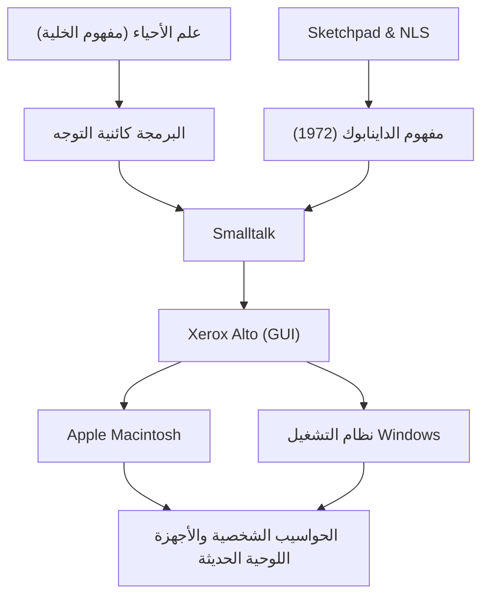

آلان كاي (Alan Kay) هو عالم حاسوب أمريكي يُعرف أيضًا باسم "أبو الكمبيوتر الشخصي"، وهو صاحب رؤية عبقرية أثر بشكل كبير على الحوسبة الحديثة. مقولته الشهيرة "أفضل طريقة للتنبؤ بالمستقبل هي اختراعه" (The best way to predict the future is to invent it.) لا تزال تلهم العديد من رواد الأعمال والمهندسين حتى يومنا هذا.

في هذا المقال، سنتعمق في حياة آلان كاي، والفلسفة المبتكرة التي دافع عنها، وكيف أثر على التكنولوجيا الحديثة.

## الحياة والمسيرة: جذور العبقرية

وُلد آلان كاي في سبرينغفيلد بولاية ماساتشوستس عام 1940. أظهر ذكاءً عبقرياً منذ طفولته، حيث تمكن من قراءة الكتب بطلاقة في سن الثالثة، وأظهر مواهب متعددة مثل وقوفه على المسرح كموسيقي جاز محترف خلال سنوات دراسته الثانوية.

ما يميز مسيرته المهنية هو أنه لم يكن مجرد عالم حاسوب، بل امتلك معرفة واسعة في مجالات مثل علم الأحياء، الفلسفة، الموسيقى، وعلم التربية. في الجامعة، تخصص في الرياضيات وعلم الأحياء الجزيئي، ومفهوم "الخلية" (Cell) في علم الأحياء شكل لاحقاً الأساس لما ابتكره تحت اسم "البرمجة كائنية التوجه" (Object-Oriented Programming). فقد اعتقد أنه كما تعمل الخلايا بشكل مستقل وتتبادل الرسائل للحفاظ على الحياة، يمكن بناء البرمجيات أيضاً كشبكة من الكائنات المستقلة.

أكمل كاي دراساته العليا في جامعة يوتا، حيث تواصل مع أنظمة متقدمة مثل "Sketchpad" لـ إيفان ساذرلاند، و"NLS" لـ دوغلاس إنجيلبارت. من خلال هذه اللقاءات، أصبح على يقين بأن الكمبيوتر ليس مجرد آلة حاسبة، بل هو "وسيط جديد" (وسيط ديناميكي) يوسع أساساً التفكير البشري والقدرة على التعبير.

## الفكر والفلسفة: رؤية الداينابوك (Dynabook)

أحد أشهر إنجازات آلان كاي هو اقتراحه المفهوم الرائد لـ "الداينابوك" (Dynabook). في عام 1972، في عصر كانت فيه الحواسيب ضخمة لدرجة أنها كانت تملأ الغرف، تصور كاي جهازاً شخصياً يتميز بما يلي:

- حجم ووزن يمكن حمله مثل الكتاب
- مزود بشاشة مسطحة عالية الدقة
- واجهة رسومية يمكن لأي شخص استخدامها بسهولة
- الوصول إلى المعلومات عبر شبكة لاسلكية
- بيئة تتيح للأطفال التعبير عن أفكارهم من خلال البرمجة

هذا هو بالضبط ما يمكن اعتباره النموذج الأولي لأجهزة الكمبيوتر المحمولة والأجهزة اللوحية والهواتف الذكية الحديثة. ومع ذلك، بالنسبة لكاي، لم يكن الداينابوك مجرد جهاز مفيد، بل كان "وسيطاً جديداً لتعزيز إبداع الأطفال ودفعهم للتعلم الذاتي". وكما تطور الذكاء البشري من خلال القراءة، كان يعتقد أن الأطفال يمكنهم اكتساب مستوى جديد تماماً من الذكاء من خلال بناء نماذج للعالم وإجراء محاكاة عبر الداينابوك.

## التقدم في زيروكس بارك: ولادة Smalltalk و واجهة المستخدم الرسومية (GUI)

في سبعينيات القرن العشرين، انضم كاي كعضو مؤسس إلى مركز زيروكس للأبحاث في بالو ألتو (PARC). هناك قاد "مجموعة أبحاث التعلم" (LRG) وانغمس في تطوير برمجيات وأجهزة لتحقيق رؤية الداينابوك.

ومن بين ما نتج عن ذلك لغة البرمجة "سمول توك" (Smalltalk). كانت لغة Smalltalk أول تطبيق كامل في العالم لمفهوم "البرمجة كائنية التوجه"، حيث تعامل جميع العناصر كـ "كائنات" وتعمل البرامج من خلال تبادل "الرسائل" بين هذه الكائنات.

في الوقت نفسه، كبيئة تشغيل لـ Smalltalk، تم تطوير "واجهة المستخدم الرسومية" (GUI) التي تستخدم النوافذ، الرموز (الأيقونات)، الماوس، والمؤشر. بالإضافة إلى ذلك، وُلد "Xerox Alto" كنموذج أولي للأجهزة لتشغيل هذه البرمجيات. هذه الإنجازات التاريخية في PARC ألهمت ستيف جوبز من Apple الذي زار المختبر في عام 1979 بشكل كبير، مما أدى لاحقاً بشكل مباشر إلى ولادة ليزا وماكنتوش.

## التأثير على الأجيال القادمة: ما نرثه اليوم

البذور التي زرعها آلان كاي أزهرت في كل مكان في مجتمع تكنولوجيا المعلومات الحالي.

1. **انتشار البرمجة كائنية التوجه**
   العديد من لغات البرمجة الرئيسية الحديثة، مثل Java، Python، Ruby، و C++، دمجت بشكل أو بآخر مفاهيم التوجه الكائني التي اقترحها كاي وجسدها في Smalltalk. هذا جعل من الممكن تطوير برامج معقدة وواسعة النطاق بكفاءة ومرونة.

2. **توحيد الحواسيب الشخصية و واجهة المستخدم الرسومية (GUI)**
   واجهات الهواتف الذكية وأجهزة الكمبيوتر التي نستخدمها كأمر مسلم به يومياً تعود جذورها إلى واجهة المستخدم الرسومية التي طورها كاي وزملاؤه في PARC. لولا اختراع التحكم في الكائنات على الشاشة بشكل بديهي باستخدام الماوس، لما تغلغل الكمبيوتر في المجتمع العام إلى هذا الحد.

3. **دمج التعليم والتكنولوجيا**
   رؤيته لـ "كمبيوتر للأطفال" تنتقل بسلاسة إلى لغات البرمجة المرئية التعليمية مثل Scratch، وفي الفصول الدراسية الحديثة حيث يُستخدم جهاز واحد لكل طالب.

## الخلاصة: رؤية آلان كاي لا تنتهي

لم يعتبر آلان كاي التكنولوجيا مجرد "أداة لزيادة الكفاءة"، بل كـ "بيئة" لتحرير الذكاء البشري والإبداع. المثالية التي تصورها للداينابوك ربما تم تحقيقها تقريباً من حيث الأجهزة مع ظهور الأجهزة المحمولة مثل iPad.

ومع ذلك، فيما يتعلق بالهدف البرمجي والتعليمي المتمثل في "قيام الأطفال ببناء وسائطهم الخاصة والتعبير عن التفكير العميق"، أشار كاي نفسه إلى أننا لا نزال في منتصف الطريق عند النظر إلى المجتمع التكنولوجي الحالي الذي يعتمد على استهلاك التطبيقات.

وراء مقولته "أفضل طريقة للتنبؤ بالمستقبل هي اختراعه" تكمن رسالة قوية مفادها أن "المستقبل المرغوب ليس شيئاً يمنحنا إياه شخص آخر، بل هو شيء يجب أن نتصوره ونبتكره بأيدينا". ستظل رؤى آلان كاي العميقة وفلسفته بوصلة هامة لكل من يسعى لاستكشاف تقنيات غير معروفة وبناء مستقبل أكثر ثراءً.
