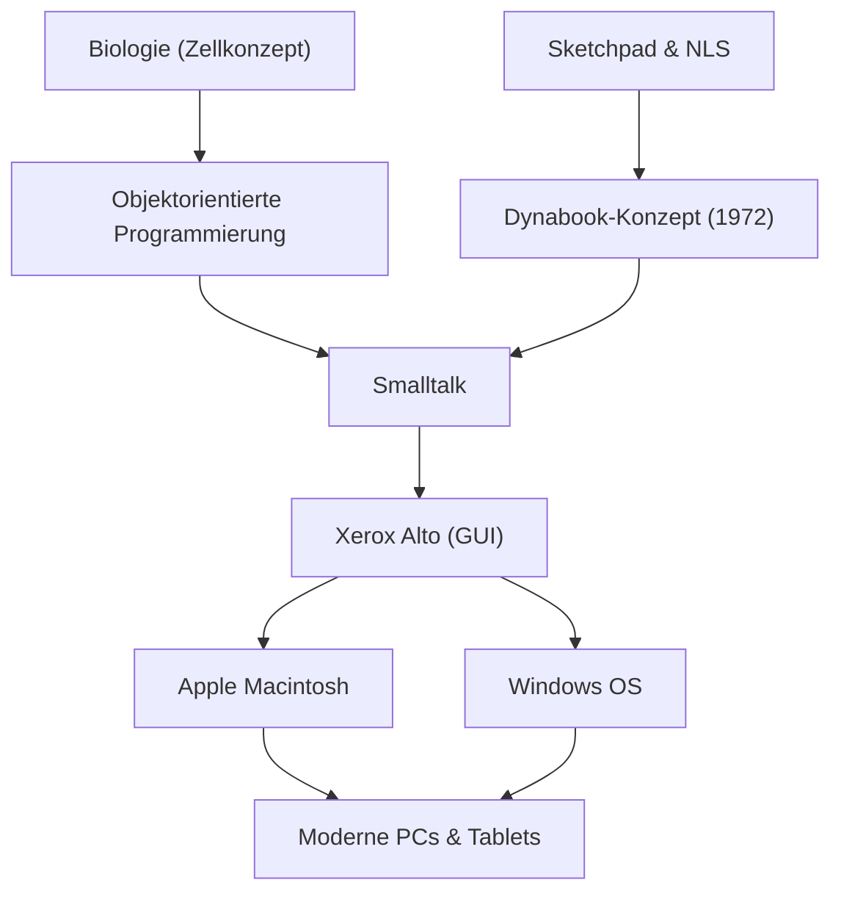

Alan Kay ist ein amerikanischer Informatiker, der oft als "Vater des Personal Computers" bezeichnet wird, und ein genialer Visionär, der das moderne Computing maßgeblich beeinflusst hat. Sein berühmtes Zitat "Der beste Weg, die Zukunft vorauszusagen, ist, sie zu erfinden (The best way to predict the future is to invent it.)" inspiriert bis heute viele Unternehmer und Ingenieure.

In diesem Artikel werden wir das Leben von Alan Kay, die innovative Philosophie, die er vorschlug, und die Art und Weise, wie er die moderne Technologie beeinflusst hat, genauer untersuchen.

## Leben und Hintergrund: Die Ursprünge eines Genies

Alan Kay wurde 1940 in Springfield, Massachusetts, geboren. Er zeigte von Kindheit an eine geniale Intelligenz, las bereits im Alter von drei Jahren fließend und zeigte seine vielfältigen Talente unter anderem dadurch, dass er während seiner High-School-Zeit als Jazzmusiker auf professionellen Bühnen auftrat.

Was seine Karriere besonders auszeichnet, ist die Tatsache, dass er nicht nur Informatiker war, sondern auch über ein breites Wissen in Bereichen wie Biologie, Philosophie, Musik und Pädagogik verfügte. An der Universität studierte er Mathematik und Molekularbiologie, und das Konzept der "Zelle (Cell)" in dieser Biologie sollte später die Grundlage der von ihm entwickelten "objektorientierten Programmierung" bilden. So wie Zellen unabhängig funktionieren und miteinander über Botschaften kommunizieren, um das Leben zu erhalten, glaubte er, dass Software ebenfalls als ein Netzwerk unabhängiger Objekte aufgebaut werden kann.

Kay besuchte die Graduiertenschule der University of Utah, wo er mit fortschrittlichen Systemen wie Ivan Sutherlands "Sketchpad" und Douglas Engelbarts "NLS" in Berührung kam. Durch diese Begegnungen gewann er die Überzeugung, dass Computer nicht nur einfache Rechenmaschinen sind, sondern ein "neues Medium (dynamisches Medium)", das das menschliche Denken und die Ausdruckskraft grundlegend erweitert.

## Ideen und Philosophie: Das Dynabook-Konzept

Eine von Alan Kays berühmtesten Errungenschaften ist die Einführung des bahnbrechenden Konzepts des "Dynabooks". Im Jahr 1972, in einer Zeit, als Computer noch so groß waren, dass sie ganze Räume füllten, stellte sich Kay folgendes persönliches Gerät vor:

- Größe und Gewicht, die man wie ein Buch tragen kann
- Ausgestattet mit einem hochauflösenden Flachbildschirm
- Eine grafische Benutzeroberfläche, die jeder intuitiv bedienen kann
- Zugriff auf Informationen über drahtlose Netzwerke
- Eine Umgebung, in der Kinder ihre eigenen Gedanken durch Programmierung ausdrücken können

Dies kann als der wahre Prototyp moderner Laptops, Tablets und Smartphones angesehen werden. Für Kay war das Dynabook jedoch nicht nur praktische Hardware, sondern ein "neues Medium, das die Kreativität von Kindern fördert und es ihnen ermöglicht, selbst zu lernen". Er glaubte, dass Kinder durch das Dynabook Modelle der Welt konstruieren und simulieren können, um eine völlig neue Ebene der Intelligenz zu erreichen, so wie sich der menschliche Intellekt durch das Lesen entwickelte.

## Durchbruch am Xerox PARC: Die Geburt von Smalltalk und GUI

In den 1970er Jahren trat Kay dem Palo Alto Research Center (PARC) von Xerox als Gründungsmitglied bei. Dort leitete er die "Learning Research Group (LRG)" und widmete sich der Erforschung von Software und Hardware, um das Dynabook-Konzept zu verwirklichen.

Dabei entstand die Programmiersprache "Smalltalk". Smalltalk setzte als erstes System der Welt das Konzept der "objektorientierten Programmierung" vollständig um, bei der alle Elemente als "Objekte" behandelt werden und das Programm funktioniert, indem sie sich gegenseitig "Nachrichten" senden.

Gleichzeitig wurde die "GUI (grafische Benutzeroberfläche)", die Fenster, Icons, Maus und Zeiger verwendet, als Betriebsumgebung für Smalltalk entwickelt. Darüber hinaus wurde der "Xerox Alto" als Prototyp-Hardware zum Ausführen dieser Software geboren. Diese historischen Errungenschaften bei PARC inspirierten Steve Jobs von Apple stark, der das Institut 1979 besuchte, was später direkt zur Entstehung der Lisa und des Macintosh führte.

## Einfluss auf die Nachwelt: Was wir heute geerbt haben

Die Samen, die Alan Kay gesät hat, blühen überall in der heutigen IT-Gesellschaft.

1. **Verbreitung der objektorientierten Programmierung**
   Viele der heutigen wichtigsten Programmiersprachen wie Java, Python, Ruby und C++ haben die von Kay vorgeschlagenen und in Smalltalk verwirklichten objektorientierten Konzepte in irgendeiner Form übernommen. Dies hat es ermöglicht, große und komplexe Software effizient und flexibel zu entwickeln.

2. **Standardisierung von Personal Computern und GUI**
   Die Schnittstellen von Smartphones und PCs, die wir jeden Tag selbstverständlich benutzen, haben ihren Ursprung in der GUI, die Kay und seine Kollegen am PARC entwickelt haben. Ohne die Erfindung, Objekte auf dem Bildschirm intuitiv mit der Maus zu bedienen, hätten Computer die Gesellschaft nicht in diesem Ausmaß durchdrungen.

3. **Verschmelzung von Bildung und Technologie**
   Seine Vision vom "Computer für Kinder" lebt in visuellen Bildungsprogrammiersprachen wie Scratch und in modernen Bildungsumgebungen, in denen jedem Kind ein eigenes Gerät zur Verfügung steht, kontinuierlich weiter.

## Fazit: Die Vision von Alan Kay endet nicht

Alan Kay sah Technologie nicht nur als ein "Werkzeug zur Effizienzsteigerung", sondern als eine "Umgebung", um die menschliche Intelligenz und Kreativität freizusetzen. Man könnte sagen, dass das von ihm angedachte Ideal des Dynabooks aus der Hardware-Perspektive durch das Aufkommen von Mobilgeräten wie dem iPad fast verwirklicht worden ist.

In Bezug auf die softwarebezogenen und pädagogischen Ziele, dass "Kinder selbst Medien konstruieren und tiefgründige Gedanken ausdrücken", weist Kay jedoch selbst darauf hin, dass wir noch nicht am Ziel sind, wenn wir auf die heutige app-konsumierende Technologiegesellschaft zurückblicken.

Hinter seinen Worten "Der beste Weg, die Zukunft vorauszusagen, ist, sie zu erfinden" verbirgt sich die starke Botschaft: "Die gewünschte Zukunft wird einem nicht von jemandem gegeben, sondern man sollte sie mit eigenen Händen entwerfen und erschaffen." Die tiefen Einsichten und die Philosophie von Alan Kay werden auch in Zukunft ein wichtiger Kompass für alle Menschen bleiben, die unbekannte Technologien erschließen und eine wahrhaft reiche Zukunft aufbauen wollen.
