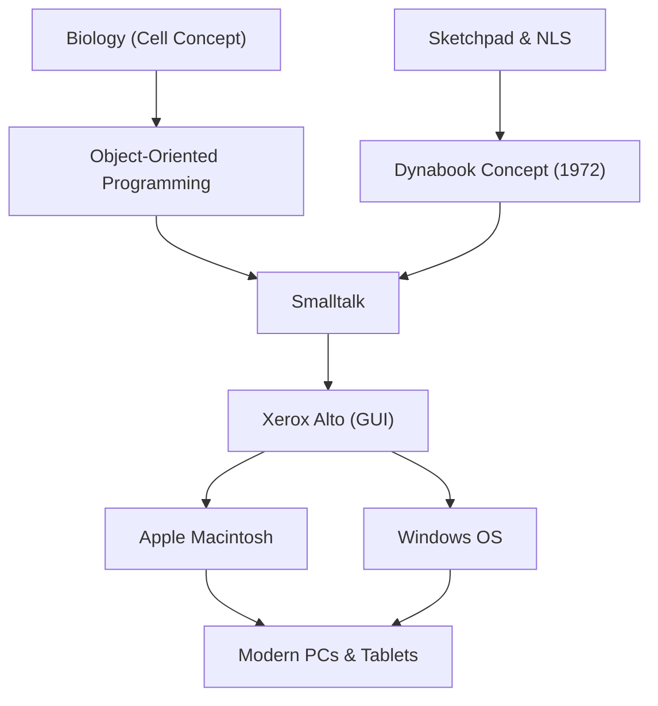

Alan Kay is an American computer scientist often referred to as the "father of the personal computer," and a genius visionary who has had a profound impact on modern computing. His famous quote, "The best way to predict the future is to invent it," continues to inspire many entrepreneurs and engineers today.

This article delves deep into Alan Kay's life, the innovative philosophy he advocated, and the impact he has had on modern technology.

## Life and Background: The Origin of a Genius

Alan Kay was born in 1940 in Springfield, Massachusetts. He demonstrated genius-level intellect from a young age, reading fluently at the age of three, and showing versatile talents such as performing on professional stages as a jazz musician during high school.

What is noteworthy in his career is that he was not merely a computer scientist, but possessed a broad range of knowledge spanning biology, philosophy, music, and pedagogy. In college, he majored in mathematics and molecular biology, and the biological concept of the "cell" would later form the foundation of "object-oriented programming," which he invented. Just as cells function independently and exchange messages with one another to sustain life, he believed that software could also be built as a network of independent objects.

Kay went on to graduate school at the University of Utah, where he encountered advanced systems such as Ivan Sutherland's "Sketchpad" and Douglas Engelbart's "NLS". Through these encounters, he became convinced that computers were not just calculating machines, but a "new medium (dynamic medium)" that could fundamentally expand human thought and expressive capabilities.

## Ideas and Philosophy: The Dynabook Concept

One of Alan Kay's most famous achievements is proposing the groundbreaking concept of the "Dynabook." In 1972, during an era when computers were still massive enough to fill an entire room, Kay envisioned a personal device like the following:

- A size and weight that could be carried around like a book
- Equipped with a high-resolution flat display
- A graphical interface that anyone could operate intuitively
- Access to information via wireless networks
- An environment where children could express their own thoughts through programming

This can truly be called the prototype of modern laptops, tablets, and smartphones. However, to Kay, the Dynabook was not just convenient hardware, but a "new medium for fostering children's creativity and allowing them to learn on their own." Just as human intelligence evolved through reading, he believed that children could acquire a completely new level of intelligence by building models of the world and running simulations through the Dynabook.

## Breakthroughs at Xerox PARC: The Birth of Smalltalk and GUI

In the 1970s, Kay joined the Xerox Palo Alto Research Center (PARC) as a founding member. There, he led the "Learning Research Group (LRG)" and immersed himself in research on software and hardware to realize the Dynabook concept.

Out of this came the programming language "Smalltalk." Smalltalk was the first in the world to fully implement the concept of "object-oriented programming," where all elements are treated as "objects" and programs operate by having them send "messages" to each other.

At the same time, a "GUI (Graphical User Interface)" utilizing windows, icons, a mouse, and a pointer was developed as the operating environment for Smalltalk. Furthermore, the "Xerox Alto" was born as prototype hardware to run these pieces of software. These historical achievements at PARC strongly inspired Apple's Steve Jobs when he visited the research center in 1979, and would directly lead to the birth of the Lisa and Macintosh later on.

## Impact on Later Generations: What We Inherit Today

The seeds Alan Kay sowed are blossoming everywhere in today's IT society.

1. **The Spread of Object-Oriented Programming**
   Many of today's major programming languages, such as Java, Python, Ruby, and C++, incorporate the concept of object-oriented programming proposed by Kay and embodied in Smalltalk in some form. This has made it possible to develop large-scale, complex software efficiently and flexibly.

2. **Standardization of Personal Computers and GUIs**
   The interfaces of the smartphones and PCs we use every day as a matter of course have their roots in the GUI developed by Kay and others at PARC. Without the invention of intuitively manipulating objects on a screen with a mouse, computers would likely not have penetrated general society to this extent.

3. **Fusion of Education and Technology**
   His vision of a "computer for children" continues to be passed down through educational visual programming languages like Scratch, and in modern educational settings that utilize a device for every student.

## Conclusion: Alan Kay's Vision is Not Over

Alan Kay viewed technology not merely as a "tool for efficiency," but as an "environment" for unleashing human intelligence and creativity. The ideal of the Dynabook he envisioned could perhaps be said to have been mostly realized from a hardware perspective with the advent of mobile devices like the iPad.

However, regarding the software and educational goals of "children building their own media and expressing deep thoughts," Kay himself points out that we are still only halfway there when looking back at our current app-consuming technological society.

Behind his words, "The best way to predict the future is to invent it," lies a strong message that "a desirable future is not something given by someone else, but something that should be conceived and created with one's own hands." Alan Kay's deep insights and philosophy will continue to be an important compass for all those who seek to pioneer unknown technologies and build a truly prosperous future.
