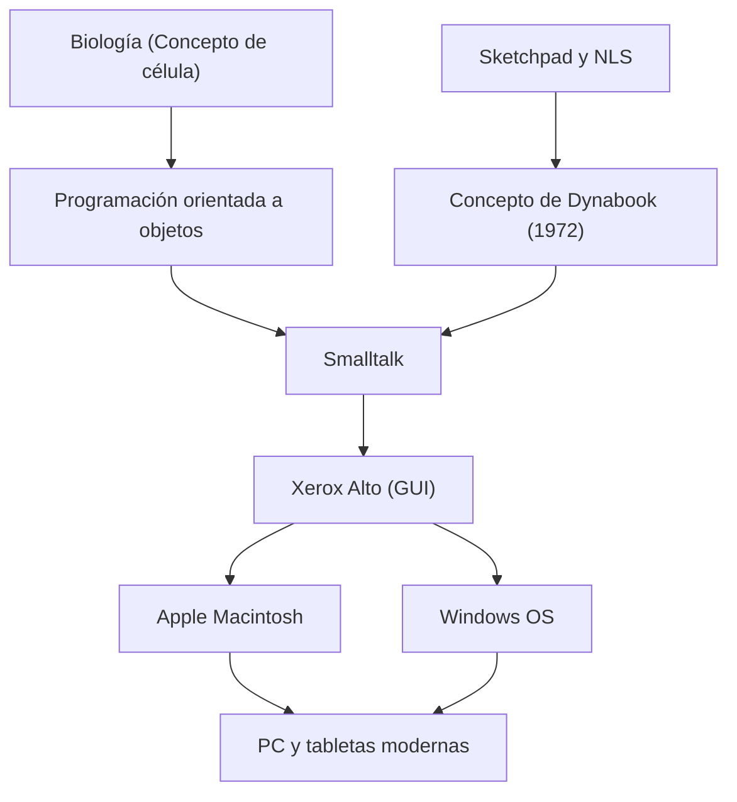

Alan Kay es un científico de la computación estadounidense, a menudo llamado el "padre del ordenador personal", y un genio visionario que tuvo un profundo impacto en la informática moderna. Su famosa frase, "La mejor manera de predecir el futuro es inventarlo" (The best way to predict the future is to invent it.), sigue inspirando a muchos emprendedores e ingenieros en la actualidad.

En este artículo, profundizaremos en la vida de Alan Kay, la filosofía innovadora que propuso y el impacto que ha tenido en la tecnología moderna.

## Vida y antecedentes: Los orígenes de un genio

Alan Kay nació en 1940 en Springfield, Massachusetts. Demostró una inteligencia genial desde muy pequeño, leyendo con fluidez a los 3 años y exhibiendo múltiples talentos, como actuar profesionalmente como músico de jazz en su época de escuela secundaria.

Lo que destaca en su carrera es que no era simplemente un informático, sino que poseía amplios conocimientos en biología, filosofía, música y pedagogía. En la universidad, se especializó en matemáticas y biología molecular, y el concepto biológico de la "célula" (Cell) formaría más tarde la base de la "programación orientada a objetos" que él concebiría. Al igual que las células funcionan de forma independiente e intercambian mensajes entre sí para mantener la vida, él pensó que el software también podría construirse como una red de objetos independientes.

Al ingresar a la escuela de posgrado en la Universidad de Utah, Kay conoció sistemas avanzados como el "Sketchpad" de Ivan Sutherland y el "NLS" de Douglas Engelbart. A través de estos encuentros, se convenció de que los ordenadores no eran simples calculadoras, sino "nuevos medios (medios dinámicos)" que ampliarían fundamentalmente el pensamiento humano y la capacidad de expresión.

## Pensamiento y filosofía: El concepto del Dynabook

Uno de los logros más famosos de Alan Kay es la propuesta del concepto revolucionario llamado "Dynabook". En 1972, en una época en la que los ordenadores eran tan grandes que ocupaban habitaciones enteras, Kay imaginó el siguiente dispositivo personal:

- Tamaño y peso portátiles, como un libro.
- Equipado con una pantalla plana de alta resolución.
- Interfaz gráfica que cualquier persona pudiera operar de forma intuitiva.
- Acceso a la información a través de una red inalámbrica.
- Un entorno donde los niños pudieran expresar sus propios pensamientos mediante la programación.

Este es verdaderamente el prototipo de las computadoras portátiles, tabletas y teléfonos inteligentes modernos. Sin embargo, para Kay, el Dynabook no era solo un hardware conveniente, sino un "nuevo medio para fomentar la creatividad de los niños y que aprendieran por sí mismos". Creía que, al igual que la lectura desarrolló la inteligencia humana, a través del Dynabook los niños podrían construir modelos del mundo, realizar simulaciones y adquirir un nivel de inteligencia completamente nuevo.

## El gran salto en Xerox PARC: El nacimiento de Smalltalk y la GUI

En la década de 1970, Kay se unió al Centro de Investigación de Palo Alto de Xerox (PARC) como miembro fundador. Allí dirigió el "Learning Research Group (LRG)" y se sumergió en la investigación de software y hardware para hacer realidad el concepto del Dynabook.

De este esfuerzo nació el lenguaje de programación "Smalltalk". Smalltalk fue el primero en el mundo en implementar completamente el concepto de "programación orientada a objetos", en el que todos los elementos se tratan como "objetos" y el programa funciona mediante el intercambio de "mensajes" entre ellos.

Al mismo tiempo, se desarrolló una "GUI (interfaz gráfica de usuario)" con ventanas, iconos, ratón y puntero como entorno operativo para Smalltalk. Además, nació el "Xerox Alto" como el hardware prototipo para ejecutar este software. Estos logros históricos en PARC inspiraron fuertemente a Steve Jobs de Apple, quien visitó el laboratorio en 1979, y llevaron directamente al posterior nacimiento de Lisa y Macintosh.

## Impacto en generaciones posteriores: Lo que heredamos hoy

Las semillas plantadas por Alan Kay han florecido en toda la sociedad de TI actual.

1. **Popularización de la programación orientada a objetos**
   Muchos de los principales lenguajes de programación modernos, como Java, Python, Ruby y C++, incorporan de alguna manera los conceptos orientados a objetos que Kay propuso e implementó en Smalltalk. Esto ha hecho posible desarrollar software a gran escala y complejo de forma eficiente y flexible.

2. **Estandarización de las computadoras personales y la GUI**
   Las interfaces de los teléfonos inteligentes y las PC que usamos a diario tienen sus raíces en la GUI desarrollada por Kay y su equipo en PARC. Sin la invención de manipular objetos en una pantalla de forma intuitiva con un ratón, los ordenadores no habrían penetrado tanto en el público en general.

3. **Fusión de educación y tecnología**
   Su visión de "una computadora para niños" se mantiene viva en lenguajes de programación visual educativa como Scratch, y en los entornos educativos modernos que utilizan un dispositivo por estudiante.

## Conclusión: La visión de Alan Kay no termina

Alan Kay consideraba la tecnología no solo como una "herramienta de eficiencia", sino como un "entorno" para liberar la inteligencia y la creatividad humanas. El ideal del Dynabook que imaginó puede decirse que casi se ha realizado desde el punto de vista del hardware con la aparición de dispositivos móviles como el iPad.

Sin embargo, en cuanto al objetivo de software y educativo de que "los niños construyan sus propios medios y expresen un pensamiento profundo", el propio Kay señala que, al observar la sociedad tecnológica actual impulsada por el consumo de aplicaciones, aún queda un largo camino por recorrer.

Detrás de su frase "La mejor manera de predecir el futuro es inventarlo", hay un fuerte mensaje de que "el futuro deseado no es algo que alguien te da, sino algo que debes concebir y crear con tus propias manos". Las profundas percepciones y la filosofía de Alan Kay seguirán siendo una brújula vital para todos aquellos que buscan ser pioneros en tecnologías desconocidas y construir un futuro verdaderamente rico.
