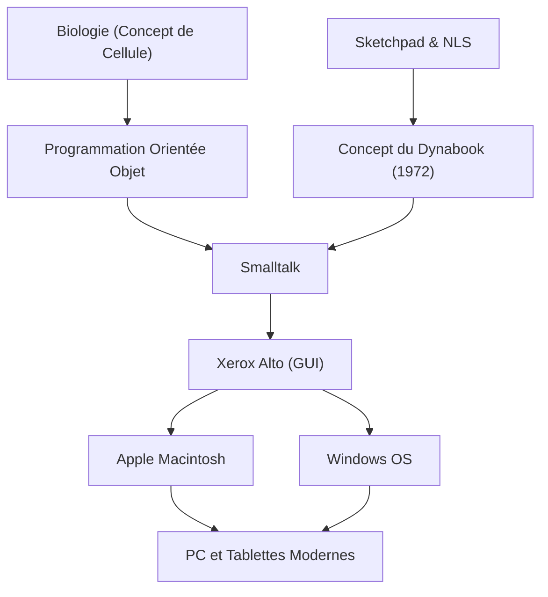

Alan Kay est un informaticien américain, souvent appelé le "père de l'ordinateur personnel", et un visionnaire de génie qui a eu une influence profonde sur l'informatique moderne. Sa célèbre citation, "La meilleure façon de prédire l'avenir est de l'inventer" (The best way to predict the future is to invent it.), continue d'inspirer de nombreux entrepreneurs et ingénieurs aujourd'hui.

Dans cet article, nous plongerons dans la vie d'Alan Kay, la philosophie innovante qu'il a proposée et son impact sur la technologie moderne.

## Vie et contexte : l'origine d'un génie

Alan Kay est né en 1940 à Springfield, dans le Massachusetts. Il a fait preuve d'une intelligence prodigieuse dès son plus jeune âge, lisant couramment à 3 ans et se produisant en tant que musicien de jazz professionnel sur scène au lycée, démontrant ainsi ses multiples talents.

Ce qui est remarquable dans sa carrière, c'est qu'il n'était pas seulement un informaticien, mais qu'il possédait de vastes connaissances en biologie, en philosophie, en musique et en pédagogie. À l'université, il s'est spécialisé en mathématiques et en biologie moléculaire. Le concept de "cellule" (Cell) en biologie a plus tard formé la base de la "programmation orientée objet" qu'il a conçue. Tout comme les cellules fonctionnent de manière indépendante et communiquent entre elles pour maintenir la vie, il pensait que les logiciels pouvaient également être construits comme un réseau d'objets indépendants.

Poursuivant ses études supérieures à l'Université de l'Utah, Kay a été exposé à des systèmes avancés tels que le "Sketchpad" d'Ivan Sutherland et le "NLS" de Douglas Engelbart. Grâce à ces rencontres, il a acquis la conviction que l'ordinateur n'était pas une simple machine à calculer, mais un "nouveau média (média dynamique)" qui étendait fondamentalement la pensée et l'expression humaines.

## Pensée et philosophie : le concept du Dynabook

L'une des réalisations les plus célèbres d'Alan Kay est la proposition du concept révolutionnaire appelé le "Dynabook". En 1972, à une époque où les ordinateurs étaient encore assez grands pour remplir une pièce, Kay a imaginé un appareil personnel présentant les caractéristiques suivantes :

- Une taille et un poids permettant de le transporter comme un livre
- Équipé d'un écran plat haute résolution
- Une interface graphique que n'importe qui pourrait utiliser de manière intuitive
- L'accès à l'information via un réseau sans fil
- Un environnement où les enfants pourraient exprimer leurs pensées grâce à la programmation

C'est exactement le prototype de nos ordinateurs portables, tablettes et smartphones modernes. Cependant, pour Kay, le Dynabook n'était pas seulement un matériel pratique, mais un "nouveau média pour nourrir la créativité des enfants et leur permettre d'apprendre par eux-mêmes". Tout comme la lecture a développé l'intelligence humaine, il croyait que grâce au Dynabook, les enfants pourraient acquérir un tout nouveau niveau d'intelligence en construisant des modèles du monde et en effectuant des simulations.

## Avancées au Xerox PARC : la naissance de Smalltalk et de la GUI

Dans les années 1970, Kay a rejoint le Xerox Palo Alto Research Center (PARC) en tant que membre fondateur. Il y a dirigé le "Learning Research Group (LRG)" et s'est consacré à la recherche logicielle et matérielle pour réaliser le concept du Dynabook.

C'est de là qu'est né le langage de programmation "Smalltalk". Smalltalk traitait chaque élément comme un "objet" et a mis en œuvre pour la première fois au monde le concept de "programmation orientée objet", où les programmes s'exécutaient en envoyant des "messages" entre eux.

Simultanément, l'interface graphique (GUI) utilisant des fenêtres, des icônes, une souris et un pointeur a été développée comme environnement d'exploitation pour Smalltalk. De plus, le "Xerox Alto" est né comme prototype matériel pour exécuter ces logiciels. Les réalisations historiques de ce PARC ont fortement inspiré Steve Jobs d'Apple lorsqu'il a visité le laboratoire en 1979, conduisant plus tard à la naissance du Lisa et du Macintosh.

## L'impact sur la postérité : ce qui nous a été transmis

Les graines semées par Alan Kay ont éclos partout dans notre société de l'information actuelle.

1. **La vulgarisation de la programmation orientée objet**
   De nombreux langages de programmation majeurs modernes, tels que Java, Python, Ruby et C++, intègrent d'une manière ou d'une autre le concept orienté objet proposé par Kay et matérialisé dans Smalltalk. Cela a permis de développer des logiciels vastes et complexes de manière efficace et flexible.

2. **Standardisation des ordinateurs personnels et des interfaces graphiques (GUI)**
   Les interfaces des smartphones et des PC que nous utilisons tous les jours comme allant de soi trouvent leur origine dans la GUI développée par Kay et ses collègues au PARC. Sans l'invention de la manipulation intuitive d'objets à l'écran avec une souris, les ordinateurs n'auraient pas pénétré la société en général à un tel point.

3. **La fusion de l'éducation et de la technologie**
   Sa vision d'un "ordinateur pour enfants" a été perpétuée dans les langages de programmation visuels éducatifs comme Scratch et dans les environnements éducatifs modernes utilisant le modèle d'un appareil par élève.

## Conclusion : la vision d'Alan Kay n'est pas terminée

Alan Kay considérait la technologie non pas simplement comme un "outil d'efficacité", mais comme un "environnement" pour libérer l'intelligence et la créativité humaines. L'idéal du Dynabook qu'il avait imaginé peut presque être considéré comme réalisé d'un point de vue matériel avec l'avènement des appareils mobiles comme l'iPad.

Cependant, Kay lui-même souligne que pour l'objectif logiciel et éducatif où "les enfants construisent leurs propres médias et expriment des pensées profondes", nous n'en sommes encore qu'à mi-chemin en repensant à la société technologique actuelle axée sur la consommation d'applications.

Derrière sa citation, "La meilleure façon de prédire l'avenir est de l'inventer", se cache un message fort : "L'avenir souhaitable n'est pas quelque chose que quelqu'un vous donnera, mais quelque chose que vous devez concevoir et créer de vos propres mains." Les pensées profondes et la philosophie d'Alan Kay continueront d'être une boussole importante pour tous ceux qui cherchent à innover dans des technologies inconnues et à bâtir un avenir véritablement riche.
