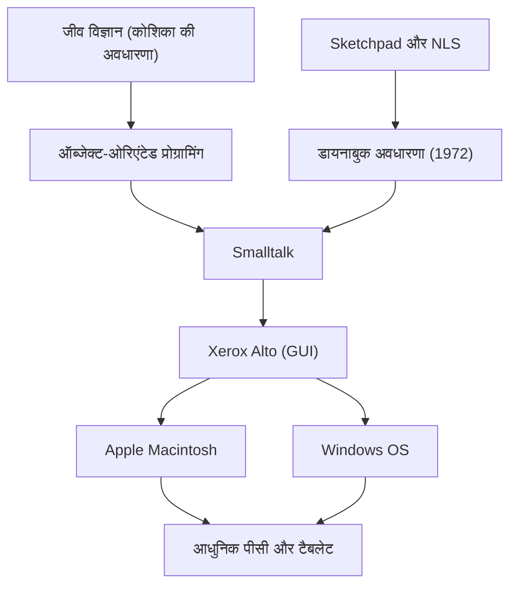

एलन के (Alan Kay) एक अमेरिकी कंप्यूटर वैज्ञानिक हैं, जिन्हें "पर्सनल कंप्यूटर का पिता" भी कहा जाता है, और एक प्रतिभाशाली दूरदर्शी (visionary) हैं जिन्होंने आधुनिक कंप्यूटिंग को गहराई से प्रभावित किया है। उनका प्रसिद्ध उद्धरण, "भविष्य की भविष्यवाणी करने का सबसे अच्छा तरीका इसका आविष्कार करना है (The best way to predict the future is to invent it.)," आज भी कई उद्यमियों और इंजीनियरों को प्रेरित करता है।

इस लेख में, हम एलन के के जीवन, उनके द्वारा प्रस्तावित अभिनव दर्शन, और आधुनिक तकनीक पर उनके प्रभाव की गहराई से पड़ताल करेंगे।

## जीवन और पृष्ठभूमि: एक प्रतिभा की उत्पत्ति

एलन के का जन्म 1940 में स्प्रिंगफील्ड, मैसाचुसेट्स में हुआ था। उन्होंने कम उम्र से ही असाधारण बुद्धि का प्रदर्शन किया; तीन साल की उम्र में वे धाराप्रवाह किताबें पढ़ सकते थे, और हाई स्कूल के दौरान उन्होंने एक पेशेवर जैज़ संगीतकार के रूप में मंच पर प्रदर्शन किया, जिससे उनकी बहुमुखी प्रतिभा का पता चलता है।

उनके करियर की एक उल्लेखनीय बात यह है कि वे केवल एक कंप्यूटर वैज्ञानिक नहीं थे, बल्कि उन्हें जीव विज्ञान, दर्शन, संगीत और शिक्षाशास्त्र का भी व्यापक ज्ञान था। विश्वविद्यालय में, उन्होंने गणित और आणविक जीव विज्ञान में पढ़ाई की। जीव विज्ञान में "कोशिका (Cell)" की यह अवधारणा बाद में "ऑब्जेक्ट-ओरिएंटेड प्रोग्रामिंग" का आधार बनी, जिसका उन्होंने आविष्कार किया। उन्होंने सोचा कि जिस तरह कोशिकाएँ स्वतंत्र रूप से काम करती हैं और जीवन को बनाए रखने के लिए एक-दूसरे के साथ संदेशों का आदान-प्रदान करती हैं, उसी तरह सॉफ्टवेयर को भी स्वतंत्र ऑब्जेक्ट्स के नेटवर्क के रूप में बनाया जा सकता है।

यूटा विश्वविद्यालय में ग्रेजुएट स्कूल में जाने के बाद, के ने इवान सदरलैंड के "Sketchpad" और डगलस एंगेलबार्ट के "NLS" जैसे उन्नत प्रणालियों का अनुभव किया। इन अनुभवों के माध्यम से, उन्हें यह विश्वास हो गया कि कंप्यूटर केवल एक गणना करने वाली मशीन नहीं है, बल्कि एक "नया माध्यम (गतिशील माध्यम)" है जो मानव सोच और अभिव्यक्ति को मौलिक रूप से विस्तारित करता है।

## विचार और दर्शन: डायनाबुक (Dynabook) अवधारणा

एलन के की सबसे प्रसिद्ध उपलब्धियों में से एक "डायनाबुक (Dynabook)" नामक एक अभूतपूर्व अवधारणा का प्रस्ताव है। 1972 में, एक ऐसे युग में जब कंप्यूटर इतने बड़े थे कि वे पूरे कमरे को भर देते थे, के ने निम्नलिखित जैसे एक व्यक्तिगत उपकरण की कल्पना की:

- एक किताब की तरह ले जाने में आसान आकार और वजन
- उच्च रिज़ॉल्यूशन वाला फ्लैट डिस्प्ले
- एक ग्राफिकल इंटरफ़ेस जिसे कोई भी सहजता से संचालित कर सके
- वायरलेस नेटवर्क के माध्यम से सूचना तक पहुंच
- एक ऐसा वातावरण जहां बच्चे प्रोग्रामिंग के माध्यम से अपने विचारों को व्यक्त कर सकें

यह वास्तव में आधुनिक लैपटॉप, टैबलेट और स्मार्टफोन का प्रोटोटाइप है। हालाँकि, के के लिए, डायनाबुक केवल एक सुविधाजनक हार्डवेयर नहीं था, बल्कि "बच्चों की रचनात्मकता को पोषित करने और उन्हें स्वयं सीखने में सक्षम बनाने के लिए एक नया माध्यम" था। उनका मानना था कि जिस तरह पढ़ने से मानव बुद्धि का विकास हुआ, उसी तरह डायनाबुक के माध्यम से बच्चे दुनिया के मॉडल बनाकर और सिमुलेशन करके बुद्धि का एक बिल्कुल नया स्तर प्राप्त कर सकते हैं।

## ज़ेरॉक्स PARC (Xerox PARC) में सफलता: स्मॉलटॉक (Smalltalk) और GUI का जन्म

1970 के दशक में, के एक संस्थापक सदस्य के रूप में ज़ेरॉक्स पालो ऑल्टो रिसर्च सेंटर (PARC) में शामिल हुए। यहां, उन्होंने "लर्निंग रिसर्च ग्रुप (LRG)" का नेतृत्व किया और डायनाबुक अवधारणा को साकार करने के लिए सॉफ्टवेयर और हार्डवेयर पर शोध में खुद को समर्पित कर दिया।

इस प्रक्रिया में, प्रोग्रामिंग भाषा "Smalltalk" का निर्माण हुआ। स्मॉलटॉक दुनिया में पहली बार "ऑब्जेक्ट-ओरिएंटेड प्रोग्रामिंग" की अवधारणा को पूरी तरह से लागू करने वाली भाषा थी, जिसमें सभी तत्वों को "ऑब्जेक्ट्स" के रूप में माना जाता है, और प्रोग्राम उनके एक-दूसरे को "संदेश" भेजने के माध्यम से संचालित होता है।

उसी समय, स्मॉलटॉक के ऑपरेटिंग वातावरण के रूप में, विंडोज़, आइकन, माउस और पॉइंटर्स का उपयोग करके एक "GUI (ग्राफिकल यूजर इंटरफेस)" विकसित किया गया था। इसके अलावा, इन सॉफ्टवेयर को चलाने के लिए प्रोटोटाइप हार्डवेयर के रूप में "Xerox Alto" का जन्म हुआ। PARC में इन ऐतिहासिक उपलब्धियों ने 1979 में संस्थान का दौरा करने वाले Apple के स्टीव जॉब्स को गहराई से प्रेरित किया, और बाद में लिसा (Lisa) और मैकिंटोश (Macintosh) के निर्माण का मार्ग प्रशस्त किया।

## भावी पीढ़ियों पर प्रभाव: आज हमें क्या विरासत में मिला है

एलन के द्वारा बोए गए बीज आज के आईटी समाज में हर जगह खिल रहे हैं।

1. **ऑब्जेक्ट-ओरिएंटेड प्रोग्रामिंग का प्रसार**
   आधुनिक मुख्य प्रोग्रामिंग भाषाएं जैसे Java, Python, Ruby, और C++ किसी न किसी रूप में ऑब्जेक्ट-ओरिएंटेड अवधारणा को शामिल करती हैं, जिसे के ने प्रस्तावित किया और स्मॉलटॉक में साकार किया। इससे बड़े पैमाने पर और जटिल सॉफ्टवेयर को कुशलतापूर्वक और लचीले ढंग से विकसित करना संभव हो गया है।

2. **पर्सनल कंप्यूटर और GUI का मानकीकरण**
   स्मार्टफोन और पीसी के इंटरफेस जिन्हें हम हर दिन उपयोग करते हैं, उनका मूल के और उनकी टीम द्वारा PARC में विकसित किया गया GUI है। माउस का उपयोग करके स्क्रीन पर ऑब्जेक्ट्स को सहजता से संचालित करने के आविष्कार के बिना, कंप्यूटर शायद आम समाज में इतना व्यापक नहीं होता।

3. **शिक्षा और प्रौद्योगिकी का विलय**
   "बच्चों के लिए कंप्यूटर" का उनका दृष्टिकोण आज भी स्क्रैच (Scratch) जैसी शैक्षिक दृश्य प्रोग्रामिंग भाषाओं में और आधुनिक शैक्षिक वातावरण में मौजूद है जहाँ प्रत्येक छात्र एक उपकरण का उपयोग करता है।

## निष्कर्ष: एलन के का दृष्टिकोण कभी समाप्त नहीं होता

एलन के ने प्रौद्योगिकी को केवल एक "दक्षता उपकरण" के रूप में नहीं, बल्कि मानव बुद्धि और रचनात्मकता को मुक्त करने के लिए एक "वातावरण" के रूप में देखा। डायनाबुक का जो आदर्श उन्होंने सोचा था, वह हार्डवेयर के दृष्टिकोण से आईपैड (iPad) जैसे मोबाइल उपकरणों के आगमन के साथ लगभग साकार हो गया है।

हालाँकि, जब बात "बच्चों द्वारा अपने स्वयं के मीडिया का निर्माण करने और अपनी गहरी सोच को व्यक्त करने" के सॉफ्टवेयर और शैक्षिक लक्ष्यों की आती है, तो के खुद बताते हैं कि आज के ऐप-उपभोक्ता प्रौद्योगिकी समाज को देखते हुए हम अभी भी आधे रास्ते पर ही हैं।

उनके उद्धरण "भविष्य की भविष्यवाणी करने का सबसे अच्छा तरीका इसका आविष्कार करना है" के पीछे एक मजबूत संदेश छिपा है कि "वांछनीय भविष्य ऐसा कुछ नहीं है जो कोई और हमें देगा; बल्कि यह कुछ ऐसा है जिसकी हमें कल्पना करनी चाहिए और अपने हाथों से बनानी चाहिए।" एलन के की गहरी अंतर्दृष्टि और दर्शन उन सभी लोगों के लिए एक महत्वपूर्ण कंपास बने रहेंगे जो अज्ञात प्रौद्योगिकियों का पता लगाना चाहते हैं और वास्तव में एक समृद्ध भविष्य का निर्माण करना चाहते हैं।
