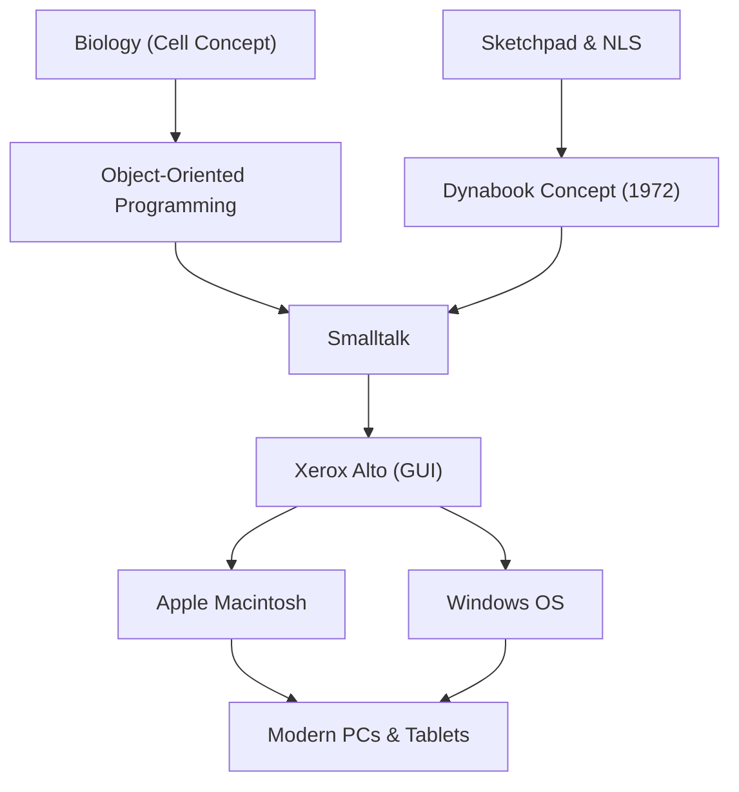

Alan Kay adalah ilmuwan komputer Amerika yang juga dikenal sebagai "Bapak Komputer Personal", dan seorang visioner jenius yang memberikan pengaruh besar pada komputasi modern. Kutipannya yang terkenal, "Cara terbaik memprediksi masa depan adalah dengan menciptakannya (The best way to predict the future is to invent it.)," terus memberikan inspirasi bagi banyak pengusaha dan insinyur hingga saat ini.

Dalam artikel ini, kita akan menggali lebih dalam mengenai kehidupan Alan Kay, filosofi inovatif yang ia usulkan, serta pengaruhnya terhadap teknologi modern.

## Kehidupan dan Latar Belakang: Titik Awal Seorang Jenius

Alan Kay lahir pada tahun 1940 di Springfield, Massachusetts. Ia menunjukkan kecerdasan jenius sejak masa kecil, membaca buku dengan lancar pada usia 3 tahun, dan menunjukkan berbagai bakat, seperti tampil di panggung profesional sebagai musisi jazz semasa SMA.

Hal yang patut dicatat dalam kariernya adalah bahwa ia bukan sekadar ilmuwan komputer, melainkan memiliki pengetahuan yang luas di bidang biologi, filosofi, musik, dan pedagogi. Di universitas, ia mengambil jurusan matematika dan biologi molekuler. Konsep "Sel (Cell)" dalam biologi inilah yang nantinya menjadi dasar dari "Pemrograman Berorientasi Objek" yang ia gagas. Ia percaya bahwa sama seperti sel-sel yang berfungsi secara independen dan saling bertukar pesan untuk mempertahankan kehidupan, perangkat lunak juga dapat dibangun sebagai jaringan objek yang independen.

Melanjutkan pendidikan pascasarjana di University of Utah, Kay bersentuhan dengan sistem-sistem canggih seperti "Sketchpad" karya Ivan Sutherland dan "NLS" karya Douglas Engelbart. Melalui perjumpaan ini, ia menjadi yakin bahwa komputer bukanlah sekadar mesin hitung, melainkan "media baru (media dinamis)" yang secara fundamental memperluas pemikiran dan daya ekspresi manusia.

## Pemikiran dan Filosofi: Konsep Dynabook

Salah satu pencapaian Alan Kay yang paling terkenal adalah pengajuan konsep revolusioner bernama "Dynabook". Pada tahun 1972, di era ketika komputer masih sangat besar hingga memenuhi seluruh ruangan, Kay membayangkan sebuah perangkat personal dengan karakteristik sebagai berikut:

- Ukuran dan berat yang dapat dibawa-bawa seperti buku
- Dilengkapi dengan layar datar beresolusi tinggi
- Antarmuka grafis yang dapat dioperasikan secara intuitif oleh siapa saja
- Akses ke informasi melalui jaringan nirkabel
- Lingkungan di mana anak-anak dapat mengekspresikan pemikiran mereka melalui pemrograman

Ini benar-benar dapat dikatakan sebagai prototipe dari laptop, komputer tablet, dan ponsel pintar modern. Namun, bagi Kay, Dynabook bukanlah sekadar perangkat keras yang praktis, melainkan "media baru untuk menumbuhkan kreativitas anak-anak dan pembelajaran mandiri". Sebagaimana kecerdasan manusia berkembang melalui membaca, ia percaya bahwa melalui Dynabook anak-anak dapat membangun model dunia dan melakukan simulasi, sehingga mencapai tingkat kecerdasan yang benar-benar baru.

## Lompatan di Xerox PARC: Kelahiran Smalltalk dan GUI

Pada tahun 1970-an, Kay bergabung dengan Pusat Penelitian Palo Alto (PARC) milik Xerox sebagai anggota pendiri. Di sana, ia memimpin "Learning Research Group (LRG)" dan mendedikasikan dirinya pada penelitian perangkat lunak dan perangkat keras untuk mewujudkan konsep Dynabook.

Dari penelitian tersebut, lahirlah bahasa pemrograman "Smalltalk". Smalltalk adalah implementasi lengkap pertama di dunia dari konsep "Pemrograman Berorientasi Objek", di mana semua elemen diperlakukan sebagai "objek" dan program beroperasi melalui objek-objek yang saling mengirim "pesan".

Pada saat yang sama, "GUI (Graphical User Interface)" yang menggunakan jendela, ikon, mouse, dan penunjuk dikembangkan sebagai lingkungan operasi untuk Smalltalk. Selain itu, "Xerox Alto" diciptakan sebagai prototipe perangkat keras untuk menjalankan perangkat lunak ini. Pencapaian bersejarah di PARC ini memberikan inspirasi yang kuat kepada Steve Jobs dari Apple yang mengunjungi laboratorium tersebut pada tahun 1979, yang kemudian berujung pada kelahiran Lisa dan Macintosh.

## Pengaruh pada Generasi Berikutnya: Warisan bagi Kita Saat Ini

Benih yang ditanam oleh Alan Kay telah mekar di berbagai penjuru masyarakat TI saat ini.

1. **Populerisasi Pemrograman Berorientasi Objek**
   Banyak bahasa pemrograman utama modern, seperti Java, Python, Ruby, dan C++, dalam berbagai cara telah mengadopsi konsep berorientasi objek yang digagas oleh Kay dan diwujudkan dalam Smalltalk. Hal ini memungkinkan pengembangan perangkat lunak berskala besar dan kompleks secara efisien dan fleksibel.

2. **Standardisasi Komputer Personal dan GUI**
   Antarmuka ponsel pintar dan PC yang kita gunakan sehari-hari berasal dari GUI yang dikembangkan oleh Kay dan timnya di PARC. Tanpa penemuan mengoperasikan objek di layar secara intuitif menggunakan mouse, komputer mungkin tidak akan menembus masyarakat umum sejauh ini.

3. **Perpaduan Pendidikan dan Teknologi**
   Visinya tentang "komputer untuk anak-anak" terus diwariskan dalam bahasa pemrograman visual edukatif seperti Scratch dan di lingkungan pendidikan modern yang memanfaatkan satu perangkat untuk setiap anak.

## Kesimpulan: Visi Alan Kay Belum Berakhir

Alan Kay tidak memandang teknologi sekadar sebagai "alat untuk efisiensi", melainkan sebagai "lingkungan" untuk membebaskan kecerdasan dan kreativitas manusia. Ideal Dynabook yang ia bayangkan mungkin dapat dikatakan hampir terwujud dari segi perangkat keras dengan munculnya perangkat seluler seperti iPad.

Namun, terkait dengan tujuan edukatif dan perangkat lunak di mana "anak-anak membangun media mereka sendiri dan mengekspresikan pemikiran mendalam," Kay sendiri menunjukkan bahwa kita masih berada di tengah jalan jika melihat masyarakat teknologi modern yang berorientasi pada konsumsi aplikasi.

Di balik kata-katanya, "Cara terbaik memprediksi masa depan adalah dengan menciptakannya," terdapat pesan kuat bahwa "masa depan yang diinginkan bukanlah sesuatu yang diberikan oleh orang lain, melainkan sesuatu yang harus dibayangkan dan diciptakan dengan tangan kita sendiri." Wawasan mendalam dan filosofi Alan Kay akan terus menjadi kompas yang penting bagi semua orang yang berusaha merintis teknologi tak dikenal dan membangun masa depan yang benar-benar kaya.
