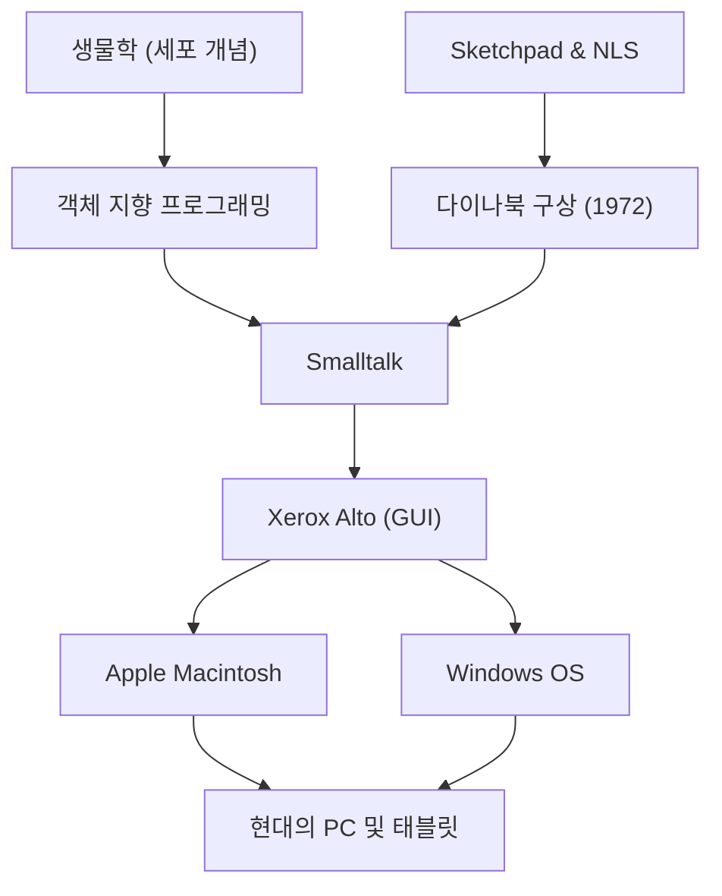

앨런 케이(Alan Kay)는 '퍼스널 컴퓨터의 아버지'라고도 불리는 미국의 컴퓨터 과학자이며, 현대 컴퓨팅에 지대한 영향을 미친 천재 비저너리입니다. "미래를 예측하는 가장 좋은 방법은 미래를 발명하는 것이다(The best way to predict the future is to invent it.)"라는 그의 유명한 말은 지금도 많은 기업가와 엔지니어들에게 영감을 주고 있습니다.

본 기사에서는 앨런 케이의 생애, 그가 제창한 혁신적인 철학, 그리고 그가 현대 기술에 어떤 영향을 미쳤는지를 깊이 파헤쳐 봅니다.

## 생애와 배경: 천재의 원점

앨런 케이는 1940년 매사추세츠주 스프링필드에서 태어났습니다. 어릴 적부터 천재적인 지성을 발휘하여 3살 때 유창하게 책을 읽었고, 고등학교 시절에는 재즈 뮤지션으로서 프로 무대에 서는 등 다재다능한 재능을 보여주었습니다.

그의 경력에서 특기할 만한 점은 단순한 컴퓨터 과학자가 아니라 생물학, 철학, 음악, 교육학 등 폭넓은 지식을 가지고 있었다는 것입니다. 대학에서는 수학과 분자 생물학을 전공했으며, 이 생물학에서의 '세포(Cell)' 개념이 훗날 그가 고안하는 '객체 지향 프로그래밍'의 근간을 형성하게 됩니다. 세포가 독립적으로 기능하며 서로 메시지를 주고받아 생명을 유지하듯이, 소프트웨어 또한 독립된 객체들의 네트워크로 구축할 수 있다고 생각한 것입니다.

유타 대학교 대학원에 진학한 케이는 그곳에서 이반 서덜랜드의 'Sketchpad'나 더글러스 엥겔바트의 'NLS'와 같은 선진적인 시스템을 접하게 됩니다. 이러한 만남을 통해 그는 컴퓨터가 단순한 계산기가 아니라 인간의 사고와 표현력을 근본적으로 확장하는 '새로운 미디어(다이내믹한 미디어)'라는 확신을 갖게 되었습니다.

## 사상과 철학: 다이나북(Dynabook) 구상

앨런 케이의 가장 유명한 업적 중 하나는 '다이나북(Dynabook)'이라는 획기적인 콘셉트의 제창입니다. 1972년, 컴퓨터가 아직 방을 가득 채울 정도로 거대했던 시대에 케이는 다음과 같은 퍼스널 기기를 구상했습니다.

- 책처럼 들고 다닐 수 있는 크기와 무게
- 고해상도 평면 디스플레이 탑재
- 누구나 직관적으로 조작할 수 있는 그래픽 인터페이스
- 무선 네트워크를 통한 정보 접근
- 아이들이 프로그래밍을 통해 스스로의 사고를 표현할 수 있는 환경

이는 그야말로 현대의 노트북이나 태블릿 단말기, 스마트폰의 원형이라고 할 수 있습니다. 하지만 케이에게 다이나북은 단순한 편리한 하드웨어가 아니라 '아이들의 창의성을 기르고 스스로 학습하기 위한 새로운 미디어'였습니다. 독서를 통해 인간의 지성이 발전했듯이, 다이나북을 통해 아이들이 세계의 모델을 구축하고 시뮬레이션을 함으로써 전혀 새로운 수준의 지성을 획득할 수 있다고 믿었던 것입니다.

## 제록스 PARC에서의 약진: Smalltalk와 GUI의 탄생

1970년대, 케이는 제록스의 팔로알토 연구소(PARC)에 설립 멤버로 참여합니다. 이곳에서 그는 '학습 연구 그룹(Learning Research Group, LRG)'을 이끌며 다이나북 구상을 실현하기 위한 소프트웨어와 하드웨어 연구에 몰두했습니다.

그 과정에서 탄생한 것이 프로그래밍 언어 'Smalltalk(스몰토크)'입니다. Smalltalk는 모든 요소를 '객체'로 취급하고, 그것들이 서로 '메시지'를 주고받음으로써 프로그램이 동작한다는 '객체 지향 프로그래밍'의 개념을 세계 최초로 완벽하게 구현했습니다.

동시에 Smalltalk의 조작 환경으로서 창, 아이콘, 마우스, 포인터를 사용한 'GUI(그래픽 사용자 인터페이스)'가 개발되었습니다. 나아가 이러한 소프트웨어를 구동하기 위한 프로토타입 하드웨어로 'Xerox Alto'가 탄생했습니다. 이 PARC에서의 역사적인 성과는 1979년 연구소를 방문한 애플의 스티브 잡스에게 강렬한 영감을 주었고, 훗날 Lisa와 Macintosh의 탄생으로 직결되게 됩니다.

## 후세에 미친 영향: 현재의 우리에게 계승되는 것

앨런 케이가 뿌린 씨앗은 현재의 IT 사회 곳곳에서 꽃을 피우고 있습니다.

1. **객체 지향 프로그래밍의 보급**
   Java, Python, Ruby, C++ 등 현대의 주요 프로그래밍 언어의 상당수는 케이가 제창하고 Smalltalk에서 구현한 객체 지향의 개념을 어떤 형태로든 받아들이고 있습니다. 이를 통해 대규모의 복잡한 소프트웨어를 효율적이고 유연하게 개발할 수 있게 되었습니다.

2. **퍼스널 컴퓨터와 GUI의 표준화**
   우리가 매일 당연하게 사용하는 스마트폰이나 PC의 인터페이스는 케이 일행이 PARC에서 개발한 GUI가 그 기원입니다. 마우스로 직관적으로 화면 상의 객체를 조작한다는 발명이 없었다면, 컴퓨터는 이토록 일반 사회에 깊이 스며들지 못했을 것입니다.

3. **교육과 기술의 융합**
   '아이들을 위한 컴퓨터'라는 그의 비전은 Scratch 등의 교육용 비주얼 프로그래밍 언어나, 1인 1단말기를 활용하는 현대의 교육 현장에 면면히 계승되고 있습니다.

## 결론: 앨런 케이의 비전은 끝나지 않는다

앨런 케이는 기술을 단순한 '효율화의 도구'가 아니라, 인간의 지성과 창조력을 해방하기 위한 '환경'으로 바라보았습니다. 그가 그렸던 다이나북의 이상은 iPad 등 모바일 기기의 등장으로 하드웨어적인 관점에서는 거의 실현되었다고 할 수 있을지도 모릅니다.

하지만 '아이들이 스스로 미디어를 구축하고 깊은 사고를 표현한다'는 소프트웨어적, 교육적인 목표에 대해서는 현재의 앱 소비형 기술 사회를 되돌아볼 때 아직 갈 길이 멀다고 케이 자신은 지적하고 있습니다.

그의 "미래를 예측하는 가장 좋은 방법은 미래를 발명하는 것이다"라는 말의 이면에는 "바람직한 미래는 누군가가 주어지는 것이 아니라, 스스로의 손으로 구상하고 창조해야 하는 것이다"라는 강한 메시지가 담겨 있습니다. 앨런 케이의 깊은 통찰과 철학은 앞으로도 미지의 기술을 개척하고 진정으로 풍요로운 미래를 구축하고자 하는 모든 사람들에게 중요한 나침반으로 계속 남을 것입니다.
