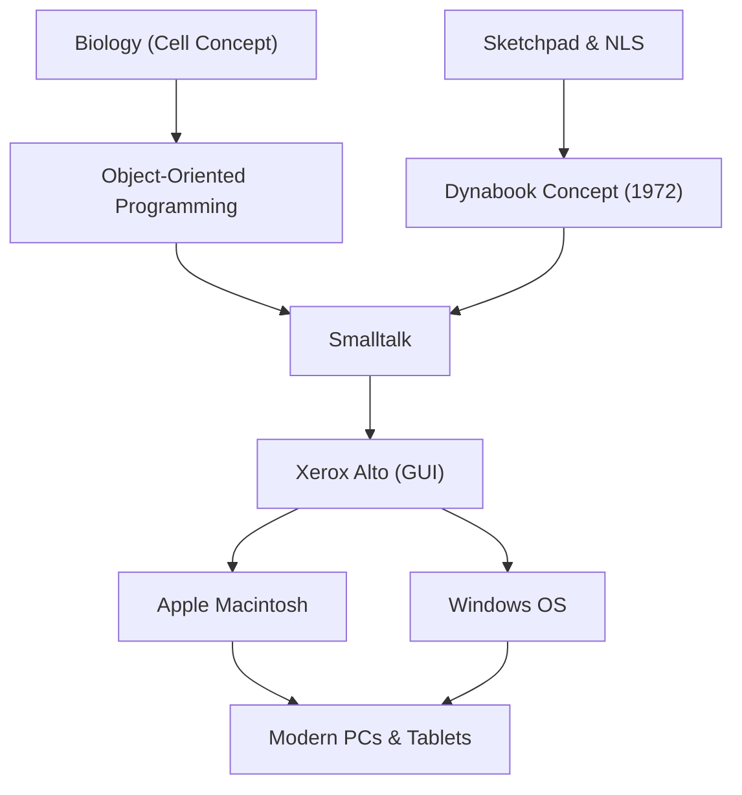

アラン・ケイ（Alan Kay）は、「パーソナルコンピュータの父」とも呼ばれるアメリカの計算機科学者であり、現代のコンピューティングに多大な影響を与えた天才ビジョナリーです。「未来を予測する最善の方法は、それを発明することだ（The best way to predict the future is to invent it.）」という彼の有名な言葉は、現在でも多くの起業家やエンジニアにインスピレーションを与え続けています。

本記事では、アラン・ケイの生涯、彼が提唱した革新的な哲学、そして彼が現代のテクノロジーにどのような影響を与えたのかを深く掘り下げます。

## 生涯と背景：天才の原点

アラン・ケイは1940年、マサチューセッツ州スプリングフィールドに生まれました。幼少期から天才的な知性を発揮し、3歳で流暢に本を読み、高校時代にはジャズミュージシャンとしてプロのステージに立つなど、多彩な才能を示しました。

彼のキャリアにおいて特筆すべきは、単なる計算機科学者ではなく、生物学、哲学、音楽、教育学といった幅広い知識を持っていたことです。大学では数学と分子生物学を専攻し、この生物学における「細胞（Cell）」の概念が、後に彼が考案する「オブジェクト指向プログラミング」の根幹を形成することになります。細胞が独立して機能し、互いにメッセージをやり取りして生命を維持するように、ソフトウェアもまた独立したオブジェクトのネットワークとして構築できると考えたのです。

ユタ大学の大学院に進学したケイは、そこでアイバン・サザランドの「Sketchpad」や、ダグラス・エンゲルバートの「NLS」といった先進的なシステムに触れます。これらの出会いを通じて、彼はコンピュータが単なる計算機ではなく、人間の思考や表現力を根本から拡張する「新しいメディア（ダイナミックなメディア）」であるという確信を抱くようになりました。

## 思想と哲学：ダイナブック（Dynabook）構想

アラン・ケイの最も有名な功績の一つは、「ダイナブック（Dynabook）」という画期的なコンセプトの提唱です。1972年、コンピュータがまだ部屋を埋め尽くすほど巨大だった時代に、ケイは次のようなパーソナルデバイスを構想しました。

- 本のように持ち運べるサイズと重さ
- 高解像度のフラットディスプレイを搭載
- 誰もが直感的に操作できるグラフィカルなインターフェース
- 無線ネットワークによる情報へのアクセス
- 子供たちがプログラミングを通じて自らの思考を表現できる環境

これはまさに、現代のノートパソコンやタブレット端末、スマートフォンの原型と言えるものです。しかし、ケイにとってダイナブックは単なる便利なハードウェアではなく、「子供たちの創造性を育み、自ら学ぶための新しいメディア」でした。読書によって人間の知性が発展したように、ダイナブックを通じて子供たちが世界のモデルを構築し、シミュレーションを行うことで、全く新しいレベルの知性を獲得できると信じていたのです。

## ゼロックスPARCでの躍進：SmalltalkとGUIの誕生

1970年代、ケイはゼロックスのパロアルト研究所（PARC）に設立メンバーとして参加します。ここで彼は「Learning Research Group（LRG）」を率い、ダイナブック構想を実現するためのソフトウェアとハードウェアの研究に没頭しました。

その中で生み出されたのが、プログラミング言語「Smalltalk（スモールトーク）」です。Smalltalkは、すべての要素を「オブジェクト」として扱い、それらが互いに「メッセージ」を送り合うことでプログラムが動作するという「オブジェクト指向プログラミング」の概念を世界で初めて完全に実装しました。

同時に、Smalltalkの操作環境として、ウィンドウ、アイコン、マウス、ポインタを用いた「GUI（グラフィカル・ユーザー・インターフェース）」が開発されました。さらに、これらのソフトウェアを動作させるためのプロトタイプハードウェアとして「Xerox Alto」が誕生しました。このPARCでの歴史的な成果は、1979年に研究所を訪問したAppleのスティーブ・ジョブズに強烈なインスピレーションを与え、後にLisaやMacintoshの誕生へと直結することになります。

## 後世への影響：現在の私たちに受け継がれるもの

アラン・ケイが撒いた種は、現在のIT社会の至る所で花開いています。

1. **オブジェクト指向プログラミングの普及**
   Java、Python、Ruby、C++など、現代の主要なプログラミング言語の多くは、ケイが提唱しSmalltalkで具現化したオブジェクト指向の概念を何らかの形で取り入れています。これにより、大規模で複雑なソフトウェアを効率的かつ柔軟に開発することが可能になりました。

2. **パーソナルコンピュータとGUIの標準化**
   私たちが毎日当たり前のように使っているスマートフォンやPCのインターフェースは、ケイらがPARCで開発したGUIが源流です。マウスで直感的に画面上のオブジェクトを操作するという発明がなければ、コンピュータはここまで一般社会に浸透しなかったでしょう。

3. **教育とテクノロジーの融合**
   「子供のためのコンピュータ」という彼のビジョンは、Scratchなどの教育用ビジュアルプログラミング言語や、一人一台端末を活用する現代の教育現場に脈々と受け継がれています。

## 結論：アラン・ケイのビジョンは終わらない

アラン・ケイは、技術を単なる「効率化の道具」としてではなく、人間の知性と創造力を解放するための「環境」として捉えていました。彼が思い描いたダイナブックの理想は、iPadなどのモバイルデバイスの登場によって、ハードウェアの観点からはほぼ実現したと言えるかもしれません。

しかし、「子供たちが自らメディアを構築し、深い思考を表現する」というソフトウェア的、教育的な目標については、現在のアプリ消費型のテクノロジー社会を振り返ると、まだ道半ばであるとケイ自身は指摘しています。

彼の「未来を予測する最善の方法は、それを発明することだ」という言葉の裏には、「望ましい未来は誰かが与えてくれるものではなく、自らの手で構想し、創り出すべきものだ」という強いメッセージが込められています。アラン・ケイの深い洞察と哲学は、これからも未知のテクノロジーを切り拓き、真に豊かな未来を築こうとするすべての人々にとって、重要な羅針盤であり続けるでしょう。
