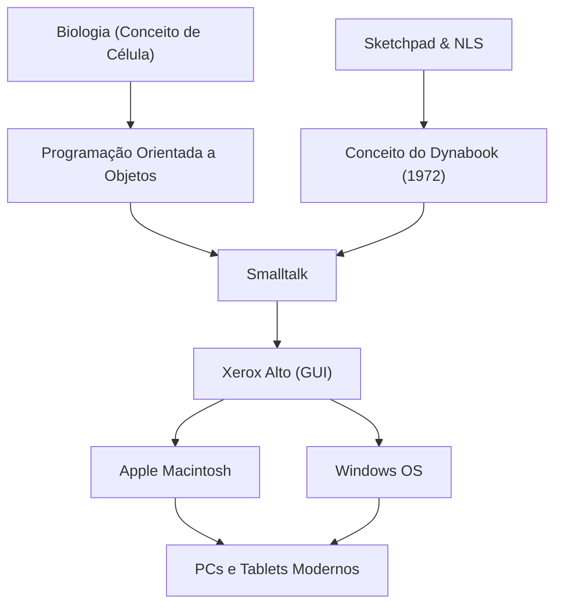

Alan Kay é um cientista da computação estadunidense, frequentemente chamado de "pai do computador pessoal", e um visionário genial que influenciou profundamente a computação moderna. Sua famosa citação, "A melhor forma de prever o futuro é inventá-lo" (The best way to predict the future is to invent it.), continua a inspirar muitos empreendedores e engenheiros até hoje.

Neste artigo, aprofundaremos a vida de Alan Kay, a filosofia inovadora que ele propôs e como ele influenciou a tecnologia moderna.

## Vida e Contexto: As Origens de um Gênio

Alan Kay nasceu em Springfield, Massachusetts, em 1940. Desde a infância demonstrou uma inteligência genial, lendo fluentemente aos 3 anos de idade e exibindo diversos talentos, como apresentar-se profissionalmente como músico de jazz no ensino médio.

O que se destaca em sua carreira é que ele não era apenas um cientista da computação, mas possuía um amplo conhecimento em biologia, filosofia, música e pedagogia. Na universidade, formou-se em matemática e biologia molecular, e esse conceito biológico de "Célula" (Cell) formaria a base da "Programação Orientada a Objetos" que ele inventaria mais tarde. Ele acreditava que, assim como as células funcionam de forma independente e trocam mensagens entre si para manter a vida, o software também poderia ser construído como uma rede de objetos independentes.

Kay prosseguiu para a pós-graduação na Universidade de Utah, onde entrou em contato com sistemas avançados como o "Sketchpad" de Ivan Sutherland e o "NLS" de Douglas Engelbart. Através desses encontros, ele se convenceu de que os computadores não eram meras máquinas de calcular, mas sim uma "nova mídia (mídia dinâmica)" que expandiria fundamentalmente o pensamento humano e a capacidade de expressão.

## Pensamento e Filosofia: O Conceito do Dynabook

Uma das conquistas mais famosas de Alan Kay é a proposição do conceito inovador chamado "Dynabook". Em 1972, numa época em que os computadores eram grandes o suficiente para preencher uma sala, Kay idealizou o seguinte dispositivo pessoal:

- Tamanho e peso que poderiam ser carregados como um livro
- Equipado com uma tela plana de alta resolução
- Uma interface gráfica que qualquer pessoa poderia operar de forma intuitiva
- Acesso à informação através de uma rede sem fio
- Um ambiente onde as crianças poderiam expressar seus próprios pensamentos através da programação

Este é exatamente o protótipo dos notebooks, tablets e smartphones modernos. No entanto, para Kay, o Dynabook não era apenas um hardware conveniente, mas "uma nova mídia para cultivar a criatividade das crianças e aprenderem por si mesmas". Assim como a inteligência humana se desenvolveu através da leitura, ele acreditava que as crianças poderiam adquirir um nível inteiramente novo de inteligência construindo modelos do mundo e realizando simulações através do Dynabook.

## Avanço no Xerox PARC: O Nascimento do Smalltalk e da GUI

Na década de 1970, Kay ingressou no Centro de Pesquisa de Palo Alto (PARC) da Xerox como membro fundador. Aqui, ele liderou o "Learning Research Group (LRG)" e dedicou-se à pesquisa de software e hardware para concretizar o conceito do Dynabook.

O que surgiu disso foi a linguagem de programação "Smalltalk". O Smalltalk implementou completamente o conceito de "Programação Orientada a Objetos" pela primeira vez no mundo, onde todos os elementos são tratados como "objetos" e o programa funciona fazendo com que eles enviem "mensagens" uns aos outros.

Ao mesmo tempo, uma "GUI (Interface Gráfica do Usuário)" usando janelas, ícones, mouse e ponteiro foi desenvolvida como o ambiente operacional para o Smalltalk. Além disso, o "Xerox Alto" nasceu como um hardware protótipo para executar este software. Essas conquistas históricas no PARC inspiraram fortemente Steve Jobs da Apple, que visitou o instituto em 1979, levando diretamente ao nascimento do Lisa e do Macintosh.

## Impacto nas Gerações Futuras: O que Herdamos Hoje

As sementes plantadas por Alan Kay floresceram em todos os lugares da sociedade de TI de hoje.

1. **A Difusão da Programação Orientada a Objetos**
   Muitas das principais linguagens de programação modernas, como Java, Python, Ruby e C++, incorporam de alguma forma o conceito de orientação a objetos proposto por Kay e materializado no Smalltalk. Isso tornou possível desenvolver softwares grandes e complexos de forma eficiente e flexível.

2. **A Padronização do Computador Pessoal e da GUI**
   As interfaces dos smartphones e PCs que usamos naturalmente todos os dias têm suas raízes na GUI desenvolvida por Kay e outros no PARC. Sem a invenção de manipular objetos intuitivamente na tela com um mouse, os computadores não teriam permeado a sociedade em geral a este ponto.

3. **A Fusão da Educação e da Tecnologia**
   Sua visão de "computadores para crianças" foi continuamente transmitida para linguagens de programação visual educacionais como o Scratch e para o cenário educacional moderno, onde cada aluno utiliza o seu próprio dispositivo.

## Conclusão: A Visão de Alan Kay não Termina

Alan Kay via a tecnologia não apenas como uma "ferramenta para eficiência", mas como um "ambiente" para libertar a inteligência e a criatividade humanas. Pode-se dizer que o ideal do Dynabook que ele imaginou foi quase realizado do ponto de vista do hardware com o surgimento de dispositivos móveis como o iPad.

No entanto, no que diz respeito ao objetivo educacional e de software de "as próprias crianças construírem mídias e expressarem pensamentos profundos", o próprio Kay aponta que ainda estamos na metade do caminho, se olharmos para a sociedade de tecnologia focada no consumo de aplicativos de hoje.

Por trás de sua citação "A melhor forma de prever o futuro é inventá-lo", há uma forte mensagem de que "o futuro desejado não é algo dado por alguém, mas algo que deve ser concebido e criado por nossas próprias mãos". A profunda percepção e filosofia de Alan Kay continuarão a ser uma bússola importante para todos aqueles que procuram abrir caminhos na tecnologia desconhecida e construir um futuro verdadeiramente rico.
