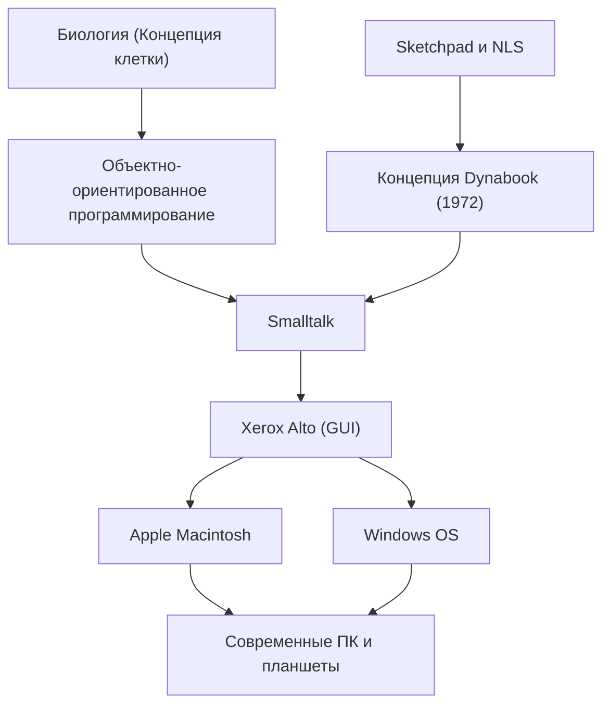

Алан Кей (Alan Kay) — американский ученый в области компьютерных наук, которого часто называют «отцом персонального компьютера». Он — гениальный визионер, оказавший колоссальное влияние на современные вычисления. Его знаменитые слова: «Лучший способ предсказать будущее — изобрести его» (The best way to predict the future is to invent it), до сих пор продолжают вдохновлять многих предпринимателей и инженеров.

В этой статье мы подробно рассмотрим жизнь Алана Кея, инновационную философию, которую он отстаивал, и то, как он повлиял на современные технологии.

## Жизнь и происхождение: Истоки гения

Алан Кей родился в 1940 году в Спрингфилде, штат Массачусетс. С раннего детства он проявлял гениальный интеллект: в три года бегло читал книги, а в старших классах школы выступал на профессиональной сцене как джазовый музыкант, демонстрируя многогранность своих талантов.

Особенностью его карьеры было то, что он был не просто специалистом в области информатики, но и обладал обширными знаниями в биологии, философии, музыке и педагогике. В университете он изучал математику и молекулярную биологию, и именно биологическая концепция «клетки» (Cell) впоследствии легла в основу разработанного им «объектно-ориентированного программирования». Он рассудил, что подобно тому, как клетки функционируют независимо и обмениваются сообщениями друг с другом для поддержания жизни, программное обеспечение также может быть построено как сеть независимых объектов.

Поступив в аспирантуру Университета Юты, Кей познакомился с такими передовыми системами, как «Sketchpad» Айвена Сазерленда и «NLS» Дугласа Энгельбарта. Благодаря этим встречам он обрел уверенность в том, что компьютер — это не просто вычислительная машина, а «новая среда (динамичная среда)», способная фундаментально расширить человеческое мышление и возможности самовыражения.

## Мысль и философия: Концепция Dynabook

Одним из самых известных достижений Алана Кея является предложение революционной концепции «Dynabook». В 1972 году, в эпоху, когда компьютеры были настолько огромными, что занимали целые комнаты, Кей задумал персональное устройство со следующими характеристиками:

- Размер и вес, позволяющие носить его как книгу
- Наличие экрана высокого разрешения
- Графический интерфейс, понятный каждому на интуитивном уровне
- Доступ к информации через беспроводную сеть
- Среда, в которой дети могли бы выражать свои мысли посредством программирования

Это, по сути, можно назвать прототипом современных ноутбуков, планшетов и смартфонов. Однако для Кея Dynabook был не просто удобным оборудованием, а «новой средой для развития детского творчества и самостоятельного обучения». Он верил, что точно так же, как чтение способствовало развитию человеческого интеллекта, использование Dynabook позволит детям строить модели мира и проводить симуляции, достигая тем самым совершенно нового уровня интеллекта.

## Прорыв в Xerox PARC: Рождение Smalltalk и GUI

В 1970-х годах Кей в качестве одного из основателей присоединился к Исследовательскому центру Пало-Альто (PARC) компании Xerox. Здесь он возглавил «Learning Research Group (LRG)» и погрузился в исследования программного и аппаратного обеспечения для реализации концепции Dynabook.

В результате этого был создан язык программирования «Smalltalk». В Smalltalk впервые в мире была полностью реализована концепция «объектно-ориентированного программирования», в которой все элементы рассматривались как «объекты», а программа работала за счет обмена «сообщениями» между ними.

Одновременно с этим, в качестве операционной среды для Smalltalk, был разработан «GUI (графический интерфейс пользователя)», использующий окна, иконки, мышь и указатель. Кроме того, в качестве прототипа аппаратного обеспечения для работы этого программного обеспечения был создан «Xerox Alto». Эти исторические достижения в PARC оказали сильное влияние на Стива Джобса из Apple во время его визита в лабораторию в 1979 году, что впоследствии привело к созданию Lisa и Macintosh.

## Влияние на потомков: То, что унаследовано нами сегодня

Семена, посеянные Аланом Кеем, сегодня цветут по всему ИТ-обществу.

1. **Популяризация объектно-ориентированного программирования**
   Многие из основных современных языков программирования, такие как Java, Python, Ruby и C++, в той или иной форме переняли концепции объектно-ориентированного программирования, предложенные Кеем и реализованные в Smalltalk. Это сделало возможным эффективную и гибкую разработку масштабного и сложного программного обеспечения.

2. **Стандартизация персональных компьютеров и GUI**
   Интерфейсы смартфонов и ПК, которыми мы пользуемся каждый день как чем-то само собой разумеющимся, берут свое начало от GUI, разработанного Кеем и его коллегами в PARC. Без изобретения интуитивного управления объектами на экране с помощью мыши компьютеры не проникли бы так глубоко в жизнь общества.

3. **Слияние образования и технологий**
   Его видение «компьютера для детей» продолжает жить в образовательных языках визуального программирования, таких как Scratch, и в современных образовательных учреждениях, где устройства используются по принципу «одно устройство на каждого ученика».

## Заключение: Видение Алана Кея не имеет конца

Алан Кей рассматривал технологии не просто как «инструмент для повышения эффективности», а как «среду» для высвобождения человеческого интеллекта и творческого потенциала. С аппаратной точки зрения, можно сказать, что идеал Dynabook, который он себе представлял, был практически реализован с появлением мобильных устройств, таких как iPad.

Однако, оглядываясь на современное технологическое общество, ориентированное на потребление приложений, сам Кей отмечает, что мы все еще находимся на полпути к достижению программной и образовательной цели: «дети сами создают медиа и выражают глубокие мысли».

За его словами «Лучший способ предсказать будущее — изобрести его» скрывается сильный посыл: «Желаемое будущее — это не то, что вам кто-то преподнесет, это то, что вы должны задумать и создать своими собственными руками». Глубокие прозрения и философия Алана Кея будут продолжать служить важным компасом для всех тех, кто стремится прокладывать путь к неизведанным технологиям и строить по-настоящему богатое будущее.
