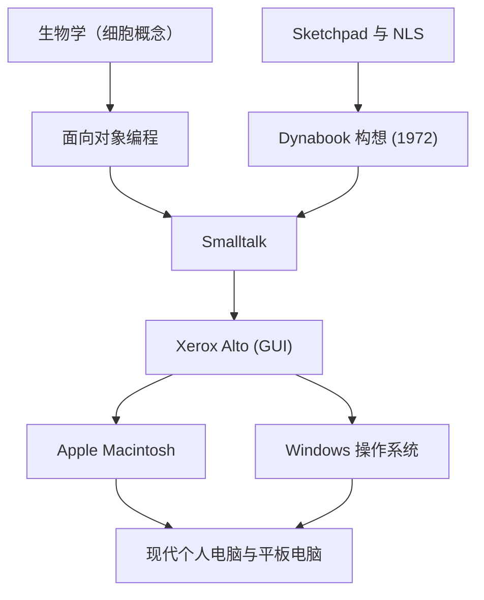

阿兰·凯（Alan Kay）是一位被称为“个人电脑之父”的美国计算机科学家，也是对现代计算产生了深远影响的天才先知。“预测未来的最好方式就是去创造它（The best way to predict the future is to invent it.）”，这句他的名言至今仍不断地启发着无数的企业家和工程师。

本文将深入探讨阿兰·凯的生平、他所提出的创新哲学，以及他对现代科技所产生的深远影响。

## 生平与背景：天才的起点

1940年，阿兰·凯出生于马萨诸塞州的斯普林菲尔德。他从童年时期就展现出天才般的智慧，3岁便能流利地阅读书籍，高中时代更是作为爵士音乐家登上了专业舞台，展现了多才多艺的天赋。

在他的职业生涯中，值得大书特书的是他不仅是一名单纯的计算机科学家，还拥有生物学、哲学、音乐、教育学等广泛的知识。在大学里，他主修数学和分子生物学，而生物学中“细胞（Cell）”的概念，后来成为了他构想“面向对象编程”的根基。他认为，正如细胞能够独立运作，通过相互传递信息来维持生命一样，软件也可以被构建为独立对象的网络。

升入犹他大学研究生院后，凯在那里接触到了伊万·萨瑟兰（Ivan Sutherland）的“Sketchpad”和道格拉斯·恩格尔巴特（Douglas Engelbart）的“NLS”等先进系统。通过这些接触，他开始确信，计算机不仅是一台单纯的计算机器，更是能够从根本上扩展人类思考与表达能力的“新媒体（动态媒体）”。

## 思想与哲学：Dynabook 构想

阿兰·凯最著名的成就之一，就是提出了名为“Dynabook”的划时代概念。1972年，在计算机依然庞大到需要占据整个房间的时代，凯构想出了如下的个人设备：

- 像书本一样便于携带的尺寸和重量
- 搭载高分辨率的平板显示器
- 任何人都能直观操作的图形界面
- 通过无线网络获取信息
- 孩子们可以通过编程表达自己思想的环境

这简直可以说就是现代笔记本电脑、平板电脑以及智能手机的原型。然而，对于凯来说，Dynabook不仅仅是一款便利的硬件，它更是“培养孩子们创造力、让他们自主学习的新媒体”。他相信，正如阅读促进了人类智慧的发展，孩子们通过 Dynabook 构建世界模型并进行模拟，将能够获得全新水平的智慧。

## 在施乐 PARC 的飞跃：Smalltalk 与 GUI 的诞生

20世纪70年代，凯作为创始成员加入了施乐帕洛阿尔托研究中心（PARC）。在这里，他领导了“学习研究小组（Learning Research Group, LRG）”，全身心投入到实现 Dynabook 构想的软件与硬件研究中。

在此过程中诞生的，便是编程语言“Smalltalk”。Smalltalk 将所有元素都视为“对象（Object）”，它们通过相互发送“消息（Message）”来使程序运行。它在世界上首次完整地实现了“面向对象编程”的概念。

同时，作为 Smalltalk 的操作环境，使用窗口、图标、鼠标和指针的“GUI（图形用户界面）”被开发了出来。此外，为了运行这些软件，诞生了作为原型硬件的“Xerox Alto”。这项在 PARC 取得的历史性成果，在1979年给予了造访该研究所的苹果公司创始人史蒂夫·乔布斯极大的启发，并直接促成了后来 Lisa 和 Macintosh 的诞生。

## 对后世的影响：传承给现代的我们

阿兰·凯播下的种子，如今已在当今IT社会的各个角落绽放。

1. **面向对象编程的普及**
   Java、Python、Ruby、C++ 等现代主流编程语言中的大多数，都以某种形式吸收了凯所倡导并在 Smalltalk 中具体实现的面向对象概念。这使得大规模且复杂的软件能够得到高效、灵活的开发。

2. **个人电脑与 GUI 的标准化**
   我们每天理所当然地使用的智能手机和个人电脑的界面，其源头便是凯等人在 PARC 开发的 GUI。如果没有用鼠标直观地操作屏幕上对象的这一发明，计算机绝不可能如此深入地渗透到一般社会中。

3. **教育与科技的融合**
   他那“为儿童设计计算机”的愿景，正在 Scratch 等教育类视觉化编程语言，以及推行“一人一机”的现代教育现场中绵延不绝地传承着。

## 结论：阿兰·凯的愿景并未终结

阿兰·凯并没有将技术仅仅视为一种“提高效率的工具”，而是将其看作一种解放人类智慧与创造力的“环境”。他所描绘的 Dynabook 理想，随着 iPad 等移动设备的出现，从硬件的角度来看或许可以说已经基本实现了。

然而，关于“孩子们自主构建媒体并表达深刻思考”这一软件层面与教育层面的目标，回顾当下以应用消费为主的科技社会，凯本人指出：这一目标仍在半途。

他那句“预测未来的最好方式就是去创造它”的背后，蕴含着强烈的信息：“理想的未来不是别人赐予的，而应该由我们亲手去构想和创造”。阿兰·凯深刻的洞察力和哲学，在未来依然将是所有致力于开拓未知科技、构筑真正丰富未来的人们的重要指南针。
