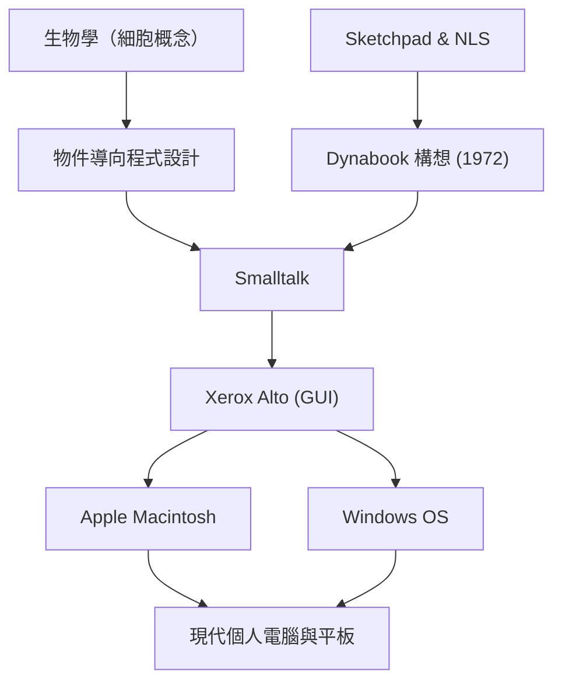

艾倫·凱（Alan Kay）是一位美國計算機科學家，被譽為「個人電腦之父」，也是對現代計算領域產生深遠影響的天才先知。他有句名言：「預測未來的最好方法就是去發明它（The best way to predict the future is to invent it.）」，這句話至今仍不斷啟發著許多的企業家和工程師。

本文將深入探討艾倫·凱的生平、他所提倡的創新哲學，以及他對現代科技產生了什麼樣的影響。

## 生平與背景：天才的原點

艾倫·凱於1940年出生在麻薩諸塞州斯普林菲爾德。他從幼年起就展現出天才般的智慧，3歲就能流利地閱讀，高中時期更以爵士音樂家的身分登上專業舞台，展現了多才多藝的一面。

在他的職業生涯中，值得一提的是他並非只是一名單純的計算機科學家，而是具備了生物學、哲學、音樂、教育學等廣泛的知識。他在大學時主修數學與分子生物學，而生物學中「細胞（Cell）」的概念，便成為了他後來構想「[物件導向程式設計](/zh-tw/p/object-oriented-programming-oop-solid-principles/)（Object-Oriented Programming）」的根基。如同細胞能獨立運作，並透過互相傳遞訊息來維持生命一樣，他認為軟體也可以被建構為由獨立物件組成的網路。

進入猶他大學研究所後，凱在那裡接觸到了伊凡·蘇澤蘭（Ivan Sutherland）的「Sketchpad」以及道格拉斯·恩格爾巴特（Douglas Engelbart）的「NLS」等先進系統。透過這些接觸，他開始確信電腦不應只是單純的計算機，而是能夠從根本上擴展人類思考與表達能力的「新媒體（動態媒體）」。

## 思想與哲學：Dynabook構想

艾倫·凱最著名的成就之一，就是提出了「Dynabook」這個劃時代的概念。1972年，在那個電腦還龐大到需要佔據整個房間的時代，凱構想出了具備以下特徵的個人裝置：

- 像書本一樣便於攜帶的尺寸與重量
- 搭載高解析度的平面顯示器
- 任何人都能直覺操作的圖形使用者介面
- 透過無線網路存取資訊
- 讓孩子們能透過寫程式來表達自我思考的環境

這完全可以說是現代筆記型電腦、平板電腦及智慧型手機的原型。然而，對凱而言，Dynabook不僅僅是方便的硬體，更是「培養孩子創造力、讓他們自主學習的新媒體」。就像閱讀促進了人類智力的發展一樣，他相信孩子們透過Dynabook來建構世界模型並進行模擬，將能夠獲得全新層次的智力。

## 在全錄PARC的飛躍：Smalltalk與GUI的誕生

1970年代，凱作為創始成員加入了全錄（Xerox）的帕羅奧多研究中心（PARC）。在這裡，他帶領「學習研究小組（Learning Research Group, LRG）」，致力於能實現Dynabook構想的軟硬體研究。

在這樣的背景下，程式語言「Smalltalk」誕生了。Smalltalk將所有元素都視為「物件（Object）」，並透過它們之間互相發送「訊息（Message）」來讓程式運作，這是世界上第一個完全實作了「[物件導向程式設計](/zh-tw/p/object-oriented-programming-oop-solid-principles/)」概念的語言。

同時，作為Smalltalk的操作環境，也開發出了使用視窗、圖示、滑鼠及指標的「GUI（圖形使用者介面）」。此外，為了運行這些軟體，更誕生了原型硬體「Xerox Alto」。PARC的這些歷史性成果，對1979年來訪的蘋果公司（Apple）創辦人[史蒂夫·賈伯斯](/zh-tw/p/biography-steve-jobs/)（Steve Jobs）產生了強烈的啟發，並直接促成了後來Lisa與Macintosh的誕生。

## 對後世的影響：傳承給現今我們的遺產

艾倫·凱所播下的種子，如今在現代IT社會的各個角落綻放。

1. **[物件導向程式設計](/zh-tw/p/object-oriented-programming-oop-solid-principles/)的普及**
   Java、Python、Ruby、C++等現代主流程式語言，大多以某種形式採用了凱所提倡並在Smalltalk中具現化的物件導向概念。這使得開發大規模且複雜的軟體變得更加高效與靈活。

2. **個人電腦與GUI的標準化**
   我們每天習以為常地使用的智慧型手機與PC介面，其源頭正是凱等人在PARC開發的GUI。如果沒有透過滑鼠直覺地操作畫面上物件的這項發明，電腦可能無法如此深入一般社會。

3. **教育與科技的結合**
   他「為兒童設計的電腦」的願景，在Scratch等教育用視覺化程式語言，以及現代教育現場實施的一人一機（每位學生配備一台載具）等政策中，持續傳承著。

## 結論：艾倫·凱的願景尚未結束

艾倫·凱並不將技術視為單純的「提升效率的工具」，而是將其視為釋放人類智力與創造力的「環境」。他所描繪的Dynabook理想，隨著iPad等行動裝置的出現，或許從硬體的角度來看可以說已經基本實現了。

然而，關於「讓孩子們自主建構媒體並表達深刻思考」這個在軟體及教育層面上的目標，若回顧當前以消費應用程式為主的科技社會，凱本人也指出這仍是一條未竟之路。

他那句「預測未來的最好方法就是去發明它」的背後，蘊含著「理想的未來不是別人給予的，而是應該由自己親手構想與創造」的強烈訊息。艾倫·凱深邃的洞察力與哲學，將會繼續為所有致力於開拓未知科技、建立真正豐碩未來的人們，提供一座重要的羅盤。
