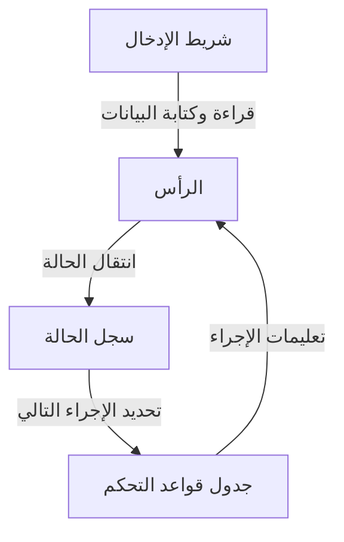
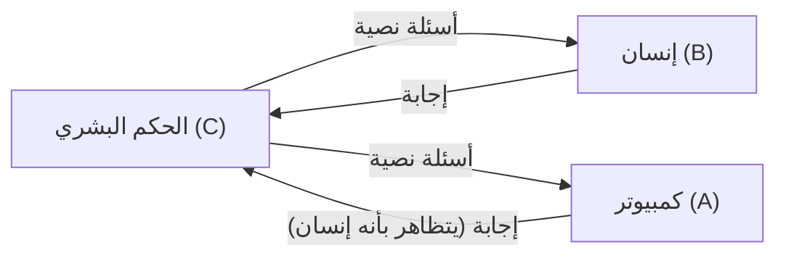

# آلان تورينج: أب الذكاء الاصطناعي والنهاية المأساوية

الهواتف الذكية، وأجهزة الكمبيوتر الشخصية، والذكاء الاصطناعي (AI) الذي يشهد تطوراً سريعاً في السنوات الأخيرة، هي أشياء نستخدمها اليوم كأمر مسلم به. الشخص الذي بنى الأساس النظري لهذه التقنيات هو عالم رياضيات بريطاني. اسمه آلان ماثيسون تورينج (Alan Mathison Turing).

يُعرف بأنه "أب علوم الكمبيوتر" و"أب الذكاء الاصطناعي"، وهو أيضاً بطل أنقذ ملايين الأرواح خلال الحرب العالمية الثانية من خلال فك الشفرات. ومع ذلك، لم تكن حياته سلسة، وانتهت بطريقة قاسية بسبب التحيزات الاجتماعية. في هذا المقال، سنستعرض بالتفصيل حياة تورينج، بدءاً من نشأته، والأفكار الثورية التي قدمها للعالم، وصولاً إلى نهايته المأساوية.

## 1. الطفولة وسنوات التكوين: براعم الموهبة الفريدة

وُلد آلان تورينج في 23 يونيو 1912 في ميدا فيل بلندن. نظراً لأن والده كان يعمل كموظف حكومي في الهند البريطانية (الهند الحالية)، قضى تورينج معظم طفولته بعيداً عن والديه، وعاش في أسر حاضنة ومدارس داخلية. ربما قاده هذا الجو من العزلة ليصبح شخصية استبطانية وعميقة التفكير.

### الأيام في مدرسة شيربورن

في سن الثالثة عشرة، التحق بمدرسة شيربورن المرموقة. لكن التعليم في بريطانيا آنذاك كان يركز على الأدب الكلاسيكي واللاتينية، ولم تكن موهبة تورينج واهتمامه الشديد بالرياضيات والعلوم تحظى بالتقدير الكافي. حتى أن أحد المدرسين قال: "إذا كان سيبقى ليصبح مجرد متخصص في العلوم، فوجوده في هذه المدرسة مضيعة للوقت".

مع ذلك، لم يتوقف فضول تورينج الفكري. فقد أظهر بالفعل علامات العبقرية من خلال فهمه المستقل لنظرية النسبية لأينشتاين وتشكيكه في قوانين الحركة لنيوتن.

### لقاء وفراق مع كريستوفر موركوم

خلال فترة وجوده في مدرسة شيربورن، حدث أمر ترك تأثيراً كبيراً على حياة تورينج. كان ذلك لقاؤه بكريستوفر موركوم، وهو طالب يكبره بعام واحد. كان موركوم يحب العلوم والرياضيات مثل تورينج، وتطورت بينهما رابطة فكرية عميقة. يقال إن موركوم كان بالنسبة لتورينج أكثر من مجرد صديق، بل كان حبه الأول.

لكن هذه الفترة السعيدة كانت قصيرة، حيث توفي موركوم فجأة في فبراير 1930 بسبب مرض السل البقري. ترك هذا الفقدان العميق جرحاً كبيراً في قلب تورينج، ودفعه لطرح أسئلة فلسفية حول "الحدود بين العقل والمادة". "هل يستمر العقل والوعي البشري بعد فناء الجسد؟"، "هل يمكن لآلة أن تحاكي التفكير البشري؟". أصبحت هذه الأسئلة القوة الدافعة وراء أبحاثه اللاحقة في الذكاء الاصطناعي.

## 2. جامعة كامبريدج وولادة "آلة تورينج"

في عام 1931، التحق تورينج بكلية كينجز في جامعة كامبريدج، وانغمس بجدية في دراسة الرياضيات والمنطق. هناك، تواصل مع أفكار علماء بارزين مثل [جون فون نيومان](/ar/p/von-neumann/) وماكس بورن، ووسع آفاقه الأكاديمية بشكل كبير.

في عام 1936، وهو في الرابعة والعشرين من عمره، نشر ورقة بحثية تاريخية تتألق في تاريخ العلم في القرن العشرين: "عن الأرقام القابلة للحساب، مع تطبيق على مشكلة القرار (On Computable Numbers, with an Application to the Entscheidungsproblem)".

### مفهوم آلة تورينج

في هذه الورقة، قدم تورينج إجابة بـ "لا" على "مشكلة القرار (Entscheidungsproblem)" التي طرحها عالم الرياضيات [ديفيد هيلبرت](/ar/p/hilbert/) (هل يمكن لأي عبارة رياضية أن يتم إثبات صحتها أو خطئها بواسطة خوارزمية؟). ومع ذلك، القيمة الحقيقية لهذه الورقة تكمن في النموذج الفكري الذي ابتكره خلال عملية الإثبات، وهو "آلة تورينج (Turing Machine)".

آلة تورينج هي آلة افتراضية بسيطة جداً تتكون من شريط طويل لا نهائي، ورأس يقرأ ويكتب على الشريط، وسجل يحفظ الحالة الداخلية، وجدول قواعد يحدد الإجراءات.

أثبت تورينج أن أي عملية حسابية، مهما كانت معقدة، يمكن تقسيمها إلى تكرار لهذه العمليات البسيطة. وعلاوة على ذلك، أثبت وجود "آلة تورينج العامة (Universal Turing Machine)" القادرة على محاكاة عمل أي آلة تورينج أخرى.

كان هذا **المبدأ الأساسي لأجهزة الكمبيوتر الحديثة (أجهزة الكمبيوتر ذات البرامج المخزنة)**، والذي يفصل بين "الأجهزة" (الجهاز نفسه) و"البرامج"، ويوضح لأول مرة في العالم أن آلة واحدة يمكنها تنفيذ أي حساب ببساطة عن طريق تغيير البرنامج.

## 3. الحرب العالمية الثانية وفك الشفرات في حديقة بلتشلي

عندما اندلعت الحرب العالمية الثانية في عام 1939، تم استدعاء تورينج إلى حديقة بلتشلي، المقر الرئيسي لمدرسة الشفرات والتعمية الحكومية البريطانية (GC&CS). كانت مهمته هي فك شفرة "إنجما (Enigma)"، أقوى آلة تشفير لدى ألمانيا النازية.

### تهديد شفرة إنجما

إنجما كانت آلة تجمع بين لوحة مفاتيح تشبه الآلة الكاتبة وعدة دوارات (rotors) مع أسلاك معقدة. في كل مرة يتم فيها الضغط على مفتاح، تدور الدوارات وتتغير قاعدة تحويل الحروف باستمرار، مما أدى إلى عدد هائل من التوليفات بلغ حوالي 159 كوينتيليون (159 مليار مليار). اعتقد الجيش الألماني أن هذا النظام "مستحيل الفك"، واستخدمه بشكل مكثف لإصدار الأوامر لغواصات يو (U-boats).

### تطوير قنبلة (Bombe)

بناءً على الأساس الذي وضعه فككو الشفرات البولنديون، صمم تورينج آلة حاسبة ضخمة تسمى "بومب (Bombe)" لفك شفرة إنجما ميكانيكياً. كانت بومب تحاكي دوران دوارات إنجما بسرعة عالية، وتستبعد التوليفات المتناقضة واحدة تلو الأخرى حتى تصل إلى الإعداد الصحيح (المفتاح).

بفضل الجهود المستمرة لتورينج وفريقه (خاصة مساهمات غوردون ويلشمان)، بدأت بومب بالعمل، وأصبحت اتصالات الجيش الألماني مكشوفة للعلن.

### بطل في الظل غيّر التاريخ

كان لفك شفرة إنجما أثر استراتيجي هائل لصالح الحلفاء. خاصة في معركة المحيط الأطلسي، حيث أتاح معرفة مواقع وخطط غواصات يو الألمانية مسبقاً إنقاذ العديد من القوافل.

يُقدّر المؤرخون أنه لولا فك الشفرات في حديقة بلتشلي، لاستمرت الحرب العالمية الثانية لعامين إلى أربعة أعوام إضافية، وكان سيُفقد ملايين آخرين من الأرواح. ومع ذلك، نظراً لأن هذه المهمة كانت سرية للغاية، لم يُعرف عن إنجازات تورينج الرائعة لعقود طويلة بعد الحرب.

## 4. فجر الذكاء الاصطناعي: "هل يمكن للآلة أن تفكر؟"

بعد الحرب، عمل تورينج في المختبر الفيزيائي الوطني (NPL) على تصميم محرك الحوسبة التلقائي (ACE)، ثم قاد جهود تطوير الحواسيب المبكرة في جامعة مانشستر. لم يكتفِ بصنع آلات لتسريع الحسابات، بل اتجه اهتمامه نحو مجال فلسفي أكثر تقدماً: "الذكاء الاصطناعي (Artificial Intelligence)".

في عام 1950، نشر ورقة بحثية رائدة بعنوان "آلات الحوسبة والذكاء (Computing Machinery and Intelligence)" في مجلة "Mind". تبدأ الورقة بسؤال استفزازي: "هل يمكن للآلة أن تفكر؟".

### اختبار تورينج (لعبة التقليد)

بدلاً من محاولة تعريف المفهوم الشخصي لـ "التفكير"، اقترح تورينج اختباراً عملياً يمكن تقييمه بشكل موضوعي. أُطلق على هذا لاحقاً "اختبار تورينج"، أو "لعبة التقليد".

في هذا الاختبار، يجري حكم بشري موجود في غرفة معزولة حواراً نصياً مع كمبيوتر وإنسان. إذا لم يتمكن الحكم من تحديد أيهما الكمبيوتر وأيهما الإنسان بدرجة من اليقين، يمكن اعتبار أن الكمبيوتر "يمتلك ذكاءً يعادل ذكاء الإنسان (يفكر)". كان هذا نهجاً ثورياً.

لا يزال هذا المفهوم يُشار إليه حتى اليوم كأحد الأهداف النهائية في تطوير الذكاء الاصطناعي، وكان له تأثير لا يقدر بثمن على تطور معالجة اللغات الطبيعية (NLP) والذكاء الاصطناعي الحواري (مثل النظام الذي يولد النص الذي تقرأه الآن).

## 5. التوجه نحو علم الأحياء الرياضي: تحدي لغز التشكل

لم يقتصر عبقرية تورينج على الرياضيات وعلوم الكمبيوتر. في سنواته الأخيرة، كان رائداً في مجال جديد تماماً هو "علم الأحياء الرياضي".

في عام 1952، نشر ورقة بحثية بعنوان "الأساس الكيميائي للتشكل (The Chemical Basis of Morphogenesis)". أظهر فيها أن الأنماط المعقدة والجميلة الموجودة في الطبيعة، مثل خطوط الحمار الوحشي، وبقع الفهد، وترتيب الأوراق، يمكن تفسيرها رياضياً من خلال عملية التفاعل والانتشار (نظام التفاعل-الانتشار) لمواد كيميائية بسيطة (المورفوجينات).

اقتربت معادلات تورينج من اللغز الأساسي لعلم الأحياء النمائي: كيف تبني الكائنات الحية هياكل معقدة من خلية واحدة؟ وكانت هذه الأبحاث ذات رؤية استباقية، ومهدت الطريق لعلم الأحياء النظامي ونظرية الفوضى الحديثة.

## 6. عبقري قتله عصره: النهاية المأساوية

بينما كان في ذروة تألقه الأكاديمي، ضربته المأساة فجأة.

في يناير 1952، تعرض منزل تورينج للسطو. أبلغ الشرطة، ولكن خلال التحقيق تم اكتشاف علاقته المثلية مع شريكه أرنولد موراي. في ذلك الوقت في بريطانيا، كانت المثلية الجنسية تعتبر "فحشاً جسيماً (Gross Indecency)" ويُعاقب عليها القانون بصرامة كجريمة.

### الخيار القاسي والإخصاء الكيميائي

تم إدانة تورينج، وخُير بين السجن أو الخضوع لعلاج هرموني لتقليل الرغبة الجنسية (إخصاء كيميائي فعلي). من أجل الاستمرار في أبحاثه، اختار العلاج الهرموني (إعطاء الإستروجين).

تسبب هذا العلاج في أضرار جسدية ونفسية عميقة. ظهرت عليه سمات أنثوية وعانى من اكتئاب شديد. وبصفته مجرماً مداناً، اعتُبر تهديداً أمنياً، وتم تجريده من تصريحه الأمني للمشاركة في مشاريع حكومية سرية، وفقد وظيفته كمستشار في تقنيات التشفير. البطل الذي أنقذ الأمة تم تجريده من كل شيء بواسطة هذه الأمة.

### التفاحة المسمومة والموت الغامض

في 8 يونيو 1954، عُثر على تورينج ميتاً في سريره في منزله. كان عمره 41 عاماً.

بجانب السرير، وُجدت تفاحة مأكول نصفها. خلص تشريح الجثة إلى أن سبب الوفاة هو التسمم بالسيانيد، وخلصت الشرطة إلى أنه انتحر عن طريق تناول تفاحة محقونة بالسيانيد. كانت نهاية مأساوية تحاكي قصة "بياض الثلج" التي كان يحبها.

(ملاحظة: ومع ذلك، أشار بعض الباحثين وكتاب السيرة الذاتية إلى احتمال أن يكون الأمر حادثاً خلال تجربة، ولا تزال الحقيقة الكاملة غير معروفة تماماً حتى اليوم.)

## 7. استعادة الشرف بعد الوفاة والإرث الأبدي

بعد وفاة تورينج، ظلت العديد من إنجازاته مخفية تحت ستار السرية العسكرية. ولكن منذ السبعينيات، مع الكشف التدريجي عن عمليات فك الشفرات في حديقة بلتشلي، أصبح دوره الحاسم في تاريخ البشرية معروفاً للعالم.

### الاعتذار والعفو

في عام 2009، قدم رئيس الوزراء البريطاني آنذاك جوردون براون اعتذاراً رسمياً نيابة عن الحكومة عن المعاملة غير العادلة التي تعرض لها تورينج.
"بدون مساهماته الاستثنائية، كان تاريخ الحرب العالمية الثانية ليكون مختلفاً تماماً. المعاملة التي تلقاها كانت غير عادلة على الإطلاق."

وفي عام 2013، منحته الملكة إليزابيث عفواً ملكياً (Royal Pardon) بعد وفاته. وفي عام 2017، تم تفعيل ما يُعرف بـ "قانون تورينج"، والذي أعاد الاعتبار لعشرات الآلاف من الرجال الذين أُدينوا في الماضي بجرائم المثلية الجنسية.

### جائزة تورينج والورقة النقدية فئة 50 جنيهاً

اليوم، أعلى جائزة في مجال علوم الكمبيوتر (تعادل جائزة نوبل في الكمبيوتر) تحمل اسمه وتُعرف باسم "جائزة تورينج (Turing Award)".
أيضاً، في عام 2021، تم اختيار صورة تورينج لتوضع على الورقة النقدية الجديدة فئة 50 جنيهاً إسترلينياً الصادرة عن بنك إنجلترا. وحُفرت عليها مقولته الشهيرة:

> "هذا مجرد تذوق لما سيأتي، ومجرد ظل لما سيكون."
> ("This is only a foretaste of what is to come, and only the shadow of what is going to be.")

### الإرث الممتد إلى اليوم

كانت حياة آلان تورينج قصيرة (41 عاماً) وانتهت بنهاية غير منطقية وقاسية. ومع ذلك، نمت البذور التي زرعها لتصبح غابة ضخمة هي المجتمع الرقمي الحديث.

في كل مرة نرسل فيها رسالة عبر هاتفنا الذكي، أو نطرح سؤالاً على الذكاء الاصطناعي، أو ننفذ عملية حسابية معقدة في لحظة، تتنفس روح آلان تورينج العبقري. تستمر حياته في تقديم درس أبدي للبشرية حول الإمكانيات غير المحدودة للذكاء، والمأساة التي تنتج عن تحيزات المجتمع.
