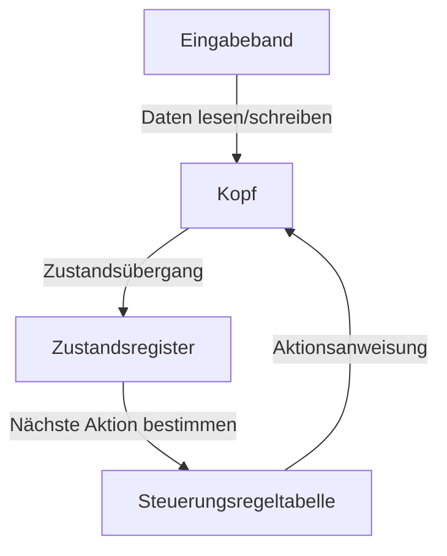
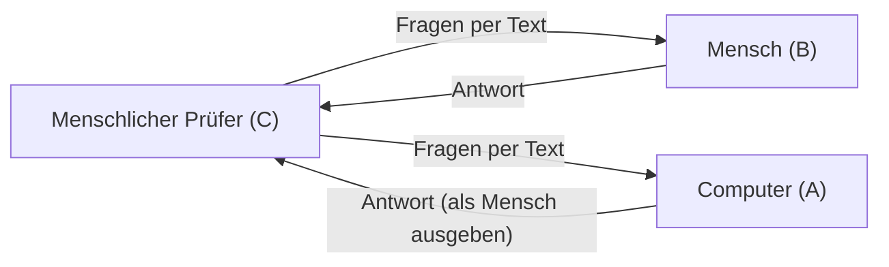

# Alan Turing: Der Vater der KI und sein tragisches Ende

Die Smartphones, Personal Computer und die sich in den letzten Jahren rasant entwickelnde künstliche Intelligenz (KI), die wir heute als selbstverständlich nutzen, haben ihre theoretische Grundlage einem einzigen britischen Mathematiker zu verdanken. Sein Name war Alan Mathison Turing.

Er wird als "Vater der Informatik" und "Vater der künstlichen Intelligenz" bezeichnet und ist zudem ein Held, der während des Zweiten Weltkriegs durch das Entschlüsseln von Codes Millionen von Menschenleben rettete. Sein Leben verlief jedoch keineswegs reibungslos und endete durch gesellschaftliche Vorurteile auf grausame Weise. In diesem Artikel werden wir das Leben Turings, von seiner Kindheit über die revolutionären Ideen, die er der Welt brachte, bis hin zu seinem tragischen Ende, sehr detailliert beleuchten.

## 1. Kindheit und prägende Jahre: Die Anfänge eines außergewöhnlichen Talents

Alan Turing wurde am 23. Juni 1912 in Maida Vale, London, geboren. Da sein Vater als Beamter in Britisch-Indien (dem heutigen Indien) arbeitete, lebte Turing von klein auf oft getrennt von seinen Eltern und war gezwungen, bei Pflegefamilien und in Internaten zu leben. Diese einsame Umgebung hat ihn möglicherweise zu seiner introspektiven und tiefgründigen Denkweise geführt.

### Die Tage an der Sherborne School

Im Alter von 13 Jahren trat er in die angesehene Sherborne School, eine Public School, ein. Die damalige britische Bildung legte jedoch großen Wert auf klassische Literatur und Latein, sodass Turings Talent und sein starkes Interesse an Mathematik und Naturwissenschaften nicht immer angemessen gewürdigt wurden. Ein Lehrer bemerkte sogar: "Wenn er nur ein wissenschaftlicher Spezialist werden will, verschwendet er hier an dieser Schule seine Zeit."

Dennoch kannte Turings intellektuelle Neugier keine Grenzen. Er verstand Einsteins Relativitätstheorie im Selbststudium und hinterfragte Newtons Bewegungsgesetze, was bereits Spuren seines Genies zeigte.

### Begegnung und Abschied von Christopher Morcom

Während seiner Zeit an der Sherborne School gab es ein Ereignis, das Turings Leben entscheidend prägte. Es war die Begegnung mit Christopher Morcom, einem ein Jahr älteren Schüler. Morcom liebte wie Turing Wissenschaft und Mathematik, und die beiden verband eine tiefe intellektuelle Bindung. Für Turing war Morcom mehr als nur ein Freund, er soll auch seine erste Liebe gewesen sein.

Diese glückliche Zeit war jedoch nur von kurzer Dauer. Im Februar 1930 verstarb Morcom plötzlich an Rinder-Tuberkulose. Dieser tiefe Verlust hinterließ große Narben in Turings Herzen und trieb ihn gleichzeitig zu der philosophischen Frage nach der "Grenze zwischen Geist und Materie". "Existiert der menschliche Geist oder das Bewusstsein auch nach dem Tod des Körpers weiter?" "Ist es möglich, dass Maschinen das menschliche Denken imitieren?" Diese Fragen waren die Triebkraft, die ihn später zur Erforschung der künstlichen Intelligenz führte.

## 2. Die Universität Cambridge und die Geburt der "Turingmaschine"

Im Jahr 1931 begann Turing sein Studium am King's College der Universität Cambridge und widmete sich intensiv der Erforschung von Mathematik und Logik. Hier kam er mit den Gedanken von Spitzenwissenschaftlern wie [John von Neumann](/de/p/von-neumann/) und Max Born in Berührung und erweiterte seine akademischen Horizonte erheblich.

1936, im Alter von 24 Jahren, veröffentlichte er seine monumentale Arbeit "On Computable Numbers, with an Application to the Entscheidungsproblem" (Über berechenbare Zahlen, mit einer Anwendung auf das Entscheidungsproblem), die hell in der Wissenschaftsgeschichte des 20. Jahrhunderts erstrahlt.

### Das Konzept der Turingmaschine

In dieser Arbeit lieferte Turing einen Beweis, der das vom Mathematiker [David Hilbert](/de/p/hilbert/) aufgeworfene "Entscheidungsproblem" (Können alle mathematischen Aussagen durch einen Algorithmus auf ihre Richtigkeit überprüft werden?) mit "Nein" beantwortete. Der wahre Wert dieser Arbeit lag jedoch in dem Gedankenexperiment-Modell der "Turingmaschine" (Turing Machine), das er im Zuge dieses Beweises entwarf.

Die Turingmaschine ist eine extrem einfache virtuelle Maschine, bestehend aus einem unendlich langen Band, einem Kopf zum Lesen und Schreiben auf dem Band, einem Register zum Speichern des internen Zustands und einer Regeltabelle, die das Verhalten bestimmt.

Turing zeigte, dass selbst die komplexesten Berechnungen in eine Wiederholung dieser einfachen Operationen zerlegt werden können. Darüber hinaus bewies er die Existenz der "Universellen Turingmaschine" (Universal Turing Machine), die das Verhalten jeder beliebigen Turingmaschine simulieren kann.

Dies trennte "Hardware" (die Maschine selbst) und "Software" (das Programm) und war das erste Mal auf der Welt, dass das **Grundprinzip moderner Computer (Computer mit gespeichertem Programm)**, bei dem eine Maschine durch Austauschen des Programms jede Berechnung ausführen kann, klar dargelegt wurde.

## 3. Der Zweite Weltkrieg und die Codeknackung in Bletchley Park

Als 1939 der Zweite Weltkrieg ausbrach, wurde Turing nach Bletchley Park, dem Hauptquartier der britischen Government Code and Cypher School (GC&CS), berufen. Seine Mission war es, die "Enigma", die stärkste Chiffriermaschine von Nazi-Deutschland, zu entschlüsseln.

### Die Bedrohung durch die Enigma-Verschlüsselung

Die Enigma war eine Maschine, die eine schreibmaschinenähnliche Tastatur mit mehreren Rotoren (Walzen) mit komplexer Verkabelung kombinierte. Bei jedem Tastendruck drehten sich die Rotoren, wodurch sich die Buchstaben-Umwandlungsregeln ständig änderten, so dass die Anzahl der möglichen Einstellungskombinationen eine astronomische Zahl von etwa 159 Trillionen erreichte. Das deutsche Militär vertraute darauf, dass dieses Verschlüsselungssystem "absolut unentschlüsselbar" sei, und nutzte es intensiv für Einsatzbefehle an U-Boote (Unterseeboote).

### Die Entwicklung der Bombe

Auf der Grundlage polnischer Codeknacker entwarf Turing eine riesige Rechenmaschine namens "Bombe", um die Enigma-Codes mechanisch zu entschlüsseln. Die Bombe simulierte die Drehung der Enigma-Rotoren mit hoher Geschwindigkeit und schloss systematisch widersprüchliche Einstellungen aus, um die richtige Einstellung (den heutigen Schlüssel) abzuleiten.

Dank der unermüdlichen Bemühungen von Turing und seinem Team (insbesondere dem großen Beitrag von Gordon Welchman) nahm die Bombe den Betrieb auf, und die verschlüsselte Kommunikation des deutschen Militärs wurde nach und nach aufgedeckt.

### Der Schattenheld, der die Geschichte veränderte

Die erfolgreiche Entschlüsselung der Enigma brachte den Alliierten einen enormen strategischen Vorteil. Insbesondere die Fähigkeit, die Positionen und Angriffspläne deutscher U-Boote in der Atlantikschlacht im Voraus zu kennen, rettete direkt viele Versorgungskonvois.

Historiker schätzen, dass der Zweite Weltkrieg ohne die Codeknackung in Bletchley Park wahrscheinlich mindestens zwei bis vier Jahre länger gedauert hätte und weitere Millionen Menschenleben verloren gegangen wären. Da diese Mission jedoch streng geheim war, blieben Turings brillante Leistungen der Öffentlichkeit nach dem Krieg für Jahrzehnte unbekannt.

## 4. Die Dämmerung der künstlichen Intelligenz: "Können Maschinen denken?"

Nach dem Krieg arbeitete Turing am National Physical Laboratory (NPL) an der Entwicklung der ACE (Automatic Computing Engine) und leitete anschließend die Entwicklung früher Computer an der Universität Manchester. Er gab sich nicht damit zufrieden, nur Maschinen zu bauen, die Berechnungen beschleunigten. Sein Interesse verlagerte sich in einen fortgeschritteneren und philosophischeren Bereich, nämlich die "Künstliche Intelligenz" (Artificial Intelligence).

1950 veröffentlichte er in der Fachzeitschrift *Mind* einen wegweisenden Artikel mit dem Titel "Computing Machinery and Intelligence". Dieser Artikel beginnt mit der provokanten Frage: "Können Maschinen denken?".

### Der Turing-Test (Das Imitationsspiel)

Anstatt das subjektive Konzept des "Denkens" zu definieren, schlug Turing einen objektiv bewertbaren praktischen Test vor. Dies ist das "Imitationsspiel", das später als "Turing-Test" bekannt wurde.

Bei diesem Test interagiert ein isolierter Prüfer textbasiert sowohl mit einem Computer als auch mit einem Menschen. Wenn der Prüfer nicht mit Sicherheit unterscheiden kann, wer der Mensch und wer der Computer ist, kann der Computer als "über eine dem Menschen gleichwertige Intelligenz verfügend (denkend)" angesehen werden – ein bahnbrechender Ansatz.

Dieses Konzept wird heute noch als eines der ultimativen Ziele in der modernen KI-Entwicklung angeführt und hatte einen unermesslichen Einfluss auf die Entwicklung der Verarbeitung natürlicher Sprache (NLP) und der konversationsbasierten KI (Systeme, wie sie genau den Text generieren, den Sie gerade lesen).

## 5. Hinwendung zur mathematischen Biologie: Die Lösung des Rätsels der Morphogenese

Turings Genialität beschränkte sich nicht auf die Grenzen der Mathematik und Informatik. In seinen späten Jahren leistete er Pionierarbeit in einem völlig neuen Bereich, der "mathematischen Biologie".

1952 veröffentlichte er eine Arbeit mit dem Titel "The Chemical Basis of Morphogenesis" (Die chemische Grundlage der Morphogenese). Darin zeigte er, dass komplexe und schöne Muster in der Natur, wie die Streifen eines Zebras, die Flecken eines Leoparden oder die Anordnung von Blättern (Phyllotaxis), mathematisch durch Reaktions- und Diffusionsprozesse (Reaktions-Diffusions-System) von einfachen chemischen Substanzen (Morphogenen) erklärt werden können.

Turings Gleichungen näherten sich dem grundlegenden Rätsel der Entwicklungsbiologie an, wie Lebewesen aus einer einzigen Zelle komplexe Strukturen aufbauen, und waren eine äußerst weitsichtige Forschung, die der heutigen Systembiologie und Chaostheorie vorausging.

## 6. Ein Genie, das von seiner Zeit getötet wurde: Das tragische Ende

Als Turing auf dem Höhepunkt seiner akademischen Karriere stand, ereilte ihn plötzlich eine Tragödie.

Im Januar 1952 wurde in Turings Haus eingebrochen. Er meldete den Vorfall der Polizei, doch im Zuge der Ermittlungen kam heraus, dass er eine Beziehung mit seinem gleichgeschlechtlichen Liebhaber Arnold Murray hatte. Im damaligen Großbritannien war Homosexualität ein Verbrechen, das gesetzlich als "grobe Unzucht" (Gross Indecency) streng bestraft wurde.

### Grausame Wahl und chemische Kastration

Turing wurde verurteilt und vor die Wahl gestellt, entweder ins Gefängnis zu gehen oder sich einer Hormonbehandlung (praktisch einer chemischen Kastration) zu unterziehen, um seine Libido zu reduzieren. Um seine Forschungen fortsetzen zu können, wählte er die Hormonbehandlung (die Verabreichung von Östrogen).

Diese Behandlung richtete schwere körperliche und geistige Schäden an. Es entwickelten sich weibliche körperliche Merkmale, und er verfiel in tiefe Depressionen. Da er nun ein Krimineller war, wurde er zudem als Sicherheitsrisiko eingestuft, seine Sicherheitsfreigabe (Security Clearance) für geheime Regierungsprojekte wurde ihm entzogen und er verlor seine Arbeit als Berater für Kryptografie. Der Held, der die Nation gerettet hatte, wurde von eben dieser Nation um alles gebracht.

### Der vergiftete Apfel und ein mysteriöser Tod

Am 8. Juni 1954 wurde Turing tot in seinem Bett aufgefunden. Er war 41 Jahre alt.

Neben seinem Bett lag ein halb aufgegessener Apfel. Die Autopsie ergab eine Vergiftung durch Zyanid (Kaliumzyanid) als Todesursache, und die Polizei kam zu dem Schluss, dass er Selbstmord begangen hatte, indem er den mit Zyanid injizierten Apfel aß. Es war ein tragisches Ende, das dem Märchen "Schneewittchen", das er so liebte, nachempfunden war.

(*Einige Forscher und Biografen haben jedoch auch auf die Möglichkeit eines Unfalls bei einem Experiment hingewiesen, sodass die Wahrheit bis heute nicht vollständig geklärt ist.*)

## 7. Posthume Rehabilitation und ewiges Erbe

Nach Turings Tod blieben viele seiner Errungenschaften unter dem Schleier militärischer Geheimhaltung verborgen. Doch seit den 1970er Jahren, als die Codeknacker-Aktivitäten in Bletchley Park allmählich enthüllt wurden, wurde die entscheidende Rolle, die er in der Geschichte der Menschheit spielte, weltweit bekannt.

### Entschuldigung und Begnadigung

2009 entschuldigte sich der damalige britische Premierminister Gordon Brown im Namen der Regierung offiziell für die ungerechte Behandlung Turings:
"Ohne seinen herausragenden Beitrag wäre die Geschichte des Zweiten Weltkriegs ganz anders verlaufen. Die Behandlung, die er erfuhr, war völlig ungerecht."

Und 2013 wurde Turing von Königin Elisabeth II. posthum begnadigt (Royal Pardon). Im Jahr 2017 trat das sogenannte "Turing-Gesetz" in Kraft, das auch den zehntausenden Männern, die in der Vergangenheit wegen Homosexualität verurteilt worden waren, die Ehre zurückgab.

### Der Turing-Award und der 50-Pfund-Schein

Heute wird die höchste Auszeichnung im Bereich der Informatik (der Nobelpreis der Computerwelt) ihm zu Ehren "Turing Award" genannt.
Außerdem wurde Turing 2021 als Porträt auf dem neuen 50-Pfund-Schein der Bank of England verewigt. Darauf sind seine berühmten Worte eingraviert:

> "Dies ist nur ein Vorgeschmack auf das, was kommen wird, und nur der Schatten dessen, was sein wird."
> ("This is only a foretaste of what is to come, and only the shadow of what is going to be.")

### Ein Erbe, das bis heute nachwirkt

Das Leben von Alan Turing fand nach nur 41 Jahren ein kurzes und allzu unvernünftiges Ende. Aber die Samen, die er säte, sind zu dem riesigen Wald unserer modernen digitalen Gesellschaft herangewachsen.

Jedes Mal, wenn wir eine Nachricht auf unserem Smartphone senden, einer KI eine Frage stellen oder komplexe Berechnungen in Sekundenschnelle ausführen lassen, lebt darin der Geist des Genies Alan Turing. Sein Leben zeigt uns weiterhin eine ewige Lehre für die Menschheit: die unendlichen Möglichkeiten des Intellekts und die Tragödie, die gesellschaftliche Vorurteile mit sich bringen.
