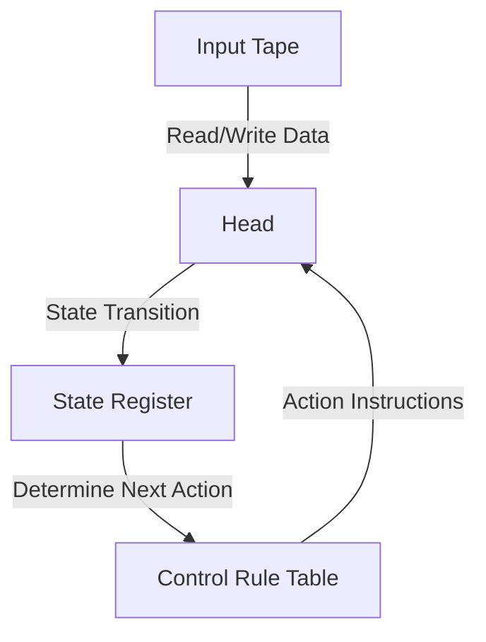
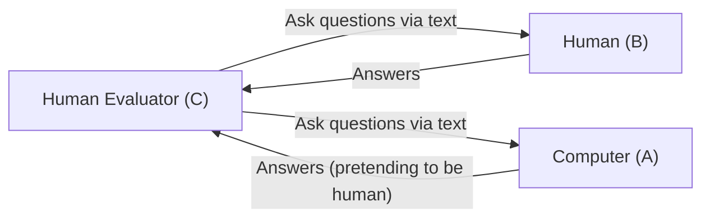

# Alan Turing: The Father of AI and His Tragic End

The smartphones, personal computers, and artificial intelligence (AI) that is rapidly developing in recent years, which we use as a matter of course today. The theoretical foundation underlying these was built by an English mathematician. His name was Alan Mathison Turing.

He is called the "father of computer science" and the "father of artificial intelligence", and is also a hero who saved millions of lives through cryptography during World War II. However, his life was by no means smooth, and ended in a cruel way due to social prejudice. In this article, we will unravel his life in extreme detail, from Turing's upbringing to the revolutionary ideas he brought to the world, and to his tragic end.

## 1. Childhood and Formative Years: The Budding of a Unique Talent

Alan Turing was born on June 23, 1912, in Maida Vale, London. Because his father worked as a civil servant in the British Indian Empire (now India), Turing often lived apart from his parents from a young age, forced to live with foster parents and in boarding schools. This lonely environment may have led him to an introspective and deeply original thinking personality.

### Days at Sherborne School

At the age of 13, he entered the prestigious public school Sherborne School. However, British education at the time emphasized classical literature and Latin, and Turing's talent, which showed a strong interest in mathematics and science, was not necessarily evaluated fairly. One teacher even commented, "If he is only to be a Scientific Specialist, he is wasting his time at a Public School."

Still, Turing's intellectual curiosity knew no bounds; he understood Einstein's theory of relativity on his own and questioned Newton's laws of motion, already showing glimpses of his genius.

### Meeting and Parting with Christopher Morcom

During his time at Sherborne School, there was an event that had a decisive impact on Turing's life. It was his encounter with Christopher Morcom, a student one year older. Like Turing, Morcom loved science and mathematics, and the two formed a deep intellectual bond. For Turing, Morcom is said to have been more than just a friend, but also his first love.

However, this happy time was short-lived, and in February 1930, Morcom suddenly passed away from bovine tuberculosis. This deep sense of loss left a huge scar on Turing's heart, and at the same time drove him to the philosophical question of the "boundary between mind and matter." "Does the human spirit or consciousness exist after the body is destroyed?" "Is it possible for a machine to imitate human thought?" These questions later became the driving force behind his research into artificial intelligence.

## 2. Cambridge University and the Birth of the "Turing Machine"

In 1931, Turing entered King's College, Cambridge, and immersed himself in earnest in the study of mathematics and logic. Here, he came into contact with the ideas of top-class scientists such as John von Neumann and Max Born, greatly expanding his academic wings.

Then, in 1936, at the age of 24, he published the monumental paper "On Computable Numbers, with an Application to the Entscheidungsproblem," which shines brightly in the history of science in the 20th century.

### The Concept of the Turing Machine

In this paper, Turing gave a proof of "no" to the "decision problem" (Entscheidungsproblem: can all mathematical propositions be judged true or false by an algorithm?) raised by mathematician David Hilbert. However, the true value of this paper lay in the thought experiment model called the "Turing Machine" that he devised in the process of the proof.

The Turing machine is an extremely simple virtual machine consisting of an infinitely long tape, a head that reads and writes the tape, a register that stores the internal state, and a rule table that determines the operation.

Turing showed that no matter how complex the calculation, it can be broken down into a repetition of this simple operation. Furthermore, he proved the existence of a "Universal Turing Machine" capable of simulating the operation of any Turing machine.

This was the first clear demonstration in the world of the **fundamental principle of modern computers (stored-program computers)**, in which "hardware" (the machine body) and "software" (the program) are separated, and one machine can execute any calculation by swapping programs.

## 3. World War II and Codebreaking at Bletchley Park

When World War II broke out in 1939, Turing was drafted to Bletchley Park, the base of the Government Code and Cypher School (GC&CS). His mission was to decipher "Enigma," the strongest cipher machine boasted by Nazi Germany.

### The Threat of the Enigma Cipher

Enigma is a machine that combines a typewriter-like keyboard with multiple rotors (rotating disks) with complex wiring. Each time a key is pressed, the rotors rotate, and the rules for converting characters change constantly, so the number of setting combinations was an astronomical number of about 159 quintillion (150 million times 100 million). The German army was overconfident that this cryptographic system was "absolutely unbreakable" and used it extensively for operational instructions of U-boats (submarines) and the like.

### The Development of the Bombe

Building on the foundation laid by Polish codebreakers, Turing designed a giant calculator called the "Bombe" to mechanically decipher the Enigma cipher. The Bombe was a machine that rapidly simulated the rotation of the Enigma's rotors and successfully eliminated contradictory settings one after another to deduce the correct setting (today's key).

Thanks to the tireless efforts of Turing and his team (especially the contributions of Gordon Welchman and others), the Bombe became operational, and German encrypted communications were brought to light one after another.

### The Unsung Hero Who Changed History

The successful deciphering of Enigma brought an enormous strategic advantage to the Allied forces. In particular, being able to grasp the deployment and attack plans of German U-boats in advance in the Battle of the Atlantic directly led to saving many supply convoys.

Historians estimate that without the codebreaking at Bletchley Park, World War II would have dragged on for at least two to four more years, likely resulting in the loss of millions more lives. However, because this mission was top secret, Turing's brilliant achievements remained unknown to the public for decades after the war.

## 4. The Dawn of Artificial Intelligence: "Can Machines Think?"

After the war, Turing was involved in the design of the ACE (Automatic Computing Engine) at the National Physical Laboratory (NPL), and then led the development of early computers at the University of Manchester. He was not satisfied merely with creating a machine that sped up calculations. His interest shifted toward a more advanced and philosophical realm: "Artificial Intelligence" (AI).

In 1950, he published a groundbreaking paper titled "Computing Machinery and Intelligence" in the academic journal *Mind*. The paper begins with the provocative question, "Can machines think?"

### The Turing Test (The Imitation Game)

Instead of defining the subjective concept of "thinking," Turing proposed an objectively evaluable, practical test. This was the "Imitation Game," later to be known as the "Turing Test."

In this test, an evaluator in an isolated room engages in a text-based conversation with both a computer and a human. If the evaluator cannot reliably distinguish which is the human and which is the computer, the computer can be considered to have "intelligence equivalent to a human (is thinking)"; this was a revolutionary approach.

This concept continues to be cited as one of the ultimate goals in modern AI development, and has had an immeasurable impact on the development of natural language processing (NLP) and conversational AI (exactly the kind of system generating the text you are reading now).

## 5. Devotion to Mathematical Biology: Tackling the Mystery of Morphogenesis

Turing's genius was not confined to mathematics and computer science. In his later years, he pioneered an entirely new field called "mathematical biology."

In 1952, he published a paper titled "The Chemical Basis of Morphogenesis." In this, he showed that the complex and beautiful patterns found in the natural world, such as the stripes of a zebra, the spots of a leopard, and the arrangement of leaves (phyllotaxis), can be mathematically explained by the process of reaction and diffusion (reaction-diffusion system) of simple chemicals (morphogens).

Turing's equations addressed the fundamental mystery of developmental biology of how organisms build complex structures from a single cell, and were extremely far-sighted research that became the forerunner of modern systems biology and chaos theory.

## 6. A Genius Killed by His Era: A Tragic End

Tragedy suddenly struck Turing at the height of his academic career.

In January 1952, Turing's home was burglarized. He reported the crime to the police, but during the investigation, it was discovered that he was having a relationship with a same-sex partner, Arnold Murray. In the UK at the time, homosexuality was a crime severely punished by law as "Gross Indecency."

### A Cruel Choice and Chemical Castration

Turing was convicted and forced to choose between imprisonment or hormone therapy designed to reduce libido (effectively chemical castration). In order to continue his research, he chose hormone therapy (administration of estrogen).

This treatment caused profound damage to his mind and body. He developed feminine physical characteristics and became deeply depressed. Also, having become a criminal, he was deemed a security threat, was stripped of his security clearance for government secret projects, and lost his job as a cryptography consultant. The hero who saved the nation had everything taken from him by that very nation.

### The Poisoned Apple and a Death Shrouded in Mystery

On June 8, 1954, Turing was found dead in his bed at home. He was 41 years old.

Beside his bed, a half-eaten apple was left. An autopsy revealed the cause of death to be cyanide poisoning, and the police concluded that he committed suicide by eating an apple injected with cyanide. It was a tragic end that mimicked the fairy tale *Snow White*, which he loved.

(*However, some researchers and biographers have pointed out the possibility that it was an accident during an experiment, and the truth has not been completely uncovered to this day.*)

## 7. Posthumous Rehabilitation and Eternal Legacy

After Turing's death, much of his work was hidden beneath a veil of military secrecy. However, from the 1970s onwards, as the codebreaking activities at Bletchley Park were gradually declassified, the decisive role he played in human history became widely known.

### Apology and Pardon

In 2009, British Prime Minister Gordon Brown officially apologized on behalf of the government for the appalling treatment Turing had received.
"Without his outstanding contribution, the history of World War II could well have been very different... the treatment he received was completely unfair."

And in 2013, Queen Elizabeth II granted Turing a posthumous Royal Pardon. In 2017, the so-called "Turing Law" came into effect, restoring the honor of tens of thousands of men who had been convicted of homosexual crimes in the past.

### The Turing Award and the £50 Note

Today, the highest award in the field of computer science (the Nobel Prize of computing) is named the "Turing Award" in his honor.
Also, in 2021, the Bank of England adopted Turing's portrait for the new £50 note. Engraved on it is his famous quote:

> "This is only a foretaste of what is to come, and only the shadow of what is going to be."

### A Legacy Continuing to the Present

Alan Turing's life met a short and overly unreasonable end at 41 years. However, the seeds he planted have grown into the vast forest of modern digital society.

Every time we send a message on a smartphone, throw a question at an AI, and instantly execute a complex calculation, the soul of a single genius named Alan Turing breathes there. His life continues to show us an eternal lesson for humanity: the infinite possibilities of intellect, and the tragedy brought about by social prejudice.
