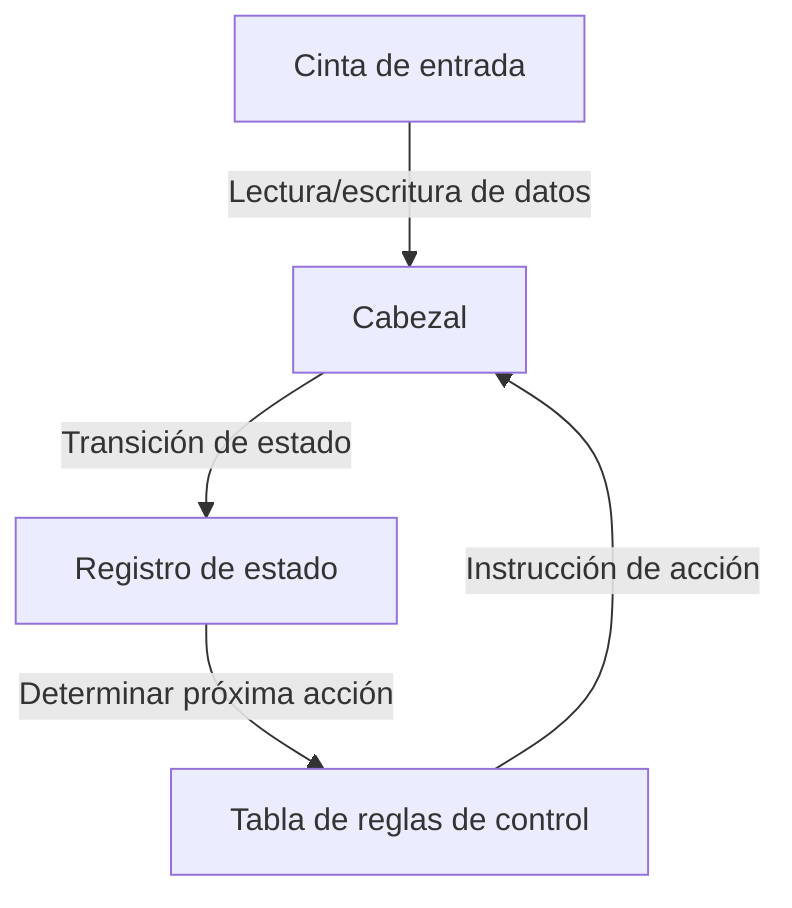
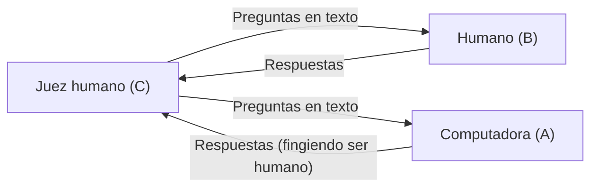

# Alan Turing: El padre de la IA y su trágico final

Los teléfonos inteligentes, las computadoras personales y la inteligencia artificial (IA), que se ha desarrollado rápidamente en los últimos años, son herramientas que utilizamos hoy en día como algo cotidiano. Las bases teóricas subyacentes a todos ellos fueron construidas por un solo matemático británico. Su nombre era Alan Mathison Turing.

Es conocido como el "padre de la informática" y el "padre de la inteligencia artificial", y también es el héroe que salvó a millones de personas durante la Segunda Guerra Mundial descifrando códigos. Sin embargo, su vida no fue nada fácil y terminó cruelmente debido a los prejuicios sociales. En este artículo, desentrañaremos con gran detalle la vida de Turing, desde su infancia hasta las ideas revolucionarias que aportó al mundo y su trágico final.

## 1. Infancia y años de formación: Los inicios de un talento excepcional

Alan Turing nació el 23 de junio de 1912 en Maida Vale, Londres. Como su padre trabajaba como funcionario público en el Imperio Indio Británico (la actual India), Turing vivió a menudo separado de sus padres desde una edad temprana, viéndose obligado a vivir con familias de acogida y en internados. Este entorno solitario puede haberlo llevado a desarrollar una personalidad introspectiva y un pensamiento independiente y profundo.

### Días en la Escuela Sherborne

A la edad de 13 años, ingresó a la prestigiosa escuela pública Sherborne. Sin embargo, la educación británica en ese momento se centraba en gran medida en la literatura clásica y el latín, y el talento de Turing, quien mostraba un gran interés en las matemáticas y la ciencia, no siempre fue debidamente apreciado. Un maestro llegó a comentar que "si sólo tiene la intención de convertirse en un especialista científico, está perdiendo su tiempo en esta escuela".

Aun así, la curiosidad intelectual de Turing no tenía límites; comprendió la teoría de la relatividad de Einstein de forma autodidacta y cuestionó las leyes del movimiento de Newton, mostrando ya destellos de su genialidad.

### Encuentro y despedida con Christopher Morcom

Durante su tiempo en Sherborne, ocurrió un evento que tuvo un impacto decisivo en la vida de Turing. Fue su encuentro con Christopher Morcom, un estudiante un año mayor que él. Al igual que Turing, Morcom amaba la ciencia y las matemáticas, y los dos formaron un profundo vínculo intelectual. Para Turing, Morcom era más que un simple amigo; se dice que fue su primer amor.

Sin embargo, este tiempo de felicidad fue breve; en febrero de 1930, Morcom falleció repentinamente debido a tuberculosis bovina. Este profundo sentido de pérdida dejó una gran cicatriz en el corazón de Turing y, al mismo tiempo, lo impulsó hacia preguntas filosóficas sobre el "límite entre la mente y la materia". "¿Sigue existiendo el espíritu o la conciencia humana incluso después de que el cuerpo perece?" "¿Es posible que las máquinas imiten el pensamiento humano?". Estas preguntas se convirtieron en la fuerza impulsora que más tarde lo llevaría a investigar sobre la inteligencia artificial.

## 2. La Universidad de Cambridge y el nacimiento de la "Máquina de Turing"

En 1931, Turing ingresó al King's College de la Universidad de Cambridge y se sumergió seriamente en el estudio de las matemáticas y la lógica. Allí, entró en contacto con las ideas de científicos de primer nivel como [John von Neumann](/es/p/von-neumann/) y Max Born, expandiendo enormemente sus horizontes académicos.

Y en 1936, a la edad de 24 años, publicó un artículo monumental que brilla en la historia de la ciencia del siglo XX: "Sobre los números computables, con una aplicación al Entscheidungsproblem" (On Computable Numbers, with an Application to the Entscheidungsproblem).

### El concepto de la máquina de Turing

En este artículo, Turing dio una prueba negativa al "Entscheidungsproblem" (problema de decisión: ¿se puede determinar la verdad o falsedad de todas las proposiciones matemáticas mediante un algoritmo?) planteado por el matemático [David Hilbert](/es/p/hilbert/). Sin embargo, el verdadero valor de este artículo residía en el modelo de experimento mental que ideó en el proceso de esa prueba: la "Máquina de Turing" (Turing Machine).

Una máquina de Turing es una máquina virtual extremadamente simple que consta de una cinta infinitamente larga, un cabezal para leer y escribir en la cinta, un registro para recordar su estado interno y una tabla de reglas que determina sus acciones.

Turing demostró que no importa cuán complejo sea un cálculo, puede dividirse en la repetición de estas operaciones simples. Además, demostró la existencia de una "Máquina de Turing Universal" (Universal Turing Machine) capaz de imitar las acciones de cualquier máquina de Turing.

Esto separó el "hardware" (la máquina física en sí) y el "software" (los programas), demostrando por primera vez en el mundo el **principio fundamental de las computadoras modernas (computadoras de programa almacenado)**: al cambiar el programa, una sola máquina puede ejecutar cualquier cálculo.

## 3. La Segunda Guerra Mundial y el descifrado de códigos en Bletchley Park

Con el estallido de la Segunda Guerra Mundial en 1939, Turing fue llamado a Bletchley Park, la sede de la Escuela Gubernamental de Códigos y Cifras (GC&CS). Su misión era descifrar "Enigma", la máquina de cifrado más fuerte de la que se jactaba la Alemania nazi.

### La amenaza del código Enigma

Enigma era una máquina que combinaba un teclado similar al de una máquina de escribir con múltiples rotores (discos giratorios) con cableado complejo. Cada vez que se presionaba una tecla, los rotores giraban y las reglas para convertir letras cambiaban constantemente. Las posibles combinaciones de configuraciones ascendían a un número astronómico de unos 159 quintillones (159,000,000,000,000,000,000). El ejército alemán confiaba ciegamente en que este sistema de cifrado era "absolutamente indescifrable" y lo usaba ampliamente para instrucciones operativas para los submarinos (U-boats).

### El desarrollo de Bombe

Sobre la base establecida por los descifradores de códigos polacos, Turing diseñó "Bombe", una enorme máquina computadora para descifrar mecánicamente los códigos de Enigma. Bombe simulaba la rotación de los rotores de Enigma a alta velocidad y eliminaba sucesivamente configuraciones contradictorias para derivar la configuración correcta (la clave del día).

A través de los incansables esfuerzos de Turing y su equipo (en particular, la contribución de Gordon Welchman fue significativa), Bombe comenzó a funcionar y las comunicaciones cifradas del ejército alemán quedaron al descubierto una tras otra.

### El héroe en las sombras que cambió la historia

El éxito en el descifrado de Enigma dio a las fuerzas aliadas una enorme ventaja estratégica. En particular, en la Batalla del Atlántico, poder conocer de antemano el despliegue de los submarinos alemanes y los planes de ataque se tradujo directamente en la salvación de muchos convoyes de suministros.

Los historiadores estiman que sin el descifrado de códigos en Bletchley Park, la Segunda Guerra Mundial se habría prolongado de 2 a 4 años más, y es muy probable que se hubieran perdido millones de vidas adicionales. Sin embargo, dado que esta misión era de máximo secreto, los brillantes logros de Turing permanecieron ocultos al público durante décadas después de la guerra.

## 4. El amanecer de la inteligencia artificial: "¿Pueden pensar las máquinas?"

Después de la guerra, Turing participó en el diseño del ACE (Automatic Computing Engine) en el Laboratorio Nacional de Física (NPL), y posteriormente lideró el desarrollo de las primeras computadoras en la Universidad de Manchester. No estaba satisfecho simplemente con construir máquinas para acelerar los cálculos. Su interés se dirigió hacia áreas más avanzadas y filosóficas, a saber, la "Inteligencia Artificial" (Artificial Intelligence).

En 1950, publicó un artículo innovador en la revista académica "Mind" titulado "Maquinaria de computación e inteligencia" (Computing Machinery and Intelligence). Este artículo comienza con la pregunta provocativa: "¿Pueden pensar las máquinas?".

### El test de Turing (El juego de la imitación)

En lugar de definir el concepto subjetivo de "pensar", Turing propuso una prueba práctica y objetivamente evaluable. Esto es lo que más tarde se llamaría el "Test de Turing" o el "juego de la imitación".

En esta prueba, un juez en una habitación aislada conversa a través de texto tanto con una computadora como con un humano. Si el juez no puede identificar con certeza cuál es el humano y cuál es la computadora, se puede considerar que esa computadora "posee una inteligencia equivalente a la humana (está pensando)". Fue un enfoque revolucionario.

Este concepto todavía se cita hoy en día como uno de los objetivos finales en el desarrollo moderno de IA, y ha tenido un impacto incalculable en el desarrollo del procesamiento del lenguaje natural (PLN) y la IA conversacional (precisamente el tipo de sistema que genera el texto que estás leyendo ahora).

## 5. Inclinación hacia la biología matemática: Abordando el misterio de la morfogénesis

La genialidad de Turing no se limitó al ámbito de las matemáticas y la informática. En sus últimos años, fue pionero en un campo completamente nuevo: la "biología matemática".

En 1952, publicó el artículo "La base química de la morfogénesis" (The Chemical Basis of Morphogenesis). En él, demostró que los patrones complejos y hermosos que se encuentran en el mundo natural, como las rayas de las cebras, las manchas de los leopardos y la disposición de las hojas (filotaxia), podían explicarse matemáticamente mediante procesos de reacción y difusión (sistemas de reacción-difusión) de sustancias químicas simples (morfógenos).

Las ecuaciones de Turing se acercaron al misterio fundamental de la biología del desarrollo sobre cómo los organismos construyen estructuras complejas a partir de una sola célula, y fueron una investigación sumamente visionaria que se convirtió en precursora de la actual biología de sistemas y la teoría del caos.

## 6. Un genio asesinado por su época: Un final trágico

En la cúspide de su brillantez académica, la tragedia golpeó repentinamente a Turing.

En enero de 1952, hubo un robo en la casa de Turing. Denunció el robo a la policía, pero en el curso de la investigación se descubrió que tenía una relación con su pareja masculina, Arnold Murray. En la Gran Bretaña de aquella época, la homosexualidad era un delito duramente castigado por la ley como "indecencia grave" (Gross Indecency).

### Elección cruel y castración química

Turing fue condenado y obligado a elegir entre el encarcelamiento o un tratamiento hormonal (efectivamente una castración química) para reducir la libido. Con el fin de poder continuar con su investigación, optó por el tratamiento hormonal (inyecciones de estrógeno).

Este tratamiento causó graves daños a su mente y cuerpo. Comenzaron a aparecer rasgos femeninos en su cuerpo y cayó en una profunda depresión. Además, al convertirse en un criminal, fue considerado una amenaza para la seguridad, se le revocó su autorización de seguridad para proyectos gubernamentales clasificados y también perdió su trabajo como consultor criptográfico. El héroe que salvó a la nación fue despojado de todo por esa misma nación.

### La manzana envenenada y una muerte envuelta en misterio

El 8 de junio de 1954, Turing fue encontrado muerto en su cama en su casa. Tenía 41 años.

Al lado de su cama quedaba una manzana a medio morder. La autopsia determinó que la causa de la muerte fue envenenamiento por cianuro (cianuro de potasio), y la policía concluyó que se había suicidado comiendo una manzana inyectada con cianuro. Fue un final trágico que imitaba su cuento de hadas favorito, "Blancanieves".

(*Sin embargo, algunos investigadores y biógrafos han señalado la posibilidad de que fuera un accidente durante un experimento, y la verdad aún hoy no se ha aclarado del todo.*)

## 7. Rehabilitación póstuma y legado eterno

Tras la muerte de Turing, muchos de sus logros permanecieron ocultos bajo el velo del secreto militar. Sin embargo, a partir de la década de 1970, a medida que las actividades de descifrado de códigos en Bletchley Park se fueron haciendo públicas gradualmente, el papel decisivo que desempeñó en la historia humana se hizo conocido en todo el mundo.

### Disculpas y perdón

En 2009, el entonces primer ministro británico Gordon Brown se disculpó oficialmente en nombre del gobierno por el trato injusto que recibió Turing.
"Sin su destacada contribución, la historia de la Segunda Guerra Mundial habría sido muy diferente. El trato que recibió fue totalmente injusto".

Y en 2013, la reina Isabel II le concedió a Turing el perdón real póstumo (Royal Pardon). En 2017, entró en vigor la llamada "Ley de Turing", que rehabilitó también el honor de decenas de miles de hombres que habían sido condenados por delitos homosexuales en el pasado.

### El Premio Turing y el billete de 50 libras

Hoy en día, el máximo galardón en el campo de la informática (el Premio Nobel de la informática) lleva su nombre y se denomina "Premio Turing" (Turing Award).
Además, en 2021, el retrato de Turing fue elegido para el nuevo billete de 50 libras emitido por el Banco de Inglaterra. En él están grabadas sus famosas palabras:

> "Esto es solo un anticipo de lo que está por venir, y solo la sombra de lo que será".
> ("This is only a foretaste of what is to come, and only the shadow of what is going to be.")

### Un legado que continúa hasta el día de hoy

La vida de Alan Turing llegó a su fin después de sólo 41 años de forma corta y demasiado irracional. Sin embargo, las semillas que plantó se han convertido en el enorme bosque de la sociedad digital moderna.

Cada vez que enviamos un mensaje en nuestro teléfono inteligente, le hacemos una pregunta a una IA o realizamos cálculos complejos al instante, el alma de un genio llamado Alan Turing vive allí. Su vida sigue mostrándonos una lección eterna para la humanidad: las posibilidades ilimitadas del intelecto humano y las tragedias provocadas por los prejuicios sociales.
