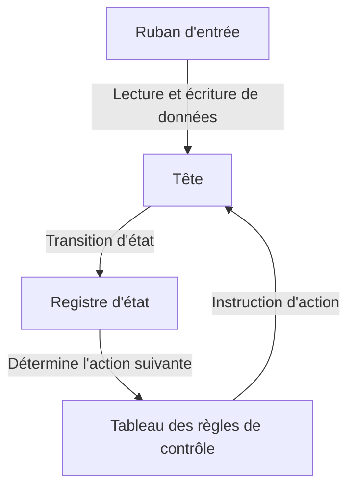
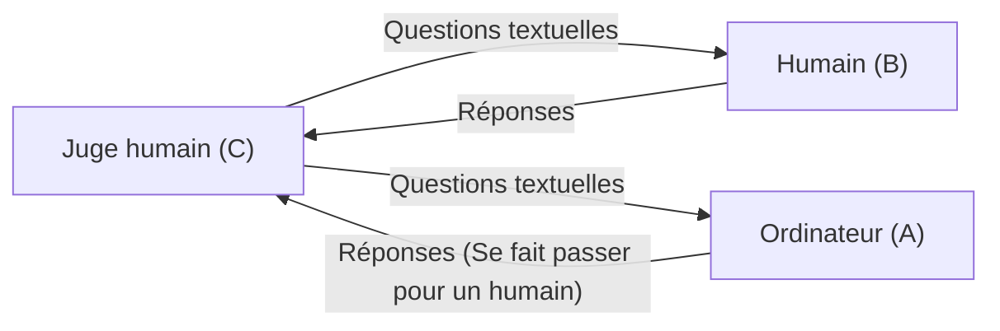

# Alan Turing : le père de l'IA et sa fin tragique

Les smartphones, les ordinateurs personnels, et l'intelligence artificielle (IA) en développement rapide ces dernières années que nous utilisons aujourd'hui comme une évidence. Le fondement théorique à la base de toutes ces technologies a été construit par un seul mathématicien britannique. Son nom est Alan Mathison Turing.

Il est appelé « le père de l'informatique » et « le père de l'intelligence artificielle », et il est aussi un héros qui a sauvé des millions de vies pendant la Seconde Guerre mondiale grâce au décryptage. Cependant, sa vie n'a pas du tout été un long fleuve tranquille, et s'est tragiquement terminée en raison des préjugés de la société. Dans cet article, nous explorerons sa vie en détail extrême, de son enfance à ses idées révolutionnaires qu'il a apportées au monde, jusqu'à sa fin tragique.

## 1. Enfance et années de formation : l'émergence d'un talent singulier

Alan Turing est né le 23 juin 1912 à Maida Vale, Londres. Parce que son père travaillait comme fonctionnaire dans l'Empire des Indes (aujourd'hui l'Inde), Turing a souvent vécu loin de ses parents depuis son plus jeune âge, forcé de vivre avec des familles d'accueil ou en internat. Cet environnement solitaire l'a peut-être conduit à développer une personnalité introspective et une pensée indépendante.

### Les jours à la Sherborne School

À l'âge de 13 ans, il entre à la Sherborne School, une prestigieuse public school. Cependant, l'éducation britannique de l'époque mettait l'accent sur la littérature classique et le latin, et le talent de Turing, qui montrait un fort intérêt pour les mathématiques et les sciences, n'était pas toujours évalué à sa juste valeur. Un enseignant a même fait remarquer : « S'il a seulement l'intention de devenir un spécialiste des sciences, il perd son temps dans cette école. »

Néanmoins, la curiosité intellectuelle de Turing était sans limite. Il a compris par lui-même la théorie de la relativité d'Einstein et a remis en question les lois du mouvement de Newton, montrant déjà des signes de son génie.

### La rencontre et la séparation avec Christopher Morcom

Pendant ses années à la Sherborne School, un événement a eu un impact décisif sur la vie de Turing. Ce fut sa rencontre avec Christopher Morcom, un élève d'un an son aîné. Morcom aimait les sciences et les mathématiques autant que Turing, et les deux ont formé un profond lien intellectuel. Pour Turing, Morcom était plus qu'un simple ami, on dit qu'il fut aussi son premier amour.

Cependant, ce temps de bonheur fut de courte durée. En février 1930, Morcom est soudainement décédé de la tuberculose bovine. Ce profond sentiment de perte a laissé une grande cicatrice dans le cœur de Turing et l'a en même temps poussé vers la question philosophique de « la frontière entre l'esprit et la matière ». « L'esprit ou la conscience humaine existe-t-il encore après la mort du corps physique ? » « Est-il possible qu'une machine imite la pensée humaine ? » Ces questions sont devenues le moteur de ses futures recherches sur l'intelligence artificielle.

## 2. L'Université de Cambridge et la naissance de la « machine de Turing »

En 1931, Turing est entré au King's College de l'Université de Cambridge et s'est plongé sérieusement dans la recherche en mathématiques et en logique. C'est là qu'il a été exposé aux idées de scientifiques de premier plan tels que John von Neumann et Max Born, élargissant grandement ses horizons académiques.

Et en 1936, à l'âge de 24 ans, il a publié l'article monumental « Sur les nombres calculables, avec une application au problème de la décision (On Computable Numbers, with an Application to the Entscheidungsproblem) », qui brille brillamment dans l'histoire des sciences du 20e siècle.

### Le concept de la machine de Turing

Dans cet article, Turing a donné une preuve « négative » au « problème de la décision (Entscheidungsproblem : toute proposition mathématique peut-elle être jugée vraie ou fausse par un algorithme ?) » soulevé par le mathématicien David Hilbert. Cependant, la véritable valeur de cet article résidait dans le modèle d'expérience de pensée de la « machine de Turing (Turing Machine) » qu'il a conçu au cours du processus de preuve.

La machine de Turing est une machine virtuelle extrêmement simple composée d'un ruban de longueur infinie, d'une tête qui lit et écrit sur le ruban, d'un registre qui mémorise l'état interne et d'un tableau de règles qui détermine les actions.

Turing a montré que peu importe la complexité d'un calcul, il peut être décomposé en une répétition de cette opération simple. En outre, il a prouvé l'existence d'une « machine de Turing universelle (Universal Turing Machine) » qui peut imiter le comportement de toute machine de Turing.

C'était la première fois au monde que le **principe fondamental des ordinateurs modernes (ordinateurs à programme enregistré)** était clairement démontré : en séparant le « matériel (corps de la machine) » et le « logiciel (programme) » et en remplaçant le programme, une seule machine peut exécuter n'importe quel calcul.

## 3. La Seconde Guerre mondiale et le décryptage à Bletchley Park

Lorsque la Seconde Guerre mondiale a éclaté en 1939, Turing a été convoqué à Bletchley Park, le siège de l'école des codes et des chiffres du gouvernement britannique (GC&CS). Sa mission était de décrypter la machine de chiffrement la plus puissante de l'Allemagne nazie, « Enigma ».

### La menace du code Enigma

Enigma est une machine combinant un clavier semblable à une machine à écrire et plusieurs rotors (disques rotatifs) avec un câblage complexe. Chaque fois qu'une touche est pressée, le rotor tourne et la règle de conversion des caractères change constamment. Les combinaisons de ses paramètres atteignaient le nombre astronomique d'environ 159 milliards de milliards. L'armée allemande croyait à tort que ce système de cryptage était « absolument indéchiffrable » et l'utilisait intensivement pour les instructions opérationnelles des sous-marins (U-boote).

### Le développement de la Bombe

Sur les bases jetées par les cryptanalystes polonais, Turing a conçu un énorme ordinateur, la « Bombe », pour décrypter mécaniquement les codes Enigma. La Bombe était une machine qui simulait la rotation des rotors d'Enigma à grande vitesse et éliminait les réglages contradictoires les uns après les autres pour dériver le bon réglage (la clé du jour).

Grâce aux efforts incessants de Turing et de son équipe (notamment l'énorme contribution de Gordon Welchman), la Bombe a commencé à fonctionner et les communications cryptées de l'armée allemande ont été exposées au grand jour les unes après les autres.

### Le héros de l'ombre qui a changé l'histoire

Le succès du décryptage d'Enigma a apporté un avantage stratégique énorme aux forces alliées. En particulier, pouvoir saisir à l'avance les positions et les plans d'attaque des U-boote allemands lors de la bataille de l'Atlantique a directement permis de sauver de nombreux convois de ravitaillement.

Les historiens supposent que sans le décryptage à Bletchley Park, la Seconde Guerre mondiale aurait duré au moins 2 à 4 ans de plus et qu'il est très probable que des millions de vies supplémentaires auraient été perdues. Cependant, cette mission étant top secrète, les brillantes réalisations de Turing sont restées inconnues du public pendant des décennies après la guerre.

## 4. L'aube de l'intelligence artificielle : « Les machines peuvent-elles penser ? »

Après la guerre, Turing a travaillé sur la conception de l'ACE (Automatic Computing Engine) au National Physical Laboratory (NPL) et a ensuite dirigé le développement des premiers ordinateurs à l'Université de Manchester. Il ne se contentait pas de construire des machines accélérant les calculs. Son intérêt s'est tourné vers un domaine plus avancé et philosophique : « l'intelligence artificielle (Artificial Intelligence) ».

En 1950, il a publié un article révolutionnaire intitulé « Machinerie informatique et intelligence (Computing Machinery and Intelligence) » dans la revue académique *Mind*. Cet article commence par la question provocatrice : « Les machines peuvent-elles penser ? ».

### Le test de Turing (Le jeu de l'imitation)

Plutôt que de définir le concept subjectif de « penser », Turing a proposé un test pratique qui pouvait être évalué de manière objective. C'est ce qu'on appellera plus tard le « test de Turing », ou le « jeu de l'imitation ».

Dans ce test, un juge dans une pièce isolée converse par texte avec à la fois un ordinateur et un humain. Si le juge ne peut pas identifier avec certitude qui est l'humain et qui est l'ordinateur, cette approche révolutionnaire affirmait que l'ordinateur pouvait être considéré comme « ayant une intelligence (pensant) équivalente à celle d'un humain ».

Ce concept est toujours cité aujourd'hui comme l'un des objectifs ultimes du développement de l'IA et a eu une influence incommensurable sur le développement du traitement du langage naturel (NLP) et de l'IA conversationnelle (des systèmes exactement comme celui qui génère le texte que vous lisez en ce moment).

## 5. Dévouement à la biologie mathématique : Défier le mystère de la morphogenèse

Le génie de Turing ne se limitait pas aux mathématiques et à l'informatique. Dans ses dernières années, il a été le pionnier d'un domaine entièrement nouveau appelé « biologie mathématique ».

En 1952, il publie un article intitulé « Les bases chimiques de la morphogenèse (The Chemical Basis of Morphogenesis) ». Dans celui-ci, il a montré que les modèles complexes et magnifiques trouvés dans la nature, tels que les rayures du zèbre, les taches du léopard et la disposition des feuilles (phyllotaxie), pouvaient être mathématiquement expliqués par le processus de réaction et de diffusion (système de réaction-diffusion) de produits chimiques simples (morphogènes).

Les équations de Turing ont abordé le mystère fondamental de la biologie du développement, à savoir comment les organismes construisent des structures complexes à partir d'une seule cellule. C'était une recherche extrêmement clairvoyante qui a ouvert la voie à la biologie des systèmes moderne et à la théorie du chaos.

## 6. Un génie tué par son époque : Une fin tragique

À l'apogée de sa carrière universitaire, une tragédie frappe soudainement Turing.

En janvier 1952, un cambriolage a eu lieu au domicile de Turing. Il l'a signalé à la police, mais au cours de l'enquête, on a découvert qu'il entretenait une relation avec un amant de même sexe, Arnold Murray. En Grande-Bretagne à l'époque, l'homosexualité était un crime sévèrement puni par la loi comme « outrage aux bonnes mœurs (Gross Indecency) ».

### Un choix cruel et la castration chimique

Turing a été reconnu coupable et forcé de choisir entre l'emprisonnement et un traitement hormonal (une castration chimique effective) pour réduire la libido. Pour continuer ses recherches, il a choisi le traitement hormonal (administration d'œstrogènes).

Ce traitement a causé de graves dommages à son esprit et à son corps. Des traits physiques féminins sont apparus, et il est devenu profondément déprimé. De plus, parce qu'il est devenu un criminel, il a été considéré comme une menace pour la sécurité, dépouillé de son habilitation de sécurité pour accéder aux projets secrets du gouvernement, et a perdu son emploi en tant que consultant en cryptographie. Le héros qui avait sauvé la nation s'est tout fait enlever par cette même nation.

### La pomme empoisonnée et une mort enveloppée de mystère

Le 8 juin 1954, Turing a été retrouvé mort dans son lit chez lui. Il avait 41 ans.

Une pomme à moitié mangée a été laissée à côté de son lit. L'autopsie a révélé que la cause du décès était un empoisonnement au cyanure (cyanure de potassium), et la police a conclu qu'il s'était suicidé en mangeant une pomme injectée de cyanure. C'était une fin tragique imitant son conte de fées bien-aimé, « Blanche-Neige ».

(*Cependant, certains chercheurs et biographes ont souligné la possibilité qu'il s'agissait d'un accident lors d'une expérience, et la vérité n'a toujours pas été complètement élucidée à ce jour.*)

## 7. Réhabilitation posthume et héritage éternel

Après la mort de Turing, une grande partie de ses travaux a été cachée sous le voile du secret militaire. Cependant, à partir des années 1970, lorsque les activités de décryptage à Bletchley Park ont été progressivement rendues publiques, le rôle décisif qu'il a joué dans l'histoire de l'humanité est devenu connu du monde entier.

### Excuses et grâce

En 2009, le Premier ministre britannique de l'époque, Gordon Brown, a présenté des excuses officielles au nom du gouvernement pour le traitement injuste infligé à Turing.
« Sans sa contribution exceptionnelle, l'histoire de la Seconde Guerre mondiale aurait pu être très différente. Le traitement qu'il a reçu était complètement injuste. »

Et en 2013, la reine Elizabeth II a accordé à Turing une grâce posthume (Royal Pardon). En 2017, la soi-disant « loi de Turing » est entrée en vigueur, rétablissant l'honneur de dizaines de milliers d'hommes qui avaient été condamnés pour homosexualité dans le passé.

### Le prix Turing et le billet de 50 £

Aujourd'hui, le prix le plus prestigieux dans le domaine de l'informatique (le prix Nobel de l'informatique) porte son nom et s'appelle le « prix Turing (Turing Award) ».
Aussi, en 2021, la Banque d'Angleterre a adopté le portrait de Turing sur le nouveau billet de 50 livres. Ses mots célèbres y sont gravés.

> « Ce n'est qu'un avant-goût de ce qui est à venir, et seulement l'ombre de ce qui va être. »
> ("This is only a foretaste of what is to come, and only the shadow of what is going to be.")

### Un héritage qui perdure aujourd'hui

La vie d'Alan Turing a pris fin si brièvement et de manière si déraisonnable à 41 ans. Cependant, les graines qu'il a semées ont grandi pour devenir l'immense forêt qu'est notre société numérique moderne.

Chaque fois que nous envoyons un message sur un smartphone, posons une question à une IA ou exécutons instantanément des calculs complexes, l'âme d'Alan Turing, un génie, vit là. Sa vie continue de nous montrer une leçon éternelle pour l'humanité : le potentiel infini de l'intellect et la tragédie causée par les préjugés de la société.
