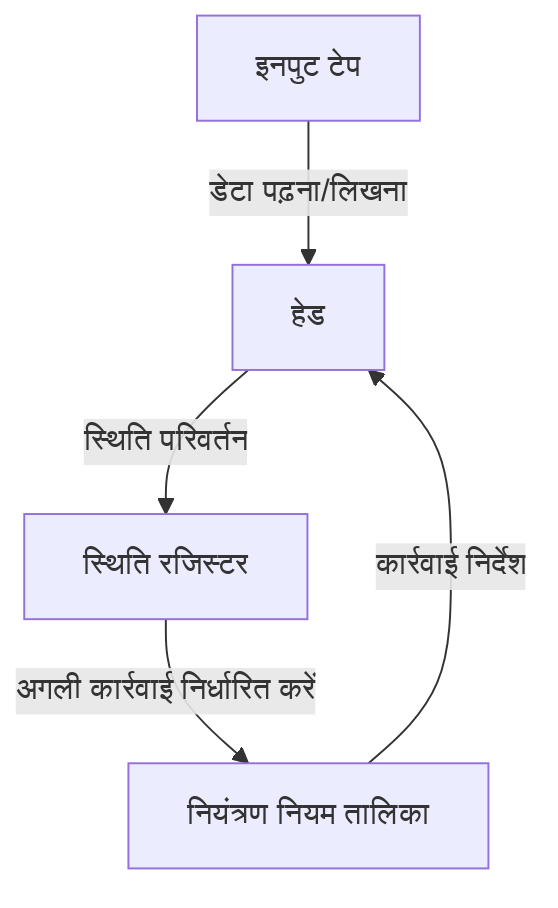
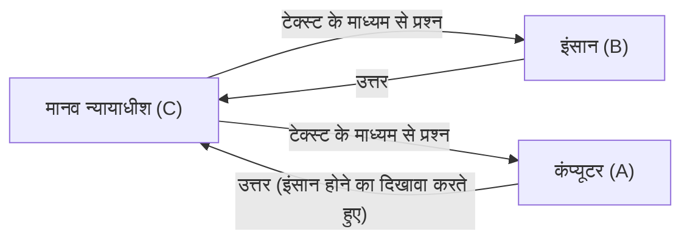

# एलन ट्यूरिंग: एआई के पिता और एक दुखद अंत

स्मार्टफोन, पर्सनल कंप्यूटर, और कृत्रिम बुद्धिमत्ता (AI) जो हाल के वर्षों में तेजी से विकसित हुई है - इन सभी का हम आज स्वाभाविक रूप से उपयोग करते हैं। इन तकनीकों के मूल में सैद्धांतिक आधार एक ब्रिटिश गणितज्ञ द्वारा बनाया गया था। उनका नाम एलन मैथिसन ट्यूरिंग (Alan Mathison Turing) था।

उन्हें "कंप्यूटर विज्ञान का पिता" और "कृत्रिम बुद्धिमत्ता का पिता" कहा जाता है, और वह एक नायक भी हैं जिन्होंने द्वितीय विश्व युद्ध के दौरान कोड तोड़ने के माध्यम से लाखों लोगों की जान बचाई। हालाँकि, उनका जीवन कभी आसान नहीं था, और समाज के पूर्वाग्रहों के कारण इसका क्रूर अंत हुआ। इस लेख में, हम ट्यूरिंग के जीवन को बहुत विस्तार से देखेंगे, उनके बचपन से लेकर उनके द्वारा दुनिया में लाए गए क्रांतिकारी विचारों और अंततः उनके दुखद अंत तक।

## 1. बचपन और प्रारंभिक वर्ष: एक असाधारण प्रतिभा का उदय

एलन ट्यूरिंग का जन्म 23 जून, 1912 को लंदन के मैदा वेले (Maida Vale) में हुआ था। क्योंकि उनके पिता ब्रिटिश भारत (वर्तमान भारत) में एक सिविल सेवक के रूप में काम करते थे, ट्यूरिंग ने अपने बचपन का अधिकांश समय अपने माता-पिता से दूर बिताया, उन्हें पालक घरों और बोर्डिंग स्कूलों में रहने के लिए मजबूर होना पड़ा। इस अकेलेपन के माहौल ने उन्हें एक आत्मनिरीक्षण और गहरी सोच वाले व्यक्तित्व की ओर अग्रसर किया होगा।

### शेरबोर्न स्कूल में दिन

13 साल की उम्र में, उन्होंने एक प्रतिष्ठित पब्लिक स्कूल, शेरबोर्न स्कूल (Sherborne School) में दाखिला लिया। हालाँकि, उस समय ब्रिटिश शिक्षा मुख्य रूप से शास्त्रीय साहित्य और लैटिन पर केंद्रित थी, और गणित और विज्ञान में ट्यूरिंग की प्रतिभा की हमेशा सही सराहना नहीं की गई। एक शिक्षक ने यहां तक कहा, "अगर वह केवल एक वैज्ञानिक विशेषज्ञ बनना चाहता है, तो इस स्कूल में रहना समय की बर्बादी है।"

फिर भी, ट्यूरिंग की बौद्धिक जिज्ञासा की कोई सीमा नहीं थी। उन्होंने अपने दम पर आइंस्टीन के सापेक्षता के सिद्धांत को समझा और न्यूटन के गति के नियमों पर सवाल उठाया, जो पहले से ही उनकी प्रतिभा की झलक दिखा रहा था।

### क्रिस्टोफर मोरकॉम से मिलना और बिछड़ना

शेरबोर्न स्कूल में ट्यूरिंग के जीवन पर निर्णायक प्रभाव डालने वाली एक घटना हुई। वह एक साल बड़े छात्र क्रिस्टोफर मोरकॉम (Christopher Morcom) से मिले। मोरकॉम भी ट्यूरिंग की तरह विज्ञान और गणित से प्यार करते थे, और दोनों एक गहरे बौद्धिक बंधन में बंध गए। ट्यूरिंग के लिए, मोरकॉम सिर्फ एक दोस्त से कहीं बढ़कर थे; उन्हें ट्यूरिंग का पहला प्यार कहा जाता है।

हालाँकि, यह खुशी का समय बहुत छोटा था। फरवरी 1930 में, मोरकॉम की अचानक गोजातीय तपेदिक (bovine tuberculosis) से मृत्यु हो गई। नुकसान की इस गहरी भावना ने ट्यूरिंग के दिल पर एक बड़ा घाव छोड़ दिया, साथ ही उन्हें "मन और पदार्थ के बीच की सीमा" के दार्शनिक प्रश्न की ओर भी प्रेरित किया। "क्या शरीर के नष्ट होने के बाद भी मानव मन और चेतना का अस्तित्व रहता है?" "क्या किसी मशीन के लिए मानवीय सोच की नकल करना संभव है?" ये प्रश्न बाद में कृत्रिम बुद्धिमत्ता (AI) में उनके शोध के पीछे प्रेरक शक्ति बन गए।

## 2. कैम्ब्रिज विश्वविद्यालय और "ट्यूरिंग मशीन" का जन्म

1931 में, ट्यूरिंग ने कैम्ब्रिज विश्वविद्यालय के किंग्स कॉलेज में प्रवेश लिया और खुद को गणित और तर्कशास्त्र के अध्ययन में पूरी तरह से समर्पित कर दिया। यहाँ, वह जॉन वॉन न्यूमैन (John von Neumann) और मैक्स बोर्न (Max Born) जैसे प्रथम श्रेणी के वैज्ञानिकों के विचारों के संपर्क में आए, जिससे उनके अकादमिक पंख काफी फैल गए।

और 1936 में, 24 वर्ष की आयु में, उन्होंने 20वीं सदी के विज्ञान के इतिहास में एक महत्वपूर्ण पेपर प्रकाशित किया: "ऑन कम्प्यूटेबल नंबर्स, विद एन एप्लिकेशन टू द एन्टशेडुंग्सप्रॉब्लम" (On Computable Numbers, with an Application to the Entscheidungsproblem)।

### ट्यूरिंग मशीन की अवधारणा

इस पेपर में, ट्यूरिंग ने गणितज्ञ डेविड हिल्बर्ट द्वारा उठाए गए "एन्टशेडुंग्सप्रॉब्लम" (निर्णय समस्या: क्या सभी गणितीय प्रस्तावों को एक एल्गोरिथ्म द्वारा सही या गलत के रूप में निर्धारित किया जा सकता है?) का "नहीं" के रूप में प्रमाण प्रदान किया। हालाँकि, इस पेपर का वास्तविक मूल्य "ट्यूरिंग मशीन" (Turing Machine) नामक विचार प्रयोग मॉडल में निहित था, जिसे उन्होंने प्रमाण की प्रक्रिया में तैयार किया था।

ट्यूरिंग मशीन एक अत्यंत सरल आभासी मशीन है जिसमें एक असीम रूप से लंबा टेप, टेप को पढ़ने और लिखने के लिए एक हेड, आंतरिक स्थिति को याद रखने के लिए एक रजिस्टर और संचालन निर्धारित करने के लिए एक नियम तालिका होती है।

ट्यूरिंग ने दिखाया कि कोई भी गणना, चाहे वह कितनी भी जटिल क्यों न हो, इन सरल संक्रियाओं की पुनरावृत्ति में तोड़ी जा सकती है। इसके अलावा, उन्होंने "यूनिवर्सल ट्यूरिंग मशीन" (Universal Turing Machine) के अस्तित्व को साबित किया, जो किसी भी ट्यूरिंग मशीन के संचालन की नकल कर सकता है।

यह दुनिया में पहली बार था जब **आधुनिक कंप्यूटर (संग्रहीत-प्रोग्राम कंप्यूटर) के मूल सिद्धांत** को स्पष्ट रूप से प्रदर्शित किया गया था, जहाँ "हार्डवेयर" (मशीन स्वयं) और "सॉफ्टवेयर" (प्रोग्राम) अलग होते हैं, और प्रोग्राम को बदलकर एक मशीन कोई भी गणना कर सकती है।

## 3. द्वितीय विश्व युद्ध और बैलेचले पार्क में कोड तोड़ना

1939 में, द्वितीय विश्व युद्ध के प्रकोप के साथ, ट्यूरिंग को बैलेचले पार्क (Bletchley Park) में बुलाया गया, जो ब्रिटिश सरकार कोड और साइफर स्कूल (GC&CS) का आधार था। उनका मिशन नाजी जर्मनी की सबसे मजबूत एन्क्रिप्शन मशीन, "एनिग्मा" (Enigma) को क्रैक करना था।

### एनिग्मा एन्क्रिप्शन का खतरा

एनिग्मा एक मशीन है जो टाइपराइटर जैसे कीबोर्ड को कई रोटर्स के साथ जोड़ती है जिनमें जटिल वायरिंग होती है। हर बार जब कोई कुंजी दबाई जाती है, तो रोटर घूमता है, और वर्ण रूपांतरण नियम लगातार बदलता रहता है। इसलिए, सेटिंग्स के संयोजन खगोलीय संख्या तक पहुंच गए: लगभग 150 मिलियन गुना 100 मिलियन (159 क्विंटलियन)। जर्मन सेना इस एन्क्रिप्शन प्रणाली को "बिल्कुल अटूट" मानकर बहुत आश्वस्त थी, और यू-बोट (पनडुब्बियों) के लिए परिचालन निर्देशों के लिए इसका भारी उपयोग करती थी।

### बॉम्बे (Bombe) का विकास

पोलिश क्रिप्टैनालिस्टों द्वारा रखी गई नींव के आधार पर, ट्यूरिंग ने एनिग्मा के सिफर को यंत्रवत् डिक्रिप्ट करने के लिए "बॉम्बे" (Bombe) नामक एक विशाल कंप्यूटर डिजाइन किया। बॉम्बे एक ऐसी मशीन थी जो उच्च गति पर एनिग्मा रोटर्स के रोटेशन का अनुकरण करती थी और सही सेटिंग (आज की कुंजी) प्राप्त करने के लिए परस्पर विरोधी सेटिंग्स को एक के बाद एक बाहर कर देती थी।

ट्यूरिंग और उनकी टीम (विशेष रूप से गॉर्डन वेल्चमैन) के निरंतर प्रयासों से, बॉम्बे ने काम करना शुरू कर दिया, और जर्मन सैन्य एन्क्रिप्टेड संचार एक के बाद एक प्रकाश में लाए गए।

### इतिहास बदलने वाले अनाम नायक

एनिग्मा की सफल डिक्रिप्शन ने मित्र देशों की सेनाओं को एक बड़ा रणनीतिक लाभ दिया। विशेष रूप से अटलांटिक की लड़ाई में, जर्मन यू-बोट की तैनाती और हमले की योजनाओं को पहले से जानने की क्षमता ने कई आपूर्ति काफिलों को बचाने में सीधा योगदान दिया।

इतिहासकारों का अनुमान है कि बैलेचले पार्क में कोड-ब्रेकिंग के बिना, द्वितीय विश्व युद्ध कम से कम 2 से 4 साल लंबा खिंचता, और लाखों और जानें जाने की संभावना थी। हालाँकि, क्योंकि यह मिशन अत्यंत गुप्त था, ट्यूरिंग की शानदार उपलब्धियाँ युद्ध के बाद दशकों तक जनता को ज्ञात नहीं थीं।

## 4. कृत्रिम बुद्धिमत्ता का उदय: "क्या मशीनें सोच सकती हैं?"

युद्ध के बाद, ट्यूरिंग ने नेशनल फिजिकल लेबोरेटरी (NPL) में ACE (ऑटोमैटिक कंप्यूटिंग इंजन) के डिजाइन पर काम किया, और फिर मैनचेस्टर विश्वविद्यालय में शुरुआती कंप्यूटर विकास का नेतृत्व किया। वह केवल ऐसी मशीनें बनाने से संतुष्ट नहीं थे जो गणनाओं को तेज करती थीं। उनकी रुचि अधिक उन्नत और दार्शनिक क्षेत्र की ओर मुड़ गई: "कृत्रिम बुद्धिमत्ता" (Artificial Intelligence)।

1950 में, उन्होंने अकादमिक पत्रिका 'Mind' में "कंप्यूटिंग मशीनरी एंड इंटेलिजेंस" (Computing Machinery and Intelligence) नामक एक महत्वपूर्ण शोध पत्र प्रकाशित किया। यह पेपर उत्तेजक प्रश्न से शुरू होता है, "क्या मशीनें सोच सकती हैं?"

### ट्यूरिंग टेस्ट (इमिटेशन गेम)

"सोचने" की व्यक्तिपरक अवधारणा को परिभाषित करने के बजाय, ट्यूरिंग ने एक व्यावहारिक परीक्षण का प्रस्ताव रखा जिसका मूल्यांकन निष्पक्ष रूप से किया जा सकता था। यह "इमिटेशन गेम" (Imitation Game) है, जिसे बाद में "ट्यूरिंग टेस्ट" (Turing Test) के रूप में जाना जाने लगा।

इस परीक्षण में, एक अलग कमरे में एक न्यायाधीश कंप्यूटर और मानव दोनों के साथ पाठ-आधारित बातचीत करता है। यदि न्यायाधीश निश्चित रूप से यह पहचानने में असमर्थ है कि कौन सा मानव है और कौन सा कंप्यूटर है, तो उस कंप्यूटर को "मनुष्य के बराबर बुद्धिमत्ता (सोच)" वाला माना जा सकता है। यह एक क्रांतिकारी दृष्टिकोण था।

इस अवधारणा को आज भी आधुनिक एआई विकास में अंतिम लक्ष्यों में से एक के रूप में उद्धृत किया जाता है, और इसका प्राकृतिक भाषा प्रसंस्करण (NLP) और संवादी एआई (उन प्रणालियों की तरह जो आपके द्वारा अभी पढ़े जा रहे पाठ को उत्पन्न करते हैं) के विकास पर अथाह प्रभाव पड़ा है।

## 5. गणितीय जीव विज्ञान की ओर झुकाव: मॉर्फोजेनेसिस के रहस्य को चुनौती देना

ट्यूरिंग की प्रतिभा गणित और कंप्यूटर विज्ञान की सीमाओं तक सीमित नहीं थी। अपने बाद के वर्षों में, उन्होंने "गणितीय जीव विज्ञान" (Mathematical Biology) के एक पूरी तरह से नए क्षेत्र का बीड़ा उठाया।

1952 में, उन्होंने "द केमिकल बेसिस ऑफ मॉर्फोजेनेसिस" (The Chemical Basis of Morphogenesis) नामक एक पेपर प्रकाशित किया। इसमें, उन्होंने दिखाया कि प्रकृति में पाए जाने वाले जटिल और सुंदर पैटर्न, जैसे कि ज़ेबरा की धारियाँ, तेंदुए के धब्बे और पत्तियों की व्यवस्था (फाइलोटैक्सिस), साधारण रसायनों (मॉर्फोजेन) की प्रतिक्रिया और प्रसार (प्रतिक्रिया-प्रसार प्रणाली) की प्रक्रिया द्वारा गणितीय रूप से समझाए जा सकते हैं।

ट्यूरिंग के समीकरण विकासवादी जीव विज्ञान के मूल रहस्य की पड़ताल करते हैं कि कैसे जीव एकल कोशिका से जटिल संरचनाएं बनाते हैं। यह एक अत्यंत दूरदर्शी शोध था जिसने आज के सिस्टम जीव विज्ञान और कैओस सिद्धांत की शुरुआत की।

## 6. समय द्वारा मारा गया प्रतिभाशाली: एक दुखद अंत

अपने अकादमिक करियर के चरम पर, ट्यूरिंग पर अचानक एक त्रासदी आ गई।

जनवरी 1952 में, ट्यूरिंग के घर में चोरी हो गई। उन्होंने पुलिस में इसकी सूचना दी, लेकिन जांच के दौरान यह पता चला कि उनके अपने पुरुष प्रेमी अर्नोल्ड मरे के साथ संबंध थे। उस समय ब्रिटेन में, समलैंगिकता को कानून द्वारा "घोर अभद्रता" (Gross Indecency) के रूप में कड़ाई से दंडित किया जाता था।

### एक क्रूर विकल्प और रासायनिक बधियाकरण

ट्यूरिंग को दोषी ठहराया गया और उसे जेल जाने या यौन इच्छा को कम करने के लिए हार्मोन थेरेपी (प्रभावी रूप से रासायनिक बधियाकरण) प्राप्त करने के बीच चयन करने के लिए मजबूर किया गया। अपना शोध जारी रखने के लिए, उन्होंने हार्मोन थेरेपी (एस्ट्रोजन का प्रशासन) को चुना।

इस उपचार ने उनके शारीरिक और मानसिक स्वास्थ्य को गंभीर नुकसान पहुंचाया। उनके शरीर में स्त्री लक्षण विकसित होने लगे, और वे मानसिक रूप से गहरे अवसाद में चले गए। इसके अलावा, एक अपराधी बन जाने के बाद, उन्हें सुरक्षा के लिए खतरा माना गया, उनकी सरकारी गुप्त परियोजनाओं (सुरक्षा निकासी) तक पहुंच छीन ली गई, और उन्होंने क्रिप्टोग्राफ़िक सलाहकार के रूप में भी अपनी नौकरी खो दी। जिस नायक ने देश को बचाया था, उसे उसी देश ने सब कुछ छीन लिया।

### जहरीला सेब और रहस्यमय मौत

8 जून, 1954 को ट्यूरिंग अपने घर में बिस्तर पर मृत पाए गए। वह 41 वर्ष के थे।

उनके बिस्तर के पास आधा खाया हुआ सेब रखा था। ऑटोप्सी के नतीजों ने उनकी मौत का कारण साइनाइड (पोटेशियम साइनाइड) विषाक्तता बताया, और पुलिस ने निष्कर्ष निकाला कि उन्होंने साइनाइड इंजेक्ट किया हुआ सेब खाकर आत्महत्या कर ली। यह उनके पसंदीदा परी कथा 'स्नो व्हाइट' की नकल करते हुए एक दुखद अंत था।

(*हालाँकि, कुछ शोधकर्ताओं और जीवनी लेखकों ने बताया है कि यह एक प्रयोग के दौरान एक दुर्घटना हो सकती थी, और सच्चाई अभी भी पूरी तरह से हल नहीं हुई है।)

## 7. मरणोपरांत पुनर्वास और शाश्वत विरासत

ट्यूरिंग की मृत्यु के बाद, उनकी कई उपलब्धियों को सैन्य रहस्यों के पर्दे के नीचे छिपा दिया गया था। हालाँकि, 1970 के दशक के बाद, जैसे ही बैलेचले पार्क में कोड-ब्रेकिंग गतिविधियों का धीरे-धीरे खुलासा हुआ, मानव इतिहास में उनके द्वारा निभाई गई निर्णायक भूमिका दुनिया को ज्ञात हो गई।

### क्षमा याचना और क्षमा

2009 में, तत्कालीन ब्रिटिश प्रधान मंत्री गॉर्डन ब्राउन (Gordon Brown) ने ट्यूरिंग के साथ किए गए अनुचित व्यवहार के लिए सरकार की ओर से आधिकारिक रूप से माफी मांगी।
"उनके उत्कृष्ट योगदान के बिना, द्वितीय विश्व युद्ध का इतिहास बहुत अलग होता। उनके साथ जो व्यवहार किया गया वह पूरी तरह से अनुचित था।"

और 2013 में, महारानी एलिजाबेथ ने ट्यूरिंग को मरणोपरांत शाही क्षमा (Royal Pardon) प्रदान की। 2017 में, तथाकथित "ट्यूरिंग लॉ" लागू किया गया, और समलैंगिकता के लिए अतीत में दोषी ठहराए गए हजारों अन्य पुरुषों का भी सम्मान बहाल किया गया।

### ट्यूरिंग पुरस्कार और £50 का नोट

आज, कंप्यूटर विज्ञान के क्षेत्र में सर्वोच्च पुरस्कार (कंप्यूटिंग का नोबेल पुरस्कार) उनके नाम पर "ट्यूरिंग पुरस्कार" (Turing Award) कहलाता है।
साथ ही, 2021 में, बैंक ऑफ इंग्लैंड द्वारा जारी किए गए नए 50-पाउंड नोट के चित्र के रूप में ट्यूरिंग को चुना गया था। वहां उनके प्रसिद्ध शब्द खुदे हुए हैं:

> "यह आने वाले समय का केवल एक पूर्वाभास है, और जो होने वाला है उसकी केवल छाया है।"
> ("This is only a foretaste of what is to come, and only the shadow of what is going to be.")

### आज भी जारी विरासत

एलन ट्यूरिंग के 41 वर्ष के छोटे से जीवन का एक बहुत ही अनुचित अंत हुआ। हालाँकि, उन्होंने जो बीज बोए वे एक विशाल जंगल में विकसित हुए हैं, जो कि हमारा आधुनिक डिजिटल समाज है।

हर बार जब हम अपने स्मार्टफोन पर एक संदेश भेजते हैं, एआई से एक प्रश्न पूछते हैं, या तुरंत जटिल गणनाएं करते हैं, तो एलन ट्यूरिंग नामक प्रतिभाशाली व्यक्ति की आत्मा वहां मौजूद होती है। उनका जीवन हमें मानवता के लिए एक शाश्वत सबक दिखाता रहता है: बुद्धि की असीम संभावनाएं और समाज के पूर्वाग्रहों से उत्पन्न त्रासदी।
