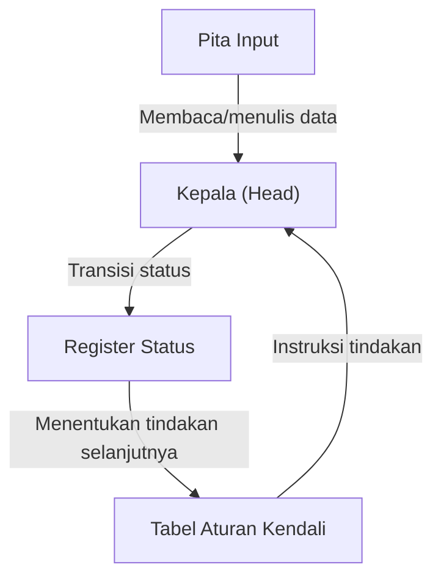
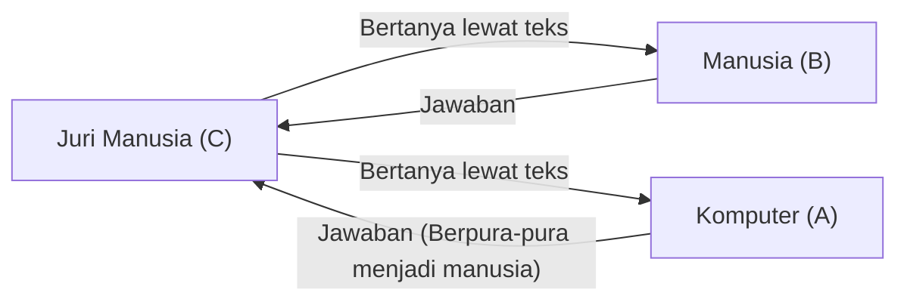

# Alan Turing: Bapak AI dan Akhir Tragisnya

Ponsel pintar, komputer pribadi, dan kecerdasan buatan (AI) yang berkembang pesat akhir-akhir ini—semua yang biasa kita gunakan saat ini, dibangun di atas fondasi teoretis yang diletakkan oleh seorang matematikawan Inggris. Namanya adalah Alan Mathison Turing.

Ia dikenal sebagai "Bapak Ilmu Komputer" dan "Bapak Kecerdasan Buatan," serta seorang pahlawan yang menyelamatkan jutaan nyawa selama Perang Dunia II melalui pemecahan kodenya. Namun, hidupnya jauh dari kata mulus, dan berakhir dengan tragis dan kejam akibat prasangka masyarakat. Dalam artikel ini, kita akan menelusuri secara rinci kehidupan Turing, dari masa kecilnya, ide-ide revolusionernya yang mengubah dunia, hingga akhir yang tragis.

## 1. Masa Kecil dan Masa Pembentukan: Munculnya Bakat Unik

Alan Turing lahir pada tanggal 23 Juni 1912 di Maida Vale, London. Karena ayahnya bekerja sebagai pegawai negeri sipil di Kemaharajaan Britania (kini India), Turing sering hidup terpisah dari orang tuanya sejak usia dini, dipaksa tinggal bersama keluarga asuh dan bersekolah di asrama. Lingkungan yang sepi ini mungkin telah membimbingnya menjadi sosok yang introspektif dengan pemikiran mandiri yang mendalam.

### Hari-hari di Sherborne School

Pada usia 13 tahun, ia mendaftar di Sherborne School, sebuah sekolah swasta bergengsi. Namun, sistem pendidikan Inggris saat itu sangat menekankan sastra klasik dan bahasa Latin, sehingga bakat Turing yang menunjukkan ketertarikan kuat pada matematika dan sains tidak dihargai semestinya. Salah satu gurunya bahkan berkomentar, "Jika ia hanya ingin menjadi ilmuwan spesialis, berada di sekolah ini adalah buang-buang waktu."

Meskipun demikian, rasa ingin tahu intelektual Turing tidak terbendung. Ia belajar sendiri teori relativitas Einstein dan mempertanyakan hukum gerak Newton, yang sudah menunjukkan tanda-tanda kejeniusannya.

### Pertemuan dan Perpisahan dengan Christopher Morcom

Selama berada di Sherborne School, ada satu peristiwa yang sangat mempengaruhi kehidupan Turing. Itu adalah pertemuannya dengan Christopher Morcom, seorang siswa setahun di atasnya. Seperti Turing, Morcom sangat mencintai sains dan matematika, dan keduanya menjalin ikatan intelektual yang mendalam. Bagi Turing, Morcom lebih dari sekadar teman—dikatakan bahwa ia adalah cinta pertamanya.

Namun, masa bahagia ini berlangsung singkat. Pada bulan Februari 1930, Morcom meninggal dunia secara tiba-tiba karena tuberkulosis sapi. Rasa kehilangan yang mendalam ini meninggalkan luka besar di hati Turing dan mendorongnya untuk merenungkan pertanyaan-pertanyaan filosofis tentang "batas antara pikiran dan materi." "Apakah roh dan kesadaran manusia tetap ada setelah tubuh fisik hancur?" "Apakah mungkin sebuah mesin meniru pemikiran manusia?" Pertanyaan-pertanyaan inilah yang kemudian mendorongnya untuk meneliti kecerdasan buatan.

## 2. Universitas Cambridge dan Lahirnya "Mesin Turing"

Pada tahun 1931, Turing masuk ke King's College, Universitas Cambridge, tempat ia mendalami matematika dan logika. Di sana ia mengenal pemikiran ilmuwan terkemuka seperti John von Neumann dan Max Born, yang memperluas wawasannya.

Dan pada tahun 1936, pada usia 24 tahun, ia menerbitkan makalah bersejarah dalam sejarah sains abad ke-20: "On Computable Numbers, with an Application to the Entscheidungsproblem".

### Konsep Mesin Turing

Dalam makalah ini, Turing membuktikan bahwa jawaban atas "Entscheidungsproblem" (Masalah Keputusan: apakah semua pernyataan matematis dapat dibuktikan benar atau salah melalui algoritma), yang diajukan oleh matematikawan David Hilbert, adalah "tidak". Namun, nilai sebenarnya dari makalah ini terletak pada model eksperimen pemikiran yang ia temukan selama proses pembuktian, yang dikenal sebagai "Mesin Turing" (Turing Machine).

Mesin Turing adalah mesin virtual yang sangat sederhana, terdiri dari pita yang panjangnya tak terhingga, kepala (head) untuk membaca dan menulis di pita, register untuk mengingat status internal, dan tabel aturan untuk menentukan tindakan.

Turing menunjukkan bahwa tidak peduli seberapa rumit perhitungannya, hal itu dapat dipecah menjadi pengulangan operasi-operasi sederhana ini. Selain itu, ia membuktikan keberadaan "Mesin Turing Universal" (Universal Turing Machine), yang dapat meniru perilaku Mesin Turing apa pun.

Ini merupakan pertama kalinya dalam sejarah bahwa **prinsip dasar komputer modern (komputer berprogram tersimpan)**—memisahkan "perangkat keras" dan "perangkat lunak", dan memungkinkan satu mesin untuk melakukan perhitungan apa pun dengan hanya mengganti programnya—dijelaskan secara jelas.

## 3. Perang Dunia II dan Pemecahan Kode di Bletchley Park

Ketika Perang Dunia II pecah pada tahun 1939, Turing direkrut ke Bletchley Park, markas besar Government Code and Cypher School (GC&CS) Inggris. Tugasnya adalah memecahkan "Enigma", mesin sandi terkuat milik Nazi Jerman.

### Ancaman Sandi Enigma

Enigma adalah mesin seperti mesin tik dengan kombinasi keyboard dan beberapa rotor (cakram berputar) dengan pengkabelan yang rumit. Setiap kali sebuah tombol ditekan, rotor berputar, sehingga aturan konversi huruf selalu berubah. Kombinasi pengaturan ini mencapai jumlah astronomis yaitu sekitar 159 kuintiliun. Militer Jerman terlalu percaya diri bahwa sistem sandi ini "mustahil untuk dipecahkan," dan sering menggunakannya untuk instruksi kapal selam U-boat.

### Pengembangan Bombe

Membangun fondasi dari para pemecah kode Polandia, Turing merancang "Bombe," sebuah mesin komputasi raksasa untuk mendekripsi sandi Enigma secara mekanis. Bombe menyimulasikan putaran rotor Enigma pada kecepatan tinggi, dan secara sistematis menghilangkan pengaturan yang saling bertentangan untuk menemukan pengaturan yang benar (kunci).

Berkat usaha tak kenal lelah dari Turing dan timnya, Bombe mulai beroperasi, dan komunikasi rahasia militer Jerman secara bertahap terbongkar.

### Pahlawan Bayangan yang Mengubah Sejarah

Keberhasilan memecahkan sandi Enigma memberi pasukan Sekutu keuntungan strategis yang sangat besar. Terutama dalam Pertempuran Atlantik, mengetahui penempatan dan rencana serangan kapal selam U-boat Jerman sebelumnya sangat penting dalam menyelamatkan banyak konvoi pasokan.

Sejarawan memperkirakan bahwa tanpa pemecahan kode di Bletchley Park, Perang Dunia II akan berlangsung setidaknya dua hingga empat tahun lebih lama, dan jutaan nyawa lagi akan melayang. Namun, karena misi ini sangat rahasia, prestasi cemerlang Turing tidak diketahui publik selama puluhan tahun setelah perang.

## 4. Fajar Kecerdasan Buatan: "Dapatkah Mesin Berpikir?"

Setelah perang, Turing bekerja di National Physical Laboratory (NPL) dalam merancang ACE (Automatic Computing Engine), lalu memimpin pengembangan komputer-komputer awal di Universitas Manchester. Ia tidak hanya puas menciptakan mesin yang dapat menghitung lebih cepat. Minatnya beralih ke bidang yang lebih tinggi dan filosofis: "Kecerdasan Buatan" (Artificial Intelligence).

Pada tahun 1950, ia menerbitkan sebuah makalah penting di jurnal akademik 'Mind' yang berjudul "Computing Machinery and Intelligence." Makalah ini dimulai dengan pertanyaan provokatif: "Dapatkah mesin berpikir?"

### Tes Turing (Permainan Imitasi)

Alih-alih mendefinisikan konsep subjektif "berpikir," Turing mengusulkan tes praktis yang dapat dievaluasi secara objektif. Ini adalah "Permainan Imitasi," yang kemudian dikenal sebagai "Tes Turing."

Dalam tes ini, seorang juri yang berada di ruangan terpisah berinteraksi baik dengan komputer maupun manusia melalui teks. Jika juri tidak dapat membedakan dengan pasti mana yang manusia dan mana yang komputer, maka komputer tersebut dapat dianggap "memiliki kecerdasan yang setara dengan manusia (berpikir)." Ini adalah pendekatan revolusioner.

Konsep ini masih sering dikutip sebagai salah satu tujuan akhir dalam pengembangan AI modern, dan memiliki pengaruh yang tak terukur pada pengembangan pemrosesan bahasa alami dan AI percakapan.

## 5. Beralih ke Biologi Matematika: Memecahkan Misteri Morfogenesis

Kejeniusan Turing tidak terbatas pada matematika dan ilmu komputer. Di tahun-tahun terakhirnya, ia memelopori bidang yang sama sekali baru: "Biologi Matematika" (Mathematical Biology).

Pada tahun 1952, ia menerbitkan sebuah makalah berjudul "The Chemical Basis of Morphogenesis". Di dalamnya, ia menunjukkan bahwa pola-pola yang rumit dan indah di alam, seperti garis-garis pada zebra, bintik-bintik pada macan tutul, dan susunan daun, dapat dijelaskan secara matematis melalui proses reaksi dan difusi (sistem reaksi-difusi) zat kimia sederhana (morfogen).

Persamaan Turing membahas misteri fundamental dalam biologi perkembangan tentang bagaimana makhluk hidup membangun struktur yang kompleks dari satu sel, menjadikannya sebuah penelitian visioner yang menjadi cikal bakal biologi sistem dan teori kekacauan.

## 6. Kejeniusan yang Dibunuh oleh Zaman: Akhir yang Tragis

Di puncak karier akademisnya, tragedi tiba-tiba menimpa Turing.

Pada bulan Januari 1952, rumah Turing dibobol. Ia melaporkan pencurian tersebut kepada polisi, namun selama penyelidikan terungkap bahwa ia menjalin hubungan dengan kekasih sesama jenis, Arnold Murray. Di Inggris pada waktu itu, homoseksualitas adalah kejahatan yang dihukum berat oleh hukum sebagai "Tindakan Asusila yang Berat" (Gross Indecency).

### Pilihan Kejam dan Kebiri Kimiawi

Turing divonis bersalah dan dipaksa untuk memilih antara dipenjara atau menerima pengobatan hormon untuk mengurangi hasrat seksualnya (kebiri kimiawi secara efektif). Agar bisa terus melanjutkan penelitiannya, ia memilih pengobatan hormon (suntikan estrogen).

Pengobatan ini memberikan kerusakan parah pada tubuh dan pikirannya. Ia mulai mengembangkan karakteristik fisik wanita dan menderita depresi yang mendalam. Selain itu, karena ia kini menjadi penjahat, ia dianggap sebagai ancaman keamanan; izin keamanannya dicabut, dan ia kehilangan pekerjaannya sebagai konsultan kriptografi. Pahlawan yang menyelamatkan negaranya, justru dirampas segalanya oleh negaranya sendiri.

### Apel Beracun dan Kematian Misterius

Pada tanggal 8 Juni 1954, Turing ditemukan tewas di tempat tidurnya di rumah. Ia meninggal pada usia 41 tahun.

Sebuah apel yang setengah dimakan ditemukan di samping tempat tidurnya. Hasil autopsi menunjukkan penyebab kematiannya adalah keracunan sianida, dan polisi menyimpulkan bahwa ia bunuh diri dengan memakan apel yang telah disuntikkan sianida. Itu adalah akhir yang tragis, mirip dengan dongeng kesukaannya, "Putri Salju."

(*Namun, beberapa peneliti dan penulis biografi menunjukkan kemungkinan bahwa itu adalah kecelakaan selama eksperimen, dan kebenarannya masih belum sepenuhnya terpecahkan hingga hari ini.)

## 7. Pemulihan Nama Baik Setelah Kematian dan Warisan Abadi

Setelah kematian Turing, banyak dari pencapaiannya tetap tersembunyi di bawah tabir rahasia militer. Namun, sejak tahun 1970-an dan seterusnya, ketika operasi pemecahan kode di Bletchley Park secara bertahap dipublikasikan, peran krusialnya dalam sejarah umat manusia mulai dikenal luas.

### Permintaan Maaf dan Pengampunan

Pada tahun 2009, Perdana Menteri Inggris saat itu, Gordon Brown, mengeluarkan permintaan maaf resmi atas nama pemerintah mengenai perlakuan tidak adil terhadap Turing.
"Tanpa kontribusinya yang luar biasa, sejarah Perang Dunia Kedua akan sangat berbeda. Perlakuan yang diterimanya benar-benar tidak adil."

Kemudian pada tahun 2013, Ratu Elizabeth II memberikan pengampunan anumerta (Royal Pardon) kepada Turing. Pada tahun 2017, sebuah hukum yang dikenal secara luas sebagai "Hukum Turing" diberlakukan, secara anumerta mengampuni puluhan ribu pria yang sebelumnya dihukum karena pelanggaran homoseksual dan memulihkan nama baik mereka.

### Penghargaan Turing dan Uang Kertas £50

Saat ini, penghargaan tertinggi dalam ilmu komputer dinamai untuk menghormatinya: "Turing Award".
Selain itu, pada tahun 2021, potret Turing dipilih untuk menghiasi uang kertas 50 poundsterling baru yang diterbitkan oleh Bank of England. Di sana, tertulis kutipan terkenalnya:

> "Ini hanyalah rasa awal dari apa yang akan datang, dan hanyalah bayangan dari apa yang akan terjadi."
> ("This is only a foretaste of what is to come, and only the shadow of what is going to be.")

### Warisan yang Berlanjut ke Era Modern

Kehidupan Alan Turing berakhir pada usia yang sangat muda, 41 tahun, dengan cara yang sangat tidak masuk akal. Namun, benih yang ia tanam telah tumbuh menjadi hutan raksasa dalam masyarakat digital modern.

Setiap kali kita mengirim pesan dari ponsel pintar, mengajukan pertanyaan kepada AI, dan melakukan perhitungan rumit secara instan, di sanalah jiwa seorang jenius bernama Alan Turing hidup. Kehidupannya terus menunjukkan kepada kita sebuah pelajaran abadi bagi umat manusia: potensi intelektual yang tak terbatas, dan tragedi yang diakibatkan oleh prasangka sosial.
