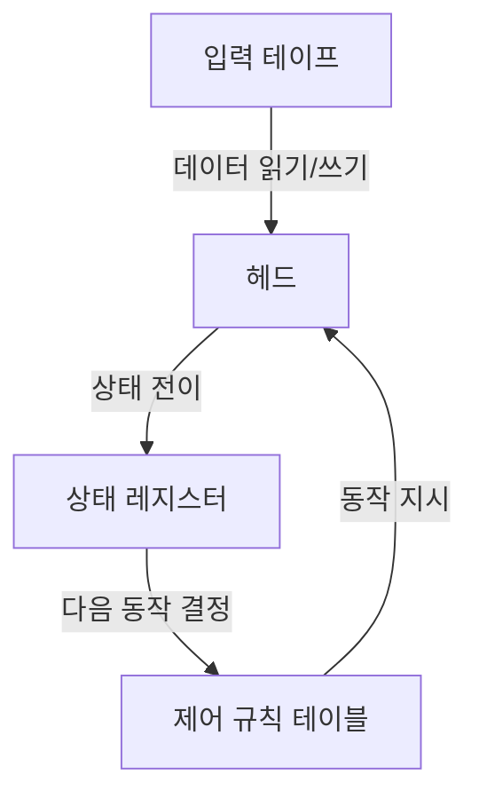
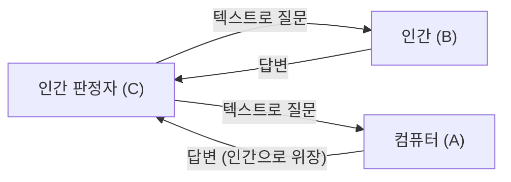

# 앨런 튜링: AI의 아버지와 비극적인 최후

우리가 일상적으로 사용하는 스마트폰, 개인용 컴퓨터, 그리고 최근 급격한 발전을 이루고 있는 인공지능(AI). 이들의 근저에 있는 이론적 기반을 구축한 사람은 한 영국의 수학자였습니다. 그의 이름은 앨런 매시슨 튜링(Alan Mathison Turing)입니다.

그는 "컴퓨터 과학의 아버지", "인공지능의 아버지"로 불리며, 제2차 세계대전 중에는 암호 해독을 통해 수백만 명의 목숨을 구한 영웅이기도 합니다. 그러나 그의 생애는 결코 평탄하지 않았으며, 사회적 편견으로 인해 잔혹한 형태로 막을 내리게 되었습니다. 본 기사에서는 튜링의 성장 배경부터 그가 세상에 가져온 혁명적인 아이디어, 그리고 비극적인 최후에 이르기까지 그의 인생을 아주 상세히 풀어보겠습니다.

## 1. 어린 시절과 형성기: 특이한 재능의 싹

앨런 튜링은 1912년 6월 23일 런던 메이다 베일에서 태어났습니다. 아버지가 영국령 인도 제국(현재의 인도)에서 공무원으로 일했기 때문에, 튜링은 어릴 적부터 부모와 떨어져 지내는 경우가 많았고 위탁 가정이나 기숙 학교에서 생활해야 했습니다. 이런 고독한 환경이 그를 내성적이고 독창적인 사고를 깊이 있게 하는 성격으로 이끌었을지도 모릅니다.

### 셔본 학교에서의 나날

13세 때 명문 사립학교인 셔본 학교에 입학합니다. 그러나 당시 영국의 교육은 고전문학과 라틴어에 중점을 두고 있었기에, 수학과 과학에 강한 관심을 보이는 튜링의 재능은 반드시 정당하게 평가받지 못했습니다. 한 교사는 "그가 단순한 과학 전문가가 될 작정이라면 이 학교에 있는 것은 시간 낭비다"라고 평했을 정도입니다.

그럼에도 튜링의 지적 호기심은 멈출 줄 몰랐고, 아인슈타인의 상대성 이론을 독학으로 이해하며 뉴턴의 운동 법칙에 의문을 제기하는 등 이미 천재의 잠재력을 보이고 있었습니다.

### 크리스토퍼 모컴과의 만남과 이별

셔본 학교 시절, 튜링의 인생에 결정적인 영향을 미친 사건이 있었습니다. 그것은 한 학년 위인 학생 크리스토퍼 모컴과의 만남이었습니다. 모컴은 튜링과 마찬가지로 과학과 수학을 사랑했고, 두 사람은 지적이고 깊은 유대감으로 맺어졌습니다. 튜링에게 모컴은 단순한 친구 이상의 존재였으며, 첫사랑이었다고도 전해집니다.

하지만 이 행복한 시간은 짧았고, 1930년 2월 모컴은 소 결핵으로 갑작스럽게 세상을 떠나고 맙니다. 이 깊은 상실감은 튜링의 마음에 큰 상처를 남기는 동시에 그를 "마음과 물질의 경계"라는 철학적 질문으로 내몰았습니다. "인간의 정신이나 의식은 육체가 멸망한 후에도 존재하는가?", "기계가 인간의 사고를 모방하는 것이 가능한가?". 이러한 질문들은 훗날 그가 인공지능 연구로 향하는 원동력이 되었습니다.

## 2. 케임브리지 대학과 '튜링 머신'의 탄생

1931년 튜링은 케임브리지 대학 킹스 칼리지에 진학하여 본격적으로 수학과 논리학 연구에 몰두합니다. 이곳에서 그는 존 폰 노이만과 막스 보른 같은 일류 과학자들의 사상을 접하며 학문의 날개를 크게 펼쳤습니다.

그리고 1936년, 그는 24세의 나이로 20세기 과학사에 찬란히 빛나는 기념비적 논문 '계산 가능한 수에 대하여, 그리고 결정 문제에의 응용(On Computable Numbers, with an Application to the Entscheidungsproblem)'을 발표합니다.

### 튜링 머신의 개념

이 논문에서 튜링은 수학자 다비트 힐베르트가 제기한 "결정 문제(Entscheidungsproblem: 모든 수학적 명제는 알고리즘에 의해 참과 거짓을 판정할 수 있는가)"에 대해 "아니다"라는 증명을 제시했습니다. 그러나 이 논문의 진정한 가치는 그 증명 과정에서 그가 고안한 "튜링 머신(Turing Machine)"이라는 사고 실험 모델에 있었습니다.

튜링 머신은 무한히 긴 테이프, 테이프를 읽고 쓰는 헤드, 내부 상태를 기억하는 레지스터, 그리고 동작을 결정하는 규칙 테이블로 구성된 매우 단순한 가상의 기계입니다.

튜링은 아무리 복잡한 계산이라도 이 단순한 조작의 반복으로 분해할 수 있음을 보여주었습니다. 나아가 그는 모든 튜링 머신의 동작을 모방할 수 있는 "보편 튜링 머신(Universal Turing Machine)"의 존재를 증명했습니다.

이는 "하드웨어(기계 본체)"와 "소프트웨어(프로그램)"를 분리하고, 프로그램을 교체함으로써 하나의 기계가 어떤 계산이든 실행할 수 있다는 **현대 컴퓨터(프로그램 내장 방식 컴퓨터)의 근본 원리**를 세계 최초로 명확히 제시한 것이었습니다.

## 3. 제2차 세계대전과 블레츨리 파크에서의 암호 해독

1939년 제2차 세계대전이 발발하자, 튜링은 영국 정부 암호 학교(GC&CS)의 거점인 블레츨리 파크로 소집됩니다. 그의 임무는 나치 독일이 자랑하는 최강의 암호기 '에니그마(Enigma)'를 해독하는 것이었습니다.

### 에니그마 암호의 위협

에니그마는 타자기가 연상되는 건반과 복잡한 배선을 가진 여러 개의 로터(회전판)를 조합한 기계입니다. 키를 누를 때마다 로터가 회전하여 문자의 변환 규칙이 항상 변하기 때문에, 그 설정의 조합은 약 1억 5000만의 1억 배(159해)라는 천문학적인 수에 달했습니다. 독일군은 이 암호 시스템을 "절대 해독 불가능"하다고 맹신하며 U보트(잠수함)의 작전 지시 등에 다용하고 있었습니다.

### 봄브(Bombe)의 개발

폴란드의 암호 해독자들이 구축한 기초 위에서, 튜링은 에니그마의 암호를 기계적으로 해독하기 위한 거대한 계산기 '봄브(Bombe)'를 설계했습니다. 봄브는 에니그마 로터의 회전을 고속으로 시뮬레이션하고 모순되는 설정을 차례차례 제외해 나감으로써 올바른 설정(오늘날의 키)을 도출하는 기계였습니다.

튜링과 그의 팀(특히 고든 웰치먼 등의 기여도 큼)의 끊임없는 노력으로 봄브는 가동을 시작했고, 독일군의 암호 통신은 속속 백일하에 드러났습니다.

### 역사를 바꾼 그림자의 영웅

에니그마 해독 성공은 연합군에 막대한 전략적 우위를 가져다주었습니다. 특히 대서양 전투에서 독일 U보트의 배치나 공격 계획을 사전에 파악할 수 있었던 것은 수많은 보급 선단을 구하는 데 직결되었습니다.

역사가들은 블레츨리 파크에서의 암호 해독이 없었다면 제2차 세계대전은 최소 2~4년은 더 길어졌을 것이며, 수백만 명의 목숨이 더 희생되었을 가능성이 높다고 추측합니다. 그러나 이 임무는 최고 기밀이었기 때문에, 튜링의 빛나는 공적은 전후 수십 년 동안 세상에 알려지지 않았습니다.

## 4. 인공지능의 여명: "기계는 생각할 수 있는가?"

전후 튜링은 국립 물리 연구소(NPL)에서 ACE(Automatic Computing Engine)의 설계에 참여했고, 이어 맨체스터 대학에서 초기 컴퓨터 개발을 견인했습니다. 그는 단순히 계산을 고속화하는 기계를 만드는 것에만 만족하지 않았습니다. 그의 관심은 보다 고차원적이고 철학적인 영역, 즉 "인공지능(Artificial Intelligence)"으로 향하고 있었습니다.

1950년, 그는 학술지 'Mind'에 '계산 기계와 지성(Computing Machinery and Intelligence)'이라는 획기적인 논문을 발표합니다. 이 논문은 "기계는 생각할 수 있는가?"라는 도발적인 질문으로 시작됩니다.

### 튜링 테스트(이미테이션 게임)

튜링은 "생각한다"는 주관적인 개념을 정의하는 대신, 객관적으로 평가할 수 있는 실용적인 테스트를 제안했습니다. 이것이 훗날 "튜링 테스트"로 불리게 되는 "이미테이션 게임"입니다.

이 테스트에서는 격리된 방에 있는 판정자가 컴퓨터와 인간 모두와 텍스트 기반으로 대화를 나눕니다. 만약 판정자가 어느 쪽이 인간이고 어느 쪽이 컴퓨터인지 확신을 가지고 구별하지 못했다면, 그 컴퓨터는 "인간과 동등한 지능을 가지고 있다(사고하고 있다)"고 간주할 수 있다는 획기적인 접근법이었습니다.

이 개념은 현대 AI 개발에 있어서 궁극적인 목표 중 하나로 지금도 여전히 인용되고 있으며, 자연어 처리(NLP)나 대화형 AI(지금 당신이 읽고 있는 문장을 생성하는 것과 같은 시스템)의 발전에 헤아릴 수 없는 영향을 미쳤습니다.

## 5. 수리 생물학에의 심취: 형태 형성의 수수께끼에 도전하다

튜링의 천재성은 수학이나 컴퓨터 과학의 틀에 머물지 않았습니다. 말년의 그는 "수리 생물학"이라는 전혀 새로운 분야를 개척했습니다.

1952년, 그는 "형태 형성의 화학적 기초(The Chemical Basis of Morphogenesis)"라는 논문을 발표합니다. 이 논문에서 그는 얼룩말의 줄무늬, 표범의 반점, 잎의 배열(엽서) 등 자연계에서 볼 수 있는 복잡하고 아름다운 패턴이 단순한 화학 물질(모르포겐)의 반응과 확산 과정(반응-확산계)에 의해 수학적으로 설명될 수 있음을 보여주었습니다.

튜링의 방정식은 생물이 어떻게 단일 세포에서 복잡한 구조를 만들어내는가 하는 발생 생물학의 근본적인 수수께끼에 접근하는 것이었으며, 현재의 시스템 생물학이나 카오스 이론의 선구가 되는 매우 선견지명이 있는 연구였습니다.

## 6. 시대에 살해당한 천재: 비극적인 최후

학문적 절정에 있던 튜링에게 갑작스럽게 비극이 덮쳐옵니다.

1952년 1월, 튜링의 집에 빈집털이가 들었습니다. 그는 경찰에 피해 사실을 신고하지만, 그 수사 과정에서 그가 동성의 연인인 아놀드 머리와 관계를 맺고 있었다는 사실이 발각되고 맙니다. 당시 영국에서 동성애는 "심각한 외설 행위(Gross Indecency)"로서 법률로 엄격하게 처벌받는 범죄였습니다.

### 잔혹한 선택과 화학적 거세

튜링은 유죄 판결을 받았고, 교도소 수감 혹은 성욕을 감퇴시키기 위한 호르몬 치료(실질적인 화학적 거세) 중 하나를 선택하도록 강요받았습니다. 연구를 계속하기 위해 그는 호르몬 치료(에스트로겐 투여)를 선택합니다.

이 치료는 그의 심신에 심각한 손상을 입혔습니다. 신체에 여성적인 특징이 나타났고, 정신적으로도 깊은 우울감에 빠졌습니다. 또한 범죄자가 됨으로써 치안상의 위협으로 간주되어 정부의 기밀 프로젝트에 대한 접근 권한(보안 클리어런스)을 박탈당했고, 암호 기술 컨설턴트로서의 일자리도 잃고 말았습니다. 국가를 구한 영웅은 그 국가에 의해 모든 것을 빼앗긴 것입니다.

### 독사과와 수수께끼에 싸인 죽음

1954년 6월 8일, 튜링은 자택의 침대에서 사망한 채로 발견되었습니다. 향년 41세.

침대 옆에는 반쯤 베어 먹은 사과가 남겨져 있었습니다. 검시 결과 사인은 시안화물(청산가리)에 의한 중독사였으며, 경찰은 그가 시안화물을 주사한 사과를 먹고 자살했다고 단정했습니다. 그가 사랑했던 동화 '백설공주'를 모방한 비극적인 최후였습니다.

(※단, 일부 연구자나 전기 작가들은 실험 중의 사고였을 가능성도 지적하고 있으며, 진상은 아직도 완전히 밝혀지지 않았습니다.)

## 7. 사후의 명예 회복과 영원한 유산

튜링의 사후, 그의 업적 대부분은 군사 기밀의 베일 아래 감춰져 있었습니다. 그러나 1970년대 이후 블레츨리 파크에서의 암호 해독 활동이 서서히 공개되면서, 그가 인류 역사에서 수행한 결정적인 역할이 세상에 알려지게 되었습니다.

### 사과와 사면

2009년 영국 고든 브라운 총리(당시)는 정부를 대표하여 튜링에 대한 부당한 처우에 대해 공식적으로 사과했습니다.
"그의 비범한 공헌이 없었다면 제2차 세계대전의 역사는 크게 달라졌을 것입니다. 그가 받은 대우는 완전히 부당한 것이었습니다."

그리고 2013년 엘리자베스 여왕에 의해 튜링에게 사후 사면(Royal Pardon)이 주어졌습니다. 2017년에는 통칭 "튜링법"이 시행되어, 과거에 동성애 죄로 유죄 판결을 받았던 수만 명의 남성들도 명예를 회복했습니다.

### 튜링상과 50파운드 지폐

오늘날 컴퓨터 과학 분야에서 최고봉의 상(컴퓨터계의 노벨상)은 그의 이름을 따서 "튜링상(Turing Award)"이라 불립니다.
또한 2021년에는 잉글랜드 은행이 발행하는 새로운 50파운드 지폐의 초상에 튜링이 채택되었습니다. 그곳에는 그의 유명한 명언이 새겨져 있습니다.

> "이것은 앞으로 일어날 일의 단순한 맛보기에 불과하며, 앞으로 다가올 일의 단순한 그림자일 뿐이다."
> ("This is only a foretaste of what is to come, and only the shadow of what is going to be.")

### 현대로 이어지는 유산

앨런 튜링의 생애는 41년이라는 짧고도 너무나 불합리한 끝을 맞이했습니다. 그러나 그가 뿌린 씨앗은 현대의 디지털 사회라는 거대한 숲으로 성장했습니다.

우리가 스마트폰으로 메시지를 보내고, AI에게 질문을 던지며, 복잡한 계산을 순식간에 실행할 때마다 그곳에는 앨런 튜링이라는 한 천재의 영혼이 살아 숨 쉬고 있습니다. 그의 인생은 지성의 무한한 가능성과 사회의 편견이 가져오는 비극이라는 인류에 대한 영원한 교훈을 우리에게 보여주고 있는 것입니다.
