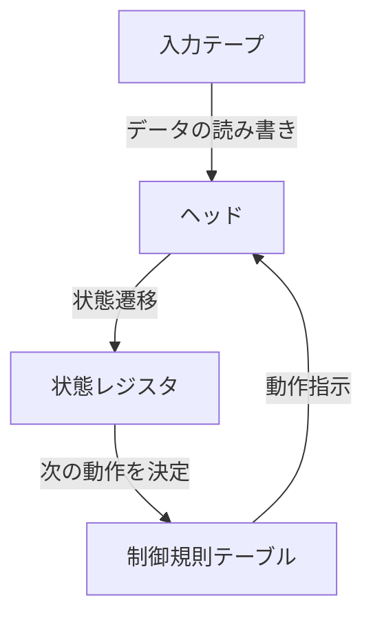
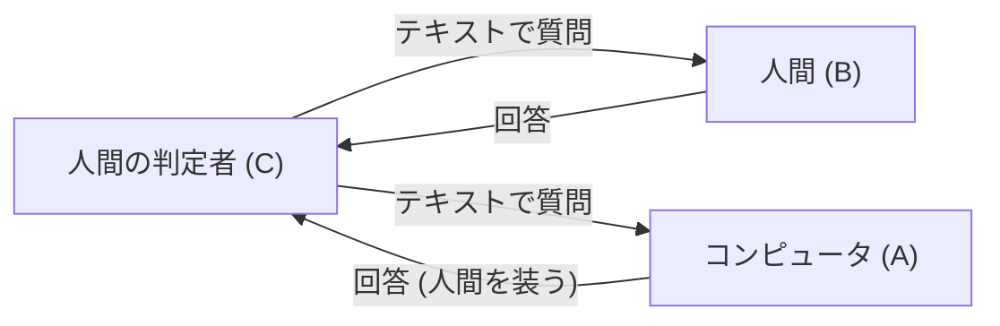

# アラン・チューリング：AIの父と悲劇の最期

現代私たちが当たり前のように使用しているスマートフォン、パーソナルコンピュータ、そして近年急速な発展を遂げている人工知能（AI）。これらの根底にある理論的基盤を構築したのは、一人のイギリス人数学者でした。その名はアラン・マシスン・チューリング（Alan Mathison Turing）。

彼は「計算機科学の父」「人工知能の父」と称され、第二次世界大戦においては暗号解読を通じて数百万人の命を救った英雄でもあります。しかし、その生涯は決して平坦なものではなく、社会の偏見によって残酷な形で幕を閉じることになりました。本記事では、チューリングの生い立ちから、彼が世界にもたらした革命的なアイデア、そしてその悲劇的な最期に至るまで、彼の人生を極めて詳細に紐解いていきます。

## 1. 幼少期と形成期：特異な才能の萌芽

アラン・チューリングは1912年6月23日、ロンドンのメイダ・ヴェールで生まれました。父親はイギリス領インド帝国（現在のインド）で公務員として働いていたため、チューリングは幼い頃から両親と離れて暮らすことが多く、里親や寄宿学校での生活を余儀なくされました。この孤独な環境が、彼を内省的で独自の思考を深める性格へと導いたのかもしれません。

### シャーボーン校での日々

13歳の時、名門パブリックスクールのシャーボーン校に入学します。しかし、当時のイギリスの教育は古典文学やラテン語に重きを置いており、数学や科学に強い関心を示すチューリングの才能は必ずしも正当に評価されませんでした。ある教師は「彼が単なる科学の専門家になるつもりなら、この学校にいるのは時間の無駄だ」と評したほどです。

それでもチューリングの知的好奇心は留まることを知らず、アインシュタインの相対性理論を独学で理解し、ニュートンの運動の法則に疑問を投げかけるなど、既に天才の片鱗を見せていました。

### クリストファー・モルコムとの出会いと別れ

シャーボーン校時代において、チューリングの人生に決定的な影響を与えた出来事がありました。それは、一つ年上の生徒であるクリストファー・モルコムとの出会いでした。モルコムはチューリングと同様に科学と数学を愛し、二人は知的な深い絆で結ばれました。チューリングにとってモルコムは、単なる友人以上の存在であり、初恋の人でもあったと言われています。

しかし、この幸せな時間は短く、1930年2月、モルコムは牛結核によって突如この世を去ってしまいます。この深い喪失感は、チューリングの心に大きな傷を残すと同時に、彼を「心と物質の境界」という哲学的な問いへと駆り立てました。「人間の精神や意識は、肉体が滅びた後も存在するのか？」「機械が人間の思考を模倣することは可能なのか？」。これらの問いは、後に彼が人工知能の研究に向かう原動力となりました。

## 2. ケンブリッジ大学と「チューリングマシン」の誕生

1931年、チューリングはケンブリッジ大学キングス・カレッジに進学し、本格的に数学と論理学の研究に没頭します。ここで彼は、ジョン・フォン・ノイマンやマックス・ボーンといった一流の科学者たちの思想に触れ、学問の翼を大きく広げていきました。

そして1936年、彼は24歳にして、20世紀の科学史に燦然と輝く記念碑的論文「計算可能数について、およびその決定問題への応用（On Computable Numbers, with an Application to the Entscheidungsproblem）」を発表します。

### チューリングマシンの概念

この論文の中でチューリングは、数学者ダフィット・ヒルベルトが提起した「決定問題（Entscheidungsproblem：すべての数学的命題はアルゴリズムによって真偽を判定できるか）」に対して「否」という証明を与えました。しかし、この論文の真の価値は、その証明の過程で彼が考案した「チューリングマシン（Turing Machine）」という思考実験のモデルにありました。

チューリングマシンは、無限に長いテープ、テープを読み書きするヘッド、内部状態を記憶するレジスタ、そして動作を決定する規則テーブルから構成される、極めてシンプルな仮想の機械です。

チューリングは、どんなに複雑な計算であっても、この単純な操作の繰り返しに分解できることを示しました。さらに彼は、あらゆるチューリングマシンの動作を模倣できる「万能チューリングマシン（Universal Turing Machine）」の存在を証明しました。

これは、「ハードウェア（機械本体）」と「ソフトウェア（プログラム）」を分離し、プログラムを入れ替えることで一つの機械がどんな計算も実行できるという、**現代のコンピュータ（プログラム内蔵方式コンピュータ）の根本原理**を世界で初めて明確に示したものでした。

## 3. 第二次世界大戦とブレッチリー・パークでの暗号解読

1939年、第二次世界大戦が勃発すると、チューリングはイギリス政府暗号学校（GC&CS）の拠点であるブレッチリー・パークに召集されます。彼の任務は、ナチス・ドイツが誇る最強の暗号機「エニグマ（Enigma）」を解読することでした。

### エニグマ暗号の脅威

エニグマは、タイプライターのような鍵盤と、複雑な配線を持つ複数のローター（回転盤）を組み合わせた機械です。キーを押すたびにローターが回転し、文字の変換規則が常に変化するため、その設定の組み合わせは約1億5000万の1億倍（159垓）という天文学的な数に上りました。ドイツ軍はこの暗号システムを「絶対に解読不可能」と過信し、Uボート（潜水艦）の作戦指示などに多用していました。

### ボンブ（Bombe）の開発

ポーランドの暗号解読者たちが築いた基礎の上で、チューリングはエニグマの暗号を機械的に解読するための巨大な計算機「ボンブ（Bombe）」を設計しました。ボンブは、エニグマのローターの回転を高速でシミュレートし、矛盾する設定を次々と除外していくことで、正しい設定（今日の鍵）を導き出す機械でした。

チューリングと彼のチーム（特にゴードン・ウェルチマンらの貢献も大きい）の絶え間ない努力により、ボンブは稼働を開始し、ドイツ軍の暗号通信は次々と白日の下に晒されました。

### 歴史を変えた影の英雄

エニグマの解読成功は、連合国軍に多大な戦略的優位をもたらしました。特に、大西洋の戦いにおいてドイツのUボートの配置や攻撃計画を事前に把握できたことは、多くの補給船団を救うことに直結しました。

歴史家たちは、ブレッチリー・パークでの暗号解読がなければ、第二次世界大戦は少なくとも2〜4年は長引き、さらに数百万人の命が失われていた可能性が高いと推測しています。しかし、この任務は最高機密であったため、チューリングの輝かしい功績は戦後何十年もの間、世間に知られることはありませんでした。

## 4. 人工知能の夜明け：「機械は考えることができるか？」

戦後、チューリングは国立物理学研究所（NPL）でACE（Automatic Computing Engine）の設計に携わり、続いてマンチェスター大学で初期のコンピュータ開発を牽引しました。彼は単に計算を高速化する機械を作ることだけには満足していませんでした。彼の関心は、より高度で哲学的な領域、すなわち「人工知能（Artificial Intelligence）」へと向かっていきました。

1950年、彼は学術誌『Mind』に「計算機械と知性（Computing Machinery and Intelligence）」という画期的な論文を発表します。この論文は「機械は考えることができるか？」という挑発的な問いから始まります。

### チューリングテスト（イミテーション・ゲーム）

チューリングは、「考える」という主観的な概念を定義する代わりに、客観的に評価可能な実用的なテストを提案しました。これが後に「チューリングテスト」と呼ばれるようになる「イミテーション・ゲーム」です。

このテストでは、隔離された部屋にいる判定者が、コンピュータと人間の両方とテキストベースで対話を行います。もし判定者が、どちらが人間でどちらがコンピュータか確信を持って識別できなかった場合、そのコンピュータは「人間と同等の知能を持っている（思考している）」と見なすことができる、という画期的なアプローチでした。

この概念は、現代のAI開発における究極の目標の一つとして今なお引き合いに出され、自然言語処理（NLP）や対話型AI（まさに今あなたが読んでいる文章を生成しているようなシステム）の発展に計り知れない影響を与えました。

## 5. 数理生物学への傾倒：形態形成の謎に挑む

チューリングの天才性は、数学やコンピュータ科学の枠にとどまりませんでした。晩年の彼は「数理生物学」という全く新しい分野を開拓しました。

1952年、彼は「形態形成の化学的基礎（The Chemical Basis of Morphogenesis）」という論文を発表します。この中で彼は、シマウマの縞模様、ヒョウの斑点、葉の配列（葉序）など、自然界に見られる複雑で美しいパターンが、単純な化学物質（モルフォゲン）の反応と拡散のプロセス（反応拡散系）によって数学的に説明できることを示しました。

チューリングの方程式は、生物がどのようにして単一の細胞から複雑な構造を作り上げていくのかという発生生物学の根本的な謎に迫るものであり、現在のシステム生物学やカオス理論の先駆けとなる極めて先見の明のある研究でした。

## 6. 時代に殺された天才：悲劇の最期

学問的絶頂期にあったチューリングに、突如として悲劇が襲いかかります。

1952年1月、チューリングの自宅に空き巣が入りました。彼は警察に被害を届け出ますが、その捜査の過程で彼が同性の恋人であるアーノルド・マレーと関係を持っていたことが発覚してしまいます。当時のイギリスでは、同性愛は「甚だしいわいせつ行為（Gross Indecency）」として法律で厳しく罰せられる犯罪でした。

### 残酷な選択と化学的去勢

チューリングは有罪判決を受け、刑務所への収監か、性欲を減退させるためのホルモン治療（実質的な化学的去勢）のいずれかを選択することを迫られました。研究を続けるために、彼はホルモン治療（エストロゲンの投与）を選択します。

この治療は彼の心身に深刻なダメージを与えました。身体に女性的な特徴が現れ、精神的にも深く落ち込むようになりました。また、犯罪者となったことで治安上の脅威と見なされ、政府の機密プロジェクトへのアクセス権（セキュリティ・クリアランス）を剥奪され、暗号技術のコンサルタントとしての仕事も失ってしまいました。国家を救った英雄は、その国家によってすべてを奪われたのです。

### 毒リンゴと謎に包まれた死

1954年6月8日、チューリングは自宅のベッドで死亡しているのが発見されました。享年41歳。

ベッドの脇には、半分かじられたリンゴが残されていました。検死の結果、死因はシアン化物（青酸カリ）による中毒死であり、警察は彼がシアン化物を注射したリンゴを食べて自殺したと断定しました。彼が愛した童話『白雪姫』を真似た悲劇的な最期でした。

（※ただし、一部の研究者や伝記作家は、実験中の事故であった可能性も指摘しており、真相は今もなお完全には解明されていません。）

## 7. 死後の名誉回復と永遠の遺産

チューリングの死後、彼の業績の多くは軍事機密のベールの下に隠されていました。しかし、1970年代以降、ブレッチリー・パークでの暗号解読活動が徐々に公開されるようになると、彼が人類史において果たした決定的な役割が世に知れ渡るようになりました。

### 謝罪と恩赦

2009年、イギリスのゴードン・ブラウン首相（当時）は、政府を代表してチューリングに対する不当な扱いについて公式に謝罪しました。
「彼の並外れた貢献がなければ、第二次世界大戦の歴史は大きく異なっていたでしょう。彼が受けた扱いは完全に不当なものでした」

そして2013年、エリザベス女王によりチューリングに死後恩赦（Royal Pardon）が与えられました。2017年には通称「チューリング法」が施行され、過去に同性愛罪で有罪判決を受けた数万人もの男性たちも名誉を回復されました。

### チューリング賞と£50紙幣

今日、コンピュータ科学分野における最高峰の賞（コンピュータ界のノーベル賞）は彼の名を冠して「チューリング賞（Turing Award）」と呼ばれています。
また、2021年にはイングランド銀行が発行する新しい50ポンド紙幣の肖像にチューリングが採用されました。そこには、彼の有名な言葉が刻まれています。

> 「これはこれから起こることの単なる前味にすぎず、これから起こることの単なる影にすぎない」
> （"This is only a foretaste of what is to come, and only the shadow of what is going to be."）

### 現代へ続く遺産

アラン・チューリングの生涯は、41年という短く、あまりにも理不尽な終わりを迎えました。しかし、彼が蒔いた種は、現代のデジタル社会という巨大な森へと成長しました。

私たちがスマートフォンでメッセージを送り、AIに質問を投げかけ、複雑な計算を瞬時に実行するたびに、そこにはアラン・チューリングという一人の天才の魂が息づいています。彼の人生は、知性の無限の可能性と、社会の偏見がもたらす悲劇という、人類に対する永遠の教訓を私たちに示し続けているのです。
