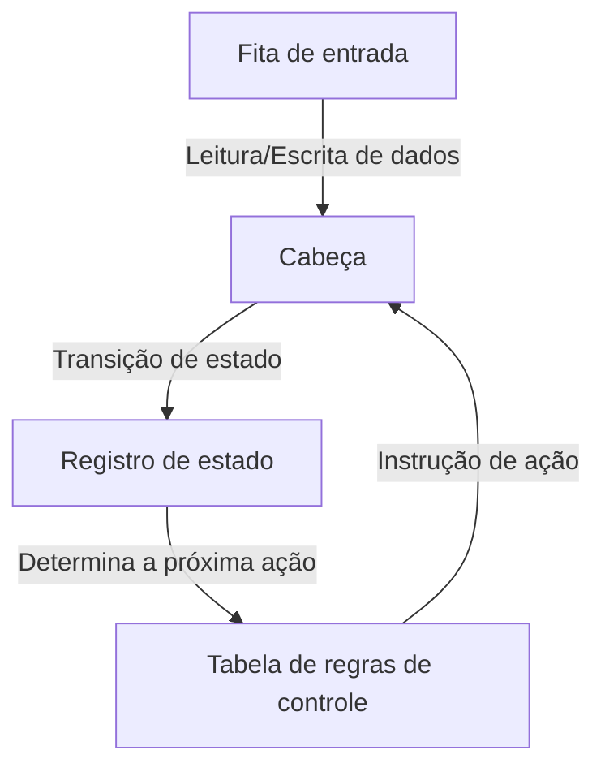
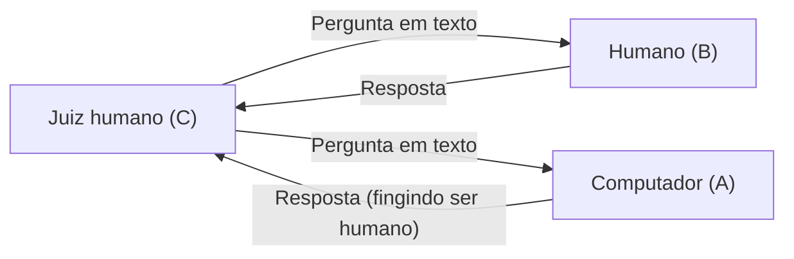

# Alan Turing: O Pai da IA e seu Fim Trágico

Os smartphones, os computadores pessoais que usamos todos os dias e a inteligência artificial (IA) que vem se desenvolvendo rapidamente nos últimos anos. Quem construiu a base teórica fundamental de tudo isso foi um único matemático britânico. Seu nome era Alan Mathison Turing.

Conhecido como o "pai da ciência da computação" e o "pai da inteligência artificial", ele também foi um herói que salvou milhões de vidas durante a Segunda Guerra Mundial ao decifrar códigos. No entanto, sua vida não foi de forma alguma tranquila e terminou de maneira cruel devido ao preconceito da sociedade. Neste artigo, desvendaremos sua vida em detalhes, desde sua infância, as ideias revolucionárias que trouxe ao mundo, até o seu fim trágico.

## 1. Infância e Anos de Formação: O Surgimento de um Talento Único

Alan Turing nasceu em 23 de junho de 1912, em Maida Vale, Londres. Como seu pai trabalhava como funcionário público na Índia Britânica (atual Índia), Turing frequentemente viveu longe dos pais desde cedo, sendo forçado a morar com famílias adotivas ou em internatos. Esse ambiente solitário pode tê-lo levado a desenvolver uma personalidade introspectiva e pensamentos originais profundos.

### Os Dias na Escola de Sherborne

Aos 13 anos, ele ingressou na prestigiada escola pública de Sherborne. No entanto, a educação britânica da época enfatizava a literatura clássica e o latim, e o talento de Turing, que mostrava forte interesse por matemática e ciências, nem sempre era avaliado de maneira justa. Um professor chegou a afirmar: "Se ele pretende se tornar apenas um especialista científico, está perdendo seu tempo nesta escola".

Mesmo assim, a curiosidade intelectual de Turing não conhecia limites. Ele entendeu a teoria da relatividade de Einstein por conta própria e questionou as leis do movimento de Newton, já mostrando os sinais de um gênio.

### Encontro e Despedida de Christopher Morcom

Durante seu tempo na Escola de Sherborne, ocorreu um evento que teve um impacto decisivo na vida de Turing. Foi o encontro com Christopher Morcom, um aluno um ano mais velho que ele. Morcom, assim como Turing, amava ciências e matemática, e os dois formaram um vínculo intelectual profundo. Diz-se que, para Turing, Morcom era mais do que apenas um amigo e pode ter sido seu primeiro amor.

No entanto, esse momento feliz foi curto e, em fevereiro de 1930, Morcom faleceu subitamente de tuberculose bovina. Essa profunda sensação de perda deixou uma grande cicatriz no coração de Turing e, ao mesmo tempo, o impulsionou em direção à questão filosófica da "fronteira entre a mente e a matéria". "O espírito e a consciência humanos continuam a existir após a destruição do corpo físico?" "É possível que as máquinas imitem o pensamento humano?". Essas perguntas tornaram-se mais tarde a força motriz de sua pesquisa em inteligência artificial.

## 2. Universidade de Cambridge e o Nascimento da "Máquina de Turing"

Em 1931, Turing ingressou no King's College, na Universidade de Cambridge, onde se dedicou intensamente à pesquisa de matemática e lógica. Lá ele entrou em contato com os pensamentos de cientistas de alto nível, como John von Neumann e Max Born, ampliando significativamente suas asas acadêmicas.

E, em 1936, aos 24 anos, ele publicou o artigo monumental "Sobre os Números Computáveis, com uma Aplicação ao Entscheidungsproblem (Problema da Decisão)", que brilha na história da ciência do século XX.

### O Conceito da Máquina de Turing

Neste artigo, Turing forneceu uma prova negativa ao "Entscheidungsproblem (Problema da Decisão: todos os enunciados matemáticos podem ser julgados como verdadeiros ou falsos por um algoritmo)", proposto pelo matemático David Hilbert. No entanto, o verdadeiro valor deste artigo estava no modelo de experimento mental que ele inventou no processo dessa prova: a "Máquina de Turing (Turing Machine)".

A Máquina de Turing é uma máquina virtual extremamente simples que consiste em uma fita infinitamente longa, uma cabeça para ler e escrever na fita, um registro para armazenar o estado interno e uma tabela de regras para determinar suas ações.

Turing mostrou que qualquer cálculo, por mais complexo que seja, poderia ser dividido nessa repetição de operações simples. Além disso, ele provou a existência de uma "Máquina de Turing Universal (Universal Turing Machine)" que pode imitar a operação de qualquer Máquina de Turing.

Isso foi a primeira demonstração clara no mundo do **princípio fundamental dos computadores modernos (computadores com programa armazenado)**, separando o "hardware (máquina física)" do "software (programa)" e mostrando que, ao trocar o programa, uma única máquina pode executar qualquer cálculo.

## 3. Segunda Guerra Mundial e a Decodificação em Bletchley Park

Em 1939, com a eclosão da Segunda Guerra Mundial, Turing foi convocado para Bletchley Park, o quartel-general da Escola de Códigos e Cifras do Governo Britânico (GC&CS). Sua missão era decifrar a "Enigma", a máquina de criptografia mais formidável da qual a Alemanha nazista se orgulhava.

### A Ameaça da Criptografia Enigma

A Enigma era uma máquina que combinava um teclado parecido com o de uma máquina de escrever e vários rotores com fiações complexas. A cada vez que uma tecla era pressionada, os rotores giravam e as regras de conversão de letras mudavam constantemente. O número de combinações possíveis chegava ao número astronômico de aproximadamente 159 quintilhões. O exército alemão confiava cegamente que esse sistema de criptografia era "absolutamente indecifrável" e o utilizava extensivamente para instruções operacionais de U-boats (submarinos).

### O Desenvolvimento da Bombe

Com base na fundação estabelecida por criptoanalistas poloneses, Turing projetou a "Bombe", uma máquina gigantesca para decifrar a criptografia da Enigma mecanicamente. A Bombe era uma máquina que simulava a rotação dos rotores da Enigma em alta velocidade, descartando rapidamente as configurações contraditórias e descobrindo a configuração correta (a chave do dia).

Graças aos esforços contínuos de Turing e sua equipe (particularmente com as grandes contribuições de Gordon Welchman e outros), a Bombe começou a operar e as comunicações criptografadas do exército alemão foram desmascaradas sucessivamente.

### O Herói Oculto que Mudou a História

O sucesso na decodificação da Enigma trouxe uma imensa vantagem estratégica às Forças Aliadas. Especialmente na Batalha do Atlântico, conhecer a implantação e os planos de ataque dos U-boats alemães de antemão contribuiu diretamente para salvar muitos comboios de suprimentos.

Os historiadores estimam que, sem a decodificação em Bletchley Park, a Segunda Guerra Mundial provavelmente teria durado pelo menos mais de dois a quatro anos e custado mais milhões de vidas. No entanto, como essa missão era ultrassecreta, as brilhantes conquistas de Turing permaneceram desconhecidas do público por décadas após a guerra.

## 4. O Amanhecer da Inteligência Artificial: "As máquinas podem pensar?"

Após a guerra, Turing participou do projeto do ACE (Automatic Computing Engine) no Laboratório Nacional de Física (NPL) e, em seguida, liderou o desenvolvimento de computadores iniciais na Universidade de Manchester. Mas ele não estava satisfeito em apenas criar uma máquina para acelerar os cálculos. Seu interesse voltou-se para uma área mais avançada e filosófica: a "Inteligência Artificial (Artificial Intelligence)".

Em 1950, ele publicou um artigo inovador intitulado "Computing Machinery and Intelligence (Maquinaria Computacional e Inteligência)" na revista acadêmica *Mind*. Este artigo começa com a pergunta provocativa: "As máquinas podem pensar?".

### O Teste de Turing (O Jogo da Imitação)

Em vez de definir o conceito subjetivo de "pensar", Turing propôs um teste prático que pudesse ser avaliado de forma objetiva. Este é "O Jogo da Imitação", que mais tarde veio a ser chamado de "Teste de Turing".

Neste teste, um juiz em uma sala isolada interage tanto com um computador quanto com um humano baseado em texto. A abordagem revolucionária era que, se o juiz não conseguisse discernir com certeza qual era o humano e qual era o computador, o computador seria considerado como "tendo uma inteligência equivalente à de um ser humano (ele está pensando)".

Esse conceito continua a ser citado como um dos objetivos finais no desenvolvimento da IA moderna e teve um impacto incomensurável no desenvolvimento do Processamento de Linguagem Natural (NLP) e IA conversacional (os mesmos sistemas que geram textos como o que você está lendo agora).

## 5. A Dedicação à Biologia Matemática: Desafiando o Mistério da Morfogênese

O gênio de Turing não se limitou à matemática e à ciência da computação. Em seus últimos anos, ele foi pioneiro em um campo inteiramente novo chamado "Biologia Matemática".

Em 1952, ele publicou o artigo "The Chemical Basis of Morphogenesis (A Base Química da Morfogênese)". Nele, ele mostrou que padrões belos e complexos encontrados na natureza, como as listras de uma zebra, as manchas de um leopardo e a disposição das folhas (filotaxia), poderiam ser matematicamente explicados através do processo de reação e difusão (sistemas de reação-difusão) de substâncias químicas simples (morfógenos).

As equações de Turing abordaram o mistério fundamental da biologia do desenvolvimento - como os organismos constroem estruturas complexas a partir de uma única célula - e foi uma pesquisa notavelmente presciente que serviu de precursora da biologia de sistemas e da teoria do caos modernas.

## 6. O Gênio Morto Pela Sua Época: Um Fim Trágico

No auge de sua carreira acadêmica, a tragédia de repente atingiu Turing.

Em janeiro de 1952, a casa de Turing foi assaltada. Ele relatou o crime à polícia, mas durante a investigação, foi descoberto que ele tinha um relacionamento com seu amante do mesmo sexo, Arnold Murray. Na Grã-Bretanha daquela época, a homossexualidade era considerada uma "indecência grosseira (Gross Indecency)" e era um crime severamente punido por lei.

### A Escolha Cruel e a Castração Química

Turing foi condenado e forçado a escolher entre ir para a prisão ou se submeter a um tratamento hormonal para reduzir sua libido (efetivamente uma castração química). Para continuar sua pesquisa, ele escolheu o tratamento hormonal (injeções de estrogênio).

Esse tratamento causou danos profundos ao seu corpo e à sua mente. Ele começou a desenvolver características físicas femininas e caiu em depressão profunda. Além disso, por se tornar um criminoso, ele foi visto como um risco de segurança, perdeu sua autorização de acesso a projetos governamentais secretos (security clearance) e também perdeu seu emprego como consultor de tecnologia criptográfica. O herói que havia salvado a nação foi destituído de tudo por ela mesma.

### A Maçã Envenenada e a Morte Envolta em Mistério

Em 8 de junho de 1954, Turing foi encontrado morto na cama de sua casa. Ele tinha 41 anos.

Ao lado da cama, havia uma maçã comida pela metade. Uma autópsia revelou que a causa da morte foi o envenenamento por cianeto (cianeto de potássio), e a polícia concluiu que ele cometeu suicídio ao comer uma maçã na qual ele havia injetado cianeto. Foi um fim trágico que imitava seu conto de fadas favorito, "Branca de Neve".

(*No entanto, alguns pesquisadores e biógrafos sugerem a possibilidade de ter sido um acidente de laboratório, e a verdade permanece não totalmente resolvida até hoje.*)

## 7. Restauração Póstuma da Honra e Legado Eterno

Após a morte de Turing, muitas de suas conquistas permaneceram ocultas sob o véu do segredo militar. No entanto, a partir da década de 1970, conforme as atividades de quebra de códigos em Bletchley Park começaram a ser reveladas ao público, o papel crucial que ele desempenhou na história da humanidade tornou-se amplamente conhecido.

### Desculpas e Perdão

Em 2009, o então primeiro-ministro britânico, Gordon Brown, emitiu um pedido de desculpas oficial em nome do governo pelo tratamento injusto dado a Turing.
"A história da Segunda Guerra Mundial seria muito diferente se não fossem suas contribuições extraordinárias. O tratamento que ele recebeu foi completamente injusto."

E em 2013, a Rainha Elizabeth concedeu a Turing um perdão póstumo real (Royal Pardon). Em 2017, a chamada "Lei de Turing" entrou em vigor, restaurando a honra de dezenas de milhares de homens que haviam sido anteriormente condenados por leis de homossexualidade.

### O Prêmio Turing e a Nota de £50

Hoje, o maior prêmio na área de ciência da computação (frequentemente referido como o Prêmio Nobel da Computação) leva o nome dele e é chamado de "Prêmio Turing (Turing Award)".
Além disso, em 2021, o Banco da Inglaterra escolheu o retrato de Turing para a nova nota de 50 libras. Nela estão inscritas suas palavras famosas:

> "This is only a foretaste of what is to come, and only the shadow of what is going to be."
> ("Isto é apenas um antegosto do que está por vir, e apenas a sombra do que será.")

### Um Legado Que Continua na Era Moderna

A vida de Alan Turing terminou de forma curta e muito injusta após 41 anos. No entanto, as sementes que ele plantou cresceram na enorme floresta da sociedade digital moderna.

Toda vez que enviamos uma mensagem em nossos smartphones, fazemos uma pergunta a uma IA ou executamos cálculos complexos instantaneamente, a alma de um único gênio, Alan Turing, está viva lá. Sua vida continua a nos oferecer uma lição duradoura para a humanidade sobre as infinitas possibilidades do intelecto humano e as tragédias trazidas pelo preconceito social.
