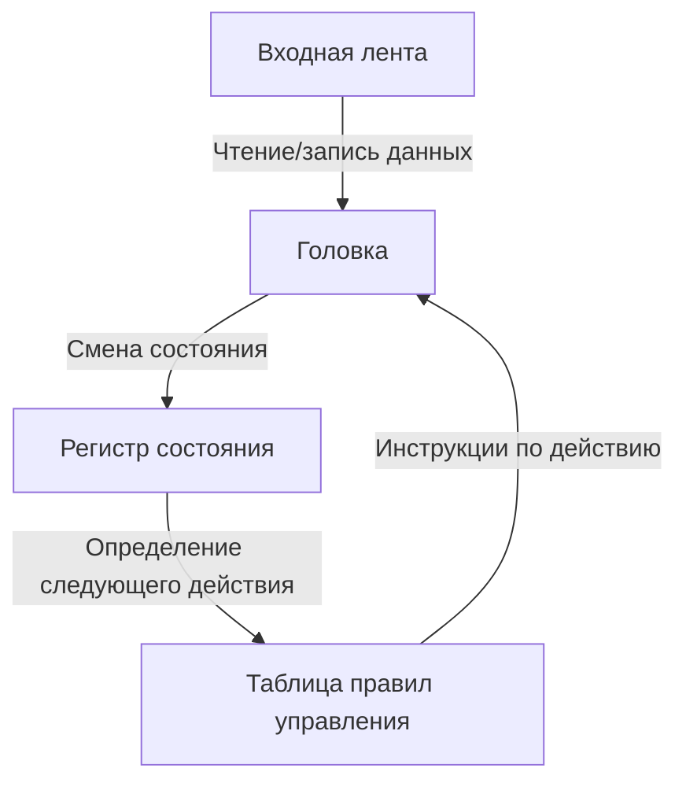
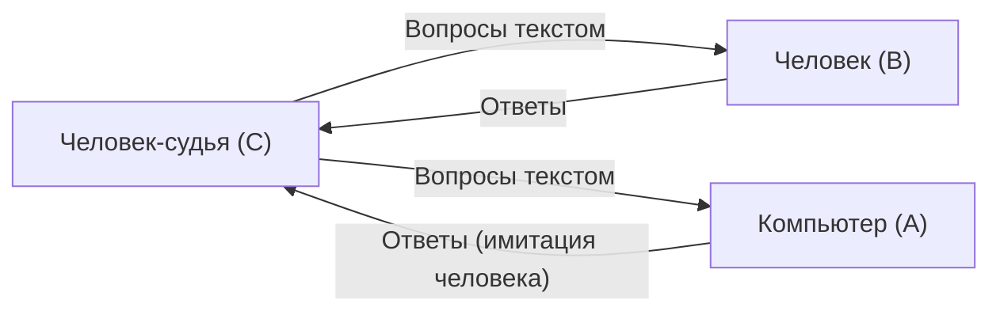

# Алан Тьюринг: Отец ИИ и трагический конец

Современные смартфоны, персональные компьютеры и искусственный интеллект (ИИ), который в последние годы стремительно развивается, — мы воспринимаем все это как должное. Однако теоретическую основу для них заложил один британский математик. Его звали Алан Мэтисон Тьюринг.

Его называют "отцом информатики" и "отцом искусственного интеллекта", а во время Второй мировой войны он стал героем, спасшим миллионы жизней благодаря расшифровке кодов. Однако его жизнь была далеко не гладкой и завершилась жестоко из-за социальных предрассудков. В этой статье мы подробно рассмотрим жизнь Тьюринга, от его ранних лет и революционных идей, которые он подарил миру, до его трагического конца.

## 1. Детство и годы формирования: Зарождение уникального таланта

Алан Тьюринг родился 23 июня 1912 года в лондонском районе Мэйда-Вейл. Поскольку его отец работал государственным служащим в Британской Индии, Тьюринг с ранних лет часто жил вдали от родителей, и ему приходилось проводить время в приемных семьях и школах-интернатах. Эта изолированная среда, возможно, способствовала развитию его интроспективного характера и склонности к глубоким размышлениям.

### Дни в Шерборнской школе

В 13 лет он поступил в престижную публичную школу Шерборн. Однако британское образование того времени уделяло большое внимание классической литературе и латыни, и талант Тьюринга, проявлявшего глубокий интерес к математике и науке, не всегда оценивался по достоинству. Один учитель даже заметил: "Если он собирается стать просто научным специалистом, ему незачем тратить время в этой школе".

Тем не менее, интеллектуальное любопытство Тьюринга не знало границ. Он самостоятельно изучал теорию относительности Эйнштейна и ставил под сомнение законы движения Ньютона, уже тогда демонстрируя признаки гениальности.

### Встреча и расставание с Кристофером Моркомом

Во время учебы в Шерборне произошло событие, оказавшее решающее влияние на жизнь Тьюринга. Это была встреча со старшим на год учеником Кристофером Моркомом. Как и Тьюринг, Морком любил науку и математику, и между ними возникла глубокая интеллектуальная связь. Говорят, что для Тьюринга Морком был больше, чем просто другом, и, возможно, его первой любовью.

Однако это счастливое время длилось недолго: в феврале 1930 года Морком внезапно скончался от бычьего туберкулеза. Это глубокое чувство утраты оставило огромную рану в сердце Тьюринга и в то же время подтолкнуло его к философским вопросам о "границе между разумом и материей". "Существуют ли человеческий дух и сознание после того, как тело умирает?" "Может ли машина имитировать человеческое мышление?" Эти вопросы позже стали движущей силой его исследований в области искусственного интеллекта.

## 2. Кембриджский университет и рождение "машины Тьюринга"

В 1931 году Тьюринг поступил в Королевский колледж Кембриджского университета, где полностью посвятил себя изучению математики и логики. Там он познакомился с идеями таких выдающихся ученых, как Джон фон Нейман и Макс Борн, и значительно расширил свой научный кругозор.

А в 1936 году, в возрасте 24 лет, он опубликовал монументальную статью "О вычислимых числах, с приложением к проблеме разрешения" (On Computable Numbers, with an Application to the Entscheidungsproblem), которая ярко вошла в историю науки XX века.

### Концепция машины Тьюринга

В этой статье Тьюринг дал отрицательный ответ на "проблему разрешения" (Entscheidungsproblem: можно ли истинность всех математических утверждений определить с помощью алгоритма?), выдвинутую математиком Давидом Гильбертом. Однако истинная ценность этой статьи заключалась в созданной им в процессе доказательства модели мысленного эксперимента — "машине Тьюринга" (Turing Machine).

Машина Тьюринга — это предельно простая виртуальная машина, состоящая из бесконечно длинной ленты, головки для чтения и записи на ленту, регистра для хранения внутреннего состояния и таблицы правил, определяющей её действия.

Тьюринг показал, что любые, даже самые сложные вычисления, можно разбить на повторение этих простых операций. Кроме того, он доказал существование "универсальной машины Тьюринга" (Universal Turing Machine), способной имитировать работу любой машины Тьюринга.

Это впервые в мире четко продемонстрировало **фундаментальный принцип современных компьютеров (компьютеров с хранимой программой)**: разделение "аппаратного обеспечения" (самой машины) и "программного обеспечения" (программы) и то, что одна машина может выполнять любые вычисления путем замены программы.

## 3. Вторая мировая война и взлом кодов в Блетчли-парке

С началом Второй мировой войны в 1939 году Тьюринг был призван в Блетчли-парк — штаб-квартиру Правительственной школы кодов и шифров (GC&CS) Великобритании. Его задачей была расшифровка кодов "Энигмы" (Enigma) — самой мощной шифровальной машины нацистской Германии.

### Угроза шифра "Энигма"

"Энигма" была машиной, сочетающей в себе клавиатуру, похожую на пишущую машинку, и несколько роторов (вращающихся дисков) со сложной проводкой. При каждом нажатии клавиши роторы вращались, постоянно меняя правила преобразования букв, поэтому количество комбинаций настроек достигало астрономической цифры — около 159 квинтиллионов (150 миллионов миллионов). Немецкие военные были слишком самоуверены, считая эту систему шифрования "абсолютно нерушимой", и широко использовали её для оперативных указаний, в том числе для подводных лодок (U-boat).

### Разработка "Бомбы" (Bombe)

Опираясь на основы, заложенные польскими криптоаналитиками, Тьюринг спроектировал гигантскую вычислительную машину под названием "Бомба" (Bombe) для механического взлома кодов "Энигмы". "Бомба" была устройством, которое на высокой скорости имитировало вращение роторов "Энигмы" и, последовательно исключая противоречивые настройки, находило правильные (сегодняшний ключ).

Благодаря неустанным усилиям Тьюринга и его команды (особо стоит отметить вклад Гордона Уэлчмана и других), "Бомба" начала работать, и зашифрованные сообщения немецких военных одно за другим становились известными.

### Теневой герой, изменивший историю

Успешный взлом "Энигмы" дал союзникам огромное стратегическое преимущество. В частности, в битве за Атлантику возможность заранее знать расположение немецких подводных лодок и их планы атак напрямую спасла множество конвоев снабжения.

Историки полагают, что если бы не расшифровка кодов в Блетчли-парке, Вторая мировая война затянулась бы как минимум на 2–4 года, и, скорее всего, погибли бы еще миллионы людей. Однако, поскольку эта миссия была совершенно секретной, блестящие достижения Тьюринга оставались неизвестными общественности на протяжении многих десятилетий после окончания войны.

## 4. Рассвет искусственного интеллекта: "Могут ли машины мыслить?"

После войны Тьюринг работал над проектированием ACE (Automatic Computing Engine) в Национальной физической лаборатории (NPL), а затем возглавлял разработку первых компьютеров в Манчестерском университете. Однако он не ограничивался лишь созданием машин для ускорения вычислений. Его интересы смещались в более сложную и философскую область — "искусственный интеллект" (Artificial Intelligence).

В 1950 году он опубликовал революционную статью "Вычислительные машины и разум" (Computing Machinery and Intelligence) в академическом журнале *Mind*. Эта статья начинается с провокационного вопроса: "Могут ли машины мыслить?"

### Тест Тьюринга (Игра в имитацию)

Вместо того чтобы определять субъективное понятие "мыслить", Тьюринг предложил объективно оцениваемый практический тест. Позже он стал известен как "тест Тьюринга" или "Игра в имитацию".

В этом тесте судья, находящийся в изолированной комнате, ведет текстовый диалог как с компьютером, так и с человеком. Если судья не может с уверенностью определить, кто из них человек, а кто — компьютер, то можно считать, что этот компьютер "обладает интеллектом, равным человеческому (мыслит)". Это был новаторский подход.

Эта концепция по-прежнему упоминается как одна из конечных целей в современной разработке ИИ и оказала неизмеримое влияние на развитие обработки естественного языка (NLP) и разговорного ИИ (подобного системе, которая генерирует текст, который вы сейчас читаете).

## 5. Увлечение математической биологией: Разгадка тайны морфогенеза

Гениальность Тьюринга не ограничивалась математикой и информатикой. В свои поздние годы он стал пионером совершенно новой области — "математической биологии".

В 1952 году он опубликовал статью "Химические основы морфогенеза" (The Chemical Basis of Morphogenesis). В ней он показал, что сложные и красивые узоры, встречающиеся в природе, такие как полосы зебры, пятна леопарда или расположение листьев (филлотаксис), можно математически объяснить с помощью процессов реакции и диффузии простых химических веществ (морфогенов).

Уравнения Тьюринга подошли к фундаментальной загадке биологии развития — как живые организмы формируют сложные структуры из единственной клетки, — и это исследование стало в высшей степени прозорливым предшественником современной системной биологии и теории хаоса.

## 6. Гений, убитый эпохой: Трагический конец

В самом расцвете его академической карьеры на Тьюринга внезапно обрушилась трагедия.

В январе 1952 года в дом Тьюринга проник вор. Он сообщил о преступлении в полицию, но в ходе расследования выяснилось, что он имел отношения со своим однополым партнером Арнольдом Мюрреем. В Великобритании того времени гомосексуализм строго наказывался законом как преступление, квалифицируемое как "грубая непристойность" (Gross Indecency).

### Жестокий выбор и химическая кастрация

Тьюринг был признан виновным и вынужден был выбирать между тюремным заключением и гормональным лечением для подавления либидо (фактически, химической кастрацией). Чтобы продолжить свои исследования, он выбрал гормональную терапию (введение эстрогена).

Это лечение нанесло серьезный ущерб его физическому и психическому здоровью. У него появились женские признаки, и он впал в глубокую депрессию. Кроме того, став преступником, он был признан угрозой безопасности, лишен допуска к государственным секретным проектам и потерял работу консультанта по криптографии. Герой, спасший нацию, был лишен этой же нацией всего.

### Отравленное яблоко и смерть, окутанная тайной

8 июня 1954 года Тьюринг был найден мертвым в своей постели дома. Ему был 41 год.

Рядом с кроватью лежало надкушенное яблоко. Вскрытие показало, что причиной смерти стало отравление цианидом (цианистым калием), и полиция пришла к выводу, что он покончил с собой, съев яблоко, в которое ввел цианид. Это был трагический конец, подражающий его любимой сказке "Белоснежка".

(*Однако некоторые исследователи и биографы отмечают вероятность того, что это был несчастный случай во время эксперимента, и правда до сих пор не выяснена до конца.*)

## 7. Посмертная реабилитация и вечное наследие

После смерти Тьюринга многие из его достижений скрывались под завесой военной тайны. Однако, начиная с 1970-х годов, когда деятельность по взлому кодов в Блетчли-парке стала постепенно рассекречиваться, его решающая роль в истории человечества стала широко известна.

### Извинения и помилование

В 2009 году тогдашний премьер-министр Великобритании Гордон Браун от имени правительства принес официальные извинения за несправедливое обращение с Тьюрингом.
"Если бы не его выдающийся вклад, история Второй мировой войны была бы совершенно иной. Обращение, которому он подвергся, было абсолютно несправедливым".

А в 2013 году королева Елизавета II посмертно помиловала Тьюринга (Royal Pardon). В 2017 году вступил в силу так называемый "Закон Тьюринга", по которому были реабилитированы десятки тысяч мужчин, ранее осужденных за гомосексуализм.

### Премия Тьюринга и банкнота в 50 фунтов

Сегодня высшая награда в области компьютерных наук (своеобразная Нобелевская премия в мире компьютеров) носит его имя — "Премия Тьюринга" (Turing Award).
Кроме того, в 2021 году Банк Англии поместил портрет Тьюринга на новую банкноту в 50 фунтов. На ней выгравированы его знаменитые слова:

> "Это лишь предвкушение того, что должно произойти, и только тень того, что будет."
> ("This is only a foretaste of what is to come, and only the shadow of what is going to be.")

### Наследие, продолжающееся в наши дни

Жизнь Алана Тьюринга длилась всего 41 год и оборвалась слишком несправедливо. Но семена, которые он посеял, выросли в гигантский лес современного цифрового общества.

Каждый раз, когда мы отправляем сообщение со смартфона, задаем вопрос ИИ или мгновенно выполняем сложные вычисления, в этом живет душа гения — Алана Тьюринга. Его жизнь продолжает служить человечеству вечным уроком о безграничных возможностях разума и трагедиях, порождаемых социальными предрассудками.
