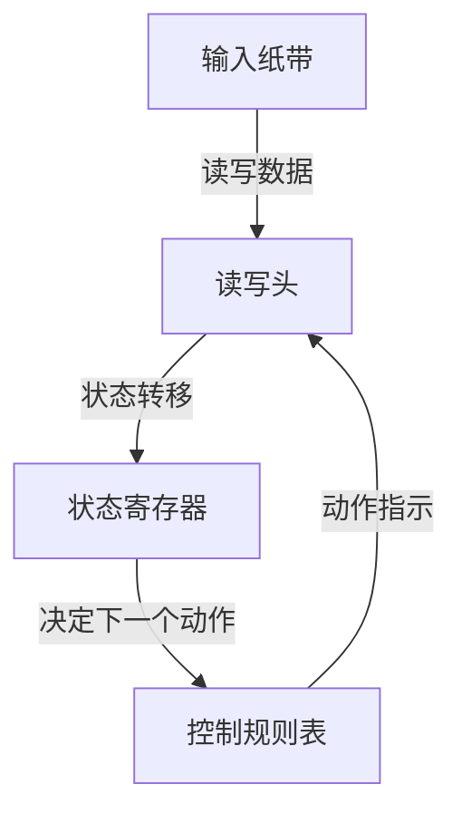
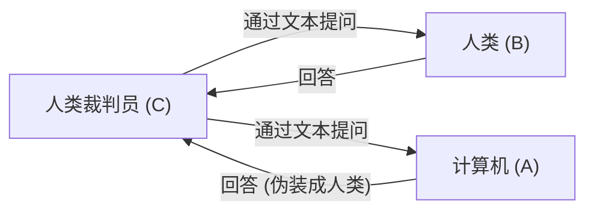

# 艾伦·图灵：AI之父与悲剧性的结局

现代我们习以为常地使用的智能手机、个人电脑，以及近年来飞速发展的人工智能（AI）。构建这些底层理论基础的，是一位英国数学家。他的名字是艾伦·麦席森·图灵（Alan Mathison Turing）。

他被称为“计算机科学之父”和“人工智能之父”，在第二次世界大战期间通过破解密码拯救了数百万人的生命，是一位英雄。然而，他的一生绝非平坦，最终因社会的偏见以残酷的方式落下帷幕。在本文中，我们将从图灵的成长经历，到他为世界带来的革命性思想，再到他悲剧性的结局，极其详细地剖析他的一生。

## 1. 童年与成长期：独特天赋的萌芽

艾伦·图灵于1912年6月23日出生于伦敦的梅达韦达尔。由于父亲在英属印度帝国（现印度）担任公务员，图灵从小就经常与父母分离，被迫在寄养家庭和寄宿学校生活。这种孤独的环境或许使他形成了内省且善于深入独立思考的性格。

### 舍伯恩学校的岁月

13岁时，他进入了著名的公学——舍伯恩学校（Sherborne School）。然而，当时英国的教育侧重于古典文学和拉丁语，图灵对数学和科学表现出的浓厚兴趣和天赋并没有得到公正的评价。一位老师甚至评价道：“如果他只想成为一名科学专家，那么待在这个学校就是浪费时间。”

尽管如此，图灵的求知欲并未停滞，他自学并理解了爱因斯坦的相对论，甚至对牛顿的运动定律提出质疑，早已展现出天才的锋芒。

### 与克里斯托弗·莫尔科姆的相遇与离别

在舍伯恩学校时期，发生了一件对图灵人生影响深远的事件。那就是他遇到了比自己大一岁的学生克里斯托弗·莫尔科姆（Christopher Morcom）。莫尔科姆和图灵一样热爱科学和数学，两人结下了深厚的知识纽带。对图灵来说，莫尔科姆不仅是朋友，甚至被认为是他初恋的对象。

然而，这段幸福的时光很短暂，1930年2月，莫尔科姆因牛结核病突然离世。这种深深的失落感不仅在图灵的心中留下了巨大的创伤，同时也驱使他去探寻“心智与物质边界”这一哲学问题。“人类的精神和意识在肉体消亡后还会存在吗？”“机器能否模仿人类的思考？”这些问题成为了他日后投身人工智能研究的动力。

## 2. 剑桥大学与“图灵机”的诞生

1931年，图灵进入剑桥大学国王学院，开始潜心于数学和逻辑学的研究。在这里，他接触到了约翰·冯·诺伊曼（John von Neumann）和马克斯·玻恩（Max Born）等一流科学家的思想，极大地拓展了学术视野。

随后在1936年，年仅24岁的他发表了在20世纪科学史上熠熠生辉的里程碑式论文——《论可计算数及其在判定问题上的应用》（On Computable Numbers, with an Application to the Entscheidungsproblem）。

### 图灵机的概念

在这篇论文中，图灵对数学家大卫·希尔伯特提出的“判定问题”（Entscheidungsproblem：是否所有的数学命题都可以通过算法判定真伪）给出了“否”的证明。但是，这篇论文的真正价值在于，他在证明过程中构思出了名为“图灵机”（Turing Machine）的思想实验模型。

图灵机是一台极其简单的虚拟机器，由一条无限长的纸带、读写纸带的读写头、记忆内部状态的寄存器以及决定动作的规则表组成。

图灵证明了，无论多么复杂的计算，都可以分解为这种简单操作的重复。此外，他还证明了可以模仿任何图灵机动作的“通用图灵机”（Universal Turing Machine）的存在。

这在世界上首次明确展示了**现代计算机（程序存储式计算机）的根本原理**：将“硬件（机器本体）”和“软件（程序）”分离，通过替换程序，同一台机器就能执行任何计算。

## 3. 第二次世界大战与布莱切利园的密码破解

1939年第二次世界大战爆发后，图灵被征召至英国政府密码学校（GC&CS）的基地布莱切利园（Bletchley Park）。他的任务是破解纳粹德国引以为傲的最强密码机“恩尼格玛”（Enigma）。

### 恩尼格玛密码的威胁

恩尼格玛是一台类似打字机键盘并结合了多个具有复杂布线的转子的机器。每次按下按键，转子就会旋转，字符的转换规则不断变化，因此其设置组合高达约1.5亿的1亿倍（159艾）这种天文数字。德军盲目自信地认为这种密码系统“绝对无法破解”，并将其广泛用于U型潜艇的作战指示等。

### 炸弹机（Bombe）的开发

在波兰密码破译者奠定的基础之上，图灵设计了一台用于机械破解恩尼格玛密码的巨大计算机——“炸弹机”（Bombe）。炸弹机能够高速模拟恩尼格玛转子的旋转，不断排除矛盾的设置，从而推导出正确的设置（即今天的密钥）。

在图灵及其团队（特别是戈登·韦尔奇曼等人的巨大贡献）的不懈努力下，炸弹机开始运转，德军的密码通信接连曝光在光天化日之下。

### 改变历史的幕后英雄

恩尼格玛密码的成功破解，为盟军带来了巨大的战略优势。特别是在大西洋海战中，能够提前掌握德国U型潜艇的部署和攻击计划，直接挽救了大量补给船队。

历史学家推测，如果没有布莱切利园的密码破解，第二次世界大战至少会延长2到4年，并可能导致数百万人丧生。然而，由于这项任务是最高机密，图灵辉煌的成就在战后几十年里都不为世人所知。

## 4. 人工智能的曙光：“机器能思考吗？”

战后，图灵在国家物理实验室（NPL）参与了ACE（自动计算引擎）的设计，随后又在曼彻斯特大学引领了早期计算机的开发。他并不满足于仅仅制造出能加快计算速度的机器。他的兴趣转向了更高级、更具哲学意味的领域，即“人工智能”（Artificial Intelligence）。

1950年，他在学术期刊《Mind》上发表了一篇划时代的论文——《计算机器与智能》（Computing Machinery and Intelligence）。这篇论文以一个挑衅性的问题开篇：“机器能思考吗？”

### 图灵测试（模仿游戏）

图灵并没有去定义“思考”这一主观概念，而是提出了一项可客观评估的实用测试。这就是后来被称为“图灵测试”的“模仿游戏”。

在这个测试中，被隔离在房间里的裁判员将同时与计算机和人类进行基于文本的对话。如果裁判员无法确信地分辨出哪个是人类、哪个是计算机，那么这台计算机就可以被认为“具有与人类同等的智能（正在思考）”。这是一种极具开创性的方法。

这一概念作为现代AI开发的终极目标之一，至今仍被反复提及，对自然语言处理（NLP）和对话型AI（正是生成你现在正在阅读的文章的系统）的发展产生了不可估量的影响。

## 5. 倾心数理生物学：挑战形态发生的奥秘

图灵的天才并未局限于数学和计算机科学领域。晚年，他开创了一个全新的领域——“数理生物学”。

1952年，他发表了论文《形态发生的化学基础》（The Chemical Basis of Morphogenesis）。在其中，他提出可以通过简单的化学物质（形态发生素）的反应和扩散过程（反应-扩散系统），从数学上解释自然界中斑马的条纹、豹子的斑点、叶子的排列（叶序）等复杂而美丽的图案。

图灵方程触及了发育生物学中的根本谜团，即生物如何从单个细胞构建出复杂的结构，这是一项极具远见的研究，成为了现代系统生物学和混沌理论的先驱。

## 6. 被时代抹杀的天才：悲剧性的结局

在学术生涯的巅峰时期，悲剧突然降临在图灵身上。

1952年1月，图灵的家中遭遇了盗窃。他向警方报案，但在调查过程中，他与同性恋人阿诺德·默里的关系被曝光。在当时的英国，同性恋被视为“严重猥亵罪”（Gross Indecency），受到法律的严惩。

### 残酷的选择与化学阉割

图灵被判有罪，并被迫在入狱和接受旨在减退性欲的荷尔蒙治疗（实质上的化学阉割）之间做出选择。为了继续研究，他选择了荷尔蒙治疗（注射雌激素）。

这种治疗对他的身心造成了严重的伤害。他的身体出现了女性特征，精神上也陷入了深度抑郁。此外，由于成为罪犯，他被视为安全威胁，被剥夺了访问政府机密项目的权限（安全许可），也失去了作为密码技术顾问的工作。拯救了国家的英雄，却被这个国家夺走了一切。

### 毒苹果与谜团重重的死亡

1954年6月8日，图灵被发现死在自己家中的床上，享年41岁。

床边留着一个被咬了一半的苹果。尸检结果显示，死因是氰化物（氰化钾）中毒，警方断定他是吃下了注射了氰化物的苹果自杀身亡的。这模仿了他所喜爱的童话故事《白雪公主》，是一个悲剧性的结局。

（※不过，一些研究人员和传记作家也指出，这可能是一场实验中的意外事故，真相至今仍未完全解开。）

## 7. 死后名誉恢复与永恒的遗产

图灵死后，他的许多成就被隐藏在军事机密的面纱之下。然而，20世纪70年代以后，随着布莱切利园密码破解活动的逐渐公开，他在人类历史中发挥的决定性作用才开始为世人所知。

### 道歉与赦免

2009年，时任英国首相戈登·布朗代表政府对图灵受到的不公正待遇正式道歉：
“如果没有他的杰出贡献，第二次世界大战的历史将大不相同。他受到的待遇是极其不公正的。”

2013年，英国女王伊丽莎白二世向图灵颁发了死后皇家赦免（Royal Pardon）。2017年，俗称的“图灵法案”生效，数万名过去因同性恋罪名被定罪的男性也恢复了名誉。

### 图灵奖与50英镑纸币

今天，计算机科学领域的最高奖项（计算机界的诺贝尔奖）以他的名字命名，称为“图灵奖”（Turing Award）。
此外，在2021年，英格兰银行发行的新版50英镑纸币上印有图灵的肖像。上面刻着他的一句名言：

> “这不过是未来之事的预演，不过是未来之事的影子。”
> （"This is only a foretaste of what is to come, and only the shadow of what is going to be."）

### 延续至现代的遗产

艾伦·图灵的一生在41岁这短暂而极其荒谬的时刻画上了句号。然而，他播下的种子已经长成了现代数字社会这片巨大的森林。

每当我们用智能手机发送消息、向AI提出问题，或在瞬间执行复杂的计算时，都有艾伦·图灵这位天才的灵魂在其中跳动。他的一生，将智力的无限可能性与社会偏见带来的悲剧作为对人类的永恒教训，继续向我们展示着。
