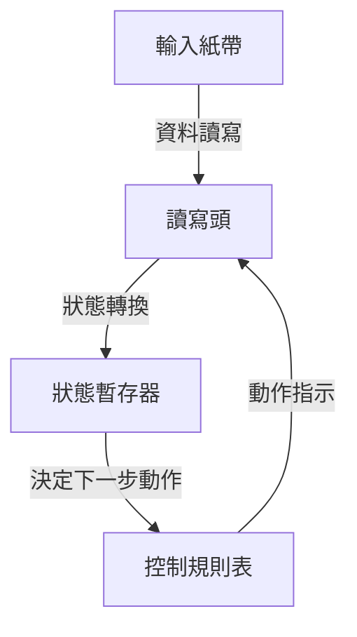
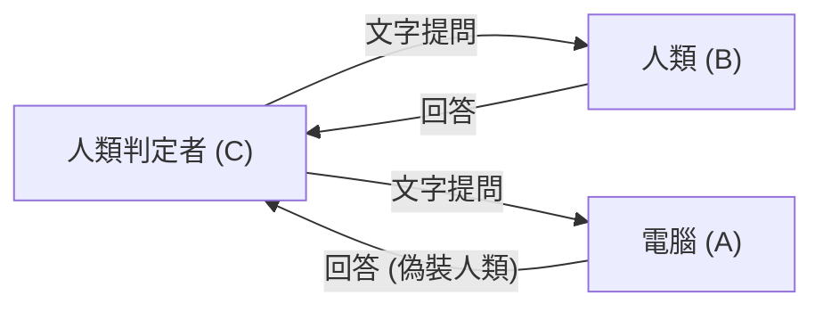

# 艾倫·圖靈：AI之父與悲劇的終結

現代我們習以為常使用的智慧型手機、個人電腦，以及近年來突飛猛進的人工智慧（AI）。為這些科技建構底層理論基礎的，是一位英國數學家。他的名字是艾倫·麥席森·圖靈（Alan Mathison Turing）。

他被譽為「電腦科學之父」與「人工智慧之父」，在第二次世界大戰期間，他更是一位透過破解密碼拯救了數百萬人生命的英雄。然而，他的一生絕非平坦，最終因社會的偏見而以殘酷的方式落下帷幕。本篇文章將詳細探究圖靈的生平，從他的成長背景、為世界帶來革命性改變的點子，直到他悲慘的離世。

## 1. 童年與成長期：異稟天賦的萌芽

艾倫·圖靈於1912年6月23日出生在倫敦的梅達維爾。由於他的父親當時在英屬印度帝國（現今的印度）擔任公務員，圖靈從小就經常與父母分離，被迫在寄養家庭和寄宿學校生活。或許正是這種孤獨的環境，造就了他內省且擅長深入獨立思考的性格。

### 謝伯恩學校的日子

13歲時，他進入了著名的公學——謝伯恩學校。然而，當時的英國教育極度重視古典文學與拉丁文，圖靈對數學和科學展現出的強烈興趣及天賦，並未獲得應有的評價。甚至有老師評論道：「如果他只想成為一個科學專家，那待在這所學校簡直是浪費時間。」

儘管如此，圖靈的求知慾並未因此停歇。他透過自學理解了愛因斯坦的相對論，並對牛頓的運動定律提出質疑，早已展現出天才的鋒芒。

### 與克里斯多福·莫爾康的相遇與訣別

在謝伯恩學校時期，發生了一件對圖靈人生產生決定性影響的事件。那就是他遇見了比自己大一歲的學生克里斯多福·莫爾康（Christopher Morcom）。莫爾康和圖靈一樣熱愛科學與數學，兩人締結了深厚的知識羈絆。對圖靈而言，莫爾康不僅是朋友，更被認為是他的初戀。

然而，這段幸福的時光非常短暫。1930年2月，莫爾康因牛結核病突然辭世。這種深深的喪失感在圖靈心中留下了巨大的創傷，同時也驅使他去探索「心靈與物質的邊界」這種哲學問題：「人類的精神與意識，在肉體毀滅後是否依然存在？」「機器有可能模仿人類的思考嗎？」。這些疑問成為了他日後投身人工智慧研究的原動力。

## 2. 劍橋大學與「圖靈機」的誕生

1931年，圖靈進入劍橋大學國王學院，開始正式埋首於數學與邏輯學的研究。在這裡，他接觸到了約翰·馮·紐曼（John von Neumann）與馬克斯·玻恩（Max Born）等頂尖科學家的思想，進一步拓展了他的學術視野。

接著在1936年，年僅24歲的他發表了一篇在20世紀科學史上閃耀著不朽光芒的里程碑論文：《論可計算數及其在判定性問題上的應用》（On Computable Numbers, with an Application to the Entscheidungsproblem）。

### 圖靈機的概念

在這篇論文中，圖靈針對數學家大衛·希爾伯特（David Hilbert）所提出的「判定性問題（Entscheidungsproblem：是否所有的數學命題都能透過演算法來判定真偽？）」給出了「否」的證明。然而，這篇論文的真正價值，在於他在證明過程中構思出的一個名為「圖靈機（Turing Machine）」的思想實驗模型。

圖靈機是一個極為簡單的虛擬機器，由一條無限長的紙帶、一個讀寫紙帶的讀寫頭、一個記錄內部狀態的暫存器，以及一個決定動作的規則表所組成。

圖靈證明了，無論多麼複雜的計算，都能分解為這些簡單操作的重複。他更進一步證明了「通用圖靈機（Universal Turing Machine）」的存在，這種機器可以模仿任何圖靈機的運作。

這在世界上首次明確展示了將「硬體（機器實體）」與「軟體（程式）」分離，只需更換程式就能讓同一台機器執行任何計算的**現代電腦（內儲程式型電腦）的核心原理**。

## 3. 第二次世界大戰與布萊切利園的密碼破解

1939年，第二次世界大戰爆發，圖靈被徵召至英國政府密碼學校（GC&CS）的基地——布萊切利園（Bletchley Park）。他的任務是破解納粹德國引以為傲的最強密碼機「恩尼格瑪（Enigma）」。

### 恩尼格瑪密碼機的威脅

恩尼格瑪密碼機結合了類似打字機的鍵盤以及具有複雜配線的多個轉子。每按鍵一次轉子就會轉動，導致字母的轉換規則不斷變化。其設定組合數量高達約1億5000萬的1億倍（159垓）這個天文數字。德軍深信這套密碼系統「絕對無法破解」，因此被廣泛應用於U型潛艇的作戰指令等軍事通訊中。

### 炸彈機（Bombe）的開發

在波蘭密碼學家奠定的基礎上，圖靈設計出了一台名為「炸彈機（Bombe）」的巨大計算機，以機械方式來破解恩尼格瑪密碼。炸彈機能夠高速模擬恩尼格瑪轉子的旋轉，透過不斷排除矛盾的設定，推導出正確的設定（即現今所稱的金鑰）。

在圖靈及其團隊（其中戈登·韋爾奇曼等人的貢獻也極大）的不懈努力下，炸彈機開始運作，德軍的密碼通訊隨之被一一解開。

### 改變歷史的幕後英雄

恩尼格瑪密碼被成功破解，為盟軍帶來了巨大的戰略優勢。特別是在大西洋海戰中，能夠提前掌握德國U型潛艇的部署與攻擊計畫，直接拯救了無數補給船隊。

歷史學家推測，如果沒有布萊切利園的密碼破解工作，第二次世界大戰至少會延長2至4年，並可能導致數百萬人喪生。然而，由於這項任務屬於最高機密，圖靈輝煌的功績在戰後數十年間都不為世人所知。

## 4. 人工智慧的黎明：「機器能思考嗎？」

戰後，圖靈在國家物理實驗室（NPL）參與了ACE（自動計算引擎）的設計，隨後又在曼徹斯特大學帶領了早期電腦的開發工作。但他並不滿足於僅僅製造一台加速計算的機器。他的興趣逐漸轉向更高深、更具哲學意味的領域，也就是「人工智慧（Artificial Intelligence）」。

1950年，他在學術期刊《Mind》上發表了名為《計算機器與智慧》（Computing Machinery and Intelligence）的劃時代論文。這篇論文以一個充滿挑釁意味的問題開篇：「機器能思考嗎？」。

### 圖靈測試（模仿遊戲）

圖靈沒有試圖去定義「思考」這個主觀概念，而是提出了一個能夠客觀評估的實用測試。這就是後來被稱為「圖靈測試」的「模仿遊戲」。

在這個測試中，身處隔離房間的判定者將同時與一台電腦和一個人進行純文字對話。如果判定者無法確信地分辨出哪個是人類、哪個是電腦，那麼這台電腦就可以被視為「擁有與人類同等的智慧（具備思考能力）」。這是一個極具突破性的方法。

這個概念至今仍被視為現代AI開發的終極目標之一被反覆提及，對自然語言處理（NLP）與對話式AI（就像正在生成你閱讀的這篇文章的系統）的發展產生了無可估量的影響。

## 5. 傾心數理生物學：挑戰形態發生的謎團

圖靈的天才並未局限於數學和電腦科學的框架內。晚年時期，他開創了一個全新的領域——「數理生物學」。

1952年，他發表了《形態發生的化學基礎》（The Chemical Basis of Morphogenesis）一文。在論文中，他展示了自然界中那些複雜又美麗的圖案，如斑馬的條紋、豹的斑點、植物葉片的排列（葉序）等，都可以透過簡單的化學物質（形態發生素）的反應與擴散過程（反應擴散系統）進行數學上的解釋。

圖靈方程式觸及了發育生物學中最根本的謎團：生物究竟是如何從單一細胞生長出複雜結構的？這是一項極具遠見的研究，成為了當今系統生物學與混沌理論的先驅。

## 6. 被時代扼殺的天才：悲劇的終結

正當學術生涯處於巔峰之際，一場悲劇突然降臨在圖靈身上。

1952年1月，圖靈的住處遭到闖空門。他向警方報案，但在調查過程中，他與同性伴侶阿諾德·默里（Arnold Murray）的關係意外曝光。在當時的英國，同性戀被視為「嚴重猥褻罪（Gross Indecency）」，是受到法律嚴厲懲罰的犯罪行為。

### 殘酷的選擇與化學閹割

圖靈被判有罪，被迫在入獄服刑和接受減少性慾的荷爾蒙治療（實質上的化學閹割）之間做出選擇。為了能夠繼續研究，他選擇了荷爾蒙治療（注射雌激素）。

這項治療對他的身心造成了嚴重的破壞。他的身體出現了女性特徵，精神也陷入極度抑鬱。此外，作為一名罪犯，他被視為安全威脅，遭剝奪了參與政府機密計畫的權限（安全許可），也失去了密碼技術顧問的工作。曾經拯救國家的英雄，卻被國家奪走了一切。

### 毒蘋果與充滿謎團的死亡

1954年6月8日，圖靈被發現死在自家的床上，享年41歲。

床邊留下了一顆咬了一半的蘋果。驗屍結果顯示，死因是氰化物（氰化鉀）中毒。警方判定他是吃下了注射有氰化物的蘋果而自殺。這與他喜愛的童話《白雪公主》如出一轍，是一個充滿悲劇色彩的結局。

（※然而，也有部分研究人員和傳記作家指出這可能是實驗過程中的意外，真相至今仍未完全解開。）

## 7. 死後的平反與永恆的遺產

圖靈死後，他的許多成就仍被隱藏在軍事機密的帷幕之下。然而，自1970年代起，隨著布萊切利園的密碼破解活動逐漸公開，他在人類歷史上扮演的關鍵角色才廣為世人所知。

### 道歉與赦免

2009年，時任英國首相戈登·布朗（Gordon Brown）代表政府對圖靈遭受的不公平對待公開致歉：
「如果沒有他傑出的貢獻，第二次世界大戰的歷史將會截然不同。他所遭受的對待是完全不公平的。」

隨後在2013年，伊莉莎白女王頒發了皇家赦免令（Royal Pardon），正式為圖靈死後平反。2017年，俗稱的「圖靈法」生效，過去因同性戀罪名被定罪的數萬名男性也因此恢復了名譽。

### 圖靈獎與£50紙鈔

如今，電腦科學領域的最高榮譽（被譽為電腦界的諾貝爾獎）便以他的名字命名為「圖靈獎（Turing Award）」。
此外，在2021年，英格蘭銀行發行的新版50英鎊紙鈔也採用了圖靈的肖像，上面刻著他的名言：

> 「這不過是未來之事的預演，這不過是將至之事的影子。」
> （"This is only a foretaste of what is to come, and only the shadow of what is going to be."）

### 延續至今的遺產

艾倫·圖靈的一生在41歲那年畫下了短暫且極度不合理的休止符。然而，他播下的種子如今已成長為現代數位社會這片廣闊的森林。

每當我們用智慧型手機傳送訊息、向AI提問、或是瞬間執行複雜計算時，艾倫·圖靈這位天才的靈魂便在其中呼吸著。他的人生將人類智慧的無限可能，以及社會偏見所造成的悲劇，化作永恆的教訓，繼續向我們展現。
