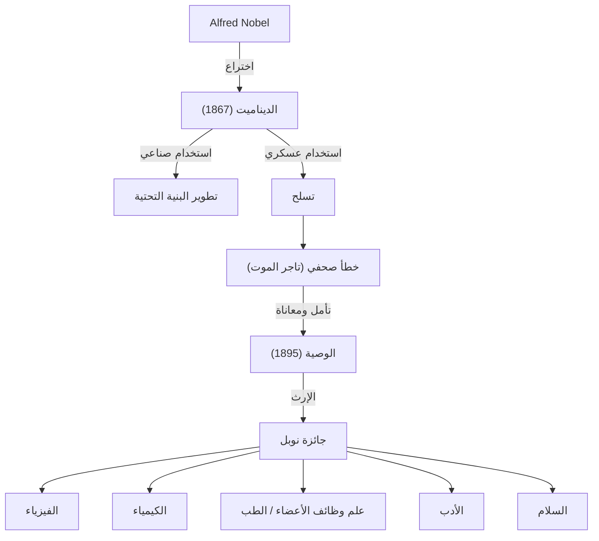

جمع ألفريد نوبل ثروة طائلة من خلال اختراع الديناميت وأسس جائزة نوبل بإرثه. جسدت حياته النور والظل اللذين جلبهما تطور العلوم والتكنولوجيا.

## الموهبة كمخترع وميلاد الديناميت

وُلد ألفريد نوبل في ستوكهولم، السويد عام 1833. متجاوزاً مأساة فقدان شقيقه في حادث انفجار النيتروجليسرين، كرس نوبل نفسه لتطوير متفجرات آمنة. في عام 1867، اخترع "الديناميت"، الذي أحدث ثورة في تطوير البنية التحتية وجلب له ثروة هائلة.

## وصمة "تاجر الموت"

استُخدم الديناميت في النهاية عسكرياً كسلاح. في عام 1888، عندما توفي شقيقه لودفيج، اعتقدت صحيفة فرنسية بالخطأ أنه ألفريد ونشرت: "مات تاجر الموت".
شعر نوبل بصدمة عميقة وبدأ يفكر جدياً في كيفية رد إرثه للمجتمع.

## أمنية للسلام: تأسيس جائزة نوبل

في وصيته عام 1895، كرس نوبل ثروته لمكافأة أولئك الذين قدموا أكبر فائدة للبشرية.

## التأثير على الأجيال القادمة والفلسفة

ترمز حياة ألفريد نوبل إلى الطبيعة المزدوجة للعلم والتكنولوجيا. اليوم، تستمر جائزة نوبل في كونها هدف العلماء ونشطاء السلام، وتضيء طريق البشرية نحو مستقبل أفضل.
