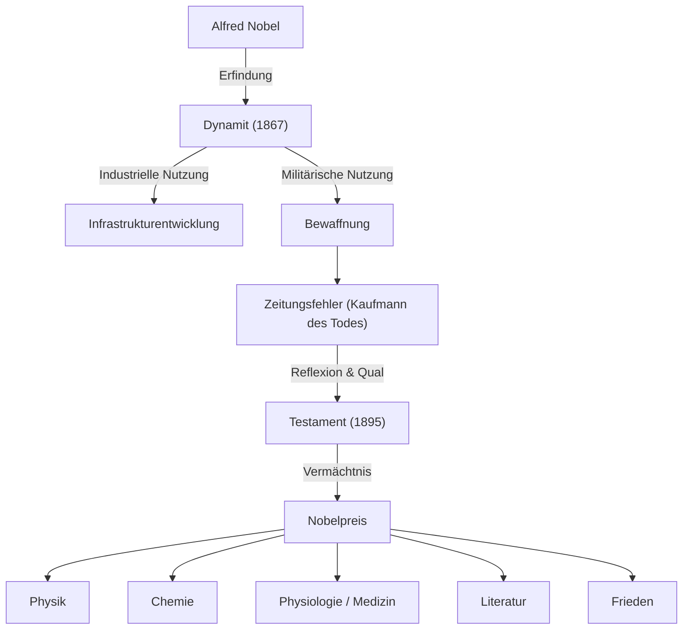

Alfred Nobel häufte durch die Erfindung des Dynamits ein riesiges Vermögen an und stiftete mit seinem Vermächtnis den Nobelpreis. Sein Leben verkörperte Licht und Schatten, die die Entwicklung von Wissenschaft und Technik mit sich brachten. 

## Talent als Erfinder und die Geburt des Dynamits

Alfred Bernhard Nobel wurde 1833 in Stockholm geboren. Er sprach fließend Schwedisch, Russisch, Französisch, Englisch und Deutsch.

Damals galt Nitroglycerin als starker Sprengstoff, war jedoch extrem instabil. Sein jüngerer Bruder Emil verlor durch eine Explosion sein Leben.

Nobel widmete sich der Entwicklung sicherer Sprengstoffe. 1867 erfand er das "Dynamit", was ihm weltweiten Reichtum durch Fabriken einbrachte.

## Das Stigma des "Kaufmanns des Todes"

Dynamit wurde ursprünglich für friedliche Zwecke entwickelt. Durch Kriege forderte es jedoch als Waffe viele Menschenleben.

1888 starb sein Bruder Ludvig in Cannes. Eine französische Zeitung hielt fälschlicherweise Alfred für tot und titelte: "Der Kaufmann des Todes ist tot". Nobel war zutiefst schockiert.

Er befürchtete, als Kaufmann des Todes in Erinnerung zu bleiben, und überlegte, wie er der Gesellschaft sein Erbe zurückgeben konnte.

## Ein Wunsch nach Frieden: Die Stiftung des Nobelpreises

In seinem Testament von 1895 verfügte der unverheiratete Nobel, dass der Großteil seines Vermögens zur Auszeichnung derjenigen verwendet werden sollte, die der Menschheit den größten Nutzen erbracht hatten.

Dies war der Beginn des "Nobelpreises" (Physik, Chemie, Physiologie/Medizin, Literatur und Frieden).

Bertha von Suttner hatte großen Einfluss auf die Stiftung des Friedenspreises, der seine Sühne und sein Gebet für eine friedliche Welt verkörperte.

## Auswirkungen auf zukünftige Generationen und Philosophie

Alfred Nobels Leben symbolisiert die Doppelnatur von Wissenschaft und Technik. Heute ist der Nobelpreis weiterhin das Ziel von Wissenschaftlern und Friedensaktivisten und beleuchtet den Weg der Menschheit in eine bessere Zukunft.
