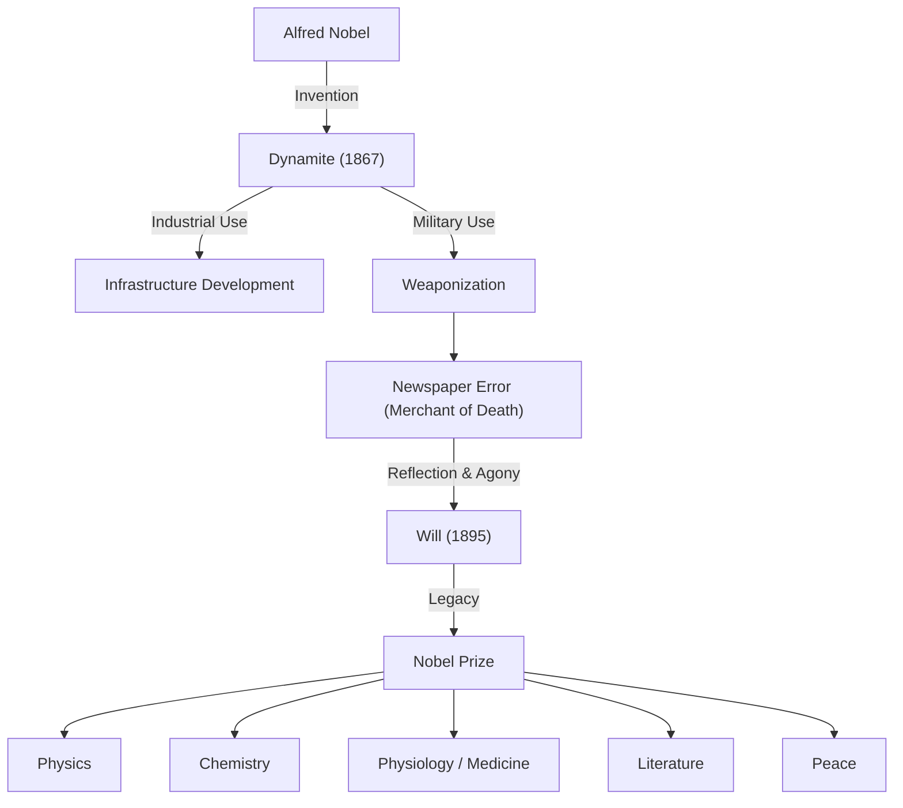

Alfred Nobel, who amassed a vast fortune through the invention of dynamite and established the Nobel Prize with his legacy. His life embodied the light and shadow brought about by the development of science and technology. In this article, we delve deep into his extraordinary talent as an inventor, his agony of being called the "merchant of death," and his wish for peace entrusted to the future.

## Talent as an Inventor and the Birth of Dynamite

Alfred Bernhard Nobel was born in Stockholm, Sweden, in 1833. His father was also an inventor and engineer, and Alfred grew up surrounded by engineering and chemistry from an early age. He was also fluent in languages; by the age of 17, he could fluently speak Swedish, Russian, French, English, and German.

In civil engineering and mining at the time, nitroglycerin was attracting attention as a powerful explosive to replace black powder. However, nitroglycerin was extremely unstable, a dangerous substance that would explode even with a slight impact. In fact, Nobel's younger brother Emil also lost his life in a nitroglycerin explosion accident.

Overcoming this tragedy, Nobel devoted himself to developing explosives that could be handled safely. In 1867, he discovered a groundbreaking method to stabilize nitroglycerin by soaking it in diatomaceous earth, and patented it as "dynamite." Thanks to this invention, infrastructure development such as tunnel excavation and railway construction progressed dramatically, and Nobel built factories all over the world, amassing enormous wealth.

## The Stigma and Agony of the "Merchant of Death"

Dynamite was originally developed for industrial development and peaceful purposes. However, due to its tremendous destructive power, it gradually came to be used for military purposes as a weapon. Through the Franco-Prussian War and other conflicts, Nobel's explosives resulted in taking many lives as tools of war.

A turning point came in 1888 when his brother Ludvig died in Cannes, France. A French newspaper mistakenly thought Alfred himself had died and published an obituary with the headline, "Le marchand de la mort est mort" (The merchant of death is dead). Nobel was deeply shocked to read this article, which described him as a man who "became rich by finding ways to kill more people faster than ever before."

Fearing that his life would be remembered as a "merchant of death," he began to think seriously about how to give his legacy back to society and what kind of memory to leave for posterity.

## A Wish for Peace: The Establishment of the Nobel Prize

Nobel remained unmarried throughout his life and made the decision to dedicate his wealth to the development of humanity rather than his relatives. In his will drawn up in 1895, it was written that the bulk of his fortune (about 31 million Swedish kronor) would be used as a fund to award prizes to those who had conferred the greatest benefit to humankind, regardless of nationality.

This is the beginning of the present "Nobel Prize." The fields he specified were Physics, Chemistry, Physiology or Medicine, Literature, and Peace (the prize in Economic Sciences was added later).

It is said that Bertha von Suttner (later the first woman to be awarded the Nobel Peace Prize), who was his former secretary and a peace activist, had a strong influence on the establishment of the "Peace Prize" in particular. It embodied his atonement for his past involvement in military technology and a strong prayer for a peaceful world.

## Impact on Future Generations and Philosophy

Nobel is said to have stated, "My factories may make an end of war sooner than your congresses." He held the idea that the existence of weapons with overwhelming destructive power would rather serve as a deterrent to war (close to the concept of mutual assured destruction). This was a complex philosophy that connects to modern nuclear deterrence theory.

Alfred Nobel's life symbolizes the dual nature of science and technology. Technology can either enrich humanity or lead it to ruin, depending on how it is used. Without turning his eyes away from the tragic reality created by his own invention, he invested his entire fortune to build a system that celebrates human wisdom and peace.

Today, the Nobel Prize continues to be the goal of scientists and peace activists as the most prestigious award in the world. The man once called the "merchant of death" eventually succeeded in etching his name in history as a "patron of peace and intellect." His legacy continues to illuminate the path of humanity towards a better future today.
