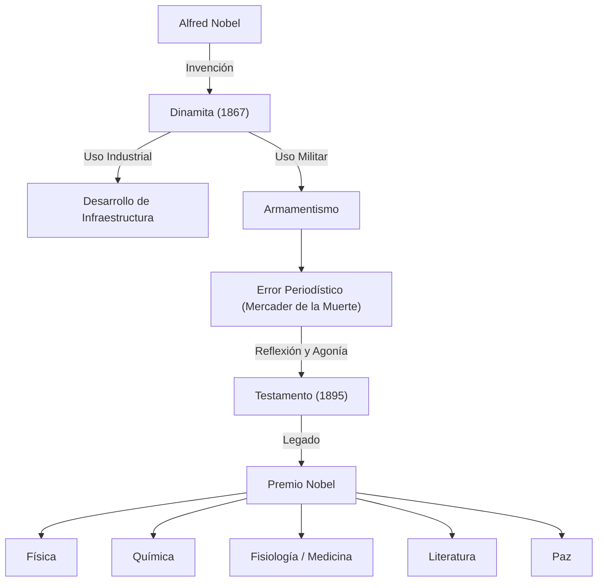

Alfred Nobel acumuló una gran fortuna gracias a la invención de la dinamita y estableció el Premio Nobel con su legado. Su vida encarnó las luces y sombras del desarrollo científico y tecnológico. En este artículo profundizamos en su extraordinario talento como inventor, su agonía al ser llamado el "mercader de la muerte" y su deseo de paz confiado al futuro.

## Talento como inventor y el nacimiento de la dinamita

Alfred Bernhard Nobel nació en Estocolmo, Suecia, en 1833. Su padre también era inventor e ingeniero, y Alfred creció rodeado de ingeniería y química desde temprana edad. También dominaba varios idiomas; a los 17 años hablaba con fluidez sueco, ruso, francés, inglés y alemán.

En la ingeniería civil y minería de la época, la nitroglicerina llamaba la atención como un explosivo potente para reemplazar la pólvora negra. Sin embargo, la nitroglicerina era extremadamente inestable y peligrosa, explotando incluso con un impacto leve. De hecho, el hermano menor de Nobel, Emil, perdió la vida en un accidente con nitroglicerina.

Superando esta tragedia, Nobel se dedicó a desarrollar explosivos que pudieran manejarse de manera segura. En 1867, descubrió un método innovador para estabilizar la nitroglicerina empapándola en tierra de diatomeas, patentándolo como "dinamita". Gracias a este invento, el desarrollo de infraestructuras progresó drásticamente, y Nobel construyó fábricas en todo el mundo, acumulando una enorme riqueza.

## El estigma y la agonía del "Mercader de la Muerte"

La dinamita fue desarrollada originalmente para el desarrollo industrial y propósitos pacíficos. Sin embargo, debido a su enorme poder destructivo, poco a poco comenzó a utilizarse con fines militares. A través de la Guerra Franco-Prusiana y otros conflictos, los explosivos de Nobel arrebataron muchas vidas como herramientas de guerra.

Un punto de inflexión llegó en 1888 cuando su hermano Ludvig murió en Cannes, Francia. Un periódico francés creyó erróneamente que era el propio Alfred quien había fallecido y publicó un obituario con el titular: "El mercader de la muerte ha muerto". Nobel quedó profundamente conmocionado al leer este artículo.

Temiendo que su vida fuera recordada como la de un "mercader de la muerte", comenzó a pensar seriamente en cómo devolver su legado a la sociedad y qué clase de memoria dejar para la posteridad.

## Un deseo de paz: La creación del Premio Nobel

Nobel permaneció soltero toda su vida y tomó la decisión de dedicar su riqueza al desarrollo de la humanidad en lugar de a sus parientes. En su testamento redactado en 1895, estipuló que la mayor parte de su fortuna se utilizaría como un fondo para premiar a quienes hubieran conferido el mayor beneficio a la humanidad, sin importar su nacionalidad.

Este es el comienzo del actual "Premio Nobel". Los campos que especificó fueron Física, Química, Fisiología o Medicina, Literatura y Paz.

Se dice que Bertha von Suttner, su exsecretaria y activista por la paz, tuvo una fuerte influencia en la creación del "Premio de la Paz" en particular. Representó su expiación por su pasada participación en la tecnología militar y una fuerte oración por un mundo pacífico.

## Impacto en las generaciones futuras y filosofía

Se dice que Nobel declaró: "Mis fábricas podrían poner fin a la guerra antes que sus congresos". Sostenía la idea de que la existencia de armas con un poder destructivo abrumador serviría más bien como elemento disuasorio de la guerra.

La vida de Alfred Nobel simboliza la naturaleza dual de la ciencia y la tecnología. La tecnología puede enriquecer a la humanidad o llevarla a la ruina, dependiendo de cómo se utilice. Hoy en día, el Premio Nobel sigue siendo la meta de científicos y activistas por la paz, iluminando el camino de la humanidad hacia un futuro mejor.
